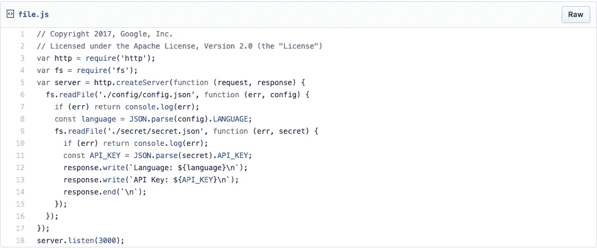
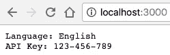
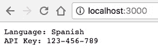
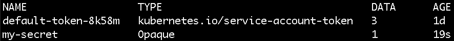
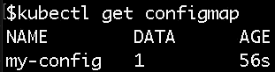
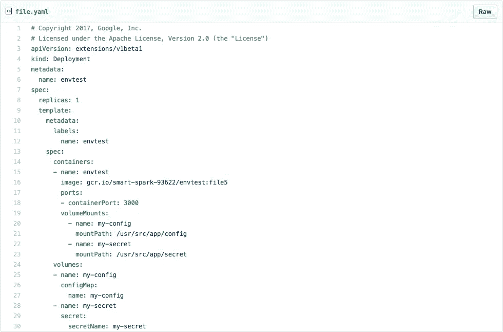
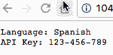

# Kubernetes 配置图和秘密第 2 部分

> 原文：<https://medium.com/google-cloud/kubernetes-configmaps-and-secrets-part-2-3dc37111f0dc?source=collection_archive---------0----------------------->

这是第一部的延续。

虽然环境变量对于小部分信息来说非常有用，但有时您可能有大量数据需要传递给应用程序。一个常见的解决方案是将这些数据分组到一个文件中，并让您的应用程序从该文件中读取。

Kubernetes 允许您将配置图和机密作为文件挂载。与环境变量不同，如果这些文件发生变化，新文件将被推送到正在运行的 pods 中，而不需要重启，因此它们更加强大。您还可以将多个文件映射到一个 ConfigMap 或 Secret，并将它们作为一个目录一次性挂载！

# 从文件中读取

让我们修改[第 1 部分](/google-cloud/kubernetes-configmaps-and-secrets-68d061f7ab5b)中的代码，从文件而不是环境变量中读取。

首先，创建名为“config”和“secret”的两个子目录，并使用我们在第一部分中使用的数据创建 config.json 和 secret.json 文件:

```
mkdir config && mkdir secretecho '{"LANGUAGE":"English"}' > ./config/config.jsonecho '{"API_KEY":"123-456-789"}' > ./secret/secret.json
```

现在，编辑代码，让它读入这些文件，而不是环境变量。



[https://gist . github . com/the sand Lord/6e 297d 7 CEB 807 e6f 0243255 ab 7885d 83 # file-file-js](https://gist.github.com/thesandlord/6e297d7ceb807e6f0243255ab7885d83#file-file-js)

> **重要提示:**这段代码将在每次请求时重新读取文件。如果您在程序启动时读取该文件一次，将不会捕获对该文件的更新，您将需要重新启动容器来更新这些文件。比每次重新读取文件更有效的一种常见模式是使用文件监视器，它只在文件发生变化时才重新加载文件。

# 使用 Docker 卷挂载文件

第一步是通过使用 Docker 卷模拟配置图和机密来测试一切工作。

重建容器:

```
docker build -t envtest .
```

构建容器后，使用以下命令运行它:

```
docker run -p 3000:3000 -ti \
  -v $(pwd)/secret/:/usr/src/app/secret/ \
  -v $(pwd)/config/:/usr/src/app/config/ \
  envtest
```

这将运行 Docker 容器，并将数据文件夹装入容器。

> **注意:**用于基本映像的 [onbuild](https://github.com/nodejs/docker-node/blob/master/6.11/onbuild/Dockerfile#L4) 容器将代码放入/usr/src/app 目录。这就是为什么文件夹被安装在那里。

如果你访问 localhost:3000 容器应该提供流量服务。



因为文件被装载到容器中，并且代码在每次请求时都重新读取文件，所以您可以更改文件并看到更改，而无需重新启动任何东西！

例如:

```
echo '{"LANGUAGE":"Spanish"}' > ./config/config.json
```



# 创建配置映射和密码

从文件中创建秘密

```
kubectl create secret generic my-secret \
  --from-file=./secret/secret.json
```

然后从另一个文件创建配置映射

```
kubectl create configmap my-config --from-file=./config/config.json
```

您可以使用以下命令检查这些文件是否已创建:

```
kubectl get secret
```



和

```
kubectl get configmap
```



# 将配置映射和机密用作文件

最后一步是使用创建一个部署，该部署将使用配置映射和密码作为一个文件，而不是一个环境变量

**注意:**记住您需要更新并推送注册中心中的 Docker 映像，以使用新代码。如果你使用 Google Cloud，你可以使用这个命令。

```
gcloud container builds submit --tag gcr.io/$(gcloud config list project --format=text | awk '{print $2}')/envtest:file .
```

在您的部署 YAML 中，您可以将配置图和密码用作卷。这将自动把它们作为一个目录挂载到你的容器中，就像 Docker 一样。



[https://gist . github . com/the sand Lord/6e 297d 7 CEB 807 e6f 0243255 ab 7885d 83 # file-file-YAML](https://gist.github.com/thesandlord/6e297d7ceb807e6f0243255ab7885d83#file-file-yaml)

请注意，Secret 和 ConfigMap 被映射到卷，这些卷用于容器规范的 volumeMount 部分。

# 无停机更新！

与 [Part](/google-cloud/kubernetes-configmaps-and-secrets-68d061f7ab5b) 1 的环境变量不同，卷可以动态地重新挂载到正在运行的容器中。这意味着新的 ConfigMap 和 Secret 值将可用于容器，而无需重新启动正在运行的进程。

例如，将语言更改为克林贡语并更新配置图。

```
echo '{"LANGUAGE":"Klingon"}' > ./config/config.jsonkubectl create configmap my-config \
  --from-file=./config/config.json \
  -o yaml --dry-run | kubectl replace -f -
```

在几秒钟内(根据缓存的不同，最多一分钟)，新文件将被自动推送到正在运行的容器中！



如果您想要更新密码，您可以遵循相同的过程:

```
echo '{"API_KEY":"0987654321"}' > ./secret/secret.jsonkubectl create secret generic my-secret \
  --from-file=./secret/secret.json \
  -o yaml --dry-run | kubectl replace -f -
```

> **注意:**这些更新最终是一致的。有可能一些容器在其他容器之前获得更新，从而在您的部署中造成不一致。如果这是一个问题，请不要使用自动更新功能。相反，创建新的配置映射或密码，并更新或创建新的部署以使用新的配置映射或密码。