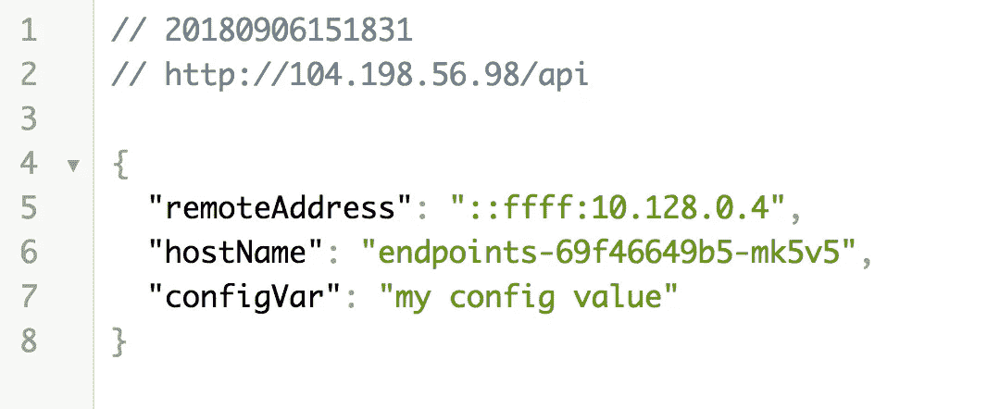

# Kubernetes:配置图和秘密(带 Firebase)

> 原文：<https://medium.com/google-cloud/kubernetes-configmaps-and-secrets-with-firebase-426e5f4c8a36?source=collection_archive---------0----------------------->

在对微服务进行了一定程度的开发之后，你开始遇到一个你最终想要……哦，我不知道……发布你的微服务的时刻。

在这一点上，您开始真正担心各种硬编码和变量，它们可能需要从您的应用程序中具体化，以便它可以顺利地通过您的测试和发布过程中的各个阶段。当您计划在 Kubernetes 集群中发布您的应用程序时，这是您开始了解配置映射的起点。

配置图只是开始。使用 ConfigMaps 一段时间后，您很自然会担心您宝贵的变量会暴露在外，现在您需要了解 Kubernetes 的秘密。


《女人双手放在嘴唇上在女人耳边低语》作者[本·怀特](https://unsplash.com/@benwhitephotography?utm_source=medium&utm_medium=referral)在 [Unsplash](https://unsplash.com?utm_source=medium&utm_medium=referral)

在本文中，在为 Kubernetes Secrets 中的敏感材料制定一个更安全的计划之前，我们将从将变量移入 ConfigMaps 开始。

# 配置映射

配置图是将 Pod 配置轻松移动到单独文件中的一种方式。这很有帮助，因为不同的环境可能有不同的配置。ConfigMaps 的一个特殊功能是，您甚至可以在 Pod 运行时更改配置，而无需重新启动 Pod。虽然我个人不推荐这样做，因为我更喜欢我的 pod 是不可变的。

配置图非常简单。在下面的示例中，您可以看到配置图的完整结构。

创建了 ConfigMap YAML 文件后，您只需像其他 Kubernetes 资源一样将其应用到您的 Kubernetes 集群。

```
**$ kubectl apply -f ../k8s/basic-config.yaml**
```

将 ConfigMap 应用到 Kubernetes 集群后，可以在部署 YAML 文件中引用它来代替实际值。下面你可以看到使用`configMapKeyRef`属性的效果。

从上面的例子中可以看出，在引用配置映射的任何地方，都必须通过名称来请求配置映射。这意味着您可以在单个 Pod 部署文件中引用多个配置图。

当您返回到 Google 云平台时，您可以直接从 UI 中查看您的配置图以及它包含的值。


集群中可查看的配置图

虽然 ConfigMaps 很棒，但您可能已经在想，让任何能够访问您的 Kubernetes 集群的开发人员都能轻松地阅读您的所有数据是一件坏事。现在是时候开始增加您的安全和介绍 Kubernetes 的秘密。

# 秘密

Kubernetes Secrets 采用易于访问的键/值对的思想，并为这些值增加了一个重要的安全层。Kubernetes 通过将这些值保存在内存中而不是磁盘上来实现额外的安全性。使得人们更难达到这些价值观。

创建一个 Kubernetes 秘密很简单，通过命令行就可以完成。在下面的例子中，我从 Firebase 控制台获取一个以 JSON 格式提供的 Firebase 服务帐户密钥，并将其放入 Kubernetes Secret names `firebase-secret`。

```
**$ kubectl create secret generic \
    firebase-secret \
    --from-file=../k8s/files/serviceAccountKey.json**
```

创建了 Kubernetes 秘密后，我们可以将秘密作为挂载卷添加到部署文件中。通过将此密码作为卷安装，您还将指定 Pod 用来访问该卷的路径。您可以看到下面的代码示例。

如果你使用谷歌云平台 UI 并找到你的`firebase-secret`,你会兴奋地发现实际值被隐藏了。最重要的是，如果您使用命令行，您仍然无法访问这个秘密的值。


不可见(秘密)的配置文件！

随着对 ConfigMaps 和 Kubernetes Secrets 有了新的工作理解，是时候实际观察它们的工作了。

# 配置图和运行中的秘密

仅仅阅读一个特性并不如亲自动手做重要。在接下来的几个步骤中，我们将在 Google 云平台中设置一个 Kubernetes 集群，部署一个 ConfigMap 和一个 Secret，然后部署一个将消费这些值的 Pod。完成后，我们将点击 Pod 上的一些端点，以查看配置图和机密的值。

*如果你没有通读甚至没有读过本系列* *的第一部分* [*，你可能会感到困惑，对代码在哪里或者之前做了什么有疑问。记住这里假设你正在使用*](/@jonbcampos/kubernetes-day-one-30a80b5dcb29) [*GCP*](https://cloud.google.com/) *和*[*GKE*](https://cloud.google.com/kubernetes-engine/)*。我将始终提供代码和如何测试代码是按预期工作。*

[](/google-cloud/kubernetes-day-one-30a80b5dcb29) [## Kubernetes:第一天

### 这是 Kubernetes 帖子的必选步骤之一。如果你对 Kubernetes 感兴趣，你可能已经读过 100 本了…

medium.com](/google-cloud/kubernetes-day-one-30a80b5dcb29) 

## 设置您的 Kubernetes 集群

开始我们需要一个 Kubernetes 集群来应用我们的资源。因为这不是本文的目的，所以我将快速介绍几个脚本，您可以用它们来启动 Kubernetes 集群。只需进入您的 Google Cloud Shell 脚本部分并运行以下脚本。

```
$ git clone [https://github.com/jonbcampos/kubernetes-series.git](https://github.com/jonbcampos/kubernetes-series)
$ cd [~/kubernetes-series/secrets/scripts](https://github.com/jonbcampos/kubernetes-series/tree/master/secrets/scripts)
$ sh [startup.sh](https://github.com/jonbcampos/kubernetes-series/blob/master/secrets/scripts/startup.sh)
```

过一会儿，您将拥有一个正在运行的 Kubernetes 集群，并准备好继续使用新的东西。

## 部署配置图

您在本文前面看到的部署 ConfigMap 的代码。我们只需将资源应用到我们的 Kubernetes 集群，就可以开始了。

```
$ cd [~/kubernetes-series/secrets/scripts](https://github.com/jonbcampos/kubernetes-series/tree/master/secrets/scripts)
**$ kubectl apply -f ../k8s/basic-config.yaml**
```

## 将机密部署到集群

在我们部署 Pod 之前，我们需要在 Kubernetes 集群中拥有所有必要的值。是的，您可以将一些配置值标记为可选，但是在这种情况下，它们都是成功启动 Pod 所必需的。下面的代码用提供的`serviceAccountKey.json`创建秘密。我需要声明，我已经终止了属于所提供密钥的 Firebase 项目，所以如果你想让它工作，你需要快速创建你自己的项目。这非常简单，不会超过 2 分钟。

```
$ cd [~/kubernetes-series/secrets/scripts](https://github.com/jonbcampos/kubernetes-series/tree/master/secrets/scripts)
**$ kubectl create secret generic firebase-secret \
    --from-file=../k8s/files/serviceAccountKey.json**
```

现在我们只需要添加配置图。

## 部署 pod 和服务

有了 Kubernetes Secret 和 ConfigMap，我们就可以部署 Pod 了。您可以通过前往`Kuberenetes Engine > Configuration`并在您的 Google Cloud 项目中查看这些文件来验证这些资源是否存在于我们的集群中。


现在我们只需要像之前部署的一百万个其他吊舱一样部署我们的吊舱。

```
$ cd [~/kubernetes-series/secrets/scripts](https://github.com/jonbcampos/kubernetes-series/tree/master/secrets/scripts)
**$ sh** [**deploy.sh**](https://github.com/jonbcampos/kubernetes-series/blob/master/secrets/scripts/deploy.sh) **$ sh** [**check-endpoint.sh**](https://github.com/jonbcampos/kubernetes-series/blob/master/secrets/scripts/check-endpoint.sh) **endpoints**
```

过一会儿，我们的吊舱将被激活并可用于交通。`check-endpoints.sh`脚本甚至会提供我们查看 Pod 数据所需的 IP 地址。您将很快使用这个 IP 地址来验证一切正常。

## 确认配置映射-ping

要进行的第一个验证是针对配置映射的。如果我们使用浏览器并访问`http://[Service IP Address]/api`，我们将看到在配置图中设置的值已成功通过，并在`configVar`中可见。



由我们部署的配置图提供的配置变量

## 确认我们可以接触到这个秘密

现在我们需要验证我们的 Kubernetes 秘密。在这种情况下，我不只是输出值。因此，我用这个秘密来访问我的 firebase，并列出 Firebase 帐户中的用户。同样，此帐户已被删除，因此您需要创建自己的帐户。

您可以通过访问`http://[Service IP Address]/secret`查看这些数据


Firebase 用户使用 Kubernetes 秘密的输出

# 关闭

Kubernetes 提供了如此多的选项，可以很容易地融入背景。像配置值这样平凡的东西会演变成价值和安全性的美妙的合奏之舞。与所有事情一样，这只是您可以使用这些功能的开始。我建议使用它们，即使是一个简单的 Pod 定义，因为额外的好处将随着时间的推移而变得清晰。

# 拆卸

在您离开之前，请确保清理您的项目，这样您就不会为您用来运行群集的虚拟机付费。返回到云 Shell 并运行 teardown 脚本来清理您的项目。这将删除您的集群和我们构建的容器。

```
$ cd [~/kubernetes-series/secrets/scripts](https://github.com/jonbcampos/kubernetes-series/tree/master/secrets/scripts)
$ sh [teardown.sh](https://github.com/jonbcampos/kubernetes-series/blob/master/secrets/scripts/teardown.sh)
```

# 本系列的其他文章

[](/google-cloud/kubernetes-running-background-tasks-with-batch-jobs-56482fbc853) [## Kubernetes:使用批处理作业运行后台任务

### 当构建令人惊叹的应用程序时，有时您可能想要处理用户之外的动作…

medium.com](/google-cloud/kubernetes-running-background-tasks-with-batch-jobs-56482fbc853) [](/google-cloud/kubernetes-run-a-pod-per-node-with-daemon-sets-f77ce3f36bf1) [## Kubernetes:用守护进程集在每个节点上运行一个 Pod

### 我最初给这篇文章起的标题只是“守护进程集”,并假设它足以抓住要点…

medium.com](/google-cloud/kubernetes-run-a-pod-per-node-with-daemon-sets-f77ce3f36bf1) [](/google-cloud/kubernetes-cron-jobs-455fdc32e81a) [## 库伯内特:克朗·乔布斯

### 有时候你的工作不是事务性的。我们不再等待用户点击按钮让系统亮起来…

medium.com](/google-cloud/kubernetes-cron-jobs-455fdc32e81a) [](/google-cloud/kubernetes-dns-proxy-with-services-d7d9e800c329) [## Kubernetes:带服务的 DNS 代理

### 构建应用程序时，通常需要与外部服务进行交互来完成业务…

medium.com](/google-cloud/kubernetes-dns-proxy-with-services-d7d9e800c329) [](/google-cloud/kubernetes-routing-internal-services-through-fqdn-d98db92b79d3) [## Kubernetes:通过 FQDN 路由内部服务

### 我记得当我第一次进入 Kubernetes 时。一切都是崭新的、闪亮的、有规模的。当我继续的时候…

medium.com](/google-cloud/kubernetes-routing-internal-services-through-fqdn-d98db92b79d3) [](/google-cloud/kubernetes-liveness-checks-4e73c631661f) [## Kubernetes:活性检查

### 最近，我整理了一篇关于 Kubernetes 就绪性调查以及它对您的集群有多重要的文章…

medium.com](/google-cloud/kubernetes-liveness-checks-4e73c631661f) [](https://itnext.io/kubernetes-readiness-probe-83f8a06d33d3) [## Kubernetes:就绪探测

### 如果对这个特性有任何疑问，我写这篇文章是为了说明这不是一个…

itnext.io](https://itnext.io/kubernetes-readiness-probe-83f8a06d33d3) [](/google-cloud/kubernetes-horizontal-pod-scaling-190e95c258f5) [## Kubernetes:水平 Pod 缩放

### 通过 Pod 自动扩展，您的 Kubernetes 集群可以监控现有 Pod 的负载，并确定我们是否需要更多…

medium.com](/google-cloud/kubernetes-horizontal-pod-scaling-190e95c258f5) [](/google-cloud/kubernetes-cluster-autoscaler-f1948a0f686d) [## Kubernetes:集群自动缩放

### 自动缩放是 Kubernetes 的一个巨大的(并且已经上市的)特性。当你的网站/应用程序/应用程序接口/项目变得越来越大时，洪水…

medium.com](/google-cloud/kubernetes-cluster-autoscaler-f1948a0f686d) [](/google-cloud/kubernetes-day-one-30a80b5dcb29) [## Kubernetes:第一天

### 这是 Kubernetes 帖子的必选步骤之一。如果你对 Kubernetes 感兴趣，你可能已经读过 100 本了…

medium.com](/google-cloud/kubernetes-day-one-30a80b5dcb29) 

Jonathan Campos 是一个狂热的开发者，也是学习新事物的爱好者。我相信我们应该不断学习、成长和失败。我总是开发社区的支持者，并且总是愿意提供帮助。因此，如果你对这个故事有任何问题或意见，请在下面提出。在 [LinkedIn](https://www.linkedin.com/in/jonbcampos/) 或 [Twitter](https://twitter.com/jonbcampos) 上与我联系，并提及这个故事。