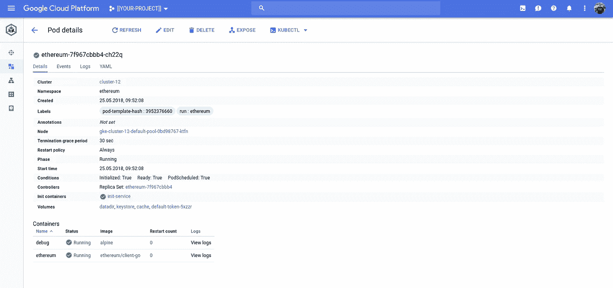
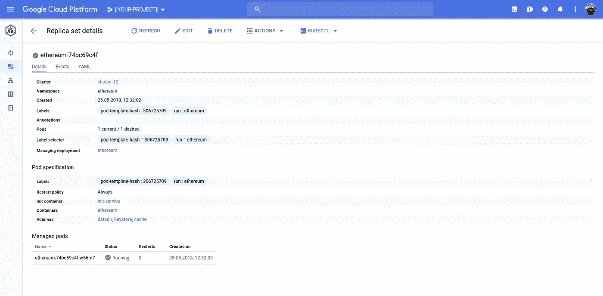

# Kubernetes 容器调试

> 原文：<https://medium.com/google-cloud/kubernetes-container-debugging-a2b87f4ff145?source=collection_archive---------0----------------------->

有一大堆容器指南(为了方便起见大多被忽略了)同样适用于 Kubernetes。我需要在[中做得更好，不作为根](https://www.google.com/search?q=don%27t+run+containers+as+root)运行容器，但是我在运行([哑-init](https://engineeringblog.yelp.com/2016/01/dumb-init-an-init-for-docker.html) 和)每个容器一个过程中做得不错(尤其是对于 Golang)。

然而，当我在开发 Deployments 时，这些方法经常不能在第一次使用。那么如何调试这些问题呢？

等等，如果它是一个在本地工作的容器，难道不能保证它在任何地方都能工作吗？是的，但是…没有集装箱是一个岛…或者…它的工作，直到我试图除以零…

问题在于运行的容器(像函数一样)依赖于运行时配置(数据)，这在不同的环境中有不同的表现。

在这种情况下，问题是，对于所讨论的容器，包含符号链接的卷引用(当前)不起作用。当在 Docker 下本地部署容器时，这种情况没有出现，因为使用了简单的文件-文件主机卷装载。

当部署到 Kubernetes 时，使用大量的 Secrets(包含钱包文件)，问题浮出水面。这是因为 Secrets(和 ConfigMaps)使用符号链接呈现文件。机密或配置地图提供了向 Kubernetes 上的容器(pod)呈现基于文件的内容的最佳实践。

## 直通式

我将使用最近的一个例子将 Ethereum 部署到 Kubernetes。这是一个包含第三方容器的实际例子(我认为这是一个潜在的问题)。

我花了一些时间来确定问题，因为在本地运行容器(！)没有提出问题。

提供这些命令是为了显示“工作”并帮助解释问题。您不需要自己运行这些命令。

```
mkdir -p /tmp/keystore
```

这将起作用:

```
docker run \
--rm \
--interactive \
--tty \
--volume=/tmp/keystore:/keystore \
ethereum/client-go \
  --rinkeby
  --keystore=/keystore
  console
```

它运行`[geth](https://github.com/ethereum/go-ethereum/wiki/geth)`——最终的以太网 Golang 实现——作为“rinkeby”网络上的测试节点*使用* `/keystore`存储钱包文件。主机目录`/tmp/keystore`在容器上映射为`/keystore`。

该容器产生大量日志记录，但是在那里的某个地方会有一个控制台，我们可以在`/keystore`目录中创建一个新的持久化为钱包文件的 Ethereum 帐户:

```
> personal
{
  listAccounts: [],
  listWallets: [],...> personal.newAccount("some-random-password")
"0x208507fd69e7ccf2af33f1ddc55e2738751c9aad"
> personal
{
  listAccounts: ["0x208507fd69e7ccf2af33f1ddc55e2738751c9aad"],
  listWallets: [{
      accounts: [{...}],
      status: "Locked",
      url: "keystore:///keystore/UTC--2018-05-25T16-32-28.467584997Z--208507fd69e7ccf2af33f1ddc55e2738751c9aad"
  }],
```

> **NB** 以太坊账号开始`0x2085`。它存储在一个格式为`UTC — [[data-created]] — [[account]`的钱包文件中。

退出容器后，钱包就在`/tmp/keystore/`创建了。更重要的是，因为这是在主机文件系统上持久化的，所以如果我使用相同的卷装载重新运行容器，帐户仍然是:

```
ls /tmp/keystore/
UTC--2018-05-25T16-32-28.467584997Z--208507fd69e7ccf2af33f1ddc55e2738751c9aad
```

好的。简单明了，没有问题。

现在，我将向您展示这个错误。我是在将这个工作配置部署到 Kubernetes 之后才发现这个错误的。我花了一些时间才意识到这个问题，这不是 Kubernetes 的问题，并在没有 Kubernetes 的情况下创建了这个 repro。

下面的代码在目录`/tmp/lnkeystore`中创建了一个符号链接(同名),指向`/tmp/keystore`目录中的底层文件。除了不同的目录名之外，这两个 wallet 文件之间的唯一区别是我们创建了一个文件，它是指向已知工作的 wallet 文件的符号链接:

```
ACCOUNT="208507fd69e7ccf2af33f1ddc55e2738751c9aad"
WALLET="UTC--2018-05-25T16-32-28.467584997Z--${ACCOUNT}"mkdir -p /tmp/lnkeystore
ln -s \
  /tmp/keystore/${WALLET} \
  /tmp/lnkeystore
```

但是，如果我现在使用`/tmp/**ln**keystore`而不是`/tmp/keystore`来运行容器，那么容器中将不会出现帐户。这是因为出现了一个错误，即如果 wallet 文件是一个符号链接，容器无法识别它:

```
docker run \
--rm \
--interactive \
--tty \--volume=/tmp/lnkeystore:/keystore \
ethereum/client-go \
  --rinkeby
  --keystore=/keystore
  console
```

> **NB** 唯一的变化在 `— volume=/tmp/lnkeystore`。

而且，如果我在容器中运行 personal，我希望帐户(和钱包)存在，但是容器看不到它们:

```
> personal
{
  listAccounts: [],
  listWallets: [],
```

## Kubernetes 调试

那么，我是如何在 Kubernetes 中发现这个问题的，又是如何调试的呢？

我发现的问题如上所述:如果以太坊钱包文件是一个符号链接，帐户不会被发现。部署到 Kubernetes 后，我希望能够重用现有的帐户和钱包。但是，这不起作用。部署没有找到我的帐户(钱包)。

使用第三方容器映像(`ethereum/client-go`)不鼓励(但不阻止)使用或更改容器映像来调试|修复问题。将容器映像更改为 debug 是一种常见的方法，也很有帮助。在这种情况下，映像使用了 [Alpine](https://alpinelinux.org/) ，Alpine 提供了一个最小的操作系统，我们可以使用它来调查问题。我将简要介绍这种方法。

下面是`ethereum/client-go`的简介。您可以看到，方便发布的`Dockerfile`显示运行时映像是从 Alpine 构建的:

[https://hub.docker.com/r/ethereum/client-go/~/dockerfile/](https://hub.docker.com/r/ethereum/client-go/~/dockerfile/)

然而，最好不要包含操作系统(甚至不要像 Alpine 那样受限制),而只包含我们想要运行的进程(可能与 dump-init 结合使用)。在这种情况下我们能做什么？这个问题没有正式的解决方案，但是有一个很好的方法。我也将展示这种方法。

## 包含调试工具的容器

如果您想要调试的容器包括一个 shell 和一些调试工具，那么这个过程会更容易。如果更简单为什么不是所有的图片都包括这些？

做好一件事的原则鼓励我们不要包含我们*可能*需要的组件，而是专注于我们必须拥有的组件。更多的组件还会导致更大的攻击面，并需要更多的维护。

首先，确定您的容器中有什么 shell 和工具。如果你创造了这个形象，你就会知道这一点。如果你使用的是第三方图片，作者通常会记录配套图片`Dockerfile`。

在我们这里使用的例子中，我们知道(从上面)我们有阿尔卑斯山。Alpine 的 shell 叫做`ash`，它包含了一系列我们可以使用的 Linux 命令行工具。

首先，确定你的吊舱。在 Kubernetes 豆荚聚合容器中。多(！)的时候，pod 运行单个容器。以下内容适用于我的以太坊部署，但我会边走边解释。

我有一个名为“以太坊”的名称空间，并且我有一个部署，它导致一个单独的 Pod 运行一个名为“以太坊”的容器:

```
kubectl get pods --namespace=ethereum
NAME                        READY     STATUS    RESTARTS   AGE
ethereum-7f967cbbb4-ch22q   2/2       Running   0          9m
```

我们需要(Pod)名称:`ethereum-7f967cbbb4-ch22q`

我知道(因为是我创建的)Pod 包含一个容器，该容器的名称也是`ethereum`。我们知道它正在运行`ash`，因此我们可以:

```
kubectl exec ethereum-7f967cbbb4-ch22q \
--stdin \
--tty \
--container=ethereum \
--namespace=ethereum \
-- ash
```

这将返回一个 shell 提示符，因此——如下所示——可以列出名为`/keystore`的卷挂载的内容:

```
/ #
/ # ls /keystore
UTC--2018-05-25T16-32-28.467584997Z--208507fd69e7ccf2af33f1ddc55e2738751c9aad
```

而且，我们知道我们也应该在这个容器中运行一个`geth`进程:

```
/ # ps aux
PID   USER     TIME   COMMAND
    1 root       0:47 geth --rinkeby --keystore=/cache ...
   23 root       0:00 ash
   30 root       0:00 ps aux
```

所以，这是有用的。

而且，仍然在 shell 中，您可以通过下面的代码获得一个针对该`geth`进程的控制台:

```
/ # geth attach [http://localhost:8545](http://localhost:8545) console
Welcome to the Geth JavaScript console!instance: Geth/v1.8.9-unstable-d6ed2f67/linux-amd64/go1.10.2
coinbase: 0x3df64eff7ae6bde185de128a97bc0a9539427453
at block: 2346567 (Fri, 25 May 2018 17:16:13 UTC)
 modules: eth:1.0 net:1.0 personal:1.0 rpc:1.0 web3:1.0> personal
{
  listAccounts: [],
  listWallets: [],...
```

这是我们的错误:-(

解决该问题后，相同的行为将再次出现:

```
/ # geth attach [http://localhost:8545](http://localhost:8545) console
Welcome to the Geth JavaScript console!instance: Geth/v1.8.9-unstable-d6ed2f67/linux-amd64/go1.10.2
coinbase: 0x3df64eff7ae6bde185de128a97bc0a9539427453
at block: 2346567 (Fri, 25 May 2018 17:16:13 UTC)
 modules: eth:1.0 net:1.0 personal:1.0 rpc:1.0 web3:1.0> personal
{
  listAccounts: ["0x208507fd69e7ccf2af33f1ddc55e2738751c9aad"],
  listWallets: [{
      accounts: [{...}],
      status: "Locked",
      url: "keystore:///cache/UTC--2018-05-25T16-32-28.467584997Z--208507fd69e7ccf2af33f1ddc55e2738751c9aad"
  }],
  deriveAccount: function(),
```

> **NB**

如果您的容器有外壳和/或调试工具，这种方法就很好。

但是，它应该变得越来越不常见，因为它打破了良好容器形象设计的一个(或多个)原则。所以…

## 不包含调试工具的容器

这种方法允许我们保持我们的容器最小，但是如果我们需要的话，可以运行 sidecar 调试容器。我认为这是一个很好的妥协。

说清楚一点，我建议你不要一直开边车。这可能会成为一件事，但照现在的情况看，这落入了上述陷阱。黑客(！)是在需要时*只*部署调试容器。

但是对于 Kubernetes，这就更棘手了，因为您需要注射(！？)将调试容器放入您要调试的容器旁边的 Pod 中。

救援部署。

您应该使用部署将资源部署到 Kubernetes。您应该使用规范文件来描述这些部署。如果需要，您可以*始终*为任何 Kubernetes 资源创建一个规格文件:

```
kubectl get [RESOURCE]/[NAME] --namespace=[NAMESPACE] --output=yaml
```

因此，给定表单的部署:

```
kind: Deployment
...
spec:
  containers:
  - name: x
    ...
  - name: y
    ...
```

你可以(！)将其编辑为如下所示，然后应用:

```
kind: Deployment
...
spec:
  containers:
  - name: x
    ...
  - name: y
    ...
  - name: debug
    image: alpine
    command: ["ash","-c","[[MY DEBUGGING COMMANDS]]"]
```

> **NB** 您并不限于使用高山。因为您指定了容器图像，所以您可以使用您想要的图像:`ubuntu`、`busybox`、`most-excellent-debugging — tools`等。

这有什么用？它向 Pod 添加了另一个名为`debug`的容器，运行一些预定义的调试命令|脚本。

如果您事先不知道您想要什么调试命令，那么您可以使用第二个技巧，即让调试容器保持忙碌-无所事事:

```
kind: Deployment
...
spec:
  containers:
  - name: x
    ...
  - name: y
    ...
  - name: debug
    image: alpine
    command: ["ash","-c","while true; do sleep 60s; done"]
```

这避免了调试容器终止，这将导致 Kubernetes 焦虑，因为它一直试图重新创建该容器；-)它会产生一个 Pod，其中包含一个名为`debug`的容器，您可以将`kubectl exec`放入其中进行调试。

您可以在这里看到`debug`在我的以太网部署中运行。在屏幕截图的底部“Containers”下是一个名为“debug”的容器，来自“alpine”图像:



您可以像以前一样访问此容器:

```
kubectl exec ethereum-7f967cbbb4-ch22q \
--stdin \
--tty \
--container=ethereum \
--namespace=ethereum \
-- ash
```

如果——就像我的情况一样——您需要访问正在调试的容器正在使用的卷装载，您只需要在调试容器上复制卷装载:

```
containers:
- name: debug
  image: alpine
  command: ["ash","-c","while true; do sleep 60s; done"]
  volumeMounts:
  - name: keystore
    mountPath: /keystore
  - name: cache
    mountPath: /cache      
- name: ethereum
  image: ethereum/client-go
  args: [...]
   volumeMounts:
   - name: datadir
     mountPath: /datadir
   - name: keystore
     mountPath: /keystore
   - name: cache
     mountPath: /cache
volumes:
- name: datadir
  persistentVolumeClaim:
  claimName: datadir
- name: keystore
  secret:
    secretName: keystore
- name: cach
  emptyDir: {}
```

在概念上，Kubernetes `Pod`类似于`localhost`。并且，为`Pod`定义的任何体积(在这种情况下)都可以安装到它的任何容器中。太棒了。所以这对我们来说非常合适。

调试完问题后，通过删除调试容器恢复部署规范，并将部署重新应用于您的集群。

这是(新的)豆荚。Kubernetes 用新的部署删除了以前的 Pod。这不再容纳`debug`容器:



## 解决问题

完成调试示例后，我对部署无法工作感到困惑。当使用 Secrets 部署到 Kubernetes 时，我很快确定我无法访问以太坊帐户(和钱包)。

我尝试使用配置图而不是密码。同样的问题。这是因为 ConfigMaps 和 Secrets 都将卷装入的文件显示为符号链接。他们这样做是为了提供 Kubernetes 所需要的活力。所以链接的使用是不可避免的。

最后一个办法是创建一个持久磁盘，并将这个“旧学校”连接到 Pod。出于多种原因，这是一个糟糕的选择。首先，它需要手动创建、格式化、安装等。磁盘的。第二，持久磁盘现在才成为[区域](https://cloudplatform.googleblog.com/2018/05/Get-higher-availability-with-Regional-Persistent-Disks-on-Google-Kubernetes-Engine.html)(然后只有 2 个副本；这降低了 Kubernetes 在将基于区域的磁盘绑定到区域浮动单元时的灵活性，尤其是对于区域集群。

永恒之盘作品:-(

它能工作是因为我复制进去的钱包文件不是符号链接。

然后，我创造了我已经添加到我的原始职位的黑客技巧。Kubernetes 支持名为`[emptyDir](https://kubernetes.io/docs/concepts/storage/volumes/#emptydir)`的动态卷类型。我想知道，如果我把动态管理账户(钱包)从秘密复制到 T1 会发生什么？我还会有一个文件-文件(不是链接)吗？这个管用！

所以，这是一个破解和变通办法，但是我现在使用一个 init 容器将钱包文件从 Secret 复制到一个`emptyDir`*在*以太坊容器启动之前。以太坊容器被配置为在`emtpyDir`卷而不是秘密卷中寻找钱包。

一切都很好。

## 旁白:容器优化的操作系统

谷歌的容器优化操作系统(COS)采用了类似的原理。COS 是一个极简操作系统(！).这带来的一个挑战是，如果您将一个基本容器部署到 COS，您没有任何工具可以帮助调试。

COS 提供 [CoreOS 工具箱](https://github.com/coreos/toolbox):

[https://cloud . Google . com/container-optimized-OS/docs/how-to/toolbox](https://cloud.google.com/container-optimized-os/docs/how-to/toolbox)

CoreOS 没有为 toolbox 发布容器图像，但谷歌确实提供了一个图像(通过[谷歌容器注册表](https://cloud.google.com/container-registry/)【GCR】)，它还包括[谷歌云 SDK](https://cloud.google.com/sdk/) (又名`gcloud`)。

Google 的 CoreOS 工具箱图片是:`gcr.io/google-containers/toolbox`

你可以——如果你愿意——在前面描述的 Kubernetes 调试中利用 CoreOS 工具箱，只需引用 GCR 映像并将`ash`替换为`bash`:

```
kind: Deployment
...
spec:
  containers:
  - name: x
    ...
  - name: y
    ...
  - name: debug
    image: gcr.io/google-containers/toolbox
    command: ["bash","-c","while true; do sleep 60s; done"]
```

随时欢迎反馈。

仅此而已！