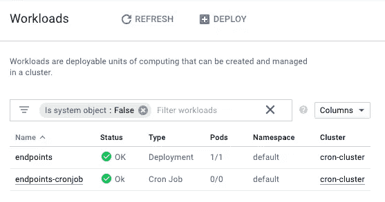

# 库伯内特:克朗·乔布斯

> 原文：<https://medium.com/google-cloud/kubernetes-cron-jobs-455fdc32e81a?source=collection_archive---------1----------------------->

有时候你的工作不是事务性的。我们有时需要响应一个特定的时间，并从那里采取行动，而不是等待用户点击一个按钮，让系统亮起来。对于大多数需要按计划运行作业的中间层和后端开发人员来说，Cron 作业已经过时了。但是，如果您正在使用 Kubernetes 集群，您可能想知道设置一些假 cron 作业来处理基于时间的操作有多难。


库伯内特·克朗·乔布斯

在本文中，我们将研究如何在 Kubernetes 集群中创建 cron 作业。然后，我们将创建一个示例来查看它的运行情况，并了解创建 Cron 作业并让它们运行的各种方法。最后，我们将看看一些最佳实践，这样您就不会被绊倒。

*如果你还没有通读甚至阅读过本系列* *的第一部分* [*，你可能会感到困惑，不知道代码在哪里，或者之前做了什么。记住这里假设你正在使用*](/@jonbcampos/kubernetes-day-one-30a80b5dcb29) [*GCP*](https://cloud.google.com/) *和*[*GKE*](https://cloud.google.com/kubernetes-engine/)*。我将始终提供代码和如何测试代码是按预期工作。*

[](/google-cloud/kubernetes-day-one-30a80b5dcb29) [## Kubernetes:第一天

### 这是 Kubernetes 帖子的必选步骤之一。如果你对 Kubernetes 感兴趣，你可能已经读过 100 本了…

medium.com](/google-cloud/kubernetes-day-one-30a80b5dcb29) 

# 创建 Kubernetes 集群 Cron 作业

在 Kubernetes 中创建 Cron 作业与创建部署非常相似。如果您已经通读了本系列，您会知道部署包括一些关于部署的元数据以及围绕您将生成的 Pod 的元数据，最后还有一些关于如何扩展和管理 Pod 的信息。Cron 作业的相似之处在于，它们包括关于资源的基本元数据、Cron 作业将启动的 Pod 周围的元数据，以及关于如何管理 Pod 启动的一些信息。

您可以在下面看到一个完全构建的 CronJob yaml 文件。

```
**apiVersion: batch/v1beta1**
**kind: CronJob** # it is a Cron Job
**metadata:
  name: endpoints-cronjob** # name of the CronJob
**spec:
  schedule: "* * * * *"** # run every minute
  **startingDeadlineSeconds: 10** # if a job hasn't starting in this many seconds, skip
  **concurrencyPolicy: Allow** # either allow|forbid|replace
  **successfulJobsHistoryLimit: 3** # how many completed jobs should be kept
  **failedJobsHistoryLimit: 1** # how many failed jobs should be kept
  **jobTemplate:
    spec:
      template:
        spec:
          restartPolicy: Never
          containers:
            - name: cron-container-cronjob
              image: gcr.io/PROJECT_NAME/cron-container-cronjob:latest**
              # environment variables for the Pod
              **env:
                - name: GCLOUD_PROJECT
                  value: PROJECT_NAME**
                # endpoint to hit by cron job
                **- name: FOREIGN_SERVICE
                  value: http://endpoints.default.svc.cluster.local/endpoint
                - name: NODE_ENV
                  value: production
              ports:
                - containerPort: 80**
```

我想快速了解 Kubernetes 集群 Cron 作业的运行情况，但是如果您正在寻找更多关于 Cron 作业特定 yaml 参数的详细信息和最佳实践，那么您可以在下面找到这些信息。

# Kubernetes 集群 Cron 工作在行动

要查看这个 Cron 作业的运行情况相当简单。像往常一样，我已经创建了一个工作样本，您可以在您的 Google 云平台项目中运行它。这个示例创建了一个 Kubernetes 集群，创建了两个容器，将其中一个容器部署到 Kubernetes 集群中，然后创建一个 cron 作业，该作业将启动并销毁第二个容器。cron 作业容器将每分钟撞击一次主容器，增加容器中的计数器。我甚至为您设置了一个端点，以便在 cron 作业运行时查看计数器的增量。要开始，请转到 Google Cloud Shell 控制台，通过运行以下命令来设置 Kubernetes 集群并部署第一个容器。

```
$ git clone [https://github.com/jonbcampos/kubernetes-series.git](https://github.com/jonbcampos/kubernetes-series.git)
$ cd [~/kubernetes-series/cron/scripts](https://github.com/jonbcampos/kubernetes-series/tree/master/cron/scripts)
$ sh [startup.sh](https://github.com/jonbcampos/kubernetes-series/blob/master/cron/scripts/startup.sh)
$ sh [deploy.sh](https://github.com/jonbcampos/kubernetes-series/blob/master/cron/scripts/deploy.sh)
$ sh [check-endpoint.sh](https://github.com/jonbcampos/kubernetes-series/blob/master/cron/scripts/check-endpoint.sh) endpoints
```

当`[check-endpoints.sh](https://github.com/jonbcampos/kubernetes-series/blob/master/cron/scripts/check-endpoint.sh)`脚本完成时，你将有一个 **IP 地址**，你可以从你的浏览器点击它。

现在我们需要将 cron 作业部署到 Kubernetes 集群中。这非常简单，只需使用与部署任何其他资源相同的命令。你可以在下面看到我设置的脚本，并点击链接获取实际代码。

```
$ cd [~/kubernetes-series/cron/scripts](https://github.com/jonbcampos/kubernetes-series/tree/master/cron/scripts)
$ sh [create_cronjob.sh](https://github.com/jonbcampos/kubernetes-series/blob/master/cron/scripts/create_cronjob.sh)
```

现在快点，因为魔法已经开始了。现在的情况是，Kubernetes 集群每一分钟都在用 cron 作业容器启动一个新的 Pod。您可以在 GCP Kubernetes 工作负载视图中看到这一点。



您的端点和 cron-job 部署到您的 Kubernetes 集群

如果你深入到`endpoints-cronjob`及其事件，你会看到`endpoints-cronjob`正在被创建。


您的 Cronjob 已成功创建

第一分钟过去后，`endpoints-cronjob`事件显示 cron 作业正在创建并成功运行。完成后，您将看到事件发生变化，包括已完成的事件。


具有第一个已完成事件的端点-cronjob 事件窗口

如果您想查看数据计数器的增量，那么您可以转到您的服务的 IP 地址，并在`http://[Your Service IP Address]/data`查看`callCount`。


来自`http://[Your Service IP Address]/data`的结果

如果我们让 cron 作业继续运行一段时间，我们将会看到事件和数据继续增长。


具有多个已完成事件的“端点-cronjob 事件”窗口

服务的数据视图显示更多的`callCounts`。


显示多个呼叫

我们可以让这种情况永远持续下去，但在这一点上，我认为我们可以同意，我们已经证明了这一点。我们现在展示了一个 NodeJs 应用程序，它由我们的 Kubernetes 集群以特定的时间间隔运行。

# Kubernetes 集群 Cron 作业的最佳实践

回想一下提供的 yaml 文件，有一些有趣的地方需要注意。下面是 CronJob Kubernetes 特有的一些属性，以及如何充分利用这些特性的一些解释。

`spec.schedule`:这是您使用通用 cron 符号为 Pod 创建设置 cron 时间表的地方。

`spec.startingDeadlineSeconds`:Kubernetes 可以错过但仍然开始工作的时间量。如果 Kubernetes 错过了太多的作业启动(100)，那么 Kubernetes 会记录一个错误，并且不会启动任何未来的作业。

`spec.concurrencyPolicy`:指定并发策略时，有三个选项可供选择:`Allow`、`Forbid`和`Replace`。如果您选择`allow`，那么您将允许多个任务同时运行。`Forbid`停止多个 cron 作业同时运行。而`replace`将用新作业替换当前正在运行的作业。

`spec.suspend`:这个可选特性非常适合挂起 cron 作业，而不必删除 cron 作业。要启用，只需将值设置为`true`。

`spec.successfulJobsHistoryLimit`:应该保留多少个成功的作业。默认情况下，只保留 3 个。

`spec.failedJobsHistoryLimit`:应该保留多少个失败的作业。默认情况下，只保留 1。

`spec.jobTemplate`:这是达到计划时要运行的作业的作业模板。我将很快跟进如何编写批处理作业。一次一个帖子。:)

## 幂等作业

要记住的最佳实践是，Kubernetes Cron 的工作并不完美。有时，作业不会在您希望的时刻启动。或者两个作业可能相互重叠。为了不被这种模糊所困扰，让你的工作变得等幂是很重要的。这意味着，以一种顺序无关紧要的方式编写您的作业。如果你已经解决了 map/reduce 问题，那么这个概念就不新鲜了。如果你没有，这里有一个使用数学的简单例子。

```
// No matter the order you always end up with the same value
**1 + 4 + 5 + 9 + 3 + 2 + 1 = 25** //  = idempotent// Depending on the order (due to parenthesis) you end up with different values
**(1 + 4) * 5 + (9 - 3) / 2 + 1 = 29** //  != idempotent
**1 + (4 * 5) + 9 - (3 / 2) + 1 = 29.5** //  != idempotent
**1 + 4 * (5 + 9 - 3) / (2 + 1) = 15.667** //  != idempotent
```

# 拆卸

在您离开之前，请确保清理您的项目，这样您就不会为您用来运行群集的虚拟机付费。返回到云 Shell 并运行 teardown 脚本来清理您的项目。这将删除您的集群和我们构建的容器。

```
$ cd ~/[kubernetes-series/cron/scripts](https://github.com/jonbcampos/kubernetes-series/tree/master/external-communication/scripts)
$ sh [teardown.sh](https://github.com/jonbcampos/kubernetes-series/blob/master/external-communication/scripts/teardown.sh)
```

# 关闭

看到 Kubernetes 支持 cron jobs，我很激动。有了这个附件，您可以在 Kubernetes 集群中构建更多的功能，而不必在容器中设置计时器。

# 本系列的其他文章

[](/google-cloud/kubernetes-dns-proxy-with-services-d7d9e800c329) [## Kubernetes:带服务的 DNS 代理

### 构建应用程序时，通常需要与外部服务进行交互来完成业务…

medium.com](/google-cloud/kubernetes-dns-proxy-with-services-d7d9e800c329) [](/google-cloud/kubernetes-routing-internal-services-through-fqdn-d98db92b79d3) [## Kubernetes:通过 FQDN 路由内部服务

### 我记得当我第一次进入 Kubernetes 时。一切都是崭新的、闪亮的、有规模的。当我继续的时候…

medium.com](/google-cloud/kubernetes-routing-internal-services-through-fqdn-d98db92b79d3) [](/google-cloud/kubernetes-horizontal-pod-scaling-190e95c258f5) [## Kubernetes:水平 Pod 缩放

### 通过 Pod 自动扩展，您的 Kubernetes 集群可以监控现有 Pod 的负载，并确定我们是否需要更多…

medium.com](/google-cloud/kubernetes-horizontal-pod-scaling-190e95c258f5) [](https://itnext.io/kubernetes-readiness-probe-83f8a06d33d3) [## Kubernetes:就绪探测

### 如果对这个特性有任何疑问，我写这篇文章是为了说明这不是一个…

itnext.io](https://itnext.io/kubernetes-readiness-probe-83f8a06d33d3) [](/@jonbcampos/kubernetes-liveness-checks-4e73c631661f) [## Kubernetes:活性检查

### 最近，我整理了一篇关于 Kubernetes 就绪性调查以及它对您的集群有多重要的文章…

medium.com](/@jonbcampos/kubernetes-liveness-checks-4e73c631661f) 

Jonathan Campos 是一个狂热的开发者，也是学习新事物的爱好者。我相信我们应该不断学习、成长和失败。我总是开发社区的支持者，并且总是愿意提供帮助。因此，如果你对这个故事有任何问题或意见，请在下面提出。在 [LinkedIn](https://www.linkedin.com/in/jonbcampos/) 或 [Twitter](https://twitter.com/jonbcampos) 上与我联系，并提及这个故事。