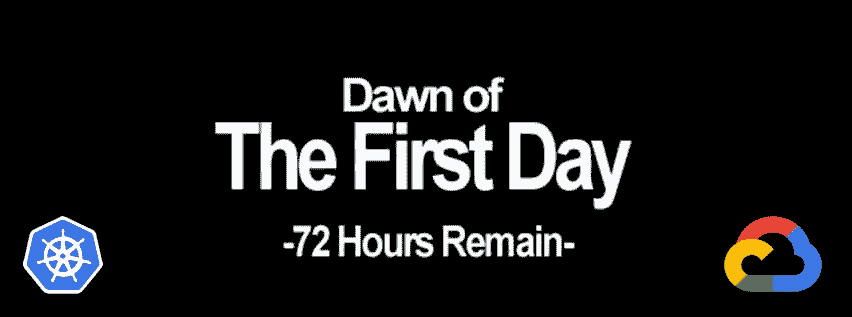
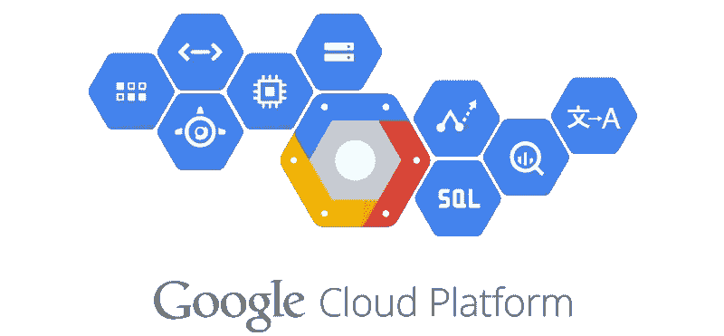
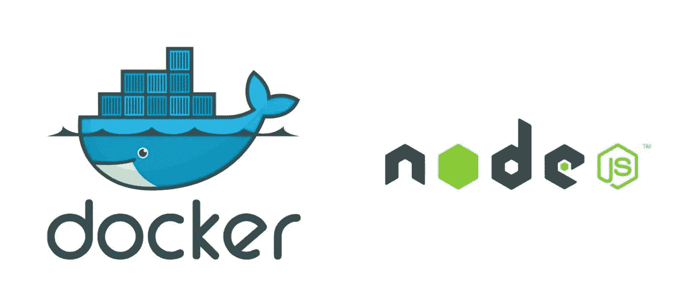
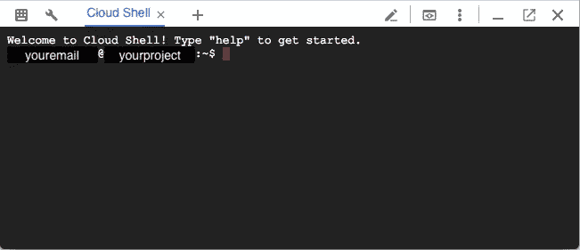

# 库伯内特:第一天

> 原文：<https://medium.com/google-cloud/kubernetes-day-one-30a80b5dcb29?source=collection_archive---------0----------------------->



你可以在 72 小时内完成

这是 Kubernetes 帖子的必选步骤之一。如果你对 Kubernetes 感兴趣，你可能已经阅读了 100 篇这样的文章，而且你可能已经建立了自己的集群。这篇文章的目的是为接下来更多的高级文章打下基础。尽管入门文章很多，但真正挖掘 Kubernetes 背后真正力量的文章却很少。

事不宜迟，让我们从基础开始。

# **高层次:什么是 Kubernetes？**

Kubernetes 是一个容器编排和管理工具。


通用 Kubernetes 图像

如果你一直在网上阅读大量文章，这很可能是你看到的答案或类似的东西。如果你感兴趣的话，这是一个关于库伯内特斯性质的[更完整的答案。](https://kubernetes.io/docs/concepts/overview/what-is-kubernetes/)

阅读其他文章，您会看到如何使用一些命令行命令或 YAML 文件来告诉 Kubernetes 如何用容器创建 [Pods](https://kubernetes.io/docs/concepts/workloads/pods/pod/#what-is-a-pod) 。然后，您将使用[服务](https://kubernetes.io/docs/concepts/services-networking/service/)向外部世界公开这些 pods，并使用[负载平衡器](https://kubernetes.io/docs/concepts/services-networking/service/#type-loadbalancer)将流量路由到这些 Pods，这些 Pods 是由全能的 [Kubelet](https://kubernetes.io/docs/concepts/overview/components/#master-components) 随意创建和销毁的。

我把它简化了很多，让它更容易理解，这样我们就可以开门见山了。

# 开始使用谷歌云平台



使用谷歌云平台和一个试用账户

对于这个演示代码，我推荐使用[谷歌云平台](https://cloud.google.com/)和他们管理的 Kubernetes 产品:[谷歌 Kubernetes 引擎](https://cloud.google.com/kubernetes-engine/)。你可以创建一个价值 300 美元的试用账户(这需要你输入一张信用卡，尽管在试用结束前不会收费)。对这个来说绰绰有余了。

# 我为你提供了什么？



我为您提供了一些带有 NodeJS 代码的 Docker 容器

假设您已经阅读了一些关于 Kubernetes 的入门文章，那么您已经知道 Kubernetes 处理如何创建和管理容器，但是不关心容器实际上做什么(再次简化)。在这个例子中，我将为您提供一些容器，它们已经完成了我们需要的功能。你可以在我的 Github Repo 上看到我提供的所有代码。

[](https://github.com/jonbcampos/kubernetes-series) [## jonbcampos/kubernetes 系列

### kubernetes-系列- kubernetes 系列代码

github.com](https://github.com/jonbcampos/kubernetes-series) 

# 从哪里开始

我们将从项目中的云外壳控制台开始。这是一个为您的 Google 云平台项目实例运行命令的简单地方。为了便于使用，我将假设您从一个没有任何特殊设置的 100%干净的项目开始。

# 开始编码

随着你的全新干净的谷歌云平台项目准备就绪，是时候让我们实际做一些真正的工作了。现在我们需要创建一个 Kubernetes 集群，任何必要的配置，并构建我们的 docker 容器，以便在我们的集群中启动。简单。

首先，我们需要通过点击云控制台右上角的控制台图标来启动云 shell 会话。


右上方—单击它

现在，您应该已经在浏览器中打开了 Cloud shell 窗口。随意花一点时间，惊叹事情变得如此简单。只需点击一下，您就启动了 Docker 实例，并完成了与您的云项目进行交互所需的所有准备工作。



耶！云壳

现在您需要获取我的代码，创建集群，并构建容器。准备好大吃一惊了吗？转到您的云 shell 并键入以下内容。

```
$ git clone [https://github.com/jonbcampos/kubernetes-series.git](https://github.com/jonbcampos/kubernetes-series.git)
$ cd kubernetes-series/partone/scripts
$ sh startup.sh
```

我们会让它运行一段时间。我们在这三个命令中所做的是克隆我为您创建的项目代码，转到 scripts 文件夹，然后运行启动脚本。

我强烈建议你花点时间看看 startup.sh 的[代码。在这个文件中，我运行了许多 **gcloud** 方法，最终为你设置好一切。您可以自己动手或通过 UI 来完成所有这些工作，但同样，我们试图快速进入更高级的主题。不过说真的，](https://github.com/jonbcampos/kubernetes-series/blob/master/partone/scripts/startup.sh)[读 startup.sh 文件](https://github.com/jonbcampos/kubernetes-series/blob/master/partone/scripts/startup.sh#L1)，我甚至对我的代码有注释。

# 我们现在在哪里？

我们已经构建了容器、云环境设置，甚至集群集。现在我们只需要发布一个 [Pod](https://kubernetes.io/docs/concepts/workloads/pods/pod-overview/) 、一个[复制集](https://kubernetes.io/docs/concepts/workloads/controllers/replicaset/)和一个[服务](https://kubernetes.io/docs/concepts/services-networking/service/)，我们的“Kubernetes 的 Hello World”就完成了。仅供参考，这是我们真正进入“Kubernetes 脚本”的最后时刻。到目前为止，你只是在设置中。

## 复制集+单元=部署

一个 [ReplicaSet](https://kubernetes.io/docs/concepts/workloads/controllers/replicaset/) ，一个来自 Kubernetes 早期版本的复制控制器的改进版本，与 Kubernetes Master 一起管理 pod。如果一个 Pod 被移除/终止/崩溃等，那么 ReplicaSet 将杀死该 Pod 并重新创建一个新的 Pod，以确保应用程序的高度一致性。

一个[容器](https://kubernetes.io/docs/concepts/workloads/pods/pod-overview/)是容器的容器。大多数 Pod 和容器之间有一对一的关系，但这不是必需的。如果一个容器需要与其他容器共享资源，那么您可以在一个 Pod 中包含多个容器。

一个[部署](https://kubernetes.io/docs/concepts/workloads/controllers/deployment/)将复制集和 pod 集合到一个单独的进程中。)部署应用程序。说真的，他们有一些直截了当的名字——我喜欢。

下面的 YAML 文件([包含在 Github](https://github.com/jonbcampos/kubernetes-series/blob/master/partone/k8s/deployment.yaml) 中)定义了我们的部署。我们将很快发布这个服务。

```
**apiVersion:** apps/v1beta1
**kind:** Deployment *# it is a deployment* **metadata:
  name:** endpoints *# name of the Deployment* **labels:** *# any Pods with matching labels are included in this Deployment* **app:** kubernetes-series
    **tier:** endpoints
**spec:** *# ReplicaSet specification* **replicas:** 3 *# we are making 3 Pods* **selector:
    matchLabels:** *# ReplicaSet labels will match Pods with the following labels* **tier:** endpoints
  **template:** *# Pod template* **metadata:
      labels:** *# Pod's labels* **app:** kubernetes-series
        **tier:** endpoints
    **spec:** *# Pod specification* **containers:** *# the container(s) in this Pod* - **name:** partone-container
          **image:** gcr.io/PROJECT_NAME/partone-container:latest
          *# environment variables for the Pod* **env:** - **name:** GCLOUD_PROJECT
              **value:** PROJECT_NAME
            *# we are going to use this later
            # for now it creates a custom endpoint
            # for this pod* - **name:** POD_ENDPOINT
              **value:** endpoint
            - **name:** NODE_ENV
              **value:** production
          **ports:** - **containerPort:** 80
```

## 服务

通过部署，我们可以在集群内正确复制我们的 pod，但我们还需要创建一种方式让世界访问我们的集群/pod。通过[服务](https://kubernetes.io/docs/concepts/services-networking/service/)，我们创建并开放了与我们的 pod 进行交互所必需的网络接口。

下面的 YAML 文件([包含在 Github](https://github.com/jonbcampos/kubernetes-series/blob/master/partone/k8s/service.yaml) 中)定义了我们的服务。我们将在接下来的部署中发布这一消息。

```
**apiVersion:** v1
**kind:** Service *# a way for the outside world to reach the Pods* **metadata:** *# any Pods with matching labels are included in this Service* **name:** endpoints
**spec:** *# Service ports* **ports:** - **name:** http
      **port:** 80
      **targetPort:** 8080
      **protocol:** TCP
    - **name:** https
      **port:** 443
      **targetPort:** 8443
      **protocol:** TCP
  *# It includes a LoadBalancer between Pods* **type:** LoadBalancer
  **selector:
    app:** kubernetes-series
```

## 发动

准备好 service.yaml 和 deployment.yaml 后，现在是我们部署所有东西的时候了，这样我们就可以看到发生了什么。我已经设置了以下脚本供您运行，它将部署一切。然后，我们只需要等待外部 IP 地址对我们的负载平衡器可用。获取外部 IP 地址可能需要一两分钟的时间，只需运行脚本，它就会等待并为您监视。

```
$ cd kubernetes-series/partone/scripts # if necessary
$ sh deploy.sh
$ sh check-endpoint.sh
```

现在我们要做的就是等待。等待外部 IP 地址可用…哦，完成了！


等待那个甜甜甜甜的外部 IP 地址

有了由此产生的 IP 地址，您可以点击您的惊人的 Hello World Kubernetes 应用程序。

我想提醒你这只是开始。在此基础上，我们可以而且将会做更多的事情。现在我们有了一个基线，我们可以真正处理更多的代码，进入有趣的东西。

# 拆卸

在您离开之前，请确保清理您的项目，这样您就不会为您用来运行群集的虚拟机付费。返回到云 Shell 并运行 teardown 脚本来清理您的项目。这将删除您的集群和我们构建的容器。

```
$ cd kubernetes-series/partone/scripts # if necessary
$ sh teardown.sh
```

# 奖金！

好吧好吧。我确实在我们的 Kubernetes 集群中包含了一个小的高级特性。是在[启动脚本](https://github.com/jonbcampos/kubernetes-series/blob/master/partone/scripts/startup.sh)里抓到的吗？

```
*gcloud* container clusters create **$**{CLUSTER_NAME} **--preemptible** --zone **$**{INSTANCE_ZONE} --scopes cloud-platform --num-nodes 3
```

为了帮助我们节省一些钱，我使用了可抢占的虚拟机，而不仅仅是“普通”的虚拟机。 [*什么是可抢占的虚拟机？*](https://cloud.google.com/preemptible-vms/) 可抢占的虚拟机最多存在 24 小时，谷歌可以在它们需要额外计算能力时关闭。在交易中，谷歌给你 80%的折扣。因为我们正在构建令人惊叹的应用程序，这些应用程序有望让虚拟机快速启动和关闭，所以这一点也不会让我们感到害怕。

因为您使用的是 Kubernetes，所以任何关闭的虚拟机都会被立即重新创建。赢了！

# 第一部分的结论

本系列还有更多内容。Kubernetes 给我留下了深刻的印象，我觉得每次我看得更深入，Kubernetes 都会奖励我一个新功能，让我的生活更轻松。我打算分享这些发现和一路上我觉得有趣的小事。我不能保证所有的帖子都会很长，大多数很可能会很短，但都应该是有帮助的。

你对 Kubernetes 的哪些功能感兴趣？
你发现哪些功能谈论得不够多？

# 本系列的其他文章

[](/@jonbcampos/kubernetes-running-background-tasks-with-batch-jobs-56482fbc853) [## Kubernetes:使用批处理作业运行后台任务

### 当构建令人惊叹的应用程序时，有时您可能想要处理用户之外的动作…

medium.com](/@jonbcampos/kubernetes-running-background-tasks-with-batch-jobs-56482fbc853) [](/@jonbcampos/kubernetes-cluster-autoscaler-f1948a0f686d) [## Kubernetes:集群自动缩放

### 自动缩放是 Kubernetes 的一个巨大的(并且已经上市的)特性。当你的网站/应用程序/应用程序接口/项目变得越来越大时，洪水…

medium.com](/@jonbcampos/kubernetes-cluster-autoscaler-f1948a0f686d) [](/@jonbcampos/kubernetes-horizontal-pod-scaling-190e95c258f5) [## Kubernetes:水平 Pod 缩放

### 通过 Pod 自动扩展，您的 Kubernetes 集群可以监控现有 Pod 的负载，并确定我们是否需要更多…

medium.com](/@jonbcampos/kubernetes-horizontal-pod-scaling-190e95c258f5) [](/google-cloud/kubernetes-run-a-pod-per-node-with-daemon-sets-f77ce3f36bf1) [## Kubernetes:用守护进程集在每个节点上运行一个 Pod

### 我最初给这篇文章起的标题只是“守护进程集”,并假设它足以抓住要点…

medium.com](/google-cloud/kubernetes-run-a-pod-per-node-with-daemon-sets-f77ce3f36bf1) [](/google-cloud/kubernetes-cron-jobs-455fdc32e81a) [## 库伯内特:克朗·乔布斯

### 有时候你的工作不是事务性的。我们不再等待用户点击按钮让系统亮起来…

medium.com](/google-cloud/kubernetes-cron-jobs-455fdc32e81a) [](/google-cloud/kubernetes-dns-proxy-with-services-d7d9e800c329) [## Kubernetes:带服务的 DNS 代理

### 构建应用程序时，通常需要与外部服务进行交互来完成业务…

medium.com](/google-cloud/kubernetes-dns-proxy-with-services-d7d9e800c329) [](/google-cloud/kubernetes-dns-proxy-with-services-d7d9e800c329) [## Kubernetes:带服务的 DNS 代理

### 构建应用程序时，通常需要与外部服务进行交互来完成业务…

medium.com](/google-cloud/kubernetes-dns-proxy-with-services-d7d9e800c329) [](/google-cloud/kubernetes-routing-internal-services-through-fqdn-d98db92b79d3) [## Kubernetes:通过 FQDN 路由内部服务

### 我记得当我第一次进入 Kubernetes 时。一切都是崭新的、闪亮的、有规模的。当我继续的时候…

medium.com](/google-cloud/kubernetes-routing-internal-services-through-fqdn-d98db92b79d3) [](/google-cloud/kubernetes-liveness-checks-4e73c631661f) [## Kubernetes:活性检查

### 最近，我整理了一篇关于 Kubernetes 就绪性调查以及它对您的集群有多重要的文章…

medium.com](/google-cloud/kubernetes-liveness-checks-4e73c631661f) [](/@jonbcampos/kubernetes-readiness-probe-83f8a06d33d3) [## Kubernetes:就绪探测

### 如果对这个特性有任何疑问，我写这篇文章是为了说明这不是一个…

medium.com](/@jonbcampos/kubernetes-readiness-probe-83f8a06d33d3) 

Jonathan Campos 是一个狂热的开发者，也是学习新事物的爱好者。我相信我们应该不断学习、成长和失败。我总是开发社区的支持者，并且总是愿意提供帮助。因此，如果你对这个故事有任何问题或意见，请在下面提出。在 [LinkedIn](https://www.linkedin.com/in/jonbcampos/) 或 [Twitter](https://twitter.com/jonbcampos) 上与我联系，并提及这个故事。