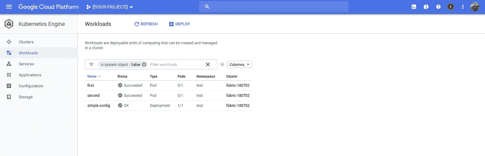
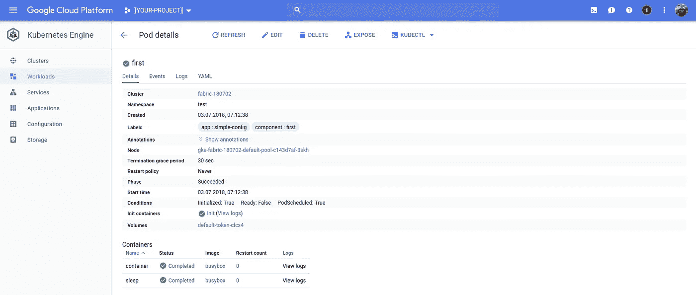
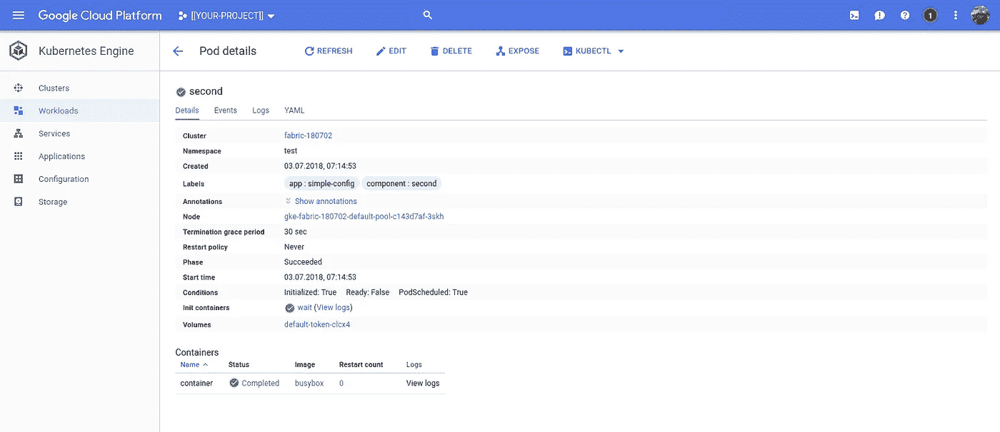
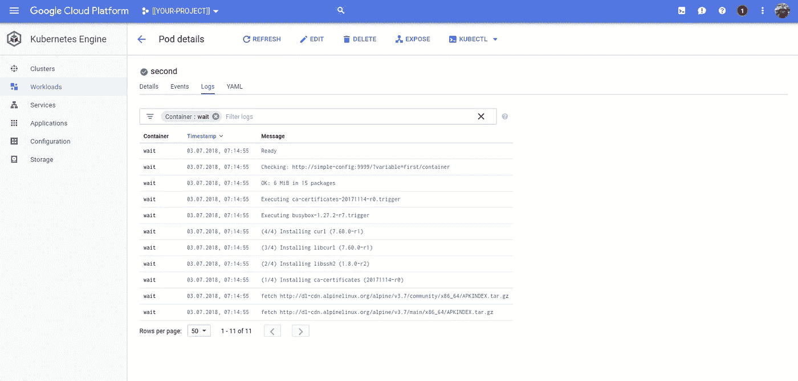

# Kubernetes 部署依赖项

> 原文：<https://medium.com/google-cloud/kubernetes-deployment-dependencies-ef703e563956?source=collection_archive---------0----------------------->

## 一个渴望抓挠的痒处！

我在做一个区块链平台的掌舵图。Helm 有助于模板化部署，尽管我发现自己复制了许多样板文件。一个更大的问题是试图在部署期间反映资源之间的依赖性。

我已经写了一个小的概念验证，我认为有帮助，并对反馈感兴趣。我意识到我不仅想要一个(分布式)锁服务(etcd？胖乎乎的？)，而且还有更透明的 Kubernetes 资源来编排这些依赖关系。

## 问题是

我有 2 个吊舱:`first`、`second`。我希望`second`阻塞，直到`first`是“可用的”。这是数据库及其客户端通常需要的，但我认为这是一个普遍的问题。

我遇到的解决方案是在 pod 之间共享一个卷，并将文件系统用作锁定数据库。某种形式的东西:

```
kind: Pod
metadata:
  name: pod-a
spec:
  volumes:
  - name: shared-pvc
  initContainers:
  - name: await
    command:
    - sh
    - -c
    - |
      while [ ! -f /shared/created ]; do
        echo Waiting for something to be created
        sleep 5s
      done
      echo created
    volumeMounts:
    - mountPath: /shared
      name: shared-pvc
```

这有几个优点:

*   它利用了 Linux 中的“一切都是文件”;随处可得
*   这很容易理解

但是它有几个缺点

*   它对 Kubernetes 和其他容器来说是不透明的
*   它甚至需要一个外壳来包装一个二进制文件
*   它需要读写多个卷
*   它不是可插拔的

下面是一个替代方法的概念验证，我怀疑这是 etcd，Chubby，Zookeeper 和其他人会提供的。如果我能说服自己这种方法的优点，我计划尝试使用 etcd 或者可能将 Google 的运行时配置服务呈现给 Kubernetes。

# 概念验证

我编写了一个简单的 Golang httpd 服务，它接受 get 来检索“变量”并发布创建它们的消息。服务本身是根据全局配置值创建的。

> **NB** 当我写这篇文章时，我意识到一个直接的改进是使全局配置值动态化而不是静态化。然后，这将与每个 GET 和 POST 一起提供，以划分到名称空间中。

例如，如果变量`a/path/my/variable`已经被创建，则返回 200:

```
curl \
--request GET \\
[http://simple-config:9999/?variable=a/path/my/variable](http://service:9999/?variable=a/path/my/variable)
[200]
```

以下命令创建上述变量:

```
curl \
--request POST
--header "Accept: application/json" \
--data '{"variable":"a/path/my/variable"}' \
http://simple-config:9999
```

这有什么好处呢？

不确定。

下面是`first`的一个实现示例:

这将修改`initContainer`(第 12-29 行)。它使用`busybox`(有`wget`没有`curl`)。它从向下的 API(例如`first`)获取容器的名称，将其连接到`init`并在服务的卷`first/init`中创建一个文件。

检查服务的数量，我们发现:

```
.
└── first
    └── init
```

主容器(称为`container`)在其`initContainers`完成时阻塞。当容器开始的时候，我们可以确信`first/init`文件已经被创建了。容器然后创建第二个名为`first/container`的文件:

```
.
├── first
    ├── container
    └── init
```

一切都好！

然后我们可以部署`Second`:

该 Pod ( `Second`)必须锁定，直到`first`准备就绪。我们的协议是`first`在准备好的时候会创建一个变量`first/container`。因此，Second 有一个`initContainer`，它等待这个变量的端点准备就绪(200)。这段代码出现在第 16–27 行。

可惜(！)这需要一个 shell(这是我希望避免的一个需求)*，但是*我建议用一个简单的 Golang 二进制程序来代替它，轮询给定的端点。这类似于我之前写的健康检查替代方案([链接](/google-cloud/dockerfile-go-healthchecks-k8s-9a87d5c5b4cb))。

和前面一样，主容器(container)使用 busybox 的 wget 创建另一个变量，记录该容器的成功完成(`second/dependent`)。

完成`first`和`second`后，我们有:

```
.
├── first
│   ├── container
│   └── init
└── second
    └── dependent
```

这些树显示了这种方法的一个副作用，即尽管实现当前使用文件系统，但是文件系统对于创建/读取变量的客户端是不透明的。可以在不重写容器清单的情况下应用替代实现(etcd，运行时配置)。

这是谷歌的控制台，显示了部署的服务和完成的`first`和`second`:



深入了解每一项:



第一

并且:



第二

和`wait`容器的日志:



等待

或者，您可以从命令行查看等待容器的日志:

```
kubectl logs pod/second \
--container=wait \
--namespace=${NAMESPACE} \
--context=${CONTEXT}fetch [http://dl-cdn.alpinelinux.org/alpine/v3.7/.](http://dl-cdn.alpinelinux.org/alpine/v3.7/main/x86_64/APKINDEX.tar.gz)..
fetch [http://dl-cdn.alpinelinux.org/alpine/v3.7/.](http://dl-cdn.alpinelinux.org/alpine/v3.7/community/x86_64/APKINDEX.tar.gz)..
(1/4) Installing ca-certificates (20171114-r0)
(2/4) Installing libssh2 (1.8.0-r2)
(3/4) Installing libcurl (7.60.0-r1)
(4/4) Installing curl (7.60.0-r1)
Executing busybox-1.27.2-r7.trigger
Executing ca-certificates-20171114-r0.trigger
OK: 6 MiB in 15 packages
**Checking:** [**http://simple-config:9999/?variable=first/container**](http://simple-config:9999/?variable=first/container)
Ready
```

这里你可以看到`initContainer`阻塞了`second`容器的开始，直到变量变得可用，在这种情况下，这种情况会很快发生。

我已经展示了使用`tree`来查看支持`simple-config`服务的目录的内容。要访问与简单配置服务相关联的调试容器(debug )(参见第 39–44 行下面的`deployment.yaml`),我们必须首先确定 pod 的名称。因为容器有一个与之关联的标签(`component: debug`)，所以我们可以快速选择它。然后，我们使用 JSONPath 获取(假设是第一个也是唯一的)pod 的名称:

```
kubectl get pods \
--selector=component-debug \
--output=jsonpath="{.items[0].metadata.name}" \
--namespace=${DEFAULT} \
--context=${CONTEXT}
```

我们可以将这个命令与一个`kubectl exec`结合起来，以访问调试容器中的`ash`外壳:

```
kubectl exec \
--stdin \
--tty
$(\
  kubectl get pods \
  --selector=component-debug \
  --output=jsonpath="{.items[0].metadata.name}" \
  --namespace=${NAMESPACE} \
  --context=${CONTEXT}) \
--namespace=${NAMESPACE} \
--context=${CONTEXT} \
-- ash
```

> 注意:如果你使用默认设置，你可以同时丢弃两组标志 `— namespace`和`— context`。
> 
> **NB** 第一次执行到容器中，你可能希望安装`tree`(你需要先更新:`apk update && apk install tree`)。

然后，您可以检查`/config`目录的内容:

```
tree /config/config
├── first
│   ├── container
│   └── init
└── second
    └── dependent
```

`simple-config`配置在 3 个地方。

首先，流程(`main.go`)可以由环境配置。变量`SIMPLE_CONFIG_PATH`用于定义变量存储的绝对路径。默认为当前目录(`.`)。变量`SIMPLE_CONFIG_PORT` 用于定义监听端口。默认为`8080`。

然后通过在第 32–35 行的`deployment.yaml`中定义`env`键:值对，将`simple-config`服务配置为使用 `/config`目录和端口`9999`(任意)。这些包括对容器的`/config`的引用。这实际上是一个名为`config`卷的卷装载(第 33–34 行)。在第 24–25 行中，卷本身被定义为一个`EmptyDir`。

为了方便和/或比较，本地运行容器的等效 Docker 命令应该是:

```
HOST_PATH=...
HOST_PORT=...
CONT_PATH=...
CONT_PORT=...docker run \
--interactive \
--tty \
--volume=$PWD/${HOST_PATH}:${CONT_PATH} \
--env=SIMPLE_CONFIG_PATH=${CONT_PATH} \
--env=SIMPLE_CONFIG_PORT=${CONT_PORT} \
--publish=${HOST_PORT}:${CONT_PORT} \
dazwilkin/simple-config:v1
```

## Golang:服务器

下面是`simple-config`服务器实现的代码:

这是它的文档:

这是它的部署清单:

## 客户

下面是`simple-config`服务的一个客户端实现:

一个带有调整过的`entrypoint`的 Dockerfile 文件也能捕获 Golang 二进制文件:

[https://gist . github . com/daz wilkin/b 9044 de 454691 eef 93 DC 69900 c 340 b 72](https://gist.github.com/DazWilkin/b9044de454691eef93dc69900c340b72)

和一份货舱清单:

这一次，我们没有外壳，不是因为对外壳有任何厌恶，而是为了更明确地表明意图。`initContainer`引用客户端(`dazwilkin/simple-config/client`)并调用`exists $(VARIABLE)`来检查变量(`plus/container`)是否存在。

随后，`container`容器调用`create $(VARIABLE)`来标记其完成。

## 结论

我还不确定这种方法的优点。它解决了我的一些问题，但不是全部，并且增加了一些复杂性。我仍然相信 Kubernetes 应该有一种机制来自动化这种类型的部署复杂性。

存在哪些替代方案？