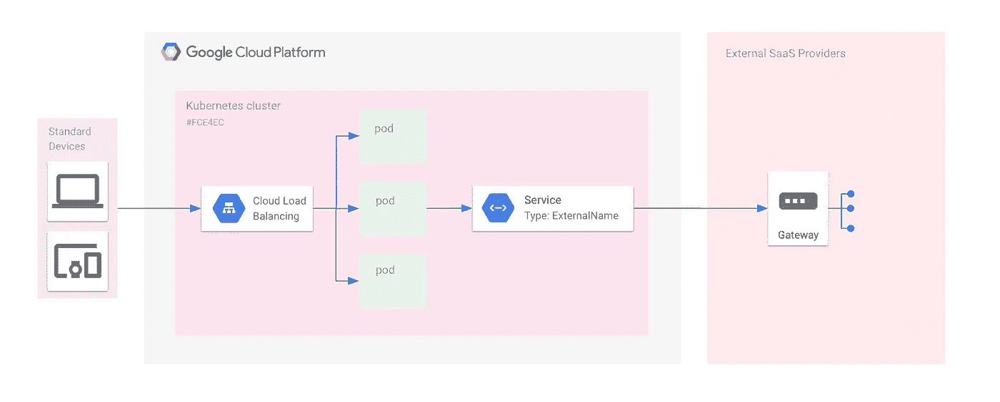

# Kubernetes:带服务的 DNS 代理

> 原文：<https://medium.com/google-cloud/kubernetes-dns-proxy-with-services-d7d9e800c329?source=collection_archive---------0----------------------->

构建应用程序时，通常需要与外部服务进行交互来完成业务目标。在 Kubernetes 集群中工作时，您可能喜欢使用[内部服务路由](/google-cloud/kubernetes-routing-internal-services-through-fqdn-d98db92b79d3)让您的一个服务与您的另一个服务通信。如果您想使用 Kubernetes DNS 服务器来屏蔽外部服务，使它们看起来像内部服务，那么您很幸运——这是可能的！本文将介绍如何使用 Kubernetes DNS 服务器将外部服务伪装成内部服务。



带 DNS 服务代理的 GCP GKE 架构图

*如果你没有通读甚至没有读过本系列* *的第一部分* [*，你可能会感到困惑，对代码在哪里或者之前做了什么有疑问。记住这里假设你正在使用*](/@jonbcampos/kubernetes-day-one-30a80b5dcb29) [*GCP*](https://cloud.google.com/) *和*[*GKE*](https://cloud.google.com/kubernetes-engine/)*。我将始终提供代码和如何测试代码是按预期工作。*

[](/google-cloud/kubernetes-day-one-30a80b5dcb29) [## 库伯内特:第一天

### 这是 Kubernetes 帖子的必选步骤之一。如果你对 Kubernetes 感兴趣，你可能已经读过 100 本了…

medium.com](/google-cloud/kubernetes-day-one-30a80b5dcb29) 

# 为什么代理您的服务

有很多原因可以让你使用 Kubernetes DNS 服务器来屏蔽外部服务。一个例子是改变端点。你可能知道一个服务端点会改变，而不是让你的开发人员在代码中改变端点，我们可以让开发人员指向一个易于使用的内部服务端点，而不管实际发生了什么。

现在，您可以通过 Kubernetes YAML 配置文件随时更改您的外部服务端点，而不必进入您的应用程序代码。

# 创建外部名称代理

创建外部名称代理非常简单。我们需要做的大部分工作都在 Kubernetes yaml 文件中。在这种情况下，我们将[创建一个新的 yaml 文件](https://github.com/jonbcampos/kubernetes-series/blob/master/external-communication/k8s/external-service.yaml#L1-L17)，如下图所示。

```
apiVersion: v1
kind: Service # a way for the outside world to reach the Pods
metadata:
  # the name of our external Service
  **name: external-service**
spec:
  # Service ports
  ports:
    - name: http
      port: 80
      targetPort: 8080
      protocol: TCP
  # *Points to external name*
  **type: ExternalName**
  **externalName: www.jonbcampos.com** *# the external url*
  selector:
    app: kubernetes-series
```

这个配置文件创建了一个 ExternalName 类型的新服务，并将外部名称指向我们选择的 URL。

现在我们的外部服务配置好了，我们只需要在应用程序代码中调用外部服务。

```
router.get('/foreign', function (req, res, next) {
    const url = '**http://external-service.default/some_path/**';
    http.get(url, response => {
        let data = '';
        response.on('data', chunk => {
            data += chunk;
        });
        response.on('end', () => {
            res.status(200).json(JSON.parse(data));
        });
    }).on('error', err => {
        throw err;
    });
});
```

# 查看我们的外部名称代理的运行情况

我已经为你设置了一个实验，这样你就可以很容易地看到它的运行。正如我之前所做的，您可以运行一个启动脚本来在 Google Cloud 中设置您的 Kubernetes 集群并部署您的应用程序代码。

```
$ git clone [https://github.com/jonbcampos/kubernetes-series.git](https://github.com/jonbcampos/kubernetes-series.git)
$ cd ~/[kubernetes-series/external-communication/scripts](https://github.com/jonbcampos/kubernetes-series/tree/master/external-communication/scripts)
$ sh [startup.sh](https://github.com/jonbcampos/kubernetes-series/blob/master/external-communication/scripts/startup.sh)
$ sh [deploy.sh](https://github.com/jonbcampos/kubernetes-series/blob/master/external-communication/scripts/deploy.sh)
$ sh [check-endpoint.sh](https://github.com/jonbcampos/kubernetes-series/blob/master/external-communication/scripts/check-endpoint.sh) service
```

一旦您的服务可用，您就可以点击`/foreign`端点来查看通话结果。根据您的集群的 IP 地址，这将是`http://[your cluster IP Address]/foreign`。

> 注意:如果你运行这段代码，你会得到一个错误，因为`jonbcampos.com`是通过 Bluehost 托管的，所以我没有直接的 IP 地址访问。您可以随时将这个值更改为适合您的测试的任何值。

测试完成后，您就大功告成了！现在可以使用 Kubernetes DNS 服务器(通过 kube-proxy)调用外部服务，就像调用内部服务一样。

# 拆卸

在您离开之前，请确保清理您的项目，这样您就不会为您用来运行群集的虚拟机付费。返回到云 Shell 并运行 teardown 脚本来清理您的项目。这将删除您的集群和我们构建的容器。

```
$ cd ~/[kubernetes-series/external-communication/scripts](https://github.com/jonbcampos/kubernetes-series/tree/master/external-communication/scripts)
$ sh [teardown.sh](https://github.com/jonbcampos/kubernetes-series/blob/master/external-communication/scripts/teardown.sh)
```

# 本系列的其他文章

[](/google-cloud/kubernetes-routing-internal-services-through-fqdn-d98db92b79d3) [## Kubernetes:通过 FQDN 路由内部服务

### 我记得当我第一次进入 Kubernetes 时。一切都是崭新的、闪亮的、有规模的。当我继续的时候…

medium.com](/google-cloud/kubernetes-routing-internal-services-through-fqdn-d98db92b79d3) [](/@jonbcampos/kubernetes-horizontal-pod-scaling-190e95c258f5) [## Kubernetes:水平 Pod 缩放

### 通过 Pod 自动扩展，您的 Kubernetes 集群可以监控现有 Pod 的负载，并确定我们是否需要更多…

medium.com](/@jonbcampos/kubernetes-horizontal-pod-scaling-190e95c258f5) [](https://itnext.io/kubernetes-readiness-probe-83f8a06d33d3) [## Kubernetes:就绪探测

### 如果对这个特性有任何疑问，我写这篇文章是为了说明这不是一个…

itnext.io](https://itnext.io/kubernetes-readiness-probe-83f8a06d33d3) [](/@jonbcampos/kubernetes-liveness-checks-4e73c631661f) [## Kubernetes:活性检查

### 最近，我整理了一篇关于 Kubernetes 就绪性调查以及它对您的集群有多重要的文章…

medium.com](/@jonbcampos/kubernetes-liveness-checks-4e73c631661f) 

[Jonathan Campos](http://jonbcampos.com/) 是一个狂热的开发者，喜欢学习新事物。我相信我们应该不断学习、成长和失败。我总是开发社区的支持者，并且总是愿意提供帮助。因此，如果你对这个故事有任何问题或意见，请在下面提出。在 [LinkedIn](https://www.linkedin.com/in/jonbcampos/) 或 [Twitter](https://twitter.com/jonbcampos) 上与我联系，并提及这个故事。