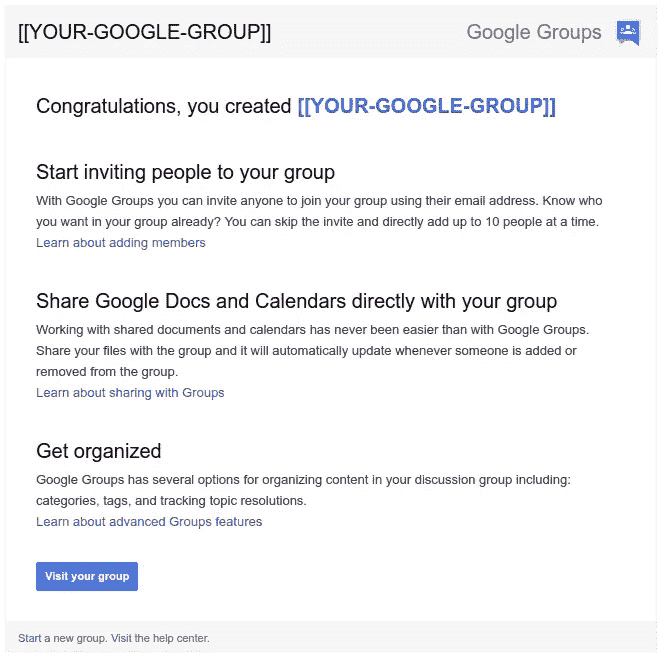
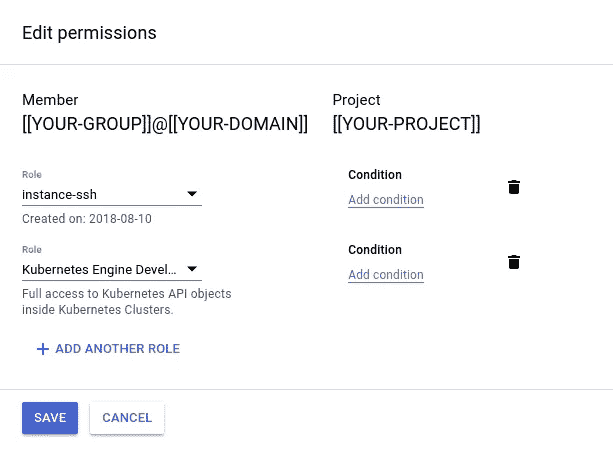
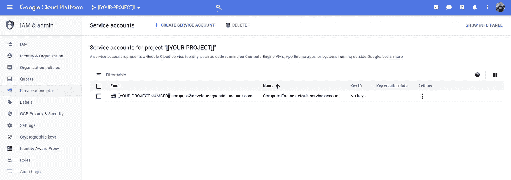

# Kubernetes 引擎访问和审计

> 原文：<https://medium.com/google-cloud/kubernetes-engine-access-and-audit-b979bbba50d0?source=collection_archive---------0----------------------->

## 库伯内特斯历险记

我一直在探索与可信的外部开发人员共享集群访问权限的方法。这些开发者需要的不仅仅是纯粹的 Kubernetes 访问，他们还希望能够`ssh`进入节点。

## 有用的分流:gcloud — account=[[ACCOUNT]]

本周我发现有一个`gcloud`(代表 GCP)标志来指定用于该命令范围的 Google 帐户。如果你希望明确哪个账户正在被使用(就像我对 GCP 项目和 Kubernetes 集群所做的那样，见[故事](/google-cloud/context-light-gcloud-and-kubectl-89185d38ce82))，这个特性是有用的，但是它更容易允许动态切换账户。

示例:

```
gcloud auth listACTIVE  ACCOUNT
*       [my](mailto:daz.wilkin@gmail.com)@gmail.com
        my@[o](mailto:dazwilkin@cloud-sce.com)ther.com
        my@google.comTo set the active account, run:
    $ gcloud config set account `ACCOUNT`
```

为了方便起见，我有一个默认的(`active` ) `gcloud`账户。这是最近的`gcloud auth login`账户，但也可以使用`gcloud config set account [ACCOUNT]`设置。

直到本周，我都会表演这种舞蹈:

```
gcloud config set account my@google.com
gcloud some-command
gcloud config set account my@gmail.com
gcloud some-command
```

现在，我知道了有可能(而且更优雅地)做到:

```
gcloud some-command --account=my@google.com
gcloud some-command --account=my@gmail.com
```

为了测试开发者的访问权限，我使用我的 Gmail 账户作为代理。

## 谷歌群组

在 GCP 项目中使用 Google Groups 进行 IAM 角色分配是一个很好的做法。一般(！)您可以使用在您的组织域(例如`acme.com`)上创建的 Google Groups 来创建这些组。在我的例子中，因为开发人员不是谷歌人，而且因为我们(通常)不被允许向在`google.com`上创建的组添加非`@google.com`帐户，我将使用公共的谷歌组域(`googlegroups.com`)。

因为我的 Gmail 帐户创建了这个组，所以它自动成为该组的成员，我可以立即开始测试。我需要添加开发人员的谷歌帐户到这个开发人员的工作小组。但是(！)因为我使用的是一个组，并且将 IAM 角色分配给该组，所以我可以确信我的 Gmail 帐户和他们的 Google 帐户在项目中将具有功能上等同的角色:



## InternationalAssociationofMachinists 国际机械师协会

这是该组在项目中的权限的快照。您可以使用云控制台 UI 来创建它，或者，我将向您展示如何从命令行完成此操作。首先我们需要创建第二个角色`instance-ssh`。



第一个角色是`[Kubernetes Engine Developer](https://cloud.google.com/kubernetes-engine/docs/how-to/iam#predefined)`。这为开发人员提供了对集群的访问，但是我也希望开发人员能够进入集群的节点。节点是计算引擎虚拟机，没有现成的角色提供仅`ssh`访问。因此，我使用自定义角色创建了一个:

```
gcloud iam roles create instance_ssh \
--project=${PROJECT} 
--file=instance_ssh.role.yaml
```

和 YAML:

这 4 个权限允许具有该角色的帐户列出项目中的实例并`ssh`进入其中。`setMetadata`权限支持`gcloud compute ssh`向项目的元数据服务添加帐户的公钥。这些帐户还必须能够使用计算引擎服务帐户(虽然这是一个必要的功能，但有点令人困惑；我们将服务帐户视为一种资源):

```
gcloud iam service-accounts add-iam-policy-binding \
${PROJECT_NUMBER}-compute@developer.gserviceaccount.com \ 
--member=group:${GROUP}@googlegroups.com \
--role=roles/iam.serviceAccountUser \
--project=${PROJECT}
```

计算引擎服务帐户是自动生成的，如果其名称是由您的 GCP 项目的编号(不是 ID)和“`-compute@developer.gserviceaccount.com`”组合而成的，则会自动生成。从云控制台查看电子邮件地址最简单:



确定项目的默认计算引擎服务帐户

## Kubernetes 发动机用户

要知道，一旦通过了`gcloud`的认证，谷歌账户仍然可以被操作系统用户使用。在我的情况下，在我的工作机器上(当我登录时)，我可以在显示的 3 个谷歌账户之间切换，只需使用`--account=[[ACCOUNT]]`标志。

> **注意**您必须`gcloud auth revoke [[ACCCOUNT]]`删除缓存的凭证。

这一事实也与 Kubernetes 发动机相关。虽然 Kubernetes 维护自己的授权机制，但 Kubernetes 引擎支持 Google 的 OAuth，一旦用户拥有`gcloud container clusters get-credentials`……这就是问题所在……*任何*由 gcloud 认证并拥有集群适当权限的帐户都可以使用它。推论:不仅仅是帐户被`get-credentials`命令使用。

如果`my@google.com`创建了集群并获得了凭证，因为我已经按照上面的说明为同一个项目对`my@gmail.com`进行了访问控制，所以作为`gcloud`的活动帐户的帐户将成为`kubectl`(!)用途。

哇哦！？？

```
gcloud config set account my@gmail.com
kubectl apply --filename=${DEPLOYMENT-1} \
--namespace=${NAMESPACE} \
--context=${CONTEXT}
gcloud config set account my@google.com
kubectl apply --filename=${DEPLOYMENT-2} \
--namespace=${NAMESPACE} \
--context=${CONTEXT}
```

将`{DEPLOYMENT-1}`部署为`my@gmail.com`，`${DEPLOYMENT-2}`部署为`my@google.com`。

我如何能确认这一点？日志。

## 审计日志

没有任何东西通过审计日志记录器。我们想做的是确定谁在何时做了什么？这很简单:

```
PROJECT=[[YOUR-PROJECT]]
ACCOUNT=[[YOUR-ACCOUNT]]LOG="cloudaudit.googleapis.com%2Factivity"
FILTER="logName=\"projects/${PROJECT}/logs/${LOG}\" "\
"resource.type=\"k8s_cluster\""gcloud logging read "${FILTER}" \
--freshness=1h \
--project=${PROJECT} \
--account=${ACCOUNT} \
--format=json \
| jq --raw-output **'.[].protoPayload.methodName'** \
| sort \
| uniqio.k8s.apiextensions.v1beta1.customresourcedefinitions.create
io.k8s.apiextensions.v1beta1.customresourcedefinitions.patch
io.k8s.apiregistration.v1.apiservices.create
io.k8s.apps.v1.deployments.create
io.k8s.app.v1alpha1.applications.create
io.k8s.authorization.rbac.v1.clusterrolebindings.patch
io.k8s.batch.v1.jobs.create
io.k8s.certificates.v1beta1.certificatesigningrequests.delete
io.k8s.core.v1.configmaps.create
io.k8s.core.v1.configmaps.update
io.k8s.core.v1.endpoints.create
io.k8s.core.v1.endpoints.update
io.k8s.core.v1.namespaces.create
io.k8s.core.v1.persistentvolumeclaims.create
io.k8s.core.v1.persistentvolumeclaims.update
io.k8s.core.v1.persistentvolumes.create
io.k8s.core.v1.persistentvolumes.update
io.k8s.core.v1.pods.binding.create
io.k8s.core.v1.pods.create
io.k8s.core.v1.secrets.create
io.k8s.core.v1.serviceaccounts.create
io.k8s.core.v1.serviceaccounts.update
io.k8s.core.v1.services.create
io.k8s.extensions.v1beta1.deployments.create
io.k8s.extensions.v1beta1.deployments.patch
io.k8s.extensions.v1beta1.replicasets.create
io.k8s.storage.v1.storageclasses.create
io.k8s.storage.v1.storageclasses.patchgcloud logging read "${FILTER}" \
--freshness=1h \
--project=${PROJECT} \
--account=${ACCOUNT} \
--format=json \
| jq --raw-output **'.[].protoPayload | { email:.authenticationInfo.principalEmail, method:.methodName }'**gcloud logging read "${FILTER}" \
--freshness=1h \
--project=${PROJECT} \
--account=${ACCOUNT} \
--format=json \
| jq --raw-output **'.[].protoPayload | .authenticationInfo.principalEmail + " " + .methodName '** \
| sort \
| uniqcluster-autoscaler io.k8s.core.v1.configmaps.update
cluster-autoscaler io.k8s.core.v1.endpoints.update
my@gmail.com io.k8s.apps.v1.deployments.create
my@gmail.comio.k8s.app.v1alpha1.applications.create
my@gmail.comio.k8s.batch.v1.jobs.create
my@gmail.comio.k8s.core.v1.configmaps.create
my@gmail.comio.k8s.core.v1.namespaces.create
my@gmail.comio.k8s.core.v1.persistentvolumeclaims.create
my@gmail.comio.k8s.core.v1.persistentvolumes.create
my@gmail.comio.k8s.core.v1.pods.create
my@gmail.comio.k8s.core.v1.services.create
my@gmail.comio.k8s.extensions.v1beta1.deployments.create
my@gmail.comio.k8s.storage.v1.storageclasses.create
my@gmail.comio.k8s.storage.v1.storageclasses.patch
system:apiserver io.k8s.apiregistration.v1.apiservices.create
system:kube-controller-manager io.k8s.core.v1.secrets.create
system:kube-controller-manager io.k8s.core.v1.serviceaccounts.update
system:kube-scheduler io.k8s.core.v1.pods.binding.create
...
system:unsecured io.k8s.core.v1.configmaps.update
system:unsecured io.k8s.extensions.v1beta1.deployments.patch
```

> **NB** (审计)日志快速增长。通过包含`--freshness`标志来限制您`read`的日志是一个很好的做法。这里设定为一小时。

这些都是为 Kubernetes 引擎记录的，在这里:

[https://cloud . Google . com/kubernetes-engine/docs/how-to/audit-logging](https://cloud.google.com/kubernetes-engine/docs/how-to/audit-logging)

## japan quarterly 日本季刊

因此，我感兴趣的是如何最好地转换日志数据以获得用户的方法:

```
gcloud logging read "${FILTER}" \
--freshness=1d \
--project=${PROJECT} \
--account=${ACCOUNT} \
--format=json \
| jq --raw-output '[.[].protoPayload | { email:.authenticationInfo.principalEmail, method:.methodName }]' \
| jq 'group_by(.email)' \
| jq 'map({"email": .[0].email, "method": map(.method) | unique})'
```

漂亮得像个要点:

> **NB** 当然，jq 命令可以组成一个单独的 jq 语句，但是，这代表了我构建管道的方式，所以我保留了它。

整洁！它丢失信息(什么部署？)但是……它显示了用户方法的范围。

## 结论

在这个故事中，我们已经讲述了`gcloud`的有用的`account`标志。简要介绍了 Kubernetes 引擎认证的工作原理，并简单介绍了 GCP 的 IAM，包括自定义角色，最后介绍了一些审计日志功能。

仅此而已！