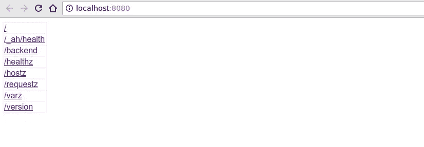
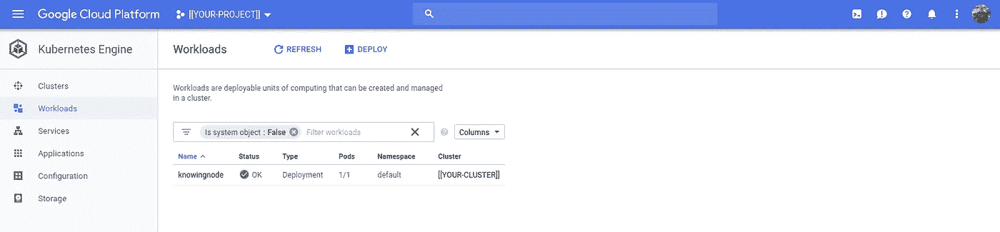
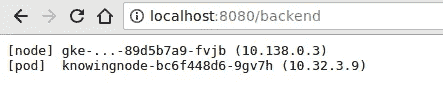
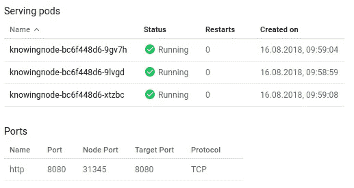
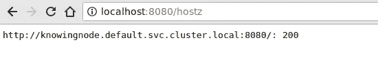
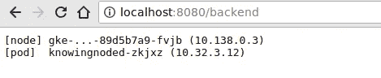
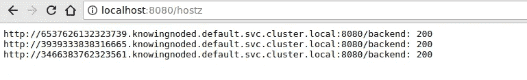
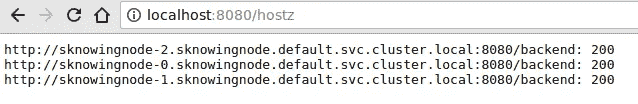

# Kubernetes 发动机从零开始 2/2

> 原文：<https://medium.com/google-cloud/kubernetes-engine-from-scratch-2-ac229df87851?source=collection_archive---------1----------------------->

## 库伯内特斯历险记

回到我的 Noogler(参见[第一部分](/google-cloud/kubernetes-engine-from-scratch-2c2369c46841))那里，他有兴趣在各种类型的控制器上部署一些 pod。

## 一个集装箱

让我们从最小部署开始。我将使用他构建的[sal maan Rashid](https://medium.com/u/b78c1a5c6205?source=post_page-----ac229df87851--------------------------------)“knowning”节点示例来探索 Istio，因为它使用向下 API 并支持简单的前端-后端配置。

Downward API 为 Kubernetes Pods 提供了一种方式来确定有关其(Kubernetes)运行时环境的信息，而不会危及“第四堵墙”。

这是萨尔代码的一个变体:

为了省去你的麻烦，我为你构建并推送到 docker hub(`dazwilkin/knowingnode:0`)。您应该能够:

```
docker run \
--interactive \
--tty \
--publish=8080:8080 \
dazwilkin/knowingnode:0
```

然后:

```
google-chrome http://localhost:8080
```

请看:



“已知节点”容器

**NB** 点开。在本地部署容器时，并非所有链接都有效。

## 一个豆荚

为自己创建一个集群，然后:

```
kubectl run knowingnode --image=dazwilkin/knowingnode:0
```

使用 Kubernetes 发动机控制台:



然后，您应该能够:

```
POD=$(kubectl get pod \
--selector=run=knowingnode \
--output=jsonpath="{ .items[0].metadata.name }") && echo ${POD}
**knowingnode-946fb96b-v78wp**
```

这是`kubectl`的一个强大功能。在之前的故事中，我使用了`output=yaml`，但是你也可以使用`— output=json`。如果您获得 JSON，那么您可以将结果通过管道传输到`jq`并使用它创造奇迹。然而，在这种情况下，我能够用 JSONPATH 完成我需要的 JSON 处理。我们拿到了豆荚的名字。

> **注意**有一个 output=name，但它以资源类型为前缀。

然后:

```
kubectl port-forward ${POD} 8080:8080
```

而且，您应该能够刷新您的浏览器选项卡…但继续从容器的页面获得空结果。这是因为我们还没有配置向下的 API 值，所以它无法检索这些值。让我们这样做:

和之前的故事一样，我通过`kubectl get deployment/knowingnode --output=yaml`和编辑开始了这个 YAML。这里要注意的区域是容器的`env`部分。这里我们为容器定义环境变量。请暂时忽略`SERVICE_NAME`。接下来的 4 个变量(`NODE_NAME`、`NODE_IP`、`POD_NAME`和`POD_IP`)都使用向下 API 来收集这个 Pod 及其节点的状态数据。有不同的方法来合并向下 API。这种方法使用环境变量。变量值(这里是`fieldPath`)是对 Pod 元数据的引用。这里可以看到`metadata.name`被重用。

尽管 Downward API 提供了特定于 Kubernetes 的数据。向下 API 和容器之间有一个清晰的分离。容器不知道向下 API。但是容器理解环境变量。我们没有对容器进行任何更改。容器图像可以在任何地方工作。当它被部署在这里时，它会显示 Downward API 提供给它的值。整洁！

## **一次部署**

将此修改后的部署应用到您的群集:

```
kubectl apply --filename=deployment.yaml
```

您将需要重新运行命令来获取`${POD}`值和`port-foward`，因为当我们应用更新的部署时，部署终止了原始 Pod 并替换了它。

现在，您应该能够浏览`/backend`端点并查看相关信息。就我而言:



正在使用的向下 API

好的，您可能已经注意到了，部署也包括 3 个副本。我们正在使用第一个(0 ),但我们真的应该创建一个服务和…

和服务部门谈谈！

该服务创建一个`NodePort`。一个 `NodePort`是一个服务端点，它在集群中每个**节点**的同一个端口上可用。您可以访问任何集群节点，我们的服务将在`NodePort`可用。



服务“已知节点”

但是，我们必须首先到达节点。Kubernetes 引擎节点是一个计算引擎虚拟机。我们可以`ssh`轻松进入计算引擎虚拟机，但我们需要知道节点名称，即虚拟机实例名称:

```
kubectl get nodes --output=jsonpath="{.items[*].metadata.name}"
--output=jsonpath="{.items[*].metadata.name}"
gke-...-045e36a8-lzxl
gke-...-802a34dc-g589
gke-...-89d5b7a9-fvjb
```

您可以通过将`*`替换为数字(如`0`)来抓取特定节点。或者，你可以随便抓一个:

```
NODE=$(shuf \
--head-count=1 \
--echo $(\
  kubectl get nodes \
  --output=jsonpath="{.items[*].metadata.name}")\
) && echo ${NODE}
```

现在，我们还必须确定分配给我们的服务的节点端口。这也很简单:

```
PORT=$(\
  kubectl get service/knowingnode \
  --output=jsonpath="{.spec.ports[0].nodePort}" && echo ${PORT}
```

> **NB** 我不只是知道这些路径语句。我要做的是用`— output=json`或`— output=yaml`运行命令，然后构建正确的过滤器。所以你可以看到你需要`--output=jsonpath="{.spec}"`，并进化你的过滤器，直到它满足你的需要。

现在，我们有了`${NODE}`和`${PORT}`，我们可以:

```
gcloud compute ssh ${NODE} \
--ssh-flag="-L ${PORT}:localhost:${PORT}" \
--project=${PROJECT}
```

> **注意**为了简单起见，我将节点端口映射到本地的同一个端口(如上)。但是，如果您愿意，您可以使用`8080:localhost:{$PORT}`在本地映射到`8080`。

请记住，您需要:

```
google-chrome http://localhost:**${PORT}**
```

## 一次部署-部署

一种非常常见的部署模式是前端和后端的结合，例如 web 服务器和数据库。一个反模式是捆绑前端和后端。前端和后端最好独立扩展。我们将在本文的剩余部分使用这种前端-后端配置，从一个部署对一个部署开始。

更准确地说，一个部署中的 pod 访问代理由另一个部署创建的 pod 的服务；-)

我们之前创建了一个代理部署的服务。这个服务叫做`knowingnode`。所以，让我们利用这一点。我们将创建一个`knowingnodes`(是的，相同的容器)的前端部署(使用前面提到的`SERVICE_NAME`)来与我们现有的服务对话。

如果您还记得，服务在集群中是通过它们的`[name].[namespace].svc.cluster.info`命名的(DNS ),可以缩写为`[name].[namespace]`,而对于`Default`命名空间，只需`[name].`

因此，我们将调整我们的部署。因此:

这主要与之前的部署文件相同。它为`SERVICE_NAME`指定了一个值，该值对应于我们之前创建的服务。我们已经更改了此部署的标签。对于部署本身和它将管理的单元都是如此。我们需要确保此部署的选择器与这些 pod 匹配。我发现最简单的方法是将部署的标签复制到 Pod 的标签上，从而复制选择器的标签。

如果您愿意，可以为此部署创建一个服务。为了简单起见，我将移植到单个 Pod:

```
POD=$(kubectl get pod \
--selector=**component=frontend,controlling=deployment** \
--output=jsonpath="{ .items[0].metadata.name }") && echo ${POD}kubectl port-forward ${POD} 8080:8080
```

然后浏览端点。如果您使用 Pod 端口转发，我们将返回到`8080`。除非您选择了不同的本地端口。

```
google-chrome http://localhost:8080**/hostz**
```

注意，我们正在查看`/hostz`端点。这个端点背后的代码对端点`${SERVICE_NAME}`和`GET`进行通用 DNS 查找。我们的前端服务正在调用我们的后端服务:



一切都好！

成功！

## 一次部署-DaemonSet

您会记得 DaemonSet 与部署的不同之处在于，它为集群中的每个节点生成一个 Pod。这使得我们可以直接通过节点来访问 pod。让我们试试那个。首先是恶魔集:

我再次注意避免命名和(更重要的)标签冲突，我们在这里使用了`knowingnode**d**`。但是，请注意添加了一个 ports 部分并包含了一个`hostPort`值(与我们的`containerPort`相匹配)。

我们通常不会期望 Kubernetes 集群的节点在端口`8080`上公开容器。它融合了吗？让我们随机选择一个节点，然后浏览它的端口`8080`。

```
NODE=$(shuf \
--head-count=1 \
--echo $(\
  kubectl get nodes \
  --output=jsonpath="{.items[*].metadata.name}")\
) && echo ${NODE}
```

然后端口转发给它:

```
gcloud compute ssh ${NODE} \
--ssh-flag="-L 8080:localhost:**8080**" \
--project=${PROJECT}
```

> **NB** 这一次，我们没有在节点上使用节点端口。

并且:

```
google-chrome http://localhost:**8080**
```

并且:



通过节点访问 DaemonSet Pod

> **NB**Pod 是 knowingnoded，这证明我们正在攻击 DaemonSet 的一个 Pod，我们正在通过节点的(！)端口。

实际上，您不太可能构建一个配置，其中一个 Kubernetes 控制器的 pod 访问由 DaemonSet 控制的 pod。守护进程通常用于提供特定于主机的功能，例如审计、安全、监控和日志记录。然而，我们可以将无头服务应用于 DaemonSet。

让我们这样做，然后修改我们的前端指向它。

我们想要一个修改过的前端部署，不再让`SERVICE_NAME`指向`knowingnode`服务，而是指向`knowingnoded`服务。为了确保我们标记的东西是正确的，我们还将修改标签`controlling`的值为`daemonset`。

然后随机抓取一个 Pod 并将其转接到端口:

```
POD=$(kubectl get pod \
--selector=component=frontend,**controlling=daemonset** \
--output=jsonpath="{ .items[0].metadata.name }") && echo ${POD}kubectl port-forward ${POD} 8080:8080
```

而且，如果我们这次浏览`/hostz`端点，前端将解析为 DaemonSet 中 3 个 pod 的 DNS 名称，而不是接收 VIP 的 DNS 名称:



无头服务的 DNS SRV 解析

成功！

## 一个部署状态集

好了，我们快到了。我们感兴趣的最后一种控制器是 StatefulSets。这些包括由应用于其名称的计数器区分的 pod，它们在死亡时以相同的名称(和 DNS 名称)等重新创建。，并将被映射回同一个永久存储器。状态集与定义其命名的服务定义成对出现

状态集的一个前提是每个 Pod 都是“独特的”。StatesfulSet 的一个常见用途是托管数据库碎片。在这样的场景中，我们希望客户端被映射到同一个碎片上，这通常是通过散列一些客户端属性来将其映射到一组碎片上实现的。

理想情况下，我们此时要做的是选择 StatefulSet Pods，并配置前端始终指向它。我们可以寻址一个特定的 Pod，因为我们能够预先确定它的 DNS 名称。该名称采用`[name]-x.[serviceName]`的形式。

但是，我想得不够远。虽然 Kubernetes 为 StatefulSet 中的每个 Pod 创建了一个 DNS 名称(与其他控制器不同)，但是 Golang 示例假定这些名称是作为 SRV 记录创建的，并且因为这些是 Pod，所以它们不是作为 SRV 记录创建的。因此，我将配置前端来调用 StatefulSet 的端点，并希望您相信我的话，对于除 SRV 解析之外的所有内容，您都能够指向特定的 Pod。

我们将创建最终部署:

然后，我们将抓住它的一个吊舱和港口前进:

```
POD=$(kubectl get pod \
--selector=component=frontend,**controlling=statefulset** \
--output=jsonpath="{ .items[0].metadata.name }") && echo ${POD}kubectl port-forward ${POD} 8080:8080
```

并且:



状态集中的每个 Pod 都有自己的 DNS 名称

成功了！

## 结论

一旦您可以将部署绑定到 Kubernetes 中的服务，递归链意味着您可以构建任何配置。在前面故事的简短扩展中，我们展示了如何将集群中的“服务”(部署)连接到其他集群服务，无论这些服务是部署、守护集还是状态集。

仅此而已！