# Kubernetes 发动机从零开始 1/2

> 原文：<https://medium.com/google-cloud/kubernetes-engine-from-scratch-2c2369c46841?source=collection_archive---------0----------------------->

## 库伯内特斯历险记

带着一个新谷歌人(New-Googler)踏上了从零到 Kubernetes 的旅程，运行了一吨的东西，并认为为了你的利益公开记录这些东西是有用的。

我使用的是 [Kubernetes 引擎](https://cloud.google.com/kubernetes-engine/)和 [Google 容器注册表](https://cloud.google.com/container-registry/)，但是，如果您跳过集群配置步骤，您将能够在部署步骤中获得一些东西，并且它将在您运行 Kubernetes 的任何地方工作。我还将包括使用 Docker Hub 的指导，因为它是 Docker 引擎的默认注册表。

## 谷歌云平台(GCP)

你需要一个谷歌账户(例如 Gmail)和(可能！)1 张信用卡来设置账单。Kubernetes 引擎依赖于计算引擎，而计算引擎要求启用计费。

请为以下环境变量提供值(替换`[[...]]`):

```
PROJECT=[[YOUR-PROJECT]]
BILLING=[[YOUR-BILLING]]
CLUSTER=[[YOUR-CLUSTER]]
REGION=[[YOUR-REGION]]
```

然后创建 GCP 项目，将您的计费帐户与其相关联，启用 Kubernetes 引擎(以前称为“容器引擎”)服务，并提供一个区域性(3 个区域)集群:

```
LATEST=1.10.5-gke.4gcloud beta container clusters create $CLUSTER \
--username="" \
--cluster-version=${LATEST} \
--machine-type=custom-2-8192 \
--image-type=COS \
--num-nodes=1 \
--enable-autorepair \
--enable-autoscaling \
--enable-autoupgrade \
--enable-stackdriver-kubernetes \
--min-nodes=1 \
--max-nodes=2 \
--region=${REGION} \
--project=${PROJECT} \
--preemptible \
--scopes="[https://www.googleapis.com/auth/cloud-platform](https://www.googleapis.com/auth/cloud-platform)"
```

> **注意**参见我之前关于确保使用最新的`${LATEST}` ( [链接](/google-cloud/kubernetes-engine-master-node-versions-b5ecd9ed0b35))值的故事。

这个命令(不正确地说是 IMO)用刚刚创建的集群的凭证来配置`kubectl`。据推测，它这样做是为了简化集群的使用，因为您应该能够:

```
kubectl get nodes
NAME                                                  STATUS    ROLES     AGE       VERSION
gke-...-1b9910a9-wrb0   Ready     <none>    10m       v1.10.5-gke.4
gke-...-999f7527-plps   Ready     <none>    7m        v1.10.5-gke.4
gke-...-ab2d8494-6ksz   Ready     <none>    10m       v1.10.5-gke.4
```

> **NB** 为了与 Kubernetes(不仅仅是 Kubernetes 引擎)进行交互，我们将使用 Kubernetes CLI ( `kubectl`)和 Google 的 Kubernetes 引擎控制台。你可以使用`kubectl`做任何事情(甚至更多)。谷歌的 Kubernetes 引擎控制台仅限于 Kubernetes 引擎集群。

但是，我认为这是不好的做法。我请求了一个集群，但没有明确要求向它进行身份验证。如果它不执行身份验证步骤，您需要:

```
gcloud container clusters get-credentials ${CLUSTER} \
--project=${PROJECT} \
--region=${REGION}
```

无论哪种方式，凭证都是在`kubeconfig`文件中配置的，对于 Linux 用户来说，这个文件就是`${HOME}/.kube/config`。

Kubernetes 引擎的控制台可通过谷歌云控制台获得，您可以访问它:

```
google-chrome \
console.cloud.google.com/kubernetes/list?project=${PROJECT}
```

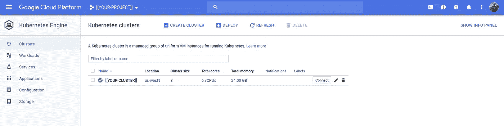

您可以查看节点:

```
google-chrome \
[console.cloud.google.com/kubernetes/clusters/details/${REGION}/${CLUSTER}?${PROJECT}&tab=nodes](https://pantheon.corp.google.com/kubernetes/clusters/details/us-west1/dazwilkin-180814-cluster-01?project=dazwilkin-180814-abhishelat&tab=nodes&persistent_volumes_tablesize=50&storage_class_tablesize=50&nodes_tablesize=50)
```

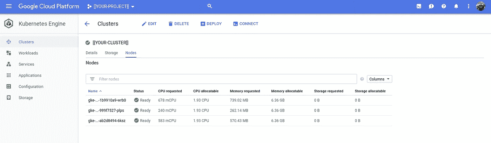

## 库伯内特斯

我将使用 Joe Beda 的“Kubernetes Up and Running”图像(又名`kuard`)，因为它提供了对 Kubernetes 环境的一些内省，并且包括就绪性和活性探测。

虽然像我将要做的那样动态地将更改应用到您的集群不是一个好的实践，但是我们都已经这样做了；-)

```
kubectl run kuard \
--image=gcr.io/kuar-demo/kuard-amd64:1 \
**--restart=Never**
```

这是来自 kuard GitHub [repo](https://github.com/kubernetes-up-and-running/kuard) 的命令。对库本内特斯鹅有益的东西对库本内特斯鹅也有益；不管在哪里，库伯内特都是库伯内特。

控制台的视觉细节有助于解释一些东西，我将包括控制台的等价物。但是，我将主要使用 CLI 显示命令:

```
kubectl get pods
NAME      READY     STATUS    RESTARTS   AGE
kuard     1/1       Running   0          13s
```

同样，从 GitHub repo 中，我们将从本地机器向集群上运行的`kuard` Pod 转发:

```
kubectl port-forward kuard 8080:8080
```

> **注意**为了能够浏览 Pod 的服务，您需要让该进程保持运行。当你浏览完了，你可以杀了它。

您可以:

```
google-chrome http://localhost:8080
```

您应该会看到:

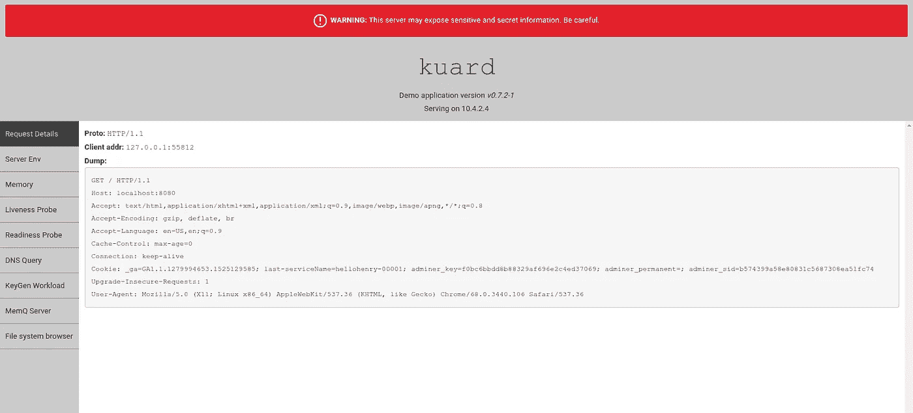

当你`kubectl run`一个图像时，命令应用`[NAME]`的值作为窗格上标签`run`的值。Kubernetes 的一个好习惯是通过标签而不是名称来引用事物，因此，对于前面的命令，一个更好的替代方法是:

```
kubectl get pods **--selector=run=kuard**
NAME      READY     STATUS    RESTARTS   AGE
kuard     1/1       Running   0          5m
```

您可以检查 Pod 的日志:

```
kubectl logs kuard
2018/08/14 17:53:20 Starting kuard version: v0.7.2-1
2018/08/14 17:53:20 ********************************************************************
2018/08/14 17:53:20 * WARNING: This server may expose sensitive
2018/08/14 17:53:20 * and secret information. Be careful.
2018/08/14 17:53:20 ********************************************************************
2018/08/14 17:53:20 Config: 
{
  "address": ":8080",
  "debug": false,
  "debug-sitedata-dir": "./sitedata",
  "keygen": {
    "enable": false,
    "exit-code": 0,
    "exit-on-complete": false,
    "memq-queue": "",
    "memq-server": "",
    "num-to-gen": 0,
    "time-to-run": 0
  },
  "liveness": {
    "fail-next": 0
  },
  "readiness": {
    "fail-next": 0
  },
  "tls-address": ":8443",
  "tls-dir": "/tls"
}
2018/08/14 17:53:20 Could not find certificates to serve TLS
2018/08/14 17:53:20 Serving on HTTP on :8080
2018/08/14 17:55:42 127.0.0.1:55808 GET /
2018/08/14 17:55:42 Loading template for index.html
...
```

一个豆荚，嘘！这一次，我们将移除`--restart`标志并添加一个`--replicas`标志。我用 3，你可以用任何你想要的值。

```
kubectl run kuard  \
--image=gcr.io/kuar-demo/kuard-amd64:1 \
**--replicas=3**
```

这一次，Kubernetes 将豆荚包装在一个部署中。Deployment 是 Kubernetes 的一个资源，不出所料，它管理 Pod 的部署(1 个或更多，我们也可以用它来管理单个 Pod)。

```
kubectl get deployments --selector=run=kuard
NAME      DESIRED   CURRENT   UP-TO-DATE   AVAILABLE   AGE
kuard     3         3         3            3           6mkubectl get pods --selector=run=kuard
NAME                    READY     STATUS    RESTARTS   AGE
kuard-b75468d67-kmbt5   1/1       Running   0          6m
kuard-b75468d67-lnl4v   1/1       Running   0          6m
kuard-b75468d67-s5m86   1/1       Running   0          6m
```

> 我选择基于标签的资源，因为这是一个好习惯，也因为 Kubernetes 的名字并不总是显而易见的。在上面的内容中，可以看到 Kubernetes 是如何被要求动态命名`kuard`pod 的，因为当有多个 pod 时，它们必须被唯一地命名。通过标签选择窗格可以继续正常工作。

部署有很多好处。您应该将它们视为默认的 Kubernetes 资源类型。现在我们有了一个部署，我们可以很容易地将这组资源公开为 Kubernetes 服务:

```
kubectl expose deployment/kuard --type=LoadBalancer --port=8080
```

这将使用部署(称为`kuard`)作为基础创建一个服务(也称为`kuard`)。事实上，它将自己加入部署的 pod，而不是部署，并且它通过基于它们的标签选择 pod 来做到这一点！

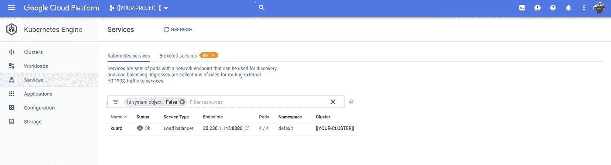

服务被创建

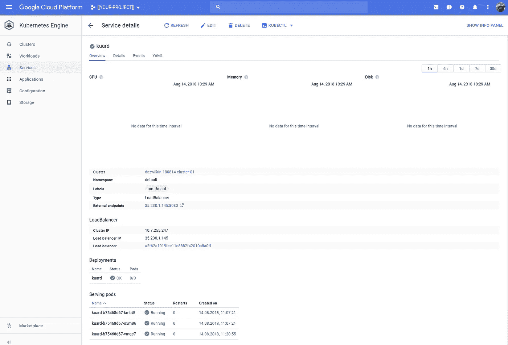

我们的服务绑定到 3 个 pod

## 旁白:部署与服务

如果您熟悉这些(Kubernetes)概念，请随意跳过。

部署(大于但是)类似于自动缩放器。部署部分负责确保预定数量的 pod 正在运行。如果您删除了一个 Pod，部署将为它创建一个替代品。如果您重新调整部署，将会创建或销毁正确数量的单元。

```
kubectl get pods --selector=run=kuard
NAME                    READY     STATUS    RESTARTS   AGE
kuard-b75468d67-kmbt5   1/1       Running   0          6m
**kuard-b75468d67-lnl4v**   1/1       Running   0          6m
kuard-b75468d67-s5m86   1/1       Running   0          6mkubectl delete pod/**kuard-b75468d67-lnl4v**
pod "kuard-b75468d67-lnl4v" deletedkubectl get pods --selector=run=kuard
NAME                    READY     STATUS    RESTARTS   AGE
kuard-b75468d67-kmbt5   1/1       Running   0          13m
kuard-b75468d67-s5m86   1/1       Running   0          13m
kuard-b75468d67-vmqc7   1/1       Running   0          20s
```

服务(大于但是)类似于负载平衡器。服务将流量路由到一组 Pod 中最合适的 Pod。服务与部署是正交的。服务绑定到 pod，而不是部署。服务如何绑定到 pod？你能猜到吗？通过标签选择豆荚。这有什么意想不到但令人敬畏的后果？任何标签与服务选择器匹配的 Pod 都将被服务捕获:

```
kubectl run kuard-2  \
--image=gcr.io/kuar-demo/kuard-amd64:1 \
--replicas=1
```

这将创建一个新的部署(称为`kuard-2`)来管理(当前)一个`kuard` Pod。这个舱会有一个标签`run=kuard**-2**`。让我们改变这个吊舱的`run`标签，使其成为`kuard`。你能猜出结果吗？

```
kubectl get pods
NAME                       READY     STATUS    RESTARTS   AGE
kuard-2-6c8ddd8fb5-qwlk8   1/1       Running   0          8s
kuard-b75468d67-kmbt5      1/1       Running   0          16m
kuard-b75468d67-s5m86      1/1       Running   0          16m
kuard-b75468d67-vmqc7      1/1       Running   0          3mkubectl get deployments
NAME      DESIRED   CURRENT   UP-TO-DATE   AVAILABLE   AGE
kuard     3         3         3            3           16m
kuard-2   1         1         1            1           14skubectl get pods **--selector=run=kuard**
NAME                    READY     STATUS    RESTARTS   AGE
kuard-b75468d67-kmbt5   1/1       Running   0          17m
kuard-b75468d67-s5m86   1/1       Running   0          17m
kuard-b75468d67-vmqc7   1/1       Running   0          3mkubectl get pods **--selector=run=kuard-2**
NAME                       READY     STATUS    RESTARTS   AGE
kuard-2-6c8ddd8fb5-qwlk8   1/1       Running   0          30skubectl label --overwrite pod/kuard-2-6c8ddd8fb5-qwlk8 run=kuard
pod/kuard-2-6c8ddd8fb5-qwlk8 labeledkubectl get pods **--selector=run=kuard**
NAME                       READY     STATUS    RESTARTS   AGE
kuard-2-6c8ddd8fb5-qwlk8   1/1       Running   0          1m
kuard-b75468d67-kmbt5      1/1       Running   0          18m
kuard-b75468d67-s5m86      1/1       Running   0          18m
kuard-b75468d67-vmqc7      1/1       Running   0          4m
```

正如所料，我们有 4 个 Pods 个来自我们的初始部署，1 个来自第二次部署)。然而，这 4 个 pod 中只有 3 个具有值为`kuard`的`run`标签。第二次展开的吊舱在展开后贴上标签，并有一个值为`kuard-2`的`run`标签。我们将它的`run`标签值也改写为`kuard`。然后，当我们查询值为`kuard`的`run`标签时，我们返回 4 个 pod。但是(！)我们的服务现在也绑定到 4 个 pod。它选择豆荚不是基于它有多爱它们，而是基于它们标签的价值:

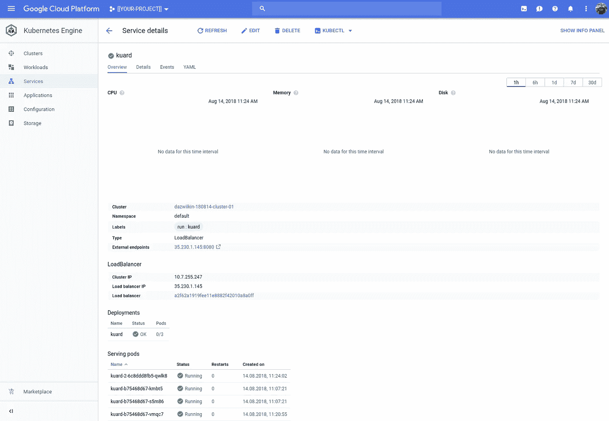

该服务现在绑定到所有 4 个 pod

重要的是要理解 Kubernetes 资源可能有多个标签，也可以跨多个标签选择作品。这是 Kubernetes 中最强大的功能之一。

## 旁白:负载平衡器和负载平衡器

当我们创建一个— type=LoadBalancer 的服务时，我们创建了一个负载平衡器，一个网络(或 TCP)负载平衡器。我们没有创建 HTTP/S 负载平衡器。这是服务的一个无意中令人困惑的方面。为了创建一个 HTTP/S 负载均衡器，我们通常会定义一个 Kubernetes 入口。我们以后可能会这样做。

Kubernetes 引擎请求时的网络负载平衡器(仅限 GCP！)产生了谷歌云平台(计算引擎)负载平衡器:

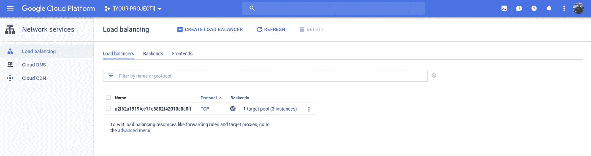

Kubernetes 提供了一个网络负载平衡器(LB)

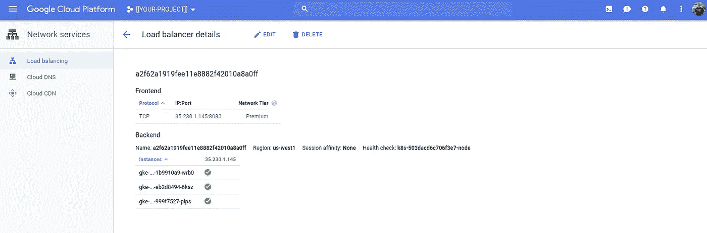

LBs 3 实例对应于集群的 3 个节点

而且，我可以从这个负载均衡器提供给我的公共 IP 地址浏览`kuard`服务。因为它…你知道…负载平衡，如果我点击刷新，我可能会得到不同的荚(！)每次都有回应。

## 表明

我之前提到过，像我一直做的那样，通过发出`kubectl`命令对集群进行更改被认为是不好的做法。一个很大的原因是，我很难重现我们刚刚做过的事情。例如，这样做的结果是，我很难将它从我们的测试环境转移到生产环境中。另一个原因是命令行公开了 Kubernetes API 的一部分功能。

更好的做法是使用 Kubernetes 清单文件。这些配置文件描述了您对 Kubernetes 的意图。它们可能是用 YAML 或 JSON 编写的。如果有工具可以方便我们创建和管理这些清单文件，那就太好了。有人试图减轻痛苦(见 Jsonnet，Helm 等)。).但是，我们今天大部分时间都被 YAML 所困。

因为我们创建了 2 个部署、1 个服务和 4 个 pod，所以我们能够让集群为我们提供等效的 YAML 清单来表示(重新创建)这些资源。这是一个有用的引导工具。你可以尝试`kubectl`命令，然后用它们创建 YAML 文件。

```
kubectl get deployment/kuard --output=yaml
```

产量(为清晰起见进行了编辑):

```
apiVersion: extensions/v1beta1
kind: Deployment
metadata:
  labels:
    run: kuard
  name: kuard
spec:
  replicas: 3
  selector:
    matchLabels:
      run: kuard
  template:
    metadata:
      labels:
        run: kuard
    spec:
      containers:
      - image: gcr.io/kuar-demo/kuard-amd64:1
        imagePullPolicy: IfNotPresent
        name: kuard
```

这是由 Kubernetes `extensions/v1beta` API 提供的部署资源(`kind`)。实际上，这已经过时了，部署已经升级到`apps/v1`。部署有标签。嗯，一个名为`run`的标签，值为`kuard`。部署总是描述 pod(尽管这不是显式的)。将有 3 个 pod，部署将选择标签名为`run`且值为`kuard`的任何 pod。Pod 模板定义了 Pod 的标签(是的，我们再次定义了标签)以及包含 Pod 及其配置的图像。

**注意**我没有在这里展示，但是 pod 包括一个**或多个**容器。“或更多”用例比您想象的要常见得多。它通常与所谓的边卡模式一起使用，在这种模式下，集装箱的功能由其边车提供的功能来补充。通常边车的功能包括代理流量，记录和监控。

当我们以这种方式从集群中 YAML 时，配置包括特定于运行实例的运行时细节。为了概括配置，我们需要削减这些信息。我在上面包含的编辑版本包含了部署的最少细节。

为了证明这一点，将上面的部署清单保存为一个文件，`deployment.yaml`。然后删除现有的`kuard`部署并重新创建它:

```
kubectl delete deployment/kuard
kubectl apply --filename=deployment.yaml
```

多。我们忘记了服务

我们没有。服务受到上述变更的影响，但并未因此而中断。当我们删除部署时，我们删除了 pod。当我们删除 pod 时，服务将不再找到 4 个与其选择器标准匹配的 pod。它应该和我们第二次部署的 1 号分离舱匹配。当我们创建新的`kuard`部署时，它会为我们创建 3 个标签与服务相匹配的新 pod。

所以…..一切正常，我们的服务应该仍然有 4 个吊舱，其中一个将是来自第二次部署的吊舱(命名:`kuard-2–6c8ddd8fb5-qwlk8`)，并且将有 3 个新吊舱:

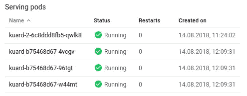

标签的魔力

我们的服务将继续可用(因为总是有≥1 个 Pod 支持它)，但单个 Pod 可能无法支持我们服务的所有流量。

实际上，您不能通过删除部署来部署对 Kubernetes 的更改。您可以通过修订部署清单并将清单重新应用到群集来部署更改。当您这样做时，Kubernetes 将至少维护最小数量的 pod，并在删除旧版本的 Pod 之前部署新版本的 Pod。还有其他方法可以指示 Kubernetes 提供这样的滚动更新，但结果是您的服务仍然可用。那很容易！

## 守护集、状态集和作业

老实说，我只在实践中使用过 Jobs，我在教程中使用过一次 StatefulSets，这将是我的第一个 DaemonSet。

我说你应该总是默认部署。你应该。更准确的说法是，您应该默认使用其中一个控制器。我们应该不再使用的一种控制器是复制控制器；该控制器被复制集取代，部署为您创建复制集。

我不想重写优秀的 Kubernetes 文档。所以，请去那里阅读所有关于控制器[的内容。](https://kubernetes.io)

每个控制器执行特定的功能:DaemonSets 在每个节点上运行您的 Pod 作业运行 pod 直到完成(然后终止)；状态集为您的 pod 维护“粘性”身份。StatefulSets 的关键区别在于名称，它们帮助 Kubernetes(否则通常是关于群体而不是个人)，或者用一个经常引用的比喻来说，帮助管理“宠物”(你把你的 pod 当作个体，你给它们命名)和“牛”(你想把它们当作一个群体/牛群)。

让我们将`kuard`部署转换成 DaemonSet:

```
apiVersion: apps/v1
kind: **DaemonSet**
metadata:
  labels:
    run: kuard
  name: kuard
spec:
  **#replicas: 3**
  selector:
    matchLabels:
      run: kuard**d**
  template:
    metadata:
      labels:
        run: kuard**d**
    spec:
      containers:
      - image: gcr.io/kuar-demo/kuard-amd64:1
        imagePullPolicy: IfNotPresent
        name: kuard
```

我们需要将`kind`修改为`DaemonSet`。记住 DaemonSets 是独特的，因为它们在每个节点上运行我们的 Pod，我们需要(并且必须)不提供副本的数量。您可以删除`replicas: 3`行。让我们也为 Pod 的(！idspnonenote)使用不同的值。)`run`标签。我们希望将 DaemonSet 管理的 pod 与 Deployment 管理的 pod 区分开来，以便它们不会被现有服务捕获。惯例是用以“-d”结尾的名字来命名守护进程，所以让我们只使用`kuardd`。就是不要试着发音！

> **NB** Kubernetes 资源只需要在资源的名称空间上是唯一的。因为这是一个 DaemonSet，所以将其命名为`kuard`与我们给部署命名的方式没有冲突。

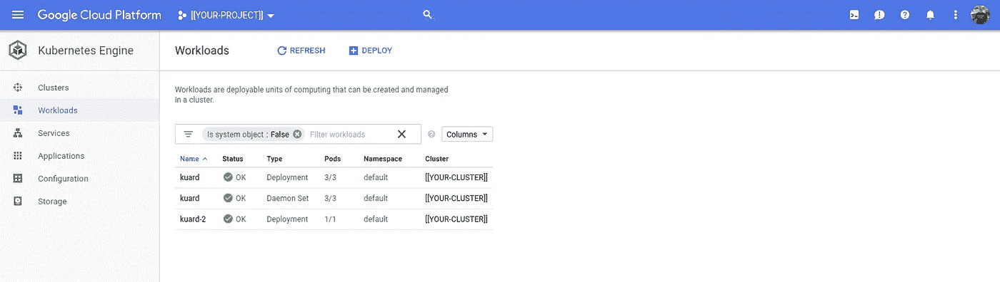

3 个“工作负载”,包括部署和一个守护集

与部署一样，我们可以在由 DaemonSet 管理的 pod 前面加入一个服务(facade ),但是服务将 pod 视为牛，我们的守护进程是唯一的(不是有状态的，而是唯一的),因为它们与集群的节点 1:1 相关。因为它们与集群的节点 1:1 相关，所以我们可以在守护进程的上下文中使用节点的独特功能，例如主机的 IP 和主机的一个端口(参见`[hostPort](https://kubernetes.io/docs/concepts/configuration/overview/)`)。不使用`hostPort`，使用`NodePorts`可能更好，但是`NodePorts`要求为 DaemonSet 的 pod 创建一个服务。

## 万圣节:无头服务和恶魔集

一个常规的 Kubernetes 服务是为“牛”服务的，我们关心这个群体，希望把这个群体作为一个单一的实体来对待。Kubernetes 服务有一个 DNS 名称和一个虚拟 IP (VIP)地址。无头服务是给“宠物”的，我们关心的是个体。该服务有一个 DNS 名称，但这会为它的每个 pod 产生一组 IP。

这是我们称为`uard`的无头服务的 YAML(明白吗？；-)):

```
apiVersion: v1
kind: Service
metadata:
  labels:
    run: kuard
  name: uard
spec:
  clusterIP: None
  ports:
  - port: 8080
    protocol: TCP
    targetPort: 8080
  selector:
    run: kuardd
```

注意，它选择我们的 DaemonSet 创建的 pod，这些 pod 的标签值为`kuardd`。应用文件后:

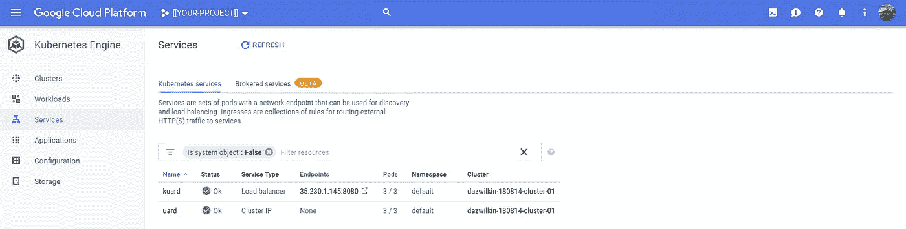

不应该是‘无头服务’吗？

注意:在应用了`uard`无头服务之后，我们现在有两个服务了。`uard`属于`Cluster IP`类型，它没有 IP 端点。我们仍然可以使用值为 kuard 的运行标签来查询两个服务(因为我们对服务使用了相同的标签):

```
kubectl get services **--selector=run=kuard**
NAME      TYPE           CLUSTER-IP     EXTERNAL-IP    PORT(S)
kuard     LoadBalancer   10.7.255.247   35.230.1.145   8080:30741
uard      ClusterIP      None           <none>         8080
```

但是，如果我们使用(我今天才发现这个资源！)`endpoints`资源:

```
kubectl get endpoints --selector=run=kuard
NAME      ENDPOINTS                                      AGE
kuard     10.4.0.13:8080,10.4.1.14:8080,10.4.2.12:8080   2h
uard      10.4.0.14:8080,10.4.1.15:8080,10.4.2.13:8080   4m
```

我们看到一些有趣的事情，Kubernetes 定期重新计算哪些服务选择了哪些 pod，并使用 IPs 填充这个端点资源。这些 IP 对应于 Pods 的 IP，你会注意到它们如我们所料发布了端口`8080`。

为了与集群内 DNS 服务交互，我们需要进入集群，下面的`kubectl`命令运行一个`busyboxplus`容器，该容器除了`nslookup`之外，还包括`curl`命令(而`busybox`没有):

```
kubectl run debug \
--image=radial/busyboxplus:curl \
--stdin \
--tty
If you don't see a command prompt, try pressing enter.
[ root@debug-85f447cc59-fsq9l:/ ]$
```

太好了！让我们查找`kuard`和`uard`服务:

```
nslookup kuard.default.svc.cluster.local
Server:    10.7.240.10
Address 1: 10.7.240.10 kube-dns.kube-system.svc.cluster.localName:      kuard.default.svc.cluster.local
Address 1: 10.7.255.247 kuard.default.svc.cluster.localnslookup uard.default.svc.cluster.local
Server:    10.7.240.10
Address 1: 10.7.240.10 kube-dns.kube-system.svc.cluster.localName:      uard.default.svc.cluster.local
Address 1: 10.4.0.14
Address 2: 10.4.1.15
Address 3: 10.4.2.13
```

看出区别。我们的常规服务`kuard`有一个 DNS 名称(`kuard.default.svc.cluster.local`)，这解析为一个 VIP ( `10.7.240.10`)，VIP 本身形成了一个 DNS 名称！

无头服务`uard`有一个 DNS 名称(`uard.default.svc.cluster.local`)，但是它解析为 4 个 IP 地址，每个 IP 地址对应一个(DaemonSet 创建的)pod。我们现在有了一种方法，可以在一个已知的端口上单独访问我们的每个守护进程。如果我们想要访问这些集群外的服务，我们只需要在服务定义中添加一个`HostPort`或`NodePort`。

## [状态集](https://kubernetes.io/docs/concepts/workloads/controllers/statefulset/)

好吧，让我们从清单开始:

这个文件合并了 2 个清单！我只见过 Kubernetes 开发者使用这个，但这是 YAML 的一个特色。你的编辑可能会抱怨！有时你会看到 `— —` (3 个破折号)用于分隔 YAML 文件，尽管形式上，三个句点应该结束(`…`)，三个破折号应该开始(`— -`)。

状态集需要(并引用)一个服务。其他类型的控制器不需要维修。StatefulSets 使用该服务作为一种方式来为豆荚域名。这里使用的服务类似于我们用于 DaemonSet 的 Headless 服务。这个服务被称为`skuard` (Stateful Kuard，在我内心的声音中，我把它发音为“skewered”)，在 StatefulSet maninfest 中，我也使用`skuard`作为`run`标签的值。因此，服务也必须选择`skuard`。

我们必须告诉群集我们需要多少个副本，所以这又回来了。我们必须告诉集群哪个服务描述了域名(`serviceName`)。除此之外，StatefulSet 与其他的非常相似。

```
kubectl apply --filename=statefulset.yaml
service/skuard created
statefulset.apps/kuard created
```

为了完整起见:

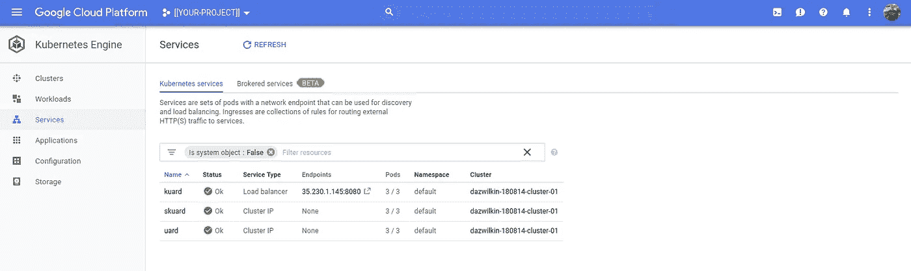

三个朋友:kuard，skuard 和 uard

我没有公正地评价本例中 StatefulSets 的值，但是，如果我们列举集群中的 pod:

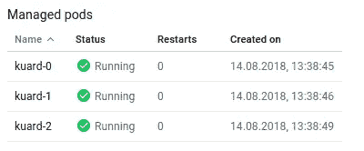

陈述集合“宠物”

你会看到每个豆荚是由一个计数器区分的。

如果我们打掉一个，它会被重新创建:

```
kubectl get pods **--selector=run=skuard**
NAME                       READY     STATUS             RESTARTS
kuard-0                    1/1       Running            0
kuard-1                    1/1       Running            0
**kuard-2**                    1/1       Running            0kubectl delete pod **kuard-2**
pod "kuard-2" deletedkubectl get pods **--selector=run=skuard**
NAME                       READY     STATUS              RESTARTS
kuard-0                    1/1       Running             0
kuard-1                    1/1       Running             0
**kuard-2**                    0/1       ContainerCreating   0
```

如果它使用某种形式的持久存储，它将被反弹到相同的存储。

与其他 pod 不同，StatefulSets 的 pod 有 DNS 名称。让我们回到 busyboxplus 容器:

```
nslookup **kuard-0**.skuard
Server:    10.7.240.10
Address 1: 10.7.240.10 kube-dns.kube-system.svc.cluster.localName:      kuard-0.skuard
Address 1: 10.4.2.15 kuard-0.skuard.default.svc.cluster.localnslookup **kuard-1**.skuard
Server:    10.7.240.10
Address 1: 10.7.240.10 kube-dns.kube-system.svc.cluster.localName:      kuard-1.skuard
Address 1: 10.4.1.16 kuard-1.skuard.default.svc.cluster.localnslookup **kuard-2**.skuard
Server:    10.7.240.10
Address 1: 10.7.240.10 kube-dns.kube-system.svc.cluster.localName:      kuard-2.skuard
Address 1: 10.4.0.16 kuard-2.skuard.default.svc.cluster.local
```

我使用了一个短名称`[StatefulSet]-[Counter].[Service]`进行欺骗，但是完全限定的名称也在那里(你可以在 DNS 服务器的回复中看到这些，例如`kuard-2.skuard.default.svc.cluster.local`)。

与服务 DNS 名称一样，这些 Pod DNS 名称是可预测的。这是有用的。例如，依赖于有状态服务的集群上的另一个部署可以总是寻找该服务的分片实例，可能是`kuard-2`并通过其 DNS 名称访问它。

## 结论:Kubernetes

希望这个例子能让你在一个小时内从零开始。Kubernetes 可能令人生畏，但是一旦你开始使用它，你可以根据需要学习高级的东西，你需要的 80%需要花 10%的时间来学习。祝你好运！

## 托管实例组(MIG)

Google Kubernetes 工程团队每次在我关于 Kubernetes 的故事中看到这个副标题时一定会抱怨，但是，我没有讨论提供不同功能但可能适用于不同情况的替代解决方案，这会对您、Google 和 Kubernetes 造成伤害。

如果您想要创建 x-百个容器的基本功能，那么[托管实例组](https://cloud.google.com/compute/docs/instance-groups/#managed_instance_groups)和[容器优化操作系统](https://cloud.google.com/container-optimized-os/)(也是支持 Kubernetes 引擎节点的默认操作系统)可能正合适。

我在四月份写了关于[容器优化操作系统](/google-cloud/container-optimized-os-d32ea15c9ef4)的文章，下面将主要是这个故事的总结。

如果您是从零开始，请创建项目并像 Kubernetes 设置那样分配账单。这一次，您可以仅启用计算引擎，而不是计算和 Kubernetes 引擎:

```
gcloud services enable compute.googleapis.com --project=${PROJECT}
```

以下命令将为我们将要创建的每个克隆创建模板:

```
PROJECT=[[YOUR-PROJECT]]
TEMPLATE=[[YOUR-TEMPLATE]] # Perhaps 'kuard'
REGION=[[YOUR-REGION]]gcloud beta compute instance-templates create-with-container ${TEMPLATE} \
--machine-type=custom-1-4096 \
--image-family=cos-stable \
--image-project=cos-cloud \
--container-image=gcr.io/kuar-demo/kuard-amd64:1 \
--container-restart-policy=always \
--preemptible \
--region=${REGION} \
--project=${PROJECT}
```

> **NB** 我又在使用可抢占实例了。我使用比 Kubernetes 更小的机器类型(1 个 CPU 和 4GB RAM)。这种方法不能打包容器:每个 VM 一个容器。

结果是:

```
Created.
NAME   MACHINE_TYPE               PREEMPTIBLE  CREATION_TIMESTAMP
kuard  custom (1 vCPU, 4.00 GiB)  true         2018-08-14T14:37:57
```

然后，我们可以使用以下方法创建一个包含 N 个克隆的托管实例组:

```
CLONES=[[HOWEVER-MANY-YOUD-LIKE]]gcloud compute instance-groups managed create ${TEMPLATE} \
--base-instance-name=${TEMPLATE} \
--template=${TEMPLATE} \
--size=${CLONES} \
--region=${REGION} \
--project=${PROJECT}
```

在我的例子中，为了确保我没有超出我的项目配额，我创建了 3 个克隆:

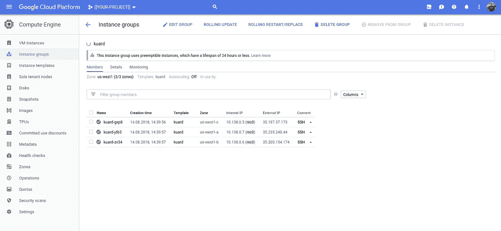

托管实例组

托管实例组提供自动伸缩(在这种情况下，我没有自动伸缩)，因此这对应于我们的 Kubernetes 部署。Kubernetes 服务的模拟是一个负载平衡器。这一次，我们将手动创建网络(或 TCP)负载平衡器(因为我们没有 Kubernetes 来帮助我们),但这很简单，只是指向托管实例组:

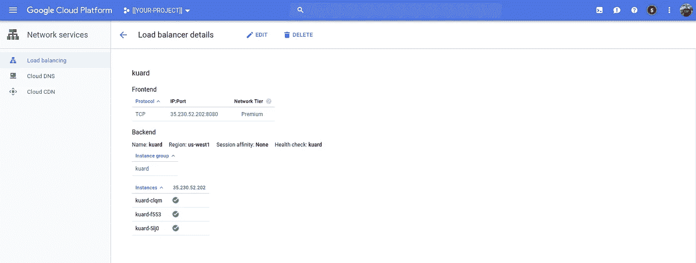

为 MIG 手动创建网络负载平衡器

## 结论-结论

希望这篇文章能帮助你更好地理解或者——更好的是——让你继续使用 Kubernetes。在介绍了集群之后，我们浏览了控制器和构建部署、DaemonSets 和 StatefulSets。为什么这些不同的控制器存在，为什么你可能希望选择每一个。

然后，为了完整起见，我们将 Kubernetes 从项目中剥离出来，使用一些底层结构来构建更简单的东西——尽管是可扩展的东西——使用容器优化的操作系统、托管实例组和网络负载平衡器。

坦白地说，我很懒，直接使用 HTTP 负载平衡器而不是网络负载平衡器。而且，使用一点 LetsEncrypt，添加 TLS 很容易。

## 拆毁

如果您愿意不可撤销地删除所有内容，您可以:

```
gcloud projects delete ${PROJECT}
```

如果您只想删除 Kubernetes 集群，您可以:

```
gcloud container clusters delete ${CLUSTER} \
--project=${PROJECT}\
--region=${REGION}
```

> **注意**如果你攻击集群，它已经提供了负载均衡器，这些可能不会自动删除，你应该手动删除它们。

如果您希望删除特定的 Kubernetes 资源，您可以:

```
kubectl delete deployment/kuard
```

如果您想删除 MIG，那么模板:

```
gcloud compute instance-groups managed delete kuard \
--region=${REGION} \
--project=$PROJECTgcloud compute instance-templates delete kuard \
--project=$PROJECT
```

仅此而已！