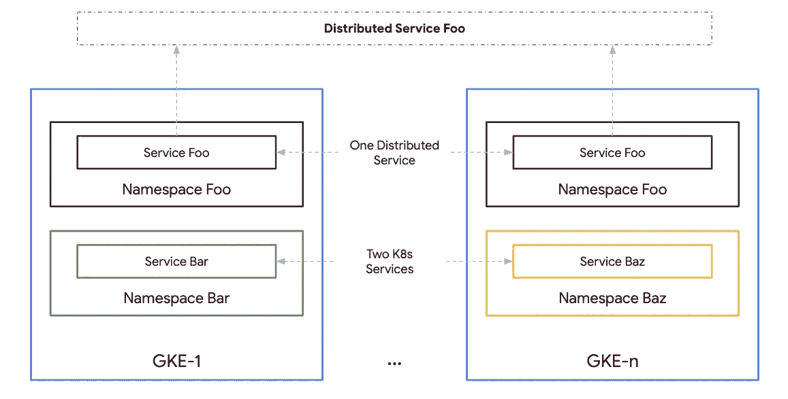

# Kubernetes 发动机(GKE)多集群生命周期管理系列

> 原文：<https://medium.com/google-cloud/kubernetes-engine-gke-multi-cluster-life-cycle-management-series-17ff892b85c8?source=collection_archive---------2----------------------->

## 第一部分:对多集群的需求

GKE 上的分布式服务

# 介绍

这个由 5 部分组成的博客系列涵盖了如何在多集群 GKE 架构中设计、规划和执行升级。本系列的最后一部分是一个分步指南，使用 Anthos 的[入口](https://cloud.google.com/kubernetes-engine/docs/concepts/ingress-for-anthos)进行多集群升级。尽管本教程使用 Ingress for Anthos 作为示例实现，但是这些概念也可以应用于其他解决方案。

该系列分为以下几部分:

*   第一部分:对多集群的需求(这一部分)
*   [第二部分:多集群和分布式服务](/@ameericus/gke-multi-cluster-life-cycle-management-series-b0d39080ac6b)
*   [第三部分:GKE 集群生命周期和自动升级](/@ameericus/gke-multi-cluster-life-cycle-management-series-a73185392345)
*   [第四部分:GKE 多集群生命周期管理规划和策略](/@ameericus/kubernetes-engine-gke-multi-cluster-life-cycle-management-series-43ed97142c47)
*   [第五部分:使用 Ingress for Anthos 的 GKE 多集群升级分步指南](/@ameericus/kubernetes-engine-gke-multi-cluster-life-cycle-management-series-ee0f583d9b10)

> 特别感谢我的朋友们:杰出的 SRE 人史蒂夫·麦克格和 Kubernetes 的专家和爱好者凯文·詹姆斯，感谢他们对这个系列的宝贵投入和反馈。

# 第一部分:对多集群的需求

## Kubernetes 作为基础设施

在讨论多集群的需求之前，需要注意的是，本系列将 Kubernetes 集群视为“基础设施”的一部分。用云本地的话说，基础设施是一次性的。不得对任何基础设施组件进行特殊处理。它的存在是有目的的。Kuberenetes 的目的是为开发者和运营商提供自动化(和编排),从而为消费者提供基于容器的应用程序和服务。消费者可以是内部团队、其他服务或外部客户。因此，Kubernetes 集群是一个基础设施组件，因此应被视为可任意使用的。稍后将详细介绍。

## 常见的多集群场景

尽管有“kubernetes 作为基础设施”的说法，但有许多理由支持多集群环境。

**地理位置** —许多服务需要位于多个地区。与在单个区域之外提供服务相比，将服务放在离消费者更近的地方(在他们的区域内)会提供更好的体验，因为延迟更低。Kubernetes 集群在单个区域中运行。对于多区域部署，需要多个区域中的多个 Kubernetes 集群。同样，多云或混合云环境也要求每个环境中有多个集群。Kubernetes 集群也经常与服务(有状态的)数据源放在一起。某些应用程序可能需要位于与其后端相同的位置(地区和区域),例如 RDBMS。

**租户和环境** — Kubernetes 集群是为多租户设计的。这意味着多个团队可以共享一个集群来提供各自的服务。Kubernetes 提供标准资源(名称空间、RBAC、网络策略、身份验证)来正确配置多租户环境中的访问控制。在某些情况下，某些服务可能无法与其他服务共存于一个集群中。这可能是由于公司政策、隐私、安全或行业法规。在这种情况下，需要多个集群来将某些租户划分到自己的集群中。同样，环境(开发、阶段和生产)也经常被创建为单独的集群。不同环境中安装的应用程序的访问范围和类型差异很大，因此最好将它们作为单独的集群。

**组成和功能** —有时，集群以特定的组成创建，以执行特定的功能。例如，使用 [kubeflow](http://kubeflow.org) 或数据分析作业的 ML 工作流可能需要具有 GPU 或其他特定硬件要求的节点，例如由[可抢占虚拟机](https://cloud.google.com/preemptible-vms)组成的集群，以实现批量分析工作负载..这些硬件要求可能不适用于其他服务。这些工作流可能对业务运营并不重要，可能需要临时集群(在关闭集群之前，为执行特定任务而创建的短期集群)。同样，可能有一些共享服务，如可观察性(日志记录、指标、跟踪)和 CI/CD 工具，它们更适合自己的“platform_admin”集群。对于非业务关键型工作流，通常会看到独立的特定功能集群。

**弹性** —通常使用多个群集来提高环境中的弹性。每个星团都有一个爆炸半径。在这种情况下，爆炸半径是由于群集故障、配置错误或只是群集离线(计划内或计划外维护)而受到不利影响的服务数量。具有大量较小尺寸的簇意味着具有大量较小尺寸的爆炸半径。如果一个服务被部署在两个平均分担负载的集群上，并且其中一个集群离线，那么这将影响 50%的用户(假设没有对负载均衡器进行流量分割)。相比之下，假设服务是从单个集群中提供的。该集群上的任何事件都会导致该服务 100%中断。同样，多个集群也经常用于灾难恢复。

对于本系列的剩余部分，我将重点关注多集群的弹性方面，这是多集群 GKE 生命周期管理中的一个关键组件。

> 接下来… [第二部分:多集群和分布式服务](/@ameericus/gke-multi-cluster-life-cycle-management-series-b0d39080ac6b)