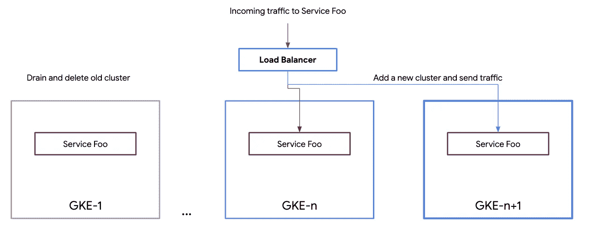

# Kubernetes 发动机(GKE)多集群生命周期管理系列

> 原文：<https://medium.com/google-cloud/kubernetes-engine-gke-multi-cluster-life-cycle-management-series-43ed97142c47?source=collection_archive---------3----------------------->

## 第四部分:GKE 多集群生命周期管理

GKE 分布式服务 Foo

在这篇博客中，我讨论了常见的 GKE 生命周期策略，以及选择合适的策略时的规划和设计考虑。

> 我假设你已经知道了**多集群架构** ( [第一部分](/@ameericus/kubernetes-engine-gke-multi-cluster-life-cycle-management-series-17ff892b85c8))、什么是**分布式服务** ( [第二部分](/@ameericus/gke-multi-cluster-life-cycle-management-series-b0d39080ac6b))以及什么构成了 **GKE 升级** ( [第三部分](/@ameericus/gke-multi-cluster-life-cycle-management-series-a73185392345))。

# 规划和设计考虑因素

GKE 多集群架构在选择理想的集群生命周期管理策略方面发挥了作用。在讨论这些策略之前，重要的是讨论可能影响集群生命周期管理策略或受其影响的某些设计决策。

**集群类型** —如果使用 GKE 自动升级作为集群生命周期管理策略，集群的类型可能很重要。例如，区域集群提供多个主服务器，主服务器一次自动升级一个，而区域集群只提供一个主服务器。如果您没有使用 GKE 自动升级，并且认为所有的 Kubernetes 集群都将被视为基础架构组件(并且是一次性的)，那么在决定集群生命周期管理策略时，您选择什么类型的集群可能并不重要。下一节讨论的策略可以应用于任何类型的集群。

**集群放置和占地面积** —在决定集群放置和占地面积时，需要考虑一些因素。

1.  区域和区域集群需要位于
2.  所需集群的数量和大小

第一个问题通常很容易回答，因为区域/地区是由您的业务以及您在哪个地区为您的用户提供服务决定的。第二个问题的答案通常分为两类，各有利弊。

1.  **少量大型集群** —您可以选择利用区域集群提供的冗余和弹性，在每个区域放置一个(或两个)大型区域集群。这种方法的好处是管理多个集群的操作开销较低。缺点是它可能会同时影响大量的服务，即大爆炸半径。
2.  **大量小型集群** —另一个策略是创建大量小型集群。这减少了集群爆炸半径，因为您的服务分散在许多集群中。这种方法也适用于短暂的临时集群(例如运行批处理工作负载的集群)。这种方法的缺点是操作开销较高，因为有更多的集群需要升级。还可能存在与更多数量的主设备相关联的额外成本。这可以通过自动化、可预测的时间表和策略以及受影响的团队和服务之间的仔细协调来抵消。

本指南并不推荐一种方法优于另一种方法，它们只是作为选项。在某些情况下，可以为不同类别的服务选择这两种设计模式。下面讨论的策略适用于任何一种设计选择。决定战略的指南可以在[这里](https://cloud.google.com/solutions/scope-and-size-kubernetes-engine-clusters)找到。

**容量规划** —规划容量时，考虑所选择的集群生命周期策略非常重要。容量规划必须考虑正常的服务负载和维护事件。有两种类型的中断:

1.  计划中的事件，如集群升级
2.  计划外事件，如群集中断，例如错误的配置推送、错误的部署等。

在进行容量规划时，您必须考虑所有的全部或部分停机。如果您仅针对计划内维护事件进行设计，则所有分布式服务必须拥有一个超出所需的额外集群，以便在升级时一次可以将一个集群从轮换中取出，而不会降低服务质量。这种方法也被称为“ [N+1 能力规划](https://landing.google.com/sre/sre-book/chapters/software-engineering-in-sre/)”。如果您针对计划内和计划外维护事件进行设计，则所有分布式服务必须拥有两个(或更多)额外的集群来提供预期的容量—一个用于计划内事件，一个用于计划外事件，以防在计划内维护窗口期间发生。这种方法也被称为“ [N+2 能力规划](https://landing.google.com/sre/sre-book/chapters/software-engineering-in-sre/)”。

在多集群架构中，经常使用术语**排出**和**溢出**。这些术语是指在升级和维护事件期间，从群集中删除(或排出)流量并将流量重定向(或溢出)到其他群集的过程。这是通过使用多集群入口等网络解决方案或其他负载平衡方法来实现的。谨慎使用排出和溢出是一些集群生命周期管理策略的核心，这将在下一节中讨论。在容量规划期间，必须考虑这些因素。例如:“如果一个集群被耗尽，其他集群是否有足够的容量来处理额外溢出的流量？”其他考虑因素包括所需地带或区域中的足够容量，或者是否需要将流量发送到不同的区域(例如，如果每个区域使用单个区域集群)。

排水和溢出

**集群和分布式服务** —基于服务的集群设计规定，集群架构(数量、大小和位置)由在集群上运行所需的服务决定。因此，集群的位置取决于分布式服务的需求。在决定分布式服务的放置时，需要考虑许多因素。其中一些是:

1.  **位置要求** —需要在哪里/哪些地区提供服务
2.  **关键程度** —服务的可用性对业务有多重要
3.  **SLO** —服务的服务级别目标(通常基于关键程度)
4.  **弹性—** 服务需要多大的弹性？它是否需要承受集群、区域甚至区域性故障。

规划群集升级时，您必须考虑单个群集耗尽时会影响的服务数量，并且必须考虑将这些服务分散到其他适当的群集。集群可以是单租户，也可以是多租户。单租户集群只提供单一服务或由一组服务代表的产品。它们不与其他服务或产品共享集群。多租户集群可以运行许多服务和产品，通常被划分到名称空间中。规划群集升级时，您必须考虑单个群集耗尽时会影响的服务数量，并且必须考虑将这些服务分散到其他适当的群集。

**对团队的影响** —集群事件不仅影响服务，还可能影响团队。例如，在集群升级期间，DevOps 团队可能需要重定向或暂停他们的 CI/CD 管道。同样，支持团队可能会收到计划内停机的警报，需要得到通知。因此，认识到集群事件影响的不仅仅是服务这一事实并对此进行规划是非常重要的。自动化谨慎的协调和工具必须到位，以帮助减轻对多个团队的影响运营和支持团队之间的压力。集群或集群机队升级应被视为常规且“平淡无奇”,所有团队都了解相关信息。

**时间、计划和协调** — Kubernetes 每季度发布一个新的次要版本，并保持上三个版本。必须仔细规划集群升级的时间和计划。总的来说，必须就何时进行这些升级达成一致。这方面有几个考虑因素:

1.  你多久升级一次？您是每季度升级一次，还是每半年(两个季度)升级一次？或者不同的时间线。
2.  什么时候升级？您是在业务放缓的季度初进行升级，还是在特定行业规定的其他业务停机时间进行升级。
3.  什么时候不升级？您对何时不升级有明确的规划吗？例如，黑色星期五、网络星期一或在引人注目的会议和其他行业特定事件期间。

重要的是要有一个适当的战略。同样重要的是，要与服务所有者以及运营和支持团队清楚地沟通。不应该有意外。每个人都知道并期望集群何时以及如何升级。这需要所有相关团队的明确协调。单个服务有多个团队与之交互。通常，它们可以分为两类。服务开发人员是负责创建业务逻辑并将其编码到服务中的角色。以及负责安全可靠地运行服务的服务运营商。运营商可以由多个团队组成，如策略/安全管理员、网络管理员、支持团队等。在集群升级过程中，它们都必须保持在循环中，以便在此期间采取适当的措施。一种选择是以与停电事故相同的方式对此进行规划。您有一个事件指挥官、一个聊天室、一个事后分析(即使没有用户受到影响)。

有了这些设计和规划考虑，让我们讨论常见的 GKE 多集群生命周期管理策略。

# GKE 集群生命周期战略

本节讨论了 GKE 多集群体系结构中常用的三种主要集群生命周期管理策略。重要的是要注意，一个尺寸并不适合所有，你可能最终选择多种战略，为各种类别的服务和需求的业务。

# 滚动升级

滚动升级策略

这是最简单和最具成本效益的策略。您从运行旧版本(或当前生产版本)的 **N** 个集群开始。然后你一次排出 **m** 个簇，其中 **m** 小于 **N** 。然后，删除并用新的所需版本重新创建新的集群，或者升级耗尽的集群。决定删除还是升级新集群取决于集群的大小以及您对不变基础设施的信任。不可变的基础设施要求您创建新的集群，避免任何不可预见的配置漂移，而不是不断地升级集群，这可能会随着时间的推移产生不良的结果。如果使用 GKE，这很容易实现，因为您可以用一个命令或 API 调用创建一个 GKE 集群。新的集群策略要求将整个集群配置(集群清单)存储在集群之外，通常存储在 Git 中。然后，您可以在新创建的集群上使用相同的配置模板。如果这是一个新的集群，请确保您的 CI/CD 管道指向正确的集群。正确配置群集后，您可以在监控服务的服务级别时将流量缓慢推回到群集。

对所有集群重复该过程。根据您的容量规划，您最终可能会一次升级多个集群，而不会违反服务 SLO。

如果您重视简单性和成本，而不是弹性，那么这种策略非常好。在这一策略中，您永远不会超过 GKE 车队对所有分布式服务的要求容量。

滚动升级战略时间表

# 蓝色/绿色

蓝/绿策略

这是一个简单的策略，它提供了一些额外的弹性，但与前一个策略相比成本要高一些。这个策略和上一个很像。唯一的区别是，不是先清空现有的集群，而是先用期望的版本创建 **m** 个新集群，其中 **m** 小于或等于 **N** 。您将新的集群添加到 CI/CD 管道中，然后在监视服务 SLO 的同时慢慢溢出流量。当新集群完全接收流量时，您将清空并删除旧版本的集群。这类似于通常用于服务的蓝/绿升级策略。一次创建多个新集群会增加总成本，但有利于加快设备升级速度。增加的成本仅适用于升级期间，在此期间会使用额外的群集。首先创建新集群的好处是在出现故障时可以轻松回滚。在向新群集发送生产流量之前，也可以对其进行测试。由于这些集群与它们的旧版本在一小段时间内共存，因此额外的成本应该是最小的。

如果您重视简单性和弹性，而不是成本，那么这种策略非常好。在该战略期间，首先添加额外的集群，因此超过了 GKE 车队在升级期间所需的容量。

蓝/绿战略时间表

# 金丝雀集群

金丝雀集群战略

这是三种策略中最有弹性和最复杂的一种。该策略将集群生命周期管理从服务生命周期管理中完全抽象出来，从而为您的服务提供最低的风险和最高的弹性。在前两个策略中，您在一个版本上维护您的整个 GKE 舰队。在这个策略中，您维护两个或者三个运行不同版本的 GKE 集群。随着时间的推移，您可以将服务从一个集群迁移到另一个集群，而不是升级集群。当最老的 GKE 车队自然耗尽时(意味着所有的服务已经迁移到下一个版本的 GKE 车队)，您删除车队。这个策略要求你保持至少两个 GKE 舰队。一个用于当前生产，一个用于下一个生产候选版本。你也可以维持两个以上的 GKE 舰队。这为您提供了更多的灵活性，但您的成本和运营开销也会增加。请务必注意，这与在不同环境(例如开发、阶段和生产)中拥有集群是不同的。非生产环境非常适合测试非生产流量的 Kubernetes 特性和/或服务。这种策略要求您在生产环境中维护多个 GKE 版本。这类似于服务经常使用的金丝雀释放策略。借助 canary 服务部署，服务所有者可以始终将问题定位到服务的特定版本；借助 canary 集群，他们还必须考虑运行服务的 GKE 车队版本。单个分布式服务版本可能会在多个 GKE 车队版本上运行。服务的迁移可以逐渐进行，因此在将服务的所有流量发送到新版本化集群之前，您可以看到服务对新车队的影响(如前两种策略)。

如果你认为弹性比其他任何东西都重要，那么这个策略非常好。

下面的决策树可能有助于根据服务和业务需求确定最适合您的策略。

GKE 生命周期管理决策矩阵

> 接下来… [第五部分实验操作:使用 Ingress for Anthos 的 GKE 多集群滚动升级分步教程](/@ameericus/kubernetes-engine-gke-multi-cluster-life-cycle-management-series-ee0f583d9b10)