# Kubernetes 发动机(GKE)多集群生命周期管理系列

> 原文：<https://medium.com/google-cloud/kubernetes-engine-gke-multi-cluster-life-cycle-management-series-ee0f583d9b10?source=collection_archive---------2----------------------->

## 第五部分:使用 Ingress for Anthos 的 GKE 多集群升级分步教程

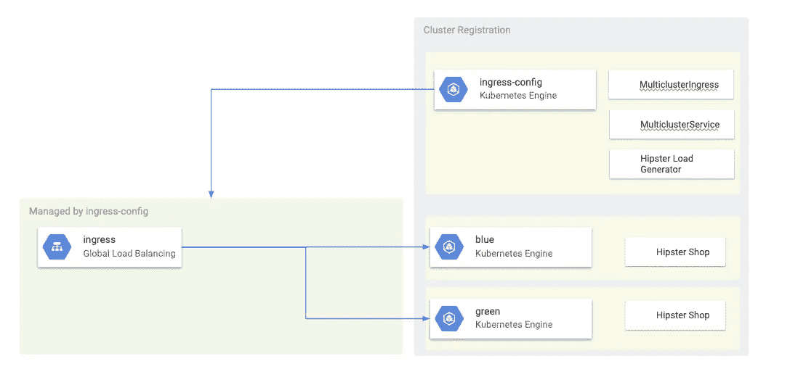

使用 Ingress for Anthos 进行 GKE 生命周期管理

本教程描述了如何使用滚动升级策略(在之前的博客中讨论过)和 Anthos 的 [ingress 提供的多集群 Ingress 特性来升级多集群 GKE 环境。本教程是本博客系列所涵盖的概念的高潮。](https://cloud.google.com/kubernetes-engine/docs/concepts/ingress-for-anthos)

GCP 推荐使用 [GKE 自动升级](https://cloud.google.com/kubernetes-engine/docs/concepts/cluster-upgrades#upgrading_automatically)功能来升级你的 GKE 集群。自动升级是一种无操作的方式，可以让您的集群(主集群和节点集群)按照 GCP 确定的发布计划自动更新。这不需要操作员的干预。但是，在某些情况下，运营商可能希望对升级集群的方式和时间有更多的控制。本教程介绍了一种升级多个集群的方法，其中您的应用程序在所有集群上运行。然后，它利用 Anthos 的入口(多集群入口)功能在升级前一次清空一个集群。

# 先决条件

1.  本教程要求多个集群(两个或更多)在所有集群上运行相同的应用程序(名称空间、部署、服务等)。
2.  本教程假设要升级的集群的自动升级功能已关闭。
3.  本教程使用 Anthos 的入口。Anthos 的入口要求:

*   gke 静态版本 1.14.10-gke.17+或 GKE 集群在快速或常规[发布渠道](https://cloud.google.com/kubernetes-engine/docs/concepts/release-channels)。
*   VPC 本地(别名 IP)模式下的集群。有关更多信息，请参见[创建 VPC 本地集群](https://cloud.google.com/kubernetes-engine/docs/how-to/alias-ips)。
*   启用 HTTP 负载平衡(默认情况下启用)。
*   gcloud —版本必须是 281 或更高版本。GKE 集群注册步骤取决于此版本或更高版本。

# 拓扑学

本教程使用以下拓扑。总共有三个集群。两个集群(蓝色和绿色)充当部署了相同应用程序的相同集群。一个群集(入口配置)充当控制平面群集，为 Anthos 配置入口。在本教程中，您将在两个应用程序集群(蓝色和绿色集群)上部署一个名为 Hipster Shop 应用程序的示例应用程序。 [Hipster Shop](https://github.com/GoogleCloudPlatform/microservices-demo) app 是一个示例微服务应用程序，由十个模拟电子商务应用程序的微服务组成。它由一个 web 前端(客户端可以访问)和一些后端服务组成，例如购物车、产品目录和推荐服务，模拟了一个云原生电子零售商。


使用 Ingress for Anthos 进行 GKE 生命周期管理

# 目标

*   创建三个 GKE 集群。
*   将集群注册到 GKE 中心。
*   将一个 GKE 集群(入口配置)配置为中央配置集群。该集群充当多集群入口的控制平面。它为 Anthos 创建和管理入口资源。
*   将一个示例应用程序部署到其他 GKE 集群。使用[潮人店](https://github.com/GoogleCloudPlatform/microservices-demo) app 作为示例应用。
*   为 Anthos 配置入口，将客户端流量发送到运行在两个应用程序集群上的 Hipster Shop。
*   设置一个负载生成器到 Hipster Shop app，用云监控配置监控。
*   从多集群入口移除(排出)一个应用集群。
*   升级耗尽的集群。
*   使用 Anthos 的 Ingress 将流量溢出回新升级的集群。

# 费用

本教程使用谷歌云平台的以下收费组件:

*   GKE
*   建立工作关系网
*   负载平衡
*   云监控

使用[定价计算器](https://cloud.google.com/products/calculator)根据您的预计使用量生成成本估算。

# 开始之前

*   选择或创建一个 GCP 项目。

```
[GO TO THE MANAGE RESOURCES PAGE](https://console.cloud.google.com/cloud-resource-manager)
```

*   为您的项目启用计费。

```
[ENABLE BILLING](https://support.google.com/cloud/answer/6293499#enable-billing)
```

*   您可以从 Cloud Shell 运行本教程中的所有终端命令。打开云壳:

```
[OPEN CLOUD SHELL](https://console.cloud.google.com/?cloudshell=true)
```

*   设置您的默认项目。

```
export PROJECT=$(gcloud info --format='value(config.project)')
gcloud config set project ${PROJECT}
```

*   在项目中启用 GKE、GKE 中心和 multiclusteringress APIs。

```
gcloud services enable container.googleapis.com gkehub.googleapis.com multiclusteringress.googleapis.com
```

完成本教程后，您可以通过删除您创建的资源来避免继续计费。详见[清理](https://docs.google.com/document/d/1vaelwoytZYoZ5WvyzwdksRTysig0bncoThU9I-T0In0/edit#heading=h.mlrdlgcohh7k)。

# 设置环境

您可以从 Cloud Shell 运行本教程中的所有终端命令。

*   打开云壳:

```
[OPEN CLOUD SHELL](https://console.cloud.google.com/?cloudshell=true)
```

*   克隆 repo 以获得本教程的文件。创建工作目录。这样，您可以在本教程结束时删除工作目录。

```
cd ${HOME}
git clone [https://github.com/ameer00/gke-multicluster-upgrades.git](https://github.com/ameer00/gke-multicluster-upgrades.git)cd gke-multicluster-upgrades
export WORKDIR=`pwd`
```

# 创建 GKE 集群并将其注册到 GKE 中心

## 创建 GKE 集群

*   创建三个 GKE 集群。

```
gcloud container clusters create ingress-config --zone us-west1-a --num-nodes=3 --enable-ip-alias --asyncgcloud container clusters create blue --zone us-west1-b --num-nodes=4 --enable-ip-alias --asyncgcloud container clusters create green --zone us-west1-c --num-nodes=4 --enable-ip-alias
```

*   等待几分钟，直到成功创建所有集群。确保集群正在运行:

```
gcloud container clusters list*Output (do not copy)**NAME LOCATION MASTER_VERSION MASTER_IP MACHINE_TYPE NODE_VERSION NUM_NODES STATUS**ingress-config us-west1-a 1.14.10-gke.24 35.203.165.186 n1-standard-1 1.14.10-gke.24 3* ***RUNNING****blue us-west1-b 1.14.10-gke.24 34.82.76.141 n1-standard-1 1.14.10-gke.24 4* ***RUNNING****green us-west1-c 1.14.10-gke.17 35.197.46.200 n1-standard-1 1.14.10-gke.17 4* ***RUNNING***
```

> 主/节点版本和 IP 地址可能不同。

*   创建一个新的 [kubeconfig](https://kubernetes.io/docs/concepts/configuration/organize-cluster-access-kubeconfig/) 文件，并连接到所有集群以在 kubeconfig 文件中生成条目:

```
touch gke-upgrade-kubeconfig
export KUBECONFIG=gke-upgrade-kubeconfiggcloud container clusters get-credentials ingress-config --zone us-west1-a --project ${PROJECT}gcloud container clusters get-credentials blue --zone us-west1-b --project ${PROJECT}
gcloud container clusters get-credentials green --zone us-west1-c --project ${PROJECT}
```

您可以使用 kubeconfig 文件通过为每个集群创建一个用户和上下文来创建集群的身份验证。创建 kubeconfig 文件后，可以在集群之间快速切换上下文。

*   验证 kubeconfig 文件中有三个集群:

```
kubectl config view -ojson | jq -r '.clusters[].name'*Output (do not copy)
gke_gke-multicluster-upgrades_us-west1-a_****ingress-config****gke_gke-multicluster-upgrades_us-west1-b_****blue****gke_gke-multicluster-upgrades_us-west1-c_****green***
```

*   获取三个集群的上下文以备后用。

```
export INGRESS_CONFIG_CLUSTER=$(kubectl config view -ojson | jq -r '.clusters[].name' | grep ingress-config)
export BLUE_CLUSTER=$(kubectl config view -ojson | jq -r '.clusters[].name' | grep blue)
export GREEN_CLUSTER=$(kubectl config view -ojson | jq -r '.clusters[].name' | grep green)
echo -e "${INGRESS_CONFIG_CLUSTER}\n${BLUE_CLUSTER}\n${GREEN_CLUSTER}"*Output (do not copy)
gke_gke-multicluster-upgrades_us-west1-a_ingress-config**gke_gke-multicluster-upgrades_us-west1-b_blue**gke_gke-multicluster-upgrades_us-west1-c_green*
```

## 将 GKE 集群注册到 GKE 中心

GKE 中心使您能够在混合环境中运行您的 Kubernetes 集群。GKE 中心还支持已注册的集群使用高级 GKE 功能，例如 Anthos 的入口。您需要一个 GCP 服务帐户(SA)来将 GKE 集群注册到 GKE 中心。请允许我向 GCP SA 注册到 GKE 中心。

*   创建 GCP 服务帐户并下载其凭据以用于注册群集。

```
gcloud iam service-accounts create ingress-svc-acctgcloud projects add-iam-policy-binding ${PROJECT} \--member="serviceAccount:ingress-svc-acct@${PROJECT}.iam.gserviceaccount.com" \--role="roles/gkehub.connect" gcloud iam service-accounts keys \create ${WORKDIR}/ingress-svc-acct.json \--iam-account=ingress-svc-acct@${PROJECT}.iam.gserviceaccount.com
```

*   从 GKE 星团中获取 URIs。

```
export INGRESS_CONFIG_URI=$(gcloud container clusters list --uri | grep ingress-config)
export BLUE_URI=$(gcloud container clusters list --uri | grep blue)
export GREEN_URI=$(gcloud container clusters list --uri | grep green)
echo -e "${INGRESS_CONFIG_URI}\n${BLUE_URI}\n${GREEN_URI}"*Output (do not copy)
https://container.googleapis.com/v1/projects/gke-multicluster-upgrades/zones/us-west1-a/clusters/ingress-config**https://container.googleapis.com/v1/projects/gke-multicluster-upgrades/zones/us-west1-b/clusters/blue**https://container.googleapis.com/v1/projects/gke-multicluster-upgrades/zones/us-west1-c/clusters/green*
```

*   将三个集群注册到 GKE 中心。

```
gcloud container hub memberships register ingress-config \ --project=${PROJECT} \ --gke-uri=${INGRESS_CONFIG_URI} \ --service-account-key-file=${WORKDIR}/ingress-svc-acct.jsongcloud container hub memberships register blue \ --project=${PROJECT} \ --gke-uri=${BLUE_URI} \ --service-account-key-file=${WORKDIR}/ingress-svc-acct.jsongcloud container hub memberships register green \ --project=${PROJECT} \ --gke-uri=${GREEN_URI} \ --service-account-key-file=${WORKDIR}/ingress-svc-acct.json
```

*   验证集群是否已注册。

```
gcloud container hub memberships list*Output (do not copy)
NAME EXTERNAL_ID**blue d40521d9–693f-11ea-a26c-42010a8a0010**green d3027ecd-693f-11ea-ad5f-42010a8a00a9**ingress-config bb778338–693f-11ea-a053–42010a8a016a*
```

*   将 ingress-config 集群配置为 Anthos 的 ingress 配置集群。您可以通过 GKE 中心启用 multiclusteringress 功能来实现这一点。

```
gcloud alpha container hub features multiclusteringress enable \ --config-membership=projects/${PROJECT}/locations/global/memberships/ingress-config
```

运行上面的命令会将 MulticlusterIngress 和 MulticlusterService CRDs 添加到配置集群中。

*   前面的命令需要几分钟才能完成。运行以下命令，验证是否已为 Anthos 的入口成功配置了入口群集。稍等片刻，直到看到入口配置集群的`code: OK`(如下所示)。

```
watch gcloud alpha container hub features multiclusteringress describe*Wait until the output is as shown below (do not copy)
createTime: ‘2020–03–18T18:13:46.530713607Z’**featureState:**details:**code: OK**description: Multicluster Ingress requires Anthos license enablement. Unlicensed**usage is unrestricted for the MCI Beta API. Note that licensing will be enforced**for use of the Generally Available MCI API.**detailsByMembership:**projects/960583074711/locations/global/memberships/blue:**code: OK**projects/960583074711/locations/global/memberships/green:**code: OK****projects/960583074711/locations/global/memberships/ingress-config:******code: OK****lifecycleState: ENABLED**multiclusteringressFeatureSpec:**configMembership: projects/gke-multicluster-upgrades/locations/global/memberships/ingress-config**name: projects/gke-multicluster-upgrades/locations/global/features/multiclusteringress*
```

> 当 lifecycleState 被标记为启用时，在您的配置群集处于正常状态之前，此功能无法使用。如果几分钟后没有看到代码:OK，请转到[故障排除部分](https://cloud.google.com/kubernetes-engine/docs/how-to/ingress-for-anthos#troubleshooting)。当特性没有准备好时，您应该会看到下面的输出。

```
*featureState:**details:**code: OK**description: Multicluster Ingress requires Anthos license enablement. Unlicensed**usage is unrestricted for the MCI Beta API. Note that licensing will be enforced**for use of the Generally Available MCI API.**lifecycleState: ENABLED**multiclusteringressFeatureSpec:**configMembership: projects/qwiklabs-gcp-6dbb2ce9d43a8ef1/locations/global/memberships/ingress-config**name: projects/qwiklabs-gcp-6dbb2ce9d43a8ef1/locations/global/features/multiclusteringress**updateTime: ‘2020–03–23T15:55:36.087585371Z’*
```

在 Macbook 上按下 **CTRL-C** 或 **CMD-C** 退出手表命令。

# 将潮人商店应用部署到蓝色和绿色集群

*   将 Hipster Shop 应用程序部署到蓝色和绿色集群。

```
kubectl --context ${BLUE_CLUSTER} apply -f ${WORKDIR}/hipster-shop
kubectl --context ${GREEN_CLUSTER} apply -f ${WORKDIR}/hipster-shop
```

*   等待几分钟，确保所有 pod 都在蓝色和绿色集群中运行。

```
kubectl --context ${BLUE_CLUSTER} get pods
kubectl --context ${GREEN_CLUSTER} get pods*Output (do not copy)
NAME READY STATUS RESTARTS AGE**adservice-86f5dfb995-nlm5w 1/1 Running 0 10m**cartservice-76cf9686b6-rxf7b 1/1 Running 0 10m**checkoutservice-7766b946f5-qszvc 1/1 Running 0 10m**currencyservice-76975c7847-vmwn7 1/1 Running 0 10m**emailservice-c55cd96f-74rxs 1/1 Running 0 10m**frontend-f4b7cd95-lk4k8 1/1 Running 0 10m**loadgenerator-6784bc5f77-bkx4c 1/1 Running 0 10m**paymentservice-696f796545–8sjp5 1/1 Running 0 10m**productcatalogservice-7975f8588c-blrbq 1/1 Running 0 10m**recommendationservice-6d44459d79-xxb8w 1/1 Running 0 10m**redis-cart-6448dcbdcc-8qcb4 1/1 Running 0 10m**shippingservice-767f84b88c-8f26h 1/1 Running 0 10m*
```

# 配置多集群入口

在本节中，您将创建一个多集群入口，它将流量发送到蓝色和绿色集群的 Hipster Shop 前端。一个[谷歌云负载平衡器](https://cloud.google.com/load-balancing/docs/load-balancing-overview) (GCLB)被创建，它使用蓝色和绿色集群中的前端服务作为后端。要创建 GCLB，您需要两个资源:一个 MultiClusterIngress 和一个或多个 MultiClusterServices。MultiClusterIngress 和 MultiClusterService 对象是多集群的类似物，类似于单个集群上下文中使用的现有 Kubernetes 入口和服务资源。

*   将 MulticlusterIngress 资源部署到 ingress-config 群集。

```
kubectl --context ${INGRESS_CONFIG_CLUSTER} apply -f mci.yaml*Output (do not copy)
multiclusteringress.networking.gke.io/frontend-multicluster-ingress created*
```

*   将 MulticlusterService 资源部署到 ingress-config 群集。

```
kubectl --context ${INGRESS_CONFIG_CLUSTER} apply -f mcs-blue-green.yaml*Output (do not copy)
multiclusterservice.networking.gke.io/frontend-multicluster-svc created*
```

*   检查 MulticlusterIngress 资源。

```
kubectl --context ${INGRESS_CONFIG_CLUSTER} get multiclusteringress -o yaml*Output excerpt (do not copy)
spec:**template:**spec:**backend:****serviceName: frontend-multicluster-svc****servicePort: 80*
```

MulticlusterIngress 资源看起来非常像 Kubernetes Ingress 资源，只是 serviceName 规范指向一个 MulticlusterService。

*   检查 MulticlusterService 资源。

```
kubectl --context ${INGRESS_CONFIG_CLUSTER} get multiclusterservice -o yaml*Output excerpt (do not copy)
spec:****clusters:******- link: us-west1-b/blue******- link: us-west1-c/green****template:**spec:**ports:**- name: web**port: 80**protocol: TCP**targetPort: 8080**selector:**app: frontend*
```

MulticlusterService 看起来像一个 Kubernetes 服务资源，只是它有一个 clusters 规范。clusters 值是在其中创建 MulticlusterService 的已注册集群的列表。

*   MulticlusterIngress 在项目中创建一个 GCLB，并带有一个指向 MulticlusterService 的后端服务。等到你看到 GCLB 的公众人物。运行以下命令，直到看到状态为的 GCLB VIP。

```
watch kubectl --context ${INGRESS_CONFIG_CLUSTER} get multiclusteringress -o jsonpath=”{.items[].status.VIP}” *Output (do not copy)
EXTERNAL IP ADDRESS*
```

> 这一步需要几分钟。不要继续，直到您看到在 MulticlusterIngress 状态下分配的 VIP。在创建 GCLB VIP 之前，您将看到上面命令的输出为 null。

*   在 Macbook 上按下 **CTRL-C** 或 **CMD-C** 退出手表命令。
*   通过导航到上一步中 GCLB VIP 上的 IP 地址，访问潮人商店应用程序。


潮人商店前台

> 如果你看到一个 404 错误信息，等待一段时间，刷新页面，直到你看到潮人商店前端。

浏览应用程序并购买一些东西。此时，Hipster Shop 应用程序被部署到蓝色和绿色集群，并且 MulticlusterIngress 被设置为向这两个集群发送流量。

# 设置负载生成器

在本节中，您将设置一个 loadgenerator 来生成到 GCLB VIP 的客户端流量。最初，这会向蓝色和绿色集群发送流量，因为 MulticlusterService 设置为向这两个集群发送流量。稍后，您将配置 MulticlusterService 向单个群集发送流量。

*   去找 GCLB 的贵宾。

```
export GCLB_VIP=$(kubectl --context ${INGRESS_CONFIG_CLUSTER} get multiclusteringress -o json | jq -r ‘.items[].status.VIP’)
echo ${GCLB_VIP}*Output (do not copy)
EXTERNAL IP ADDRES*
```

*   配置 loadgenerator，将客户端流量发送到 GCLB VIP。

```
sed -i 's/GCLB_VIP/'${GCLB_VIP}'/g' ${WORKDIR}/load-generator/loadgenerator.yaml
```

*   在 ingress-config 集群中部署负载生成器。

```
kubectl --context ${INGRESS_CONFIG_CLUSTER} apply -f ${WORKDIR}/load-generator
```

*   验证 loadgenerator Pod 正在 ingress-config 群集中运行。

```
kubectl --context ${INGRESS_CONFIG_CLUSTER} get pods*Output (do not copy)
NAME READY STATUS RESTARTS AGE**loadgenerator-5498cbcb86-hqscp 1/1* ***Running*** *0 53s**loadgenerator-5498cbcb86-m2z2z 1/1* ***Running*** *0 53s**loadgenerator-5498cbcb86-p56qb 1/1* ***Running*** *0 53s*
```

# 通过云监控进行监控

在本节中，您将使用云监控和云控制台来监控 Hipster Shop 应用的流量。

## 使用云控制台监控 GCLB 指标

在上一节中，您设置了一个 loadgenerator 部署，通过 GCLB VIP 访问来模拟 Hipster Shop 客户端流量。您可以通过云控制台监控 GCLB 指标。

*   获取前端多集群入口的转发规则的名称。

```
export INGRESS_LB_RULE=$(gcloud compute forwarding-rules list | grep frontend-multicluster-ingress | awk '{print $4}')echo ${INGRESS_LB_RULE}*Output (do not copy)
mci-h8zu63-default-frontend-multicluster-ingress*
```

*   从下面的命令输出导航到链接。

```
echo "https://console.cloud.google.com/net-services/loadbalancing/details/http/${INGRESS_LB_RULE}?project=${PROJECT}&tab=monitoring&duration=PT1H"*Output (do not copy)
https://console.cloud.google.com/net-services/loadbalancing/details/http/mci-h8zu63-default-frontend-multicluster-ingress?project=gke-multicluster-upgrades&tab=monitoring&duration=PT1H*
```

您也可以通过云控制台导航到**网络服务>负载平衡**页面来访问此页面。点击以“mci”开头的转发规则，然后点击**监控**选项卡。

*   在**负载平衡器细节监控**页面中，从**后端**下拉菜单中选择以 **mci** 开头的后端。

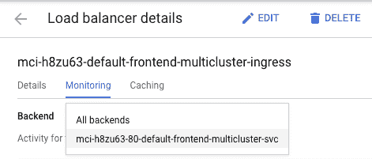

谷歌云负载平衡器监控

*   您可以看到，Hipster Shop 应用的流量流向蓝色和绿色集群(由集群所在的两个区域表示)。您还可以看到时间表指标图表，显示流向两个后端的流量。

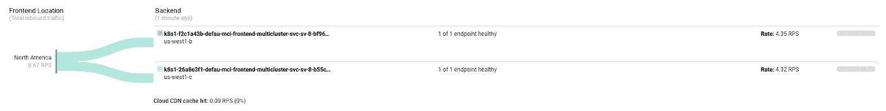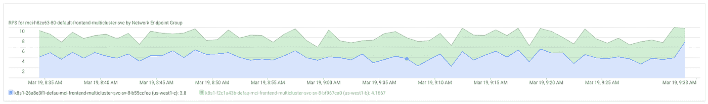

谷歌云负载平衡器监控

> 负载平衡器指标的填充需要几分钟时间。如果需要，几分钟后刷新页面。

您可以看到在蓝色和绿色集群中运行的两个前端多集群服务的 neg(在以 k8s1-开始的后端标签下)。

## 使用云监控进行监控

您可以通过云监控来监控应用的指标。

*   导航到下面命令输出中的链接，以访问云监控指标浏览器。

```
echo "https://console.cloud.google.com/monitoring/metrics-explorer?project=${PROJECT}&pageState=%7B%22xyChart%22:%7B%22dataSets%22:%5B%7B%22timeSeriesFilter%22:%7B%22filter%22:%22metric.type%3D%5C%22loadbalancing.googleapis.com%2Fhttps%2Frequest_count%5C%22%20resource.type%3D%5C%22https_lb_rule%5C%22%22,%22minAlignmentPeriod%22:%2260s%22,%22unitOverride%22:%221%22,%22aggregations%22:%5B%7B%22perSeriesAligner%22:%22ALIGN_RATE%22,%22crossSeriesReducer%22:%22REDUCE_SUM%22,%22groupByFields%22:%5B%22resource.label.%5C%22backend_scope%5C%22%22%5D%7D,%7B%22crossSeriesReducer%22:%22REDUCE_NONE%22%7D%5D%7D,%22targetAxis%22:%22Y1%22,%22plotType%22:%22LINE%22%7D%5D,%22options%22:%7B%22mode%22:%22COLOR%22%7D,%22constantLines%22:%5B%5D,%22timeshiftDuration%22:%220s%22,%22y1Axis%22:%7B%22label%22:%22y1Axis%22,%22scale%22:%22LINEAR%22%7D%7D,%22isAutoRefresh%22:true,%22timeSelection%22:%7B%22timeRange%22:%221h%22%7D%7D"
```

您也可以通过云控制台访问同一页面。点击**监控>指标浏览器**。在**查找资源类型和指标**搜索栏中，输入并选择“https_lb_rule”。对于**,选择一个指标**,搜索并选择“请求计数”。在**分组依据**搜索栏中，搜索并选择“后端范围”。

*   首次访问该链接时，云监控会为您设置一个新的工作区。

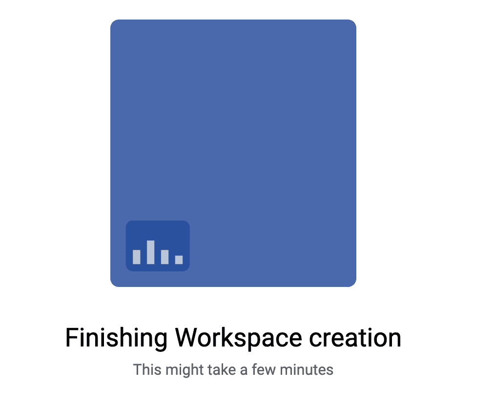

*   创建工作区后，该图表显示了按后端分组的 GCLB 请求计数度量。

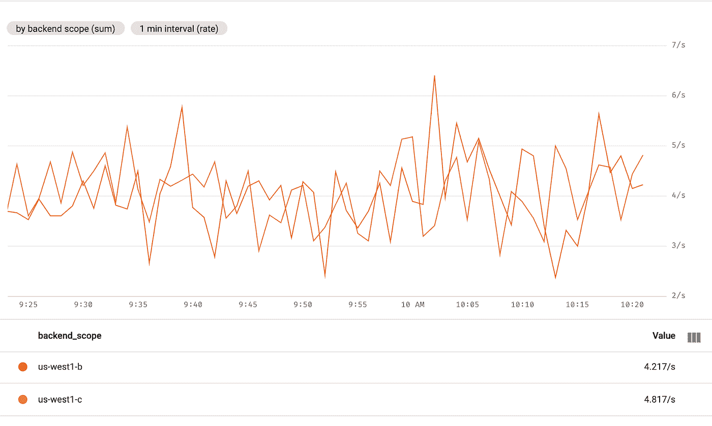

云监控指标浏览器

您会看到流量流向两个后端(蓝色和绿色集群)。后端由两个集群中运行的两个前端多集群服务的区域表示。

> 您可能会在短时间内看到第三个后端(名为 INVALID_BACKEND)。这是云监控中的 UI 异常，可以忽略。

# 排空并升级绿色集群

在本节中，您将“排空”绿色集群。清空集群意味着从负载平衡池中删除集群。在清空绿色集群后，所有发往潮人商店应用的客户端流量都将流向蓝色集群。您可以按照上一节中的描述来监控这个过程。清空集群后，您可以升级清空的集群。升级后，您可以将其放回负载平衡池中。您可以按照相同的步骤升级另一个集群(本教程中未显示)。

要耗尽绿色集群，您需要更新入口集群中的 MulticlusterService 资源，并从集群规范中删除绿色集群。

## 排干绿色的簇

*   更新 ingress-config 群集中的 MulticlusterService 资源。

```
kubectl --context ${INGRESS_CONFIG_CLUSTER} apply -f mcs-blue.yaml
```

*   验证集群规范中只有蓝色集群。

```
kubectl --context ${INGRESS_CONFIG_CLUSTER} get multiclusterservice -o json | jq '.items[].spec.clusters'*Output (do not copy)
{* *“link”: “us-west1-b/blue”**}*
```

在群集规范中，您只能看到蓝色群集。这意味着只有蓝色集群在 GCLB 负载平衡池中。

## 监控入口指标

*   导航到云监控指标图表页面，或者通过单击以下命令的输出。

```
echo "https://console.cloud.google.com/monitoring/metrics-explorer?project=${PROJECT}&pageState=%7B%22xyChart%22:%7B%22dataSets%22:%5B%7B%22timeSeriesFilter%22:%7B%22filter%22:%22metric.type%3D%5C%22loadbalancing.googleapis.com%2Fhttps%2Frequest_count%5C%22%20resource.type%3D%5C%22https_lb_rule%5C%22%22,%22minAlignmentPeriod%22:%2260s%22,%22unitOverride%22:%221%22,%22aggregations%22:%5B%7B%22perSeriesAligner%22:%22ALIGN_RATE%22,%22crossSeriesReducer%22:%22REDUCE_SUM%22,%22groupByFields%22:%5B%22resource.label.%5C%22backend_scope%5C%22%22%5D%7D,%7B%22crossSeriesReducer%22:%22REDUCE_NONE%22%7D%5D%7D,%22targetAxis%22:%22Y1%22,%22plotType%22:%22LINE%22%7D%5D,%22options%22:%7B%22mode%22:%22COLOR%22%7D,%22constantLines%22:%5B%5D,%22timeshiftDuration%22:%220s%22,%22y1Axis%22:%7B%22label%22:%22y1Axis%22,%22scale%22:%22LINEAR%22%7D%7D,%22isAutoRefresh%22:true,%22timeSelection%22:%7B%22timeRange%22:%221h%22%7D%7D"
```

*   输出显示只有蓝色集群在接收流量。

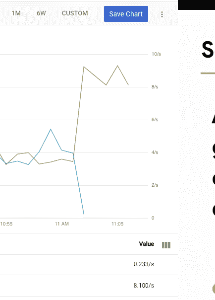

云监控

> 云监控指标刷新可能需要几分钟时间。

*   您还可以在云控制台中看到类似的 GCLB 指标。导航到云控制台中的 GCLB 监视指标页面，或单击以下命令的输出。

```
echo "https://console.cloud.google.com/net-services/loadbalancing/details/http/${INGRESS_LB_RULE}?project=${PROJECT}&tab=monitoring&duration=PT1H"
```

*   该图表还显示，只有蓝色集群正在接收潮人商店的流量。

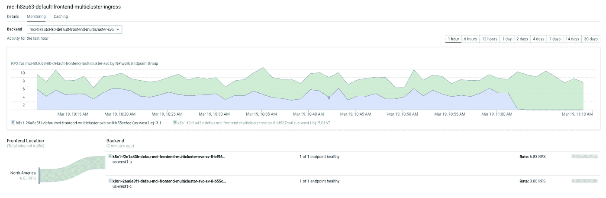

谷歌云负载平衡器监控

> 负载平衡器指标刷新可能需要几分钟时间。

## 升级绿色集群

现在，绿色集群不再接收任何客户端流量，您可以升级集群(主集群和节点集群)。获取主节点和节点的当前集群版本。然后，您可以找到可用的版本(在区域中)。最后，您可以将集群升级到较新的版本。

*   获取集群的当前版本。

```
gcloud container clusters list*Output (do not copy)
NAME LOCATION MASTER_VERSION MASTER_IP MACHINE_TYPE NODE_VERSION NUM_NODES STATUS**ingress-config us-west1-a 1.14.10-gke.24 35.203.165.186 n1-standard-1 1.14.10-gke.24 3 RUNNING**blue us-west1-b 1.14.10-gke.24 34.82.76.141 n1-standard-1 1.14.10-gke.24 4 RUNNING****green us-west1-c 1.14.10-gke.24 35.197.46.200 n1-standard-1 1.14.10-gke.24 4 RUNNING***
```

> 根据您学习本教程的时间，您的集群版本可能会有所不同。

*   获取区域中可用主版本的列表。

```
gcloud container get-server-config --zone us-west1-c --format=json | jq '.validMasterVersions'Output (do not copy)
[“1.15.9-gke.22”,“1.15.9-gke.12”,“1.15.9-gke.9”,“1.15.9-gke.8”,“1.15.8-gke.3”,“1.14.10-gke.27”,“1.14.10-gke.24”,“1.14.10-gke.22”,“1.14.10-gke.21”,“1.14.10-gke.17”,“1.13.12-gke.30”]
```

*   获取区域中可用节点版本的列表。

```
gcloud container get-server-config --zone us-west1-c --format=json | jq '.validNodeVersions[0:20]'Output (do not copy)
[“1.15.9-gke.22”,“1.15.9-gke.12”,“1.15.9-gke.9”,“1.15.9-gke.8”,“1.15.8-gke.3”,“1.15.8-gke.2”,“1.15.7-gke.23”,“1.15.7-gke.2”,“1.15.4-gke.22”,“1.14.10-gke.27”,“1.14.10-gke.24”,“1.14.10-gke.22”,“1.14.10-gke.21”,“1.14.10-gke.17”,“1.14.10-gke.0”,“1.14.9-gke.23”,“1.14.9-gke.2”,“1.14.9-gke.0”,“1.14.8-gke.33”,“1.14.8-gke.21”]
```

*   为绿色集群选择所需的主版本和节点版本(高于当前主版本和节点版本)。

```
export UPGRADE_VERSION="1.15.9-gke.26"
```

> 根据您学习本教程的时间，您的集群版本可能会有所不同。为了确定选择哪个版本，请参考[升级集群和节点池文档](https://cloud.google.com/kubernetes-engine/docs/how-to/upgrading-a-cluster#upgrading_the_cluster)。通常，最佳实践是为主节点和节点选择相同的版本。从列表中为主节点和节点选择一个可用版本。

*   升级绿色集群的主服务器。

```
gcloud container clusters upgrade green \
 --zone us-west1-c --master --cluster-version ${UPGRADE_VERSION}
```

*   键入“ **Y** 确认升级。

```
*Do you want to continue (Y/n)?* **Y***Upgrading green…⠧*
```

> 这个过程需要几分钟才能完成。请等到主升级完成后再继续。更新完成后，您应该会看到以下消息。
> 
> 已更新[https://container . Google APIs . com/v1/projects/gke-multi cluster-upgrades/zones/us-west 1-c/clusters/green]。

*   主升级完成后，您可以通过运行以下命令来升级绿色集群中的节点。

```
gcloud container clusters upgrade green \ --zone=us-west1-c --node-pool=default-pool \ --cluster-version ${UPGRADE_VERSION}
```

*   键入" **Y** "确认升级。

```
*Do you want to continue (Y/n)?* **Y***Upgrading green… Done with 0 out of 4 nodes (0.0%): 1 being processed…⠶*
```

> 这个过程需要几分钟才能完成。请等到节点升级完成后再继续。升级完成后，您应该会看到以下消息。
> 
> 升级绿色…完成 4 个节点中的 4 个(100.0%): 4 个成功…完成。
> 
> 已更新[https://container . Google APIs . com/v1/projects/gke-multi cluster-upgrades/zones/us-west 1-c/clusters/green]。

*   验证绿色集群(主集群和节点集群)是否已升级。

```
gcloud container clusters list*Output (do not copy)
NAME LOCATION MASTER_VERSION MASTER_IP MACHINE_TYPE NODE_VERSION NUM_NODES STATUS**ingress-config us-west1-a 1.14.10-gke.24 35.203.165.186 n1-standard-1 1.14.10-gke.24 3 RUNNING**blue us-west1-b 1.14.10-gke.24 34.82.76.141 n1-standard-1 1.14.10-gke.24 4 RUNNING****green us-west1-c 1.15.8-gke.3 35.197.46.200 n1-standard-1 1.15.8-gke.3 4 RUNNING***
```

> 根据您学习本教程的时间，您的集群版本可能会有所不同。

# 将绿色集群添加到负载平衡池

在本节中，您将绿色集群添加回负载平衡池中。

*   在将绿色集群添加回负载平衡池之前，请验证所有 Hipster Shop 应用部署是否正在绿色集群上运行。

```
kubectl --context ${GREEN_CLUSTER} get podsOutput (do not copy)
NAME READY STATUS RESTARTS AGEadservice-86f5dfb995–2b25h 1/1 Running 0 16mcartservice-76cf9686b6-ws7b7 1/1 Running 1 13mcheckoutservice-7766b946f5–6fhjh 1/1 Running 0 9m50scurrencyservice-76975c7847-rf8r7 1/1 Running 0 13memailservice-c55cd96f-pht8h 1/1 Running 0 13mfrontend-f4b7cd95-wxdsh 1/1 Running 0 13mloadgenerator-6784bc5f77–6b4cd 1/1 Running 6 6m34spaymentservice-696f796545–9wrl7 1/1 Running 0 9m49sproductcatalogservice-7975f8588c-kbm5k 1/1 Running 0 6m33srecommendationservice-6d44459d79-km8vm 1/1 Running 0 9m49sredis-cart-6448dcbdcc-sjg69 1/1 Running 0 13mshippingservice-767f84b88c-gh9m4 1/1 Running 0 9m49s
```

*   更新 MutliclusterService 以将绿色集群添加回负载平衡池中。

```
kubectl --context ${INGRESS_CONFIG_CLUSTER} apply -f mcs-blue-green.yaml
```

*   验证集群规范中是否有蓝色和绿色集群。

```
kubectl --context ${INGRESS_CONFIG_CLUSTER} get multiclusterservice -o json | jq '.items[].spec.clusters'*Output (do not copy)
{* *“link”: “us-west1-b/blue”**},**{* *“link”: “us-west1-c/green”**}*
```

您可以在群集规范中看到蓝色和绿色群集。

## 监控入口指标

*   导航到云监控指标图表页面，或者通过单击以下命令的输出。

```
echo "https://console.cloud.google.com/monitoring/metrics-explorer?project=${PROJECT}&pageState=%7B%22xyChart%22:%7B%22dataSets%22:%5B%7B%22timeSeriesFilter%22:%7B%22filter%22:%22metric.type%3D%5C%22loadbalancing.googleapis.com%2Fhttps%2Frequest_count%5C%22%20resource.type%3D%5C%22https_lb_rule%5C%22%22,%22minAlignmentPeriod%22:%2260s%22,%22unitOverride%22:%221%22,%22aggregations%22:%5B%7B%22perSeriesAligner%22:%22ALIGN_RATE%22,%22crossSeriesReducer%22:%22REDUCE_SUM%22,%22groupByFields%22:%5B%22resource.label.%5C%22backend_scope%5C%22%22%5D%7D,%7B%22crossSeriesReducer%22:%22REDUCE_NONE%22%7D%5D%7D,%22targetAxis%22:%22Y1%22,%22plotType%22:%22LINE%22%7D%5D,%22options%22:%7B%22mode%22:%22COLOR%22%7D,%22constantLines%22:%5B%5D,%22timeshiftDuration%22:%220s%22,%22y1Axis%22:%7B%22label%22:%22y1Axis%22,%22scale%22:%22LINEAR%22%7D%7D,%22isAutoRefresh%22:true,%22timeSelection%22:%7B%22timeRange%22:%221h%22%7D%7D"
```

*   输出显示蓝色和绿色集群都在接收流量。

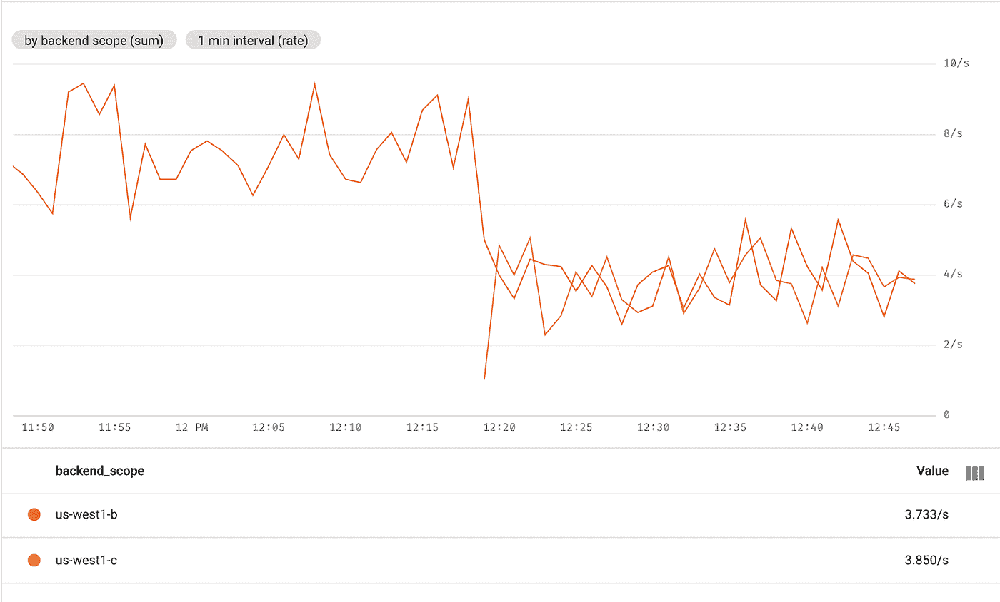

云监控

> 监控指标刷新可能需要几分钟时间。

*   您还可以在云控制台中看到类似的 GCLB 指标。导航到云控制台中的 GCLB 监视指标页面，或单击以下命令的输出。

```
echo "https://console.cloud.google.com/net-services/loadbalancing/details/http/${INGRESS_LB_RULE}?project=${PROJECT}&tab=monitoring&duration=PT1H"
```

图表还显示，蓝色和绿色集群都在接收潮人商店的流量。

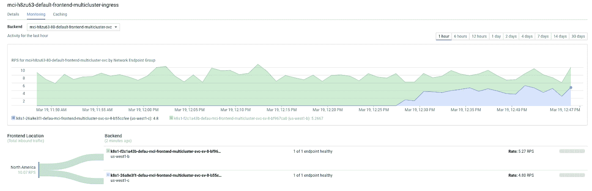

谷歌云负载平衡器监控

> 负载平衡器指标刷新可能需要几分钟时间。

> 恭喜你。您使用 Ingress for Anthos 成功升级了多集群体系结构中的 GKE 集群。您可以使用相同的过程升级蓝色集群。

# 清理

为了避免本教程中使用的资源对您的 Google 云平台帐户产生费用:

## 删除集群

*   注销并删除蓝色和绿色集群。

```
gcloud container hub memberships unregister green \ --project=${PROJECT} \ --gke-uri=${GREEN_URI}gcloud container clusters delete green --zone us-west1-c --quietgcloud container hub memberships unregister blue \ --project=${PROJECT} \ --gke-uri=${BLUE_URI}gcloud container clusters delete blue --zone us-west1-b --quiet
```

*   从 ingress-config 群集中删除 MuticlusterIngress。这将从项目中删除 GCLB 资源。注销并删除入口配置集群。

```
kubectl --context ${INGRESS_CONFIG_CLUSTER} delete -f mci.yaml gcloud container hub memberships unregister ingress-config \ --project=${PROJECT} \ --gke-uri=${INGRESS_CONFIG_URI}gcloud container clusters delete ingress-config --zone us-west1-a --quiet
```

*   验证是否删除了所有集群。

```
gcloud container clusters list*Output (do not copy)
<null>*
```

*   取消设置 kubeconfig 文件。这将重置为默认的 kubeconfig 文件。

```
unset KUBECONFIG
```

*   删除工作目录文件夹。

```
cd ${HOME}
rm -rf ${WORKDIR}
```

## 删除项目

消除计费的最简单方法是删除您为教程创建的项目。

要删除项目:

*   在云平台控制台中，转到项目页面。

```
[GO TO THE PROJECTS PAGE](https://console.cloud.google.com/iam-admin/projects)
```

*   在项目列表中，选择要删除的项目，点击**删除**。

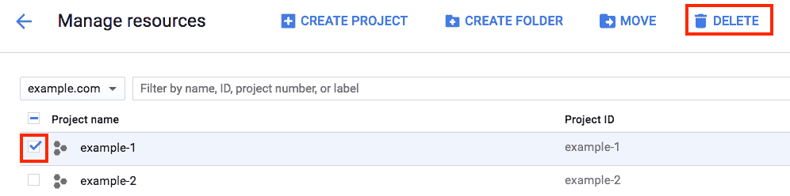

谷歌云控制台

*   在对话框中，键入项目 ID，然后点击**关闭**删除该项目。

# 下一步是什么

*   了解更多关于 Anthos 的[入口](https://cloud.google.com/kubernetes-engine/docs/concepts/ingress-for-anthos)
*   了解如何部署 Anthos 的入口— [跨集群部署 Anthos 的入口](https://cloud.google.com/kubernetes-engine/docs/how-to/ingress-for-anthos)
*   亲自尝试谷歌云平台的其他功能。看看我们的[教程](https://cloud.google.com/docs/tutorials)。