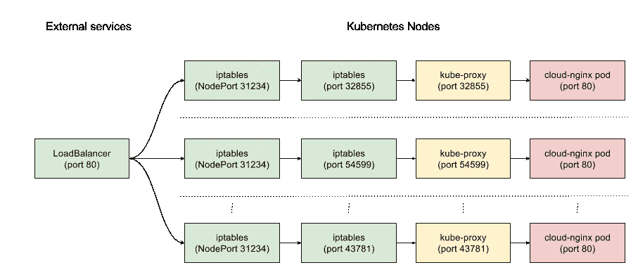

# Kubernetes:从负载平衡器到 pod

> 原文：<https://medium.com/google-cloud/kubernetes-from-load-balancer-to-pod-3f2399637b0c?source=collection_archive---------0----------------------->

在工作中，我们使用 Kubernetes。上周五，我和一位同事聊天，我们想知道负载平衡器、服务和 pods 是如何协同工作的。实际上，Kubernetes 概念中的[服务、负载平衡和网络](https://kubernetes.io/docs/concepts/services-networking/service/)部分已经很好地解释了一切。然而，你可能需要阅读几遍才能理解所有的东西，所以我真的需要自己去看一看，并使用一个例子。我试图回答的基本问题是:当您将服务定义为负载均衡器时会发生什么，以及数据包如何到达我的 pod 中？

那么，让我们从例子开始。假设我们已经定义了这个服务:

```
kind: Service
apiVersion: v1
metadata:
  name: cloud-nginx
spec:
  type: LoadBalancer
  selector:
    app: cloud-nginx
  ports:
    - port: 80
      name: http-server
    - port: 443
      name: https-server
```

这是一个名为 *cloud-nginx 的 [*负载均衡器*](https://kubernetes.io/docs/concepts/services-networking/service/#type-loadbalancer) 服务。*该服务所针对的 pods 也被命名为 *cloud-nginx* (参见*spec . selector . app:cloud-nginx*)并且 pods 将针对端口 80 和 443。端口 80 基本上重定向(带有 301 HTTP 返回代码)到端口 443。我们的*负载平衡器*服务将自动创建一些东西:一个集群 IP(只能在 Kubernetes 集群内部访问)和一个服务节点端口。服务节点端口暴露在集群中的每个节点上。这很重要。

负载平衡器在群集外部，这意味着它将拥有一个外部 IP，并将数据包转发到上面创建的服务节点端口。

当数据包到达节点时(在节点被称为 minions 之前)，这完全取决于我们正在使用哪种类型的 [*kube-proxy*](https://kubernetes.io/docs/admin/kube-proxy/) 。有两种模式: [*用户空间*](https://kubernetes.io/docs/concepts/services-networking/service/#proxy-mode-userspace) 或 [*iptables*](https://kubernetes.io/docs/concepts/services-networking/service/#proxy-mode-iptables) 。在我们的例子中，我们使用*用户空间*，正如我们从节点上运行的命令中看到的:

```
# ps auxfww | grep kube-proxy
...
kube-proxy --master=[https://30.191.106.1](https://35.192.156.14/)2 --kubeconfig=/var/lib/kube-proxy/kubeconfig --cluster-cidr=[10.244.0.0/14](http://10.244.0.0/14) --resource-container= --v=2 --proxy-mode=userspace 1>>/var/log/kube-proxy.log 2>&1
...
```

在一个*用户空间*代理中， *kube-proxy* 打开一个代理端口，并安装 *iptables* 规则，将流量从服务节点端口重定向到代理端口。这意味着两个端口都被 *kube-proxy* 打开(下面将进一步解释端口 31234 和 32855):

```
# lsof -i TCP:31234 -i TCP:32855
COMMAND PID USER FD TYPE DEVICE SIZE/OFF NODE NAME
kube-prox 3822 root 22u IPv6 272416 0t0 TCP *:31234 (LISTEN)
kube-prox 3822 root 23u IPv6 269708 0t0 TCP *:32855 (LISTEN)
```

当数据包到达服务节点端口时，新的 *iptables* 规则开始生效。这些是我上面提到的由 *kube-proxy* 设置的 *iptables* 规则。因此，在我们的例子中，在端口 80 到达外部负载均衡器的数据包将到达我们的一个节点(即服务节点端口)，一旦它到达该节点， *iptables* 规则将把数据包重定向到代理端口。

在 iptables 中，我们对 nat 表感兴趣。您可以使用以下命令列出所有的 *nat* 规则:

```
# iptables -t nat -L -n
```

然后你可以寻找特定的规则。例如，在我的集群的一个节点中，有这些 *iptables* 规则:

```
# iptables -t nat -S KUBE-NODEPORT-CONTAINER
...
-A KUBE-NODEPORT-CONTAINER -p tcp -m comment — comment “default/cloud-nginx:http-server” -m tcp — dport 31234 -j REDIRECT — to-ports 32855
...
```

它告诉将所有本地数据包从端口 31234 重定向到本地端口 32855。

```
# iptables -t nat -S KUBE-NODEPORT-HOST
...
-A KUBE-NODEPORT-HOST -p tcp -m comment — comment “default/cloud-nginx:http-server” -m tcp — dport 31234 -j DNAT — to-destination [10.240.0.4:32855](http://10.240.0.4:32855/)
...
```

它将所有去往端口 31234 的分组重写并路由到端口 32855 处的节点的内部集群 IP。

如果您连接到 31234 或 32855，您可以看到它可以工作:

```
# nc localhost 31234
GET /
<html>
<head><title>301 Moved Permanently</title></head>
<body bgcolor=”white”>
<center><h1>301 Moved Permanently</h1></center>
<hr><center>nginx/1.11.5</center>
</body>
</html>
```

iptables 中使用的端口 31234 和 32855 是什么？端口 31234 是服务节点端口，32855 是代理端口。我们还可以看到使用 *kubectl* 从端口 80 上的负载平衡器到服务节点端口 31234 的映射:

```
$ kubectl get services cloud-nginx
NAME CLUSTER-IP EXTERNAL-IP PORT(S) AGE
cloud-nginx 10.0.226.161 101.195.33.220 80:31234/TCP,443:30582/TCP 1d
```

回到 *iptables* ，我们可以看到另一个有趣的规则:

```
# iptables -t nat -S KUBE-PORTALS-HOST
...
-A KUBE-PORTALS-HOST -d [101.195.33.220/32](http://104.197.38.226/32) -p tcp -m comment — comment “default/cloud-nginx:http-server” -m tcp — dport 80 -j DNAT — to-destination [10.240.0.4:32855](http://10.240.0.4:32855/)
....
```

它将数据包从我的负载平衡器(101.195.33.220)直接重写到代理端口 32855(不需要通过服务节点端口)。

最后一个问题还有待回答，kube-proxy 如何将数据包从端口 32855 转发到 cloud-nginx 容器？这个难题的缺失部分是每个 Kubernetes pod 都有自己的 IP，并且 kube-proxy 知道它们。出于我们的目的，我们可以用 *kubectl* 获得 pod IP:

```
$ kubectl get po cloud-nginx-3tvcp -o wide
NAME READY STATUS RESTARTS AGE IP NODE
cloud-nginx-3tvcp 1/1 Running 0 2d 10.244.1.5 aleix-minion-group-7f52
```

这意味着 *kube-proxy* 基本上会将所有来自端口 32855 的数据包转发到端口 80(这是我们服务文件中指定的端口)的 10.244.1.5。从该节点，我们可以验证我们可以将 pod IP 访问到所需的端口:

```
# nc 10.244.1.5 80
GET /
<html>
<head><title>301 Moved Permanently</title></head>
<body bgcolor=”white”>
<center><h1>301 Moved Permanently</h1></center>
<hr><center>nginx/1.11.5</center>
</body>
</html>
```

因此，从高层次的角度来看，整个过程应该是这样的:



从负载平衡器到 pod

上面我提到过端口 31234 也是由 *kube-proxy* 处理的，但是正如我们在图中看到的，我们并没有真正在 *kube-proxy* 中使用它。如果我在 [*kube-proxy* 代码](https://github.com/kubernetes/kubernetes/blob/master/pkg/proxy/iptables/proxier.go#L1673)中理解正确的话，这是为了确保该端口被保留，因此其他应用程序无法获取它。

我相信就是这样。还有另一种 *kube-proxy* 模式，带有 *iptables* 性能更好，我相信这是因为数据包不需要进入用户空间。然而，由于它都是基于 *iptables* 的，如果数据包无法到达 pod(例如，因为 pod 关闭)，它将不会重试，因为 iptables 中没有这种东西。但那是以后的事了。