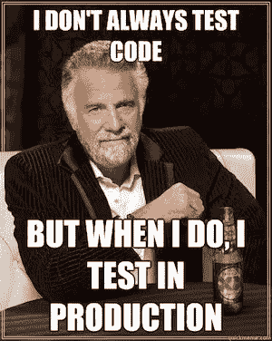
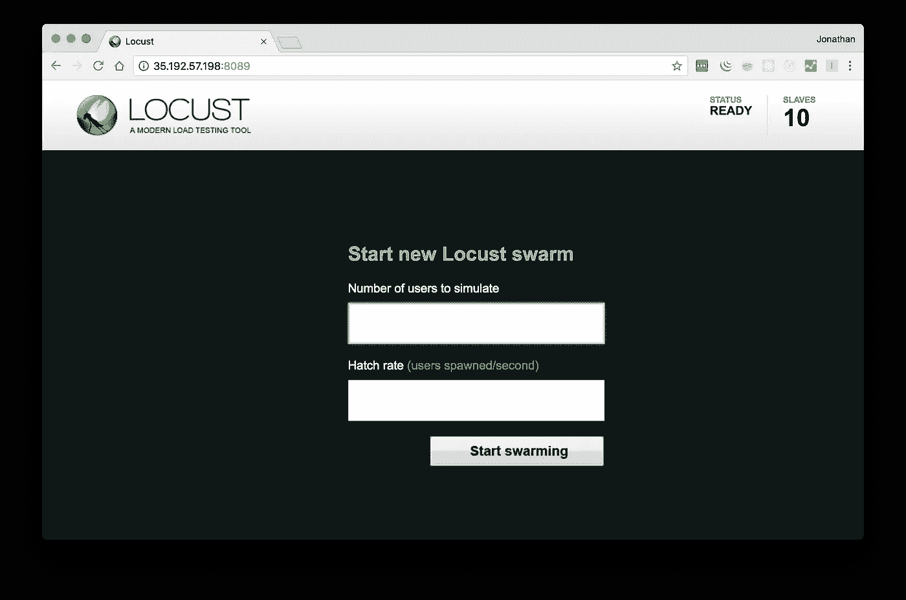

# Kubernetes:水平 Pod 缩放

> 原文：<https://medium.com/google-cloud/kubernetes-horizontal-pod-scaling-190e95c258f5?source=collection_archive---------0----------------------->

通过 Pod 自动扩展，您的 Kubernetes 集群可以监控现有 Pod 的负载，并确定我们是否需要更多 Pod。这是使用 Kubernetes 的最大好处之一，因为您可以避免单个 pod 过载，这将导致意外的代码行为和各种错误。您可以通过多种方式来控制这个 Pod 自动扩展，以及围绕它的最佳实践。这就是本文的目的。


复制舱！

*如果你还没有通读甚至阅读过本系列* *的第一部分* [*，你可能会感到困惑，不知道代码在哪里，或者之前做了什么。记住这里假设你正在使用*](/@jonbcampos/kubernetes-day-one-30a80b5dcb29) [*GCP*](https://cloud.google.com/) *和*[*GKE*](https://cloud.google.com/kubernetes-engine/)*。我将始终提供代码和如何测试代码是按预期工作。*

[](/@jonbcampos/kubernetes-day-one-30a80b5dcb29) [## Kubernetes:第一天

### 这是 Kubernetes 帖子的必选步骤之一。如果你对 Kubernetes 感兴趣，你可能已经读过 100 本了…

medium.com](/@jonbcampos/kubernetes-day-one-30a80b5dcb29) 

# Pod 自动缩放

正如我们之前所讨论的，Kubernetes 在一个称为 Pod 的 Kubernetes 容器中使用 Docker 容器来管理 Kubernetes 集群中的资源。通过自动缩放，Kubernetes 会观察每个单元的*资源指标*，并确定我们是否需要更多或更少的单元。我说“资源度量”是故意含糊其辞，因为您可以根据应用程序的需求创建定制的度量。最常见的是 CPU 利用率。

> 也就是说，Kubernetes 将观察 X 秒内的平均 CPU 利用率，并根据利用率添加或删除 pod。我们使用平均 CPU 利用率来降低峰值噪声。

# 向集群添加水平窗格自动缩放

Kubernetes 集群准备就绪后，您可以添加一个水平 Pod 自动缩放器(也称为 HPA ),以便您的集群根据资源指标在必要时添加和删除 Pod。添加这个 HPA 非常简单，只需下面的脚本行。

```
echo "sets autoscale logic" ***kubectl* autoscale deployment endpoints --cpu-percent=50 --min=1 --max=10**
```

现在我们知道了什么是 HPA，我们可以专注于制作我们自己的 HPA，并在 GCP 上测试我们的集群。



不要做这种人

# 带负荷测试

你现在可以成为两个开发者之一。

1.  你可以把一切都推出去，相信它会起作用。
2.  在你因为没有验证你的工作而陷入麻烦之前，你可以验证事情已经设置好了。

没错。我们现在将成为第二号开发人员，测试我们的 Kubernetes 集群在事情开始变得棘手时是否会像预期的那样扩展。为此，我们将创建一个全新的 Kubernetes 集群，模拟来自完全不同的 GCP 区域的负载。我们将以这种方式进行测试，因为它将充分模拟来自另一个位置的负载，同时专注于我们可以真正影响的代码，并且没有太多的测试污染。

注意:这个使用 Locust 的解决方案在[这篇文章](https://cloud.google.com/solutions/distributed-load-testing-using-kubernetes)中有详细介绍。我刚为你写了一个很好的剧本。

首先，让我们的环境运行起来。您可以选择默认创建自动缩放，或者运行两个替代命令来添加自动缩放。如果你对这个集群定标器感兴趣，我推荐你看看我在 [Kubernetes 集群定标器](/@jonbcampos/kubernetes-cluster-autoscaler-f1948a0f686d)上发布的另一个帖子。

```
$ git clone [https://github.com/jonbcampos/kubernetes-series.git](https://github.com/jonbcampos/kubernetes-series.git)
$ cd ~/[kubernetes-series/autoscaling/scripts](https://github.com/jonbcampos/kubernetes-series/tree/master/autoscaling/scripts)
$ sh [startup.sh](https://github.com/jonbcampos/kubernetes-series/blob/master/autoscaling/scripts/startup.sh) # with autoscaling
$ # sh [startup_wo_autoscaling.sh](https://github.com/jonbcampos/kubernetes-series/blob/master/autoscaling/scripts/startup_wo_autoscaling.sh) # without autoscaling
$ # sh [add_autoscaling.sh](https://github.com/jonbcampos/kubernetes-series/blob/master/autoscaling/scripts/add_autoscaling.sh) # add autoscaling **after** creation
```

哇，这些命令解决了很多问题，不是吗！？现在是时候创建我们的负载测试 Kubernetes 集群了，构建我们的 Docker 文件，其中包含我们的 runner 测试，最后部署我们的负载测试代码。为了让这变得简单，我把它放到了一个脚本中，你可以[一头扎进去，看看神奇的](https://github.com/jonbcampos/kubernetes-series/blob/master/autoscaling/scripts/startup_load_runner.sh)。

您会注意到，我们在脚本中添加了一个参数，以便负载运行器知道要测试什么地址。

```
cd ~/kubernetes-series/autoscaling/scripts # if necessary
# You’ll notice that we added an argument to our 
# script so that the load runner knows what address to test
$ sh [startup_load_runner.sh](https://github.com/jonbcampos/kubernetes-series/blob/master/autoscaling/scripts/startup_load_runner.sh) 100.101.102.103
```

完成此过程后，您应该会看到一个提示，告诉您在哪里可以查看和访问您的群集。是时候转到该链接并启动您的负载运行器了。



可从[您的群集 ip 地址]:8089 获得

这是有趣的部分。您可以输入想要模拟的用户数量及其速度，然后设置一个 Kubernetes 集群开始攻击另一个。

当你在玩负重跑的时候，你可能想在你的吊舱中增加一个观察器。这样，您可以看到负载何时开始变大，自动缩放何时开始。

```
# view specific cluster details
$ **gcloud container clusters get-credentials autoscaling-cluster** **--zone****=us-central1-a**
# show horizontal pod autoscaling details
$ **watch kubectl get hpa** # ctrl+c to stop
```

如果您真的想让您的集群变得紧张，您可能还想使用我为您设置的以下复制脚本来添加更多的工作线程。

```
$ cd ~/kubernetes-series/autoscaling/scripts # if necessary
$ sh [scale_load_runner.sh](https://github.com/jonbcampos/kubernetes-series/blob/master/autoscaling/scripts/scale_load_runner.sh) X # <-- number of replicas to make
```

有了它，你就大功告成了！您已经创建了一个集群，您已经将集群设置为自动扩展，最后您已经通过使用负载运行器来测试集群的扩展。说真的，太神奇了。

额外收获:如果你想享受看着吊舱下降的过程，你可以在观看 hpa 的同时清空负载运行器。

```
$ cd ~/kubernetes-series/autoscaling/scripts # if necessary
$ sh [teardown_load_runner.sh](https://github.com/jonbcampos/kubernetes-series/blob/master/autoscaling/scripts/teardown_load_runner.sh)
```

额外阅读:如果你对 Locust 有点好奇，我推荐你看看我的另一个链接[，在那里我给出了更多关于编辑 Locust 文件的细节](/@jonbcampos/locust-customize-task-runner-f5a6c59476ff)。

 [## 蝗虫:自定义任务运行器

### 这篇文章是我刚刚在 Kubernetes 上发布的另一系列文章的副产品:集群自动缩放器和…

medium.com](/@jonbcampos/locust-customize-task-runner-f5a6c59476ff) 

# 拆卸

在您离开之前，请确保清理您的项目，这样您就不会为您用来运行群集的虚拟机付费。返回到云 Shell 并运行 teardown 脚本来清理您的项目。这将删除您的集群和我们构建的容器。

```
$ cd ~/kubernetes-series/autoscaling/scripts # if necessary
$ sh [teardown.sh](https://github.com/jonbcampos/kubernetes-series/blob/master/autoscaling/scripts/teardown.sh)
```

# 关闭

这篇文章与围绕[集群自动缩放器](/@jonbcampos/kubernetes-cluster-autoscaler-f1948a0f686d)的另一篇文章齐头并进。如果这激发了你对扩展的兴趣，我会推荐你朝那个方向前进。

# 本系列的其他文章

[](/@jonbcampos/kubernetes-running-background-tasks-with-batch-jobs-56482fbc853) [## Kubernetes:使用批处理作业运行后台任务

### 当构建令人惊叹的应用程序时，有时您可能想要处理用户之外的动作…

medium.com](/@jonbcampos/kubernetes-running-background-tasks-with-batch-jobs-56482fbc853) [](/google-cloud/kubernetes-run-a-pod-per-node-with-daemon-sets-f77ce3f36bf1) [## Kubernetes:用守护进程集在每个节点上运行一个 Pod

### 我最初给这篇文章起的标题只是“守护进程集”,并假设它足以抓住要点…

medium.com](/google-cloud/kubernetes-run-a-pod-per-node-with-daemon-sets-f77ce3f36bf1) [](/google-cloud/kubernetes-cron-jobs-455fdc32e81a) [## 库伯内特:克朗·乔布斯

### 有时候你的工作不是事务性的。我们不再等待用户点击按钮让系统亮起来…

medium.com](/google-cloud/kubernetes-cron-jobs-455fdc32e81a) [](/google-cloud/kubernetes-dns-proxy-with-services-d7d9e800c329) [## Kubernetes:带服务的 DNS 代理

### 构建应用程序时，通常需要与外部服务进行交互来完成业务…

medium.com](/google-cloud/kubernetes-dns-proxy-with-services-d7d9e800c329) [](/google-cloud/kubernetes-routing-internal-services-through-fqdn-d98db92b79d3) [## Kubernetes:通过 FQDN 路由内部服务

### 我记得当我第一次进入 Kubernetes 时。一切都是崭新的、闪亮的、有规模的。当我继续的时候…

medium.com](/google-cloud/kubernetes-routing-internal-services-through-fqdn-d98db92b79d3) [](/google-cloud/kubernetes-liveness-checks-4e73c631661f) [## Kubernetes:活性检查

### 最近，我整理了一篇关于 Kubernetes 就绪性调查以及它对您的集群有多重要的文章…

medium.com](/google-cloud/kubernetes-liveness-checks-4e73c631661f) [](/@jonbcampos/kubernetes-day-one-30a80b5dcb29) [## Kubernetes:第一天

### 这是 Kubernetes 帖子的必选步骤之一。如果你对 Kubernetes 感兴趣，你可能已经读过 100 本了…

medium.com](/@jonbcampos/kubernetes-day-one-30a80b5dcb29) [](/@jonbcampos/kubernetes-cluster-autoscaler-f1948a0f686d) [## Kubernetes:集群自动缩放

### 自动缩放是 Kubernetes 的一个巨大的(并且已经上市的)特性。当你的网站/应用程序/应用程序接口/项目变得越来越大时，洪水…

medium.com](/@jonbcampos/kubernetes-cluster-autoscaler-f1948a0f686d) [](/@jonbcampos/kubernetes-readiness-probe-83f8a06d33d3) [## Kubernetes:就绪探测

### 如果对这个特性有任何疑问，我写这篇文章是为了说明这不是一个…

medium.com](/@jonbcampos/kubernetes-readiness-probe-83f8a06d33d3) 

[Jonathan Campos](http://jonbcampos.com/) 是一个狂热的开发者，喜欢学习新事物。我相信我们应该不断学习、成长和失败。我总是开发社区的支持者，并且总是愿意提供帮助。因此，如果你对这个故事有任何问题或意见，请在下面提出。在 [LinkedIn](https://www.linkedin.com/in/jonbcampos/) 或 [Twitter](https://twitter.com/jonbcampos) 上与我联系，并提及这个故事。