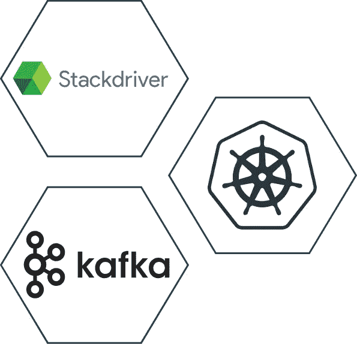
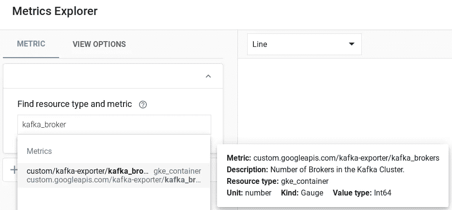
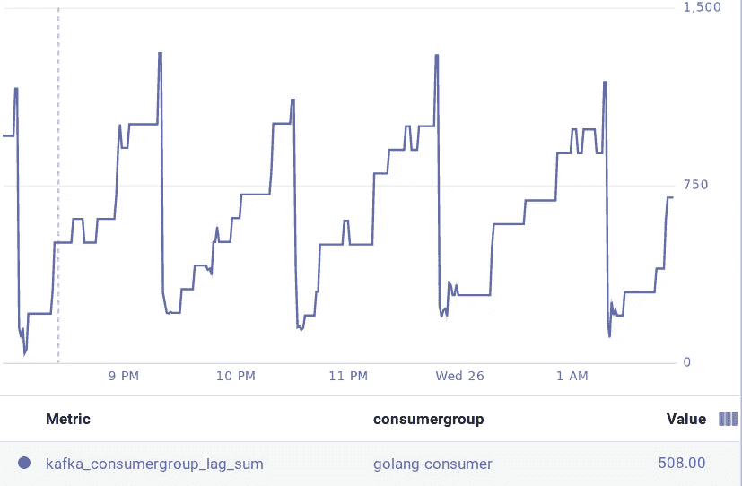

# Kubernetes HPA 使用 Kafka 指标进行自动缩放

> 原文：<https://medium.com/google-cloud/kubernetes-hpa-autoscaling-with-kafka-metrics-88a671497f07?source=collection_archive---------0----------------------->



Kubernetes 本身支持自动缩放。从 1.7 版本开始，Kubernetes 添加了一个基于自定义指标来扩展工作负载的特性。之前的版本只支持根据 CPU 和内存来扩展应用。

Kubernetes 1.7 引入了“聚合器层”，它允许 Kubernetes 在核心的 Kubernetes APIs 之外扩展更多的 API。这使您能够启用自己的定制 API。

在本指南中，我们将了解 HPAs、自定义外部指标 API 的基础知识，以及如何根据从 Kafka 集群中收集的外部指标来工作和扩展工作负载。

以下是您将在本指南中完成的步骤:

*   步骤 1:为 Stackdriver 启用集群监控。
*   步骤 2:部署一个定制的 API 服务器，并将其注册到聚合器层。
*   步骤 3:部署度量导出器并写入 Stackdriver。
*   步骤 4:部署一个用 Golang 编写的样例应用程序来测试自动缩放。
*   步骤 5:编写基于自定义指标的 HPA 来扩展应用程序。

在继续演示之前，我们需要了解一些有用的概念。

# Kubernetes HPA 如何工作？

水平 Pod 自动缩放器被实现为 Kubernetes API 资源和控制器。资源决定了控制器的行为。控制器定期调整复制控制器或部署中的副本数量。

HorizontalPodAutoscaler 通常从一系列聚合的 API(`metrics.k8s.io`、`custom.metrics.k8s.io`和`external.metrics.k8s.io`)中获取指标。`metrics.k8s.io` API 通常由 **metrics-server** 提供，需要单独启动。HorizontalPodAutoscaler 也可以直接从 Heapster 获取指标。

在本指南中，我们将部署来自`external.metrics.k8s.io`的 HPA 读数，因为我们的 Kafka 指标将暴露于该 API。

# 什么是自定义指标？

Kubernetes 允许我们部署您自己的指标解决方案。默认情况下，**指标服务器**和**堆服务器**充当核心指标后端。

Kubernetes 已经扩展了支持，允许自定义 API 公开其他指标提供者。很少有适配器是由第三方编写来实现自定义 API 的，这些 API 可用于向 Kubernetes 资源(如 HPA)公开这些指标。

当前实施:[github.com/Kubernetes/IMPLEMENTATIONS.md](https://github.com/Kubernetes/metrics/blob/master/IMPLEMENTATIONS.md)

# 自定义 API 服务器和 HPA 是如何联系在一起的？

我们部署的定制 API 服务器向 Kubernetes 注册了一个 API，并允许 HPA 控制器从中查询定制指标。我们将在这里部署的 API 服务器是 Stackdriver 适配器，它可以从 Stackdriver 收集指标，并通过 REST 查询将它们发送到 HPA 控制器。

我们的定制 API 服务器将向 Kubernetes 注册两个 API:`custom.metrics.k8s.io`和`external.metrics.k8s.io`。

我们还将部署一个应用程序来将指标(在本例中是 Kafka 指标)写入 google stackdriver。我们将要写入 Stackdriver 的度量类型将在`external.metrics.k8s.io`下公开，而不是在 custom.metrics.k8s.io 下

# 先决条件

确保已经满足以下依赖关系:

1.  你有一个码头运行。你知道这个游戏的规则。；)
2.  你有一个 Kubernetes 集群(GKE)运行在 GCP。
3.  您已经为您的 GKE 集群安装并配置了 kubectl CLI。

让我们开始演示吧。

# 1.为 Stackdriver 启用集群监控

GCP 助手文档:[https://cloud . Google . com/kubernetes-engine/docs/how-to/monitoring # enabling _ monitoring _ for _ an _ existing _ cluster](https://cloud.google.com/kubernetes-engine/docs/how-to/monitoring#enabling_monitoring_for_an_existing_cluster)

应该在群集节点上启用监视范围。默认启用，[https://cloud . Google . com/kubernetes-engine/docs/how-to/monitoring # enabling _ monitoring _ for _ an _ existing _ cluster](https://cloud.google.com/kubernetes-engine/docs/how-to/monitoring#enabling_monitoring_for_an_existing_cluster)所以你什么都不用做。如果您有旧版本，请将其升级到最新版本，然后也更新您的节点版本。范围将启用对 stackdriver 的写权限，这对于写度量很重要。

```
$ gcloud container clusters list
NAME                 LOCATION       MASTER_VERSION  MASTER_IP       MACHINE_TYPE   NODE_VERSION   NUM_NODES  STATUS
my-kube-cluster  us-central1-b  1.10.7-gke.11   xxx.xxx.xxx.xxx  n1-standard-1    1.10.7-gke.11    2          RUNNING$ gcloud container clusters describe my-kube-cluster
............
..<output>..
............
oauthScopes:
    - [https://www.googleapis.com/auth/compute](https://www.googleapis.com/auth/compute)
    - [https://www.googleapis.com/auth/devstorage.read_only](https://www.googleapis.com/auth/devstorage.read_only)
    - [https://www.googleapis.com/auth/service.management](https://www.googleapis.com/auth/service.management)
    - [https://www.googleapis.com/auth/servicecontrol](https://www.googleapis.com/auth/servicecontrol)
    - [https://www.googleapis.com/auth/logging.write](https://www.googleapis.com/auth/logging.write)
    - [https://www.googleapis.com/auth/monitoring](https://www.googleapis.com/auth/monitoring)   *# enabled*
............
..<output>..
............
```

# 2.部署一个定制的 API 服务器，并将其注册到聚合器层。

在部署我们的定制服务器之前，让我们看看 k8s 中有哪些可用的 API。

```
## Type commands to see existing available APIs
$ kubectl api-versionsadmissionregistration.k8s.io/v1beta1
apiextensions.k8s.io/v1beta1
apiregistration.k8s.io/v1
apiregistration.k8s.io/v1beta1
............
..<other-APIs>..
............
metrics.k8s.io/v1beta1    # this is our core metrics APIs
............
..<other-APIs>..
............
```

在这里，您可以看到我们有`metrics.k8s.io`可用，但我们需要`external.metrics.k8s.io`来公开我们的 stackdriver 指标，并允许 HPA 通读它。

我们将使用定制的 metrics stackdriver 适配器来注册我们的 API。

```
# Use one of google user account to create a cluster role
$ kubectl create clusterrolebinding cluster-admin-binding \
    --clusterrole cluster-admin --user "$(gcloud config get-value account)"# We will deploy new resource model based APIs$ kubectl apply -f [https://raw.githubusercontent.com/GoogleCloudPlatform/k8s-stackdriver/master/custom-metrics-stackdriver-adapter/deploy/production/adapter_new_resource_model.yaml](https://raw.githubusercontent.com/GoogleCloudPlatform/k8s-stackdriver/master/custom-metrics-stackdriver-adapter/deploy/production/adapter_new_resource_model.yaml)namespace "custom-metrics" created
serviceaccount "custom-metrics-stackdriver-adapter" created
clusterrolebinding.rbac.authorization.k8s.io "custom-metrics:system:auth-delegator" created
rolebinding.rbac.authorization.k8s.io "custom-metrics-auth-reader" created
clusterrolebinding.rbac.authorization.k8s.io "custom-metrics-resource-reader" created
deployment.extensions "custom-metrics-stackdriver-adapter" created
service "custom-metrics-stackdriver-adapter" created
apiservice.apiregistration.k8s.io "v1beta1.custom.metrics.k8s.io" created
apiservice.apiregistration.k8s.io "v1beta1.external.metrics.k8s.io" created
clusterrole.rbac.authorization.k8s.io "external-metrics-reader" created
clusterrolebinding.rbac.authorization.k8s.io "external-metrics-reader" created
```

现在，我们已经将自定义服务器和注册的 API 部署到聚合器层。

```
# Custom Metrics APIs verification$  kubectl get all -n custom-metrics
NAME                                                 READY     STATUS    RESTARTS   AGE
custom-metrics-stackdriver-adapter-6c9bd9679-m2cnh   1/1       Running   0          2m# Type again to get available APIs
$ kubectl api-versions
............
..<other-APIs>..
............
metrics.k8s.io/v1beta1
.....
custom.metrics.k8s.io/v1beta1   # for custom Kubernetes metrics
external.metrics.k8s.io/v1beta1 # for external metrics
............
..<other-APIs>..
............
```

现在，查询我们刚刚上线的新 API。

```
$ kubectl get --raw "/apis/external.metrics.k8s.io/v1beta1" | jq
$ kubectl get --raw "/apis/custom.metrics.k8s.io/v1beta1" | jq
```

现在，您可以看到，这两个 API 都是在线的，有许多自定义指标可供查询。接下来，我们将向 stackdriver 写入 Kafka 指标，这些 API 将帮助我们从中读取。

详细资源:[k8s-stack driver/custom-metrics-stack driver-adapter](https://github.com/GoogleCloudPlatform/k8s-stackdriver/tree/master/custom-metrics-stackdriver-adapter)

# 3.部署指标导出器并写入 stackdriver。

我们正在使用 [Kafka exporter](https://github.com/danielqsj/kafka_exporter) ，它将读取我的 Kafka 集群并以 [prometheus 格式](https://prometheus.io/docs/instrumenting/exposition_formats/)公开指标，我们将我们的部署与这个[k8s-stack driver/Prometheus-to-SD](https://github.com/GoogleCloudPlatform/k8s-stackdriver/tree/master/prometheus-to-sd)sidecar 容器结合起来。Kafka-exporter 将读取 Kafka 集群，并在特定的 web-URL 上公开指标，我们的 sidecar 容器将读取这些指标并写入 stackdriver。很简单，我们开始吧。

```
*# prometheus-to-sd-custom-metrics-kafka-exporter.yaml*
apiVersion: extensions/v1beta1
kind: Deployment
metadata:
  name: custom-metrics-kafka-exporter
spec:
  replicas: 1
  selector:
    matchLabels:
      custom: metrics
  template:
    metadata:
      labels:
        custom: metrics
    spec:
      hostNetwork: true
      containers:
      - name: kafka-exporter
        image: danielqsj/kafka-exporter
        command:
        - kafka_exporter
        - "--kafka.server=my-kafka-broker-1:9092"
        - "--kafka.server=my-kafka-broker-2:9092"
        ports:
          - name: http-metrics
            containerPort: 9308
        readinessProbe:
          httpGet:
            path: /
            port: 9308
          initialDelaySeconds: 5
          timeoutSeconds: 5
      - name: prometheus-to-sd
        image: gcr.io/google-containers/prometheus-to-sd:v0.3.2
        ports:
          - name: profiler
            containerPort: 6060
        command:
          - /monitor
          - --stackdriver-prefix=custom.googleapis.com
          - --source=kafka-exporter:http://localhost:9308?whitelisted=kafka_brokers,kafka_topic_partitions,kafka_consumergroup_current_offset_sum,kafka_consumergroup_lag_sum
          - --pod-id=**$(**POD_NAME**)**
          - --namespace-id=**$(**POD_NAMESPACE**)**
        env:
          - name: POD_NAME
            valueFrom:
              fieldRef:
                fieldPath: metadata.name
          - name: POD_NAMESPACE
            valueFrom:
              fieldRef:
                fieldPath: metadata.namespace
```

部署它以将您的指标发送到 stackdriver。

```
kubectl apply -f prometheus-to-sd-custom-metrics-kafka-exporter.yaml
```

下一步是探索 stackdriver 并过滤您的外部指标。可用指标:[https://github.com/danielqsj/kafka_exporter#metrics](https://github.com/danielqsj/kafka_exporter#metrics)

> 比如搜索:卡夫卡 _ 经纪人



堆栈驱动度量浏览器

您还可以查询已注册的 API 来读取这些外部值。

```
$ kubectl get --raw "/apis/external.metrics.k8s.io/v1beta1/namespaces/default/custom.googleapis.com|kafka-exporter|kafka_brokers" | jq{
  "kind": "ExternalMetricValueList",
  "apiVersion": "external.metrics.k8s.io/v1beta1",
  "metadata": {
    "selfLink": "/apis/external.metrics.k8s.io/v1beta1/namespaces/default/custom.googleapis.com%7Ckafka-exporter%7Ckafka_brokers"
  },
  "items": [
    {
      "metricName": "custom.googleapis.com|kafka-exporter|kafka_brokers",
      "metricLabels": {
        "resource.labels.cluster_name": "my-kube-cluster",
        "resource.labels.container_name": "",
        "resource.labels.instance_id": "gke-my-kube-cluster-69201eb2-dvdg",
        "resource.labels.namespace_id": "default",
        "resource.labels.pod_id": "custom-metrics-kafka-exporter-56764bbbc9-p5xqb",
        "resource.labels.zone": "us-central1-b",
        "resource.type": "gke_container"
      },
      "timestamp": "2018-12-25T12:56:46Z",
      "value": "2"
    }
  ]
}
```

# 4.部署一个用 golang 编写的示例应用程序来测试自动缩放。

到目前为止，我们已经检查了所有有助于向 HPA 展示我们的指标的复杂部分。从现在开始，我们将运行一些我们通常在 Kubernetes 中执行的基本操作。

为了模拟自动缩放，我部署了一个用 golang 编写的示例应用程序，它将作为 Kafka 主题的 Kafka 客户端(生产者和消费者)。

> 参考代码:[k8s-HPA-自定义-自动缩放-kafka-metrics/go-kafka](https://github.com/sunnykrGupta/k8s-hpa-custom-autoscaling-kafka-metrics/tree/master/go-kafka)

```
$ kubectl get deploy -llang=golang
NAME                       DESIRED   CURRENT   UP-TO-DATE   AVAILABLE   AGE
consumer-kafka-go-client   1         1         1            1           25m
producer-kafka-go-client   1         1         1            1           30m*# scaling the producer app to build a consumer lag on kafka topic*
$ kubectl scale --replicas=2 deployment/producer-kafka-go-client
```

我已经调整了我的生成器，这样它就可以推送足够的消息来为我的消费者客户端建立延迟，我们将在消费者部署上测试我们的 HPA。

# 5.编写基于自定义指标的 HPA 来扩展应用程序。

既然我已经扩展了我的 Kafka producer，那么在 Kafka 主题中应该会有一个消费者滞后。我们已经准备好 HPA，通过我们新注册的 API 读取来自 stackdriver 的外部指标。以上所有的辛苦都是为了这一刻。

下面是我的 HPA 清单文件，它将帮助扩展我们的 Kafka 消费者:

```
# kafka-custom-metrics-hpa.yaml
apiVersion: autoscaling/v2beta1
kind: HorizontalPodAutoscaler
metadata:
  name: consumer-kafka-go-client
spec:
  minReplicas: 1
  maxReplicas: 5
  metrics:
  - type: External
    external:
      # which metrics to read from stackdriver
      metricName: custom.googleapis.com|kafka-exporter|kafka_consumergroup_lag_sum
      metricSelector:
        matchLabels:
          # define labels to target
          metric.labels.consumergroup: golang-consumer
      # scale +1 whenever it crosses multiples of mentioned value
      targetAverageValue: "1000"
  # define deployment to control
  scaleTargetRef:
    apiVersion: extensions/v1beta1
    kind: Deployment
    name: consumer-kafka-go-client$ kubectl apply -f kafka-custom-metrics-hpa.yaml
horizontalpodautoscaler.autoscaling "consumer-kafka-go-client" configured
```

让我们查询我们的 kafka_consumer_lag，看看当前的统计数据是什么。

```
kubectl get --raw "/apis/external.metrics.k8s.io/v1beta1/namespaces/default/custom.googleapis.com|kafka-exporter|kafka_consumergroup_lag_sum" | jq{
  "kind": "ExternalMetricValueList",
  "apiVersion": "external.metrics.k8s.io/v1beta1",
  "metadata": {
    "selfLink": "/apis/external.metrics.k8s.io/v1beta1/namespaces/default/custom.googleapis.com%7Ckafka-exporter%7Ckafka_consumergroup_lag_sum"
  },
  "items": [
    {
      "metricName": "custom.googleapis.com|kafka-exporter|kafka_consumergroup_lag_sum",
      "metricLabels": {
        "metric.labels.consumergroup": "golang-consumer",
        "metric.labels.topic": "custom-topic",
        "resource.labels.container_name": "",
        "resource.labels.namespace_id": "default",
        "resource.labels.pod_id": "custom-metrics-kafka-exporter-547c7f4d5c-tqtw8",
        "resource.labels.zone": "us-central1-b",
        "resource.type": "gke_container"
      },
      "timestamp": "2018-12-25T18:46:54Z",
      "value": "732"
    }
  ]
}
```

在轮询一些统计数据一段时间后，我看到自动缩放在一段时间后触发。耶！！在这种情况下，它根据在 stackdriver 上找到的数字将应用程序扩展到 4 个副本。

```
$ kubectl get hpa
NAME                       REFERENCE                             TARGETS        MINPODS   MAXPODS   REPLICAS   AGE
consumer-kafka-go-client   Deployment/consumer-kafka-go-client   732/1k (avg)   1         5         1          4m$ kubectl get hpa
NAME                       REFERENCE                             TARGETS         MINPODS   MAXPODS   REPLICAS   AGE
consumer-kafka-go-client   Deployment/consumer-kafka-go-client   4032/1k (avg)   1         5         1          12m$ kubectl get hpa
NAME                       REFERENCE                             TARGETS         MINPODS   MAXPODS   REPLICAS   AGE
consumer-kafka-go-client   Deployment/consumer-kafka-go-client   1008/1k (avg)   1         5         4          13m
```



Kafka 消费者滞后指标

当您希望根据生产中部署的工作的复杂性来扩展工作负载时，自定义自动扩展是一个非常有用的功能。可能是磁盘大小、网络、负载平衡器连接等。

希望你喜欢这个指南。竖起大拇指，在评论中提问。

**Github:**[**https://Github . com/sunnykrGupta/k8s-HPA-custom-autoscaling-Kafka-metrics**](https://github.com/sunnykrGupta/k8s-hpa-custom-autoscaling-kafka-metrics)

感谢 [Arvind Jha](https://medium.com/u/be723eddb0e6?source=post_page-----88a671497f07--------------------------------) 的编辑和建议。

## 资源:

*   [普罗米修斯到 sd](https://github.com/GoogleCloudPlatform/k8s-stackdriver/tree/master/prometheus-to-sd)
*   [卡夫卡 _ 出口商](https://github.com/danielqsj/kafka_exporter)
*   [运行-应用/水平-pod-自动缩放](https://kubernetes.io/docs/tasks/run-application/horizontal-pod-autoscale)
*   [自定义指标堆栈驱动程序适配器](https://github.com/GoogleCloudPlatform/k8s-stackdriver/tree/master/custom-metrics-stackdriver-adapter)
*   [https://cloud . Google . com/kubernetes-engine/docs/tutorials/external-metrics-auto scaling](https://cloud.google.com/kubernetes-engine/docs/tutorials/external-metrics-autoscaling)
*   [https://Kubernetes . io/docs/concepts/extend-Kubernetes/API-extension/API server-aggregation/](https://kubernetes.io/docs/concepts/extend-Kubernetes/api-extension/apiserver-aggregation/)
*   [在与 Kubernetes 对象无关的度量上自动缩放](https://kubernetes.io/docs/tasks/run-application/horizontal-pod-autoscale-walkthrough/#autoscaling-on-metrics-not-related-to-Kubernetes-objects)