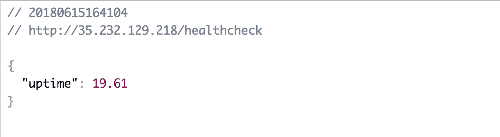
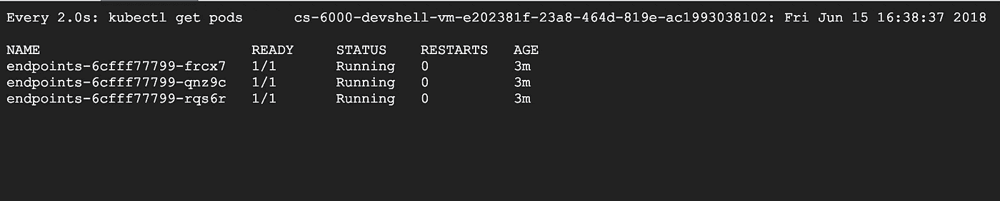
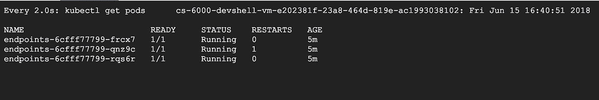

# Kubernetes:活性检查

> 原文：<https://medium.com/google-cloud/kubernetes-liveness-checks-4e73c631661f?source=collection_archive---------1----------------------->

最近，我整理了一篇关于 [Kubernetes 准备就绪探测器](/@jonbcampos/kubernetes-readiness-probe-83f8a06d33d3)以及它对您的集群有多重要的文章。如果就绪性探针在重要级别中是 9/10，则活性检查是 10/10。与就绪检查非常相似，添加这个特性非常容易。在本文中，我们将研究您的应用程序所需的代码以及您的 YAML 文件，以使这种检查成为可能。最后，我们甚至将测试我们的代码，以确保事情正如我们所期望的那样工作。


*如果你没有通读甚至没有读过本系列* *的第一部分* [*，你可能会感到困惑，对代码在哪里或者之前做了什么有疑问。记住这里假设你正在使用*](/@jonbcampos/kubernetes-day-one-30a80b5dcb29) [*GCP*](https://cloud.google.com/) *和*[*GKE*](https://cloud.google.com/kubernetes-engine/)*。我将始终提供代码和如何测试代码是按预期工作。*

[](/@jonbcampos/kubernetes-day-one-30a80b5dcb29) [## Kubernetes:第一天

### 这是 Kubernetes 帖子的必选步骤之一。如果你对 Kubernetes 感兴趣，你可能已经读过 100 本了…

medium.com](/@jonbcampos/kubernetes-day-one-30a80b5dcb29) 

# 为什么我们需要活性检查？

现在，让我们假设您已经创建了一个很棒的 Kubernetes 集群，其中许多 pod 已经根据需要进行了复制。如果其中一个吊舱遇到问题，我们需要让 Kubernetes 知道这个吊舱可以被拆除，一个新的吊舱旋转起来。活性检查通过定期检查所有的 pod 并确保它们仍然根据需要做出响应来做到这一点。如果一个 Pod 未能通过活性检查，那么 Kubernetes 可以关闭该 Pod 并旋转一个新的 Pod。如果您跳过活性检查，那么您的集群中很可能会有不健康的 pod，并且没有自动修复问题的方法。

# 服务码

对于我的例子，由于我的测试应用程序使用了 NodeJs 和 Express，我将添加一个奇妙的[Express-health check](https://www.npmjs.com/package/express-healthcheck)NPM 包来帮助完成这项繁重的工作。

[](https://www.npmjs.com/package/express-healthcheck) [## 快速健康检查

### 面向 express 的超级简单健康检查中间件

www.npmjs.com](https://www.npmjs.com/package/express-healthcheck) 

有了这个包，我们只需添加一行代码就可以响应活跃度请求。

```
// basic liveness check
**app.use('/healthcheck', require('express-healthcheck')());**
```

对于我们的测试用例，我做了进一步的工作，创建了一种方法来获得活跃度，但也将 Pod 设置为不健康。以下代码绝不会用于产品部署。你可以在这里查看所有的代码。

```
// setup
**const healthCheck = require('express-healthcheck');
let healthy = true;**// sets the Pod status to `unhealthy`
**app.use('/unhealthy', function(req, res, next){
    healthy = false;
    res.status(200).json({ healthy });
});**// returns the liveness response
**app.use('/healthcheck', healthyIntercept, healthCheck());**// function to `check` liveness
**function healthyIntercept(req, res, next){
    if(healthy){
        next();
    } else {
        next(new Error('unhealthy'));
    }
}**
```

有了 Pod 中的这段代码，我们就可以在服务器上响应我们的活性探测了。

## 我必须使用 HTTP 请求吗？

不。在 Pod 定义中，您可以使用 HTTP 请求(可能是最简单的选项)，也可以设置 TCP 探测，甚至运行命令脚本来验证您的 Pod 正在运行。你有很多选择，我只喜欢最简单的一个。

# Pod 定义

对 Pod 定义的更改非常小，只需一会儿就能完成。我们只需要说明在哪里以及如何测试 Pod 的活性。我在代码中添加了注释，以显示所有可以定制探针的地方。

```
# the liveness probe details
**livenessProbe:**
  **httpGet:** # make an HTTP request
    **port: 8080** # port to use
    **path: /healthcheck** # endpoint to hit
    **scheme: HTTP** # or HTTPS
  **initialDelaySeconds: 3** # how long to wait before checking
  **periodSeconds: 3** # how long to wait between checks
  **successThreshold: 1** # how many successes to hit before accepting
  **failureThreshold: 1** # how many failures to accept before failing
  **timeoutSeconds: 1** # how long to wait for a response
```

根据我之前提供的[吊舱/部署定义](https://github.com/jonbcampos/kubernetes-series/blob/master/partone/k8s/deployment.yaml#L40-L50)。

# 测试我们的活性探针

现在有趣的部分来了！我们现在可以启动我们的 Kubernetes 集群，部署我们的容器，并让我们的集群通过活性探测。

## 启动我们的 Kubernetes 集群

按照 [Kubernetes: Day One](/@jonbcampos/kubernetes-day-one-30a80b5dcb29) 文章中的步骤，你已经知道如何进入谷歌云平台云外壳并运行以下命令。

```
$ git clone [https://github.com/jonbcampos/kubernetes-series.git](https://github.com/jonbcampos/kubernetes-series.git)
$ cd kubernetes-series/partone/scripts
$ sh startup.sh
$ sh deploy.sh
$ sh check-endpoint.sh endpoints
```

这将启动您的 Kubernetes 集群并部署容器。当启动脚本完成时，您将拥有一切设置和 IP 地址，您可以点击查看我们的服务。从获取活性探测端点开始。为此，您可以使用浏览器并转到以下 URL。

```
https://**[your_external_ip_address]**/healthcheck
```

服务响应将让您知道该 Pod 已经运行了多长时间。



健康检查输出

在你的控制台上，你会想看下一部分的现场直播。我们将在我们的 Pod 上放置一个监视器，这样我们就可以看到 Pod 何时变得不健康并被群集取代。要添加该手表，只需输入以下命令。

```
$ watch kubectl get pods
```

当你的观察者运行时，你可以看到你的豆荚在运行，以及它们发生的任何变化。



kubectl 获取 pods 输出

## 让你的豆荚失效

我们现在将翻转开关，使我们的一个豆荚不健康。我们通过达到不健康的终点来做到这一点。

```
https://**[your_external_ip_address]**/unhealthy
```

Kubernetes 会将我们的请求路由到我们的一个 pod(我可能会在后面写如何在 pod 之间路由请求)，从而改变其中一个 pod 的状态。

观察我们的控制台输出，我们将会看到，在活性探测运行之后，我们的一个 pod 出现了故障。这可能发生得太快以至于你甚至没有注意到，但是你会注意到其中一个吊舱被重启以修复“中断”。

就这样，我们有了一个全新的健康 Pod，可以接受更多的服务请求。



用我们重启的分离舱

# 拆卸

在您离开之前，请确保清理您的项目，这样您就不会为您用来运行群集的虚拟机付费。返回到云 Shell 并运行 teardown 脚本来清理您的项目。这将删除您的集群和我们构建的容器。

```
$ cd ~/kubernetes-series/autoscaling/scripts # if necessary
$ sh [teardown.sh](https://github.com/jonbcampos/kubernetes-series/blob/master/autoscaling/scripts/teardown.sh)
```

# 关闭

本文将全面探讨 Kubernetes 的活性探测。拥有一个自我监控的 Kubernetes 集群，可以对不健康的豆荚做出反应，这是一项改变生活的技术。如果你是那种习惯于在凌晨 3 点重启虚拟机的开发运维经理，生活将会发生改变。

# 本系列的其他文章

[](/@jonbcampos/kubernetes-day-one-30a80b5dcb29) [## Kubernetes:第一天

### 这是 Kubernetes 帖子的必选步骤之一。如果你对 Kubernetes 感兴趣，你可能已经读过 100 本了…

medium.com](/@jonbcampos/kubernetes-day-one-30a80b5dcb29) [](/@jonbcampos/kubernetes-horizontal-pod-scaling-190e95c258f5) [## Kubernetes:水平 Pod 缩放

### 通过 Pod 自动扩展，您的 Kubernetes 集群可以监控现有 Pod 的负载，并确定我们是否需要更多…

medium.com](/@jonbcampos/kubernetes-horizontal-pod-scaling-190e95c258f5) [](/@jonbcampos/kubernetes-cluster-autoscaler-f1948a0f686d) [## Kubernetes:集群自动缩放

### 自动缩放是 Kubernetes 的一个巨大的(并且已经上市的)特性。当你的网站/应用程序/应用程序接口/项目变得越来越大时，洪水…

medium.com](/@jonbcampos/kubernetes-cluster-autoscaler-f1948a0f686d) [](/@jonbcampos/kubernetes-readiness-probe-83f8a06d33d3) [## Kubernetes:就绪探测

### 如果对这个特性有任何疑问，我写这篇文章是为了说明这不是一个…

medium.com](/@jonbcampos/kubernetes-readiness-probe-83f8a06d33d3) 

Jonathan Campos 是一个狂热的开发者，也是学习新事物的爱好者。我相信我们应该不断学习、成长和失败。我总是开发社区的支持者，并且总是愿意提供帮助。因此，如果你对这个故事有任何问题或意见，请在下面提出。在 [LinkedIn](https://www.linkedin.com/in/jonbcampos/) 或 [Twitter](https://twitter.com/jonbcampos) 上与我联系，并提及这个故事。