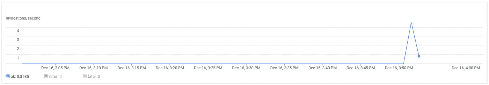
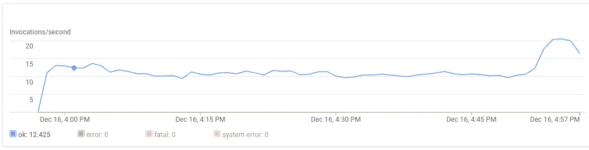
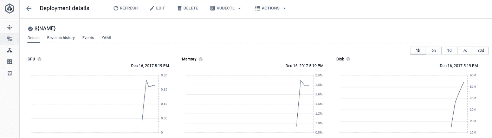
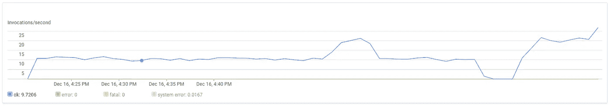
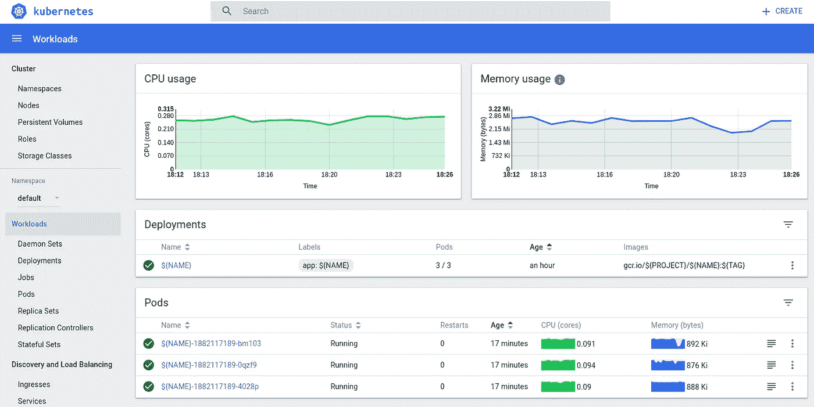

# Kubernetes 负载测试云功能

> 原文：<https://medium.com/google-cloud/kubernetes-load-testing-cloud-functions-685087f0f66e?source=collection_archive---------1----------------------->

## 许多美丽的卷发

我想对云函数施加压力。用 curl，ab 容易，用 wrk 不难。如果能够在本地进行 curl 调用、指定集群和一些约束、按需启动集群并将负载添加到端点，那就太棒了。这只是第一步…

假设您已经为 [Google Cloud Functions](https://cloud.google.com/functions) 部署了一个 HTTP 触发的函数，您可以使用以下形式的 curls 来测试它:

```
PROJECT=[YOUR-PROJECT-ID]
FUNCTION=[YOUR-FUNCTION-NAME]
TYPE="application/json"
DATA=[YOUR-DATA-FILE]
NAME=[YOUR-IMAGE-NAME] # 'curls_cloud_functions'curl \
--silent \
--request POST \
--header "Content-Type:${TYPE}" \
--data [@](http://twitter.com/payload)${DATA} \
https://us-central1-${PROJECT}.cloudfunctions.net/${FUNCTION}
```

使用 ApacheBench ('ab ')的一个等效测试是:

```
ab \
-n NUMBER_OF_TESTS_TOTAL \
-c NUMBER_OF_TESTS_CONCURRENT \
-t TIME_LIMIT_IN_SECONDS \
-p ${DATA} \
-T ${TYPE} \
https://us-central1-${PROJECT}.cloudfunctions.net/${FUNCTION}
```

云功能提供基本的监控功能:



云控制台:云功能(调用)

您还可以使用 Stackdriver Metrics Explorer 查看云函数指标。稍后我将提供一个这些指标的例子。

## busyboxplus

你们中的许多人可能都熟悉令人敬畏的 [busybox](https://busybox.net/) 和相关的 Docker [映像](https://hub.docker.com/_/busybox/)，其中包含一个小的可执行文件和许多有用的 Linux 实用程序。Busybox 不包括 curl。为此，你可以考虑 [busyboxplus](https://hub.docker.com/r/radial/busyboxplus/) 。使用 busyboxplus，我们可以运行 curl 命令，但是我们需要一种方法来访问数据文件。当使用 Kubernetes 时，我们需要一种不同的方法，但是，下面是如何使用 busyboxplus 容器并使文件可以被其中运行的 curl 访问:

```
docker run \
--interactive \
--tty \
--rm \
--volume=${PWD}/${DATA}:/${DATA} \
radial/busyboxplus curl \
  --silent \
  --request POST \
  --header "Content-Type:${TYPE}" \
  --data @${DATA} \
  [https://us-central1-${PROJECT}.cloudfunctions.net/${FUNCTION](https://us-central1-${PROJECT}.cloudfunctions.net/${FUNCTION)}
```

“volume”映射适用于本地 Docker 引擎，但不被远程 Kubernetes 集群支持。有多种方法可以让 Kubernetes pods 访问数据文件，但是探索这些替代方法并不是本文的目的。我们希望实现的是使 curl 命令的延迟最小化。因此，我将采用最简单的方法，将数据文件合并到派生的 Docker 映像中。创建 Dockerfile 文件:

```
FROM radial/busyboxplusARG dataCOPY ./${data} /data
```

为了实现这一点:

```
TAG=$(date +%y%m%d%H%M)
docker build \
--tag=gcr.io/${PROJECT}/${NAME}:${TAG} \
--build-arg data=${DATA} \
.
```

现在，我们可以在不指定本地相关卷标志的情况下运行该映像。请注意，我们还可以删除＄{ DATA }变量，因为图像现在包括了我们的“数据”文件:

```
docker run \
--interactive \
--tty \
--rm \
gcr.io/${PROJECT}/${NAME}:${TAG} curl \
  --silent \
  --request POST \
  --header "Content-Type:${TYPE}" \
  --data @/data \
  [https://us-central1-${PROJECT}.cloudfunctions.net/${FUNCTION](https://us-central1-${PROJECT}.cloudfunctions.net/${FUNCTION)}
```

## 库伯内特发动机

下一步是将这个图像推送到[谷歌容器注册(GCR)](https://cloud.google.com/container-registry/) ，这样我们就可以从[谷歌 Kubernetes 引擎](https://cloud.google.com/kubernetes-engine/)访问它。我假设您有一个正在运行的 Kubernetes(引擎)集群，并且您已经启用了 GCR:

```
gcloud docker -- push gcr.io/${PROJECT}/${NAME}:${TAG}
```

> 这些指令应该适用于任何 Kubernetes 集群(不仅仅是那些运行在 Kubernetes 引擎上的集群)，并使用任何 Docker 容器注册中心(包括 DockerHub)。这是你的选择。

现在，让我们为这个容器创建一个简单的部署。下面使用您的环境变量完成了一个部署文件，并将其应用到您当前的默认集群:

```
CMD="\
while true;
do
  curl \
  --silent \
  --request POST \
  --header \"Content-Type:${TYPE}\" \
  --data @/data ${ENDPOINT} \
  [https://us-central1-${PROJECT}.cloudfunctions.net/$](https://us-central1-dazwilkin-171214-ncr.cloudfunctions.net/parse-20171215124506'){FUNCTION};
done"echo "
apiVersion: extensions/v1beta1
kind: Deployment
metadata:
  labels:
    app: ${NAME}
  name: ${NAME}
spec:
  replicas: 1
  template:
    metadata:
      labels:
        app: ${NAME}
    spec:
      containers:
      - name: ${NAME}
        command: ['/bin/sh']
        args: ['-c','${CMD}']
        image: 'gcr.io/${PROJECT}/${NAME}:${TAG}'
" | kubectl apply --filename -
```

你会在上面看到，我已经为容器定义了一个简短的脚本。如果它运行一个单一的旋度，它会这样做，然后终止。因此，这个脚本只是在 pod 的生命周期内重复卷曲端点。

单个吊舱能够将一些负载放在整个集装箱上:



云控制台:云功能(调用)

只要部署存在，您将一直被收费。在任何时候，您都可以将 pod 的数量设置为零，以停止针对云函数运行测试。 **NB** 您将继续为该集群付费:

```
kubectl scale --replicas=0 deployment/${NAME}
```

或者，完全删除部署:

```
kubectl delete deployment/${NAME}
```

但是，如果您有钱，您也可以增加部署中的单元数量，从而增加云功能的负载:

```
kubectl scale --replicas=10 deployment/${NAME}
```

我仍然是 Kube UI 的粉丝，但也鼓励我探索 Kubernetes 引擎的工具。以下是其“工作负载”页面的输出:



云控制台:Kubernetes 引擎(工作负载)



云控制台:云功能(调用)

使用 stack driver“Metrics Explorer”，您可以选择“cloud_function”的“资源类型”，例如，“cloud functions/function/execution _ count”的指标类型:


Stackdriver:度量浏览器“云函数”

还可以过滤日志，例如，提取时间戳、执行时间和 HTTP 响应状态代码:

```
ROOT="projects/${PROJECT}/logs"
LOG="${ROOT}/cloudfunctions.googleapis.com%2Fcloud-functions"
AFTER=$(\
  date --utc --rfc-3339=ns --date='2 minutes ago' \
  | sed 's/ /T/'\
)
BEFORE=$(\
  date --utc --rfc-3339=ns \
  | sed 's/ /T/'\
)
FILTER="\
  resource.type=\"cloud_function\" \
  logName=\"${LOG}\" \
  resource.labels.function_name=\"${FUNCTION}\" \
  textPayload:\"Function execution took\" \
  timestamp>=\"${AFTER}\" \
  timestamp<=\"${BEFORE}\""
gcloud logging read "${FILTER}" \
--project=$PROJECT \
--format='value(timestamp,textPayload)'
```

旁白:为了处理这些日志中的数据，我们可以使用一个简单的 Python 脚本将带有命名捕获组的 regex 应用到每个日志行。假设您将该脚本命名为“parse.py ”,并对其进行 chmod +x 处理:

parse.py

然后，抓取[这个](https://unix.stackexchange.com/a/13779) bash 脚本，将其命名为‘stats . sh’并将其命名为 chmod +x，然后，通过这些管道输出日志:

```
gcloud logging read "${FILTER}" \
--project=$PROJECT \
--format='value(timestamp,textPayload)' \
| ./parse.py \
| ./stats.sh
```

您应该会看到类似下面的内容，其中的数字表示日志数据中执行时间的总和、计数、平均值、中间值、最低值和最高值。

```
373495 14096 26.4965 11 5 352
```

对于结合了云功能端点 URL(可能是内容类型和一些数据)的每个“测试”,我们必须:

*   建立码头工人形象
*   把它推到 GCR
*   修改 Kubernetes 部署
*   观察

有一个更好的方法来实现自动化。

## 集装箱建造商

每个使用[谷歌容器生成器](https://cloud.google.com/container-builder/)的人都称赞它。使用一个简单明了的规范，并利用一个体面的[步骤集](https://github.com/GoogleCloudPlatform/cloud-builders)(表现为 Docker 镜像)，你可以将构建迁移到 Google 云平台。

> 从技术上讲，将构成 Docker 映像步骤的流程链接在一起是 Container Builder 的核心，因此它不仅限于构建流程。

对于我们的简单用例，容器构建器可能有些多余，但是使用它可以自动完成上面描述的 3 个步骤。切入正题，这里有一个 cloudbuild.yaml:

```
steps:
- name: 'gcr.io/cloud-builders/docker'
  args: [
    'build',
      '--build-arg','data=${_DATA}',
      '--tag','gcr.io/${PROJECT_ID}/${_NAME}:${_TAG}',
      '.'
  ]
- name: 'gcr.io/cloud-builders/docker'
  args: ['push','gcr.io/${PROJECT_ID}/${_NAME}:${_TAG}']
- name: 'gcr.io/cloud-builders/kubectl'
  args: [
    'set','image','deployment','${_NAME}',
    '${_NAME}=gcr.io/${PROJECT_ID}/${_NAME}:${_TAG}'
  ]
  env:
  - 'CLOUDSDK_COMPUTE_ZONE=${_ZONE}'
  - 'CLOUDSDK_CONTAINER_CLUSTER=${_CLUSTER}'
```

您需要在使用前启用该服务:

```
gcloud services enable cloudbuild.googleapis.com --project=$PROJECT
```

此外，如果您希望容器构建器在步骤#3 中访问您的集群，您将需要将 Kubernetes 引擎开发人员角色(container.developer)添加到运行容器构建器的服务帐户，如这里的和这里的所述:

```
NUM=$(gcloud projects describe $PROJECT --format='value(projectNumber)')gcloud projects add-iam-policy-binding ${PROJECT} \
--member=serviceAccount:${[NUM}@cloudbuild.gserviceaccount.com](mailto:PROJECT@cloudbuild.gserviceaccount.com) \
--role=roles/container.developer
```

该构建配置包含 3 个步骤:

*   云构建者/对接者构建映像
*   云建设者/码头工人将图像推向 GCR
*   云构建者/kubectl 然后修改我们现有的部署

Container Builder 要求用户定义的变量以“_”为前缀，因此，例如必须将 _NAME 赋给我们的环境变量$NAME。当我们使用“替换”提交构建时，我们会这样做。

> **NB** 云构建者/kubectl 目前不支持[区域集群](https://cloud.google.com/kubernetes-engine/docs/concepts/multi-zone-and-regional-clusters#regional)。为此，您必须使用单区域集群。

唯一复杂的是 kubectl 的第三步。我们必须为这个容器提供集群的区域和名称的环境变量。否则，我们假设(！)名为＄{ NAME }的现有部署，我们使用此脚本重新创建的映像对其进行了修改。

要强制更新，您可能需要:

```
export TAG=$(date +%y%m%d%H%M)
```

此外，您还需要提供 Kubernetes 集群(名称)和区域的详细信息:

```
CLUSTER=[YOUR-CLUSTER-NAME]
ZONE=[YOUR-CLUSTER-ZONE]
```

并且，您可以使用以下方式触发构建:

```
gcloud container builds submit . \
--config=cloudbuild.yaml \
--substitutions=\
_CLUSTER=${CLUSTER},\
_DATA=${DATA},\
_NAME=${NAME},\
_TAG=${TAG},\
_ZONE=${ZONE} \
--project=$PROJECT
```

如果一切顺利，这将成功完成，您可以确认您现在正在使用此新映像运行经过修改的部署＄{ NAME },该映像包含:

```
kubectl get deployment/${NAME} \
--output=jsonpath='{.spec.template.spec.containers[0].image}'
```

并检查它是否正确，用:

```
ACTUAL=$(kubectl get deployment/${NAME} --output=jsonpath='{.spec.template.spec.containers[0].image}')
EXPECT="gcr.io/${PROJECT}/${NAME}:${TAG}"if [ ${ACTUAL} == ${EXPECT} ] 
then
  echo "Correct" 
else 
  echo "Incorrect"
fi
```



Kubernetes 用户界面

## 结论

一个稍微曲折的旅程，但希望是一个有趣的。从在本地使用 curl 命令测试云函数(或任何其他端点)扩展到为 Kubernetes 集群运行相同的 curl 命令的简单方法。

在这个过程中，我们探索了 Container Builder，将其作为简化构建过程的一种方式，即使对于这样简单的情况也是如此。

## 整理

您可以将部署设置为消耗零个 pod:

```
kubectl scale --replicas=0 deployment/${NAME}
```

您可以删除部署:

```
kubectl delete deployment/${NAME}
```

由于操作是不可撤销的，所以您可以小心地删除 Kubernetes 集群:

```
gcloud container clusters delete ${CLUSTER} \
--project=${PROJECT} \
--zone=${ZONE}
```

您可以删除整个 GCP 项目，但同样，在执行此不可恢复的步骤之前，请确保删除的是您自己的项目:

```
gcloud projects delete $PROJECT --quiet
```