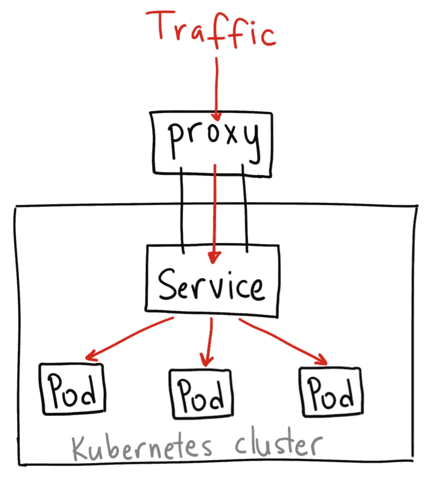
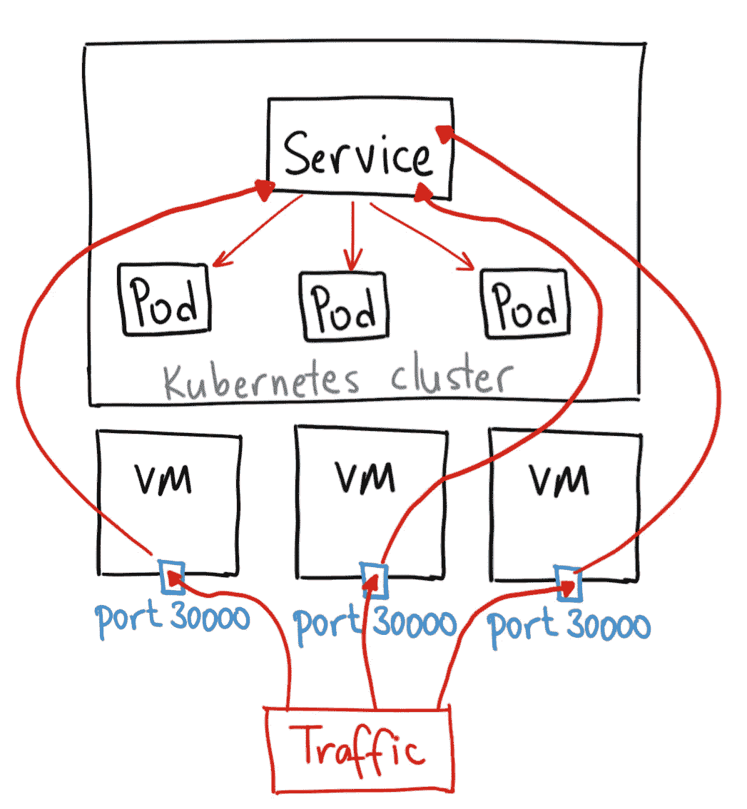
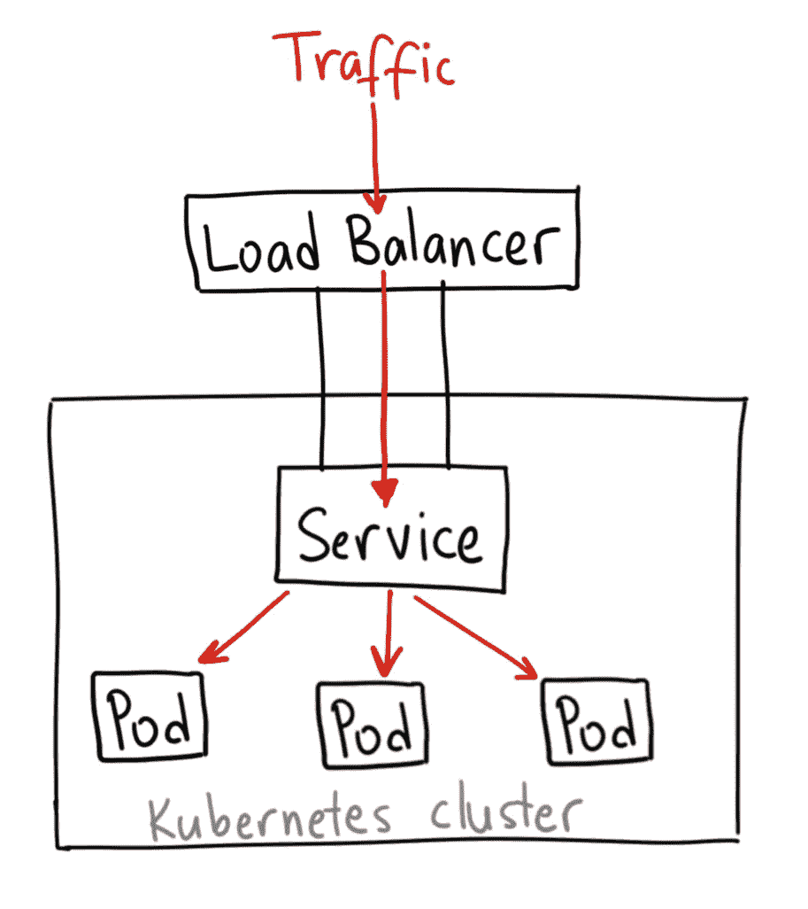
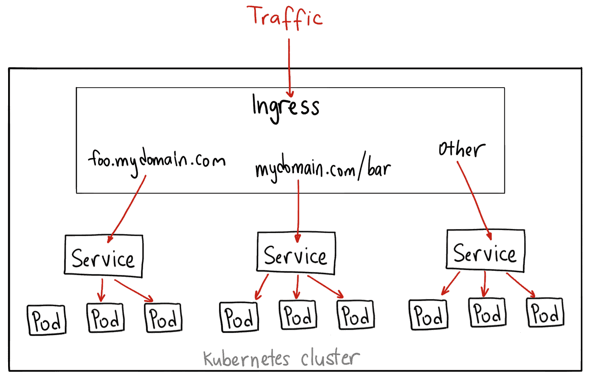

# Kubernetes 节点端口 vs 负载平衡器 vs 入口？什么时候该用什么？

> 原文：<https://medium.com/google-cloud/kubernetes-nodeport-vs-loadbalancer-vs-ingress-when-should-i-use-what-922f010849e0?source=collection_archive---------0----------------------->

最近有人问我 NodePorts，LoadBalancers，Ingress 有什么区别。它们都是将外部流量引入您的集群的不同方式，并且都是以不同的方式实现的。让我们来看看它们是如何工作的，以及何时使用它们。

***注:*** *这里的一切都适用于* [*Google Kubernetes 引擎。*](https://cloud.google.com/gke) *如果你运行在另一个云上，在 prem 上，用 minikube，或者别的什么，这些会略有不同。我也不打算深入探讨技术细节。如果你有兴趣了解更多，那么* [*官方文档*](https://kubernetes.io/docs/concepts/services-networking/service/) *是一个很棒的资源！*

# ClusterIP

ClusterIP 服务是默认的 Kubernetes 服务。它为您提供了集群内的服务，集群内的其他应用程序可以访问该服务。没有外部访问。

ClusterIP 服务的 YAML 如下所示:

```
apiVersion: v1
kind: Service
metadata:  
  name: my-internal-service
spec:
  selector:    
    app: my-app
  type: ClusterIP
  ports:  
  - name: http
    port: 80
    targetPort: 80
    protocol: TCP
```

如果您不能从互联网访问 ClusterIP 服务，我为什么要谈论它？原来您可以使用 Kubernetes 代理来访问它！



感谢 Ahmet Alp Balkan 提供的图表

启动 Kubernetes 代理:

```
$ kubectl proxy --port=8080
```

现在，您可以通过 Kubernetes API 使用这个方案来访问这个服务:

http://localhost:8080/API/v1/proxy/namespaces/<namespace>/services/<service-name>:<port-name>/</port-name></service-name></namespace>

因此，要访问我们上面定义的服务，您可以使用以下地址:

http://localhost:8080/API/v1/proxy/namespaces/default/services/my-internal-service:http/

## 你什么时候会用这个？

在一些场景中，您会使用 Kubernetes 代理来访问您的服务。

1.  调试您的服务，或者出于某种原因从您的笔记本电脑直接连接到它们
2.  允许内部流量、显示内部仪表盘等。

因为这种方法要求您以经过身份验证的用户身份运行 kubectl，所以您不应该使用这种方法将您的服务公开给 internet，或者将其用于生产服务。

# 节点端口

节点端口服务是将外部流量直接发送到您的服务的最原始的方式。顾名思义，NodePort 在所有节点(虚拟机)上打开一个特定的端口，发送到该端口的任何流量都会被转发到该服务。



这不是技术上最准确的图表，但我认为它说明了节点端口的工作原理

节点端口服务的 YAML 如下所示:

```
apiVersion: v1
kind: Service
metadata:  
  name: my-nodeport-service
spec:
  selector:    
    app: my-app
  type: NodePort
  ports:  
  - name: http
    port: 80
    targetPort: 80
    nodePort: 30036
    protocol: TCP
```

基本上，节点端口服务与普通的“ClusterIP”服务有两个不同之处。首先，类型是“节点端口”还有一个名为 nodePort 的附加端口，它指定在节点上打开哪个端口。如果你不指定这个端口，它会随机选择一个端口。大多数时候你应该让 Kubernetes 选择端口；正如 thockin 所说，有许多关于你可以使用哪些端口的警告。

## 你什么时候会用这个？

这种方法有很多缺点:

1.  每个端口只能有一个服务
2.  您只能使用 30000–32767 端口
3.  如果您节点/虚拟机 IP 地址发生变化，您需要处理它

由于这些原因，我不建议在生产中使用这种方法来直接公开您的服务。如果您正在运行一项不一定总是可用的服务，或者您对成本非常敏感，这种方法将适合您。这种应用程序的一个很好的例子是演示应用程序或临时的东西。

# 负载平衡器

负载平衡器服务是向互联网公开服务的标准方式。在 GKE，这会启动一个[网络负载平衡器](https://cloud.google.com/compute/docs/load-balancing/network/)，它会给你一个单一的 IP 地址，将所有流量转发给你的服务。



感谢 [Ahmet Alp Balkan](https://medium.com/u/2cac56571879?source=post_page-----922f010849e0--------------------------------) 提供的图表

## 你什么时候会用这个？

如果您想直接公开服务，这是默认方法。您指定的端口上的所有流量都将被转发到服务。没有过滤，没有路由等。这意味着您可以向它发送几乎任何类型的流量，如 HTTP、TCP、UDP、Websockets、gRPC 或任何其他类型的流量。

最大的缺点是，您使用负载均衡器公开的每个服务都将获得自己的 IP 地址，并且您必须为每个公开的服务支付负载均衡器，这可能会非常昂贵！

# 进入

与上述所有例子不同，入口实际上不是一种服务。相反，它位于多个服务的前面，充当“智能路由器”或进入集群的入口点。

您可以使用入口做许多不同的事情，并且有许多类型的入口控制器具有不同的功能。

默认的 GKE 入口控制器将为您启动一个 [HTTP(S)负载平衡器](https://cloud.google.com/compute/docs/load-balancing/http/)。这将允许你基于路径和子域路由到后端服务。例如，您可以将 foo.yourdomain.com 上的所有内容发送给 foo 服务，将 yourdomain.com/bar/路径下的所有内容发送给 bar 服务。



感谢 [Ahmet Alp Balkan](https://medium.com/u/2cac56571879?source=post_page-----922f010849e0--------------------------------) 提供图表

带有 [L7 HTTP 负载平衡器](https://cloud.google.com/compute/docs/load-balancing/http/)的 GKE 入口对象的 YAML 可能如下所示:

```
apiVersion: extensions/v1beta1
kind: Ingress
metadata:
  name: my-ingress
spec:
  backend:
    serviceName: other
    servicePort: 8080
  rules:
  - host: foo.mydomain.com    http:
      paths:
      - backend:
          serviceName: foo
          servicePort: 8080  - host: mydomain.com
    http:
      paths:
      - path: /bar/*
        backend:
          serviceName: bar
          servicePort: 8080
```

## 你什么时候会用这个？

Ingress 可能是公开您的服务的最强大的方法，但也可能是最复杂的。入口控制器有很多种，从[谷歌云负载平衡器](https://cloud.google.com/kubernetes-engine/docs/tutorials/http-balancer)、 [Nginx](https://github.com/kubernetes/ingress-nginx) 、 [Contour](https://github.com/heptio/contour) 、 [Istio](https://istio.io/docs/tasks/traffic-management/ingress.html) 等等。还有入口控制器插件，如 [cert-manager](https://github.com/jetstack/cert-manager) ，它可以自动为您的服务提供 SSL 证书。

如果要在同一个 IP 地址下公开多个服务，并且这些服务都使用同一个 L7 协议(一般是 HTTP)，那么 Ingress 是最有用的。如果您使用原生 GCP 集成，您只需支付一个负载均衡器，因为 Ingress 是“智能”的，您可以获得许多开箱即用的功能(如 SSL、Auth、路由等)