# 使用云市场、Kubectl CLI 和 Helm 图表将应用部署到 Google Kubernetes 引擎。

> 原文：<https://medium.com/google-cloud/kubernetes-on-gke-series-intro-8ec514c4c369?source=collection_archive---------0----------------------->

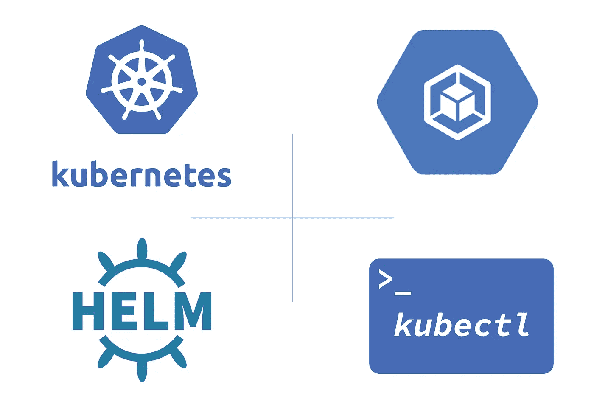

> 在本文中，您将学习如何使用 [Google Cloud Marketplace](https://cloud.google.com/marketplace) 、 [Kubectl CLI](https://kubernetes.io/docs/tasks/tools/install-kubectl/) 、 [Helm3 Charts](https://helm.sh/) 来设置和部署应用程序到[Google Kubernetes Engine(GKE](https://cloud.google.com/kubernetes-engine))集群。

*虽然这篇文章是基于容器的，但我不会谈论容器，请随意阅读 Robert John 关于什么是 Docker 容器* *的文章。
这只是为了让你尽快熟悉 GKE。
本系列的其他文章将指导您以多种方式将应用程序部署和管理到您即将创建的 GKE 集群。*

> Kubernetes(通常称为 k8s)是一个开源的容器编排系统，用于自动化应用程序部署、扩展和管理。它旨在提供一个“跨主机集群自动部署、扩展和操作应用程序容器的平台”。
> 它可以和一系列容器工具一起工作，包括 Docker。——[*维基*](https://en.wikipedia.org/wiki/Kubernetes)
> 
> 有关 Kubernetes 概念的概述，请参见 [Kubernetes 文档](https://kubernetes.io/docs/concepts/)。
> 
> Google Kubernetes 引擎 (GKE)提供了一个托管环境，用于部署、管理和扩展使用 Google 基础设施的容器化应用程序。Kubernetes 引擎环境由多台机器(具体来说是 [Google 计算引擎](https://cloud.google.com/compute)实例)组成，这些机器组合在一起形成一个[容器集群](https://cloud.google.com/kubernetes-engine/docs/concepts/cluster-architecture)。

## 先决条件

*   创建一个[谷歌云平台(GCP)项目](https://console.cloud.google.com/project)，或者使用一个现有的项目。
*   启用 [Kubernetes 引擎 API](https://console.developers.google.com/apis/api/container.googleapis.com/overview) 。
*   [安装 GCloud SDK](https://cloud.google.com/sdk/install)

## 本文的主要部分

*   [*使用云市场将就绪应用部署到 GKE*](#9808)
*   [*使用 Kubectl*](#6b83) 将容器映像部署到 GKE
*   [*使用舵图管理 GKE 上的应用*](#8f0c)

# 使用 Kubernetes 引擎进行集群编排

Kubernetes 引擎集群由开源集群管理系统提供支持。Kubernetes 提供了与容器集群交互的机制。您可以使用 Kubernetes 命令和资源来部署和管理您的应用程序，执行管理任务和设置策略，以及监控您部署的工作负载的健康状况。

当您在 GKE 上运行 Kubernetes 引擎集群时，您还会受益于 Google 云平台提供的高级集群管理功能。其中包括:

*   [计算引擎实例的负载平衡](https://cloud.google.com/compute/docs/load-balancing-and-autoscaling)。
*   [节点池](https://cloud.google.com/kubernetes-engine/docs/node-pools)指定集群中的节点子集，以提供额外的灵活性。
*   [自动扩展集群的节点实例数](https://cloud.google.com/kubernetes-engine/docs/cluster-autoscaler)。
*   [为集群的节点软件自动升级](https://cloud.google.com/kubernetes-engine/docs/node-auto-upgrade)。
*   [节点自动修复](https://google.qwiklabs.com/focuses/Node%20auto-repair%5D(https://cloud.google.com/kubernetes-engine/docs/node-auto-repair)维护节点健康和可用性。
*   [使用 Stackdriver 对集群进行日志记录和监控](https://cloud.google.com/kubernetes-engine/docs/how-to/logging)。

# 创建 Kubernetes 引擎集群

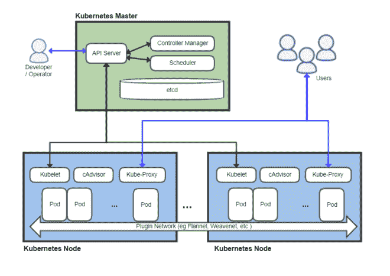

Kubernetes 聚类图(来自维基)

一个 GKE [集群](https://cloud.google.com/kubernetes-engine/docs/concepts/cluster-architecture)由至少一个*集群主*机和多个被称为*节点*的工作机组成。节点是[计算引擎虚拟机(VM)实例](https://cloud.google.com/compute/docs/instances/)，它们运行必要的 Kubernetes 进程，使它们成为集群的一部分。

*要设置 GKE 集群，* [*单击此处*](https://console.cloud.google.com/kubernetes/add) *或在 GCP 控制台上导航如下:* ***Kubernetes 引擎>集群>创建集群*** *(名称:* ***我的集群*** *，其他字段保持不变)*

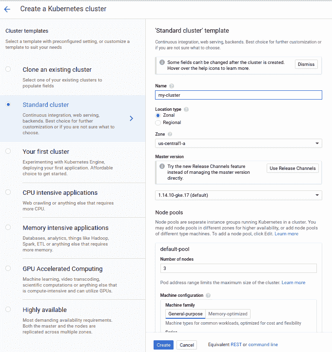

集群创建屏幕

*如果您更习惯使用 gcloud 工具，上面的等效命令如下。* *确保你已经默认* ***项目****&****区域*** *配置好了。*

```
gcloud container clusters create my-cluster
```

您的集群应该在几分钟内准备好。

# 使用云市场将就绪应用部署到 GKE

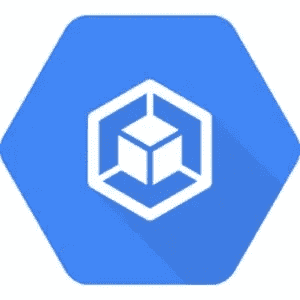

GKE

[Google Cloud Marketplace](https://cloud.google.com/marketplace) 包括容器映像和配置文件，比如一个`kubectl`配置，我们将使用它将一个 [Wordpress](https://wordpress.org/) 应用程序部署到 Google Kubernetes 引擎集群。

当您从 Google Cloud Marketplace 部署应用程序时，Kubernetes 资源会在您的集群中创建，您可以作为一个组来管理这些资源。

*要查看您可以在 GKE 集群上部署的 Kubenetes 应用程序，* [*单击此处*](https://console.cloud.google.com/kubernetes/add) *或在 GCP 控制台上导航如下:* ***market place****>Filter by****Kubenetes 应用程序***

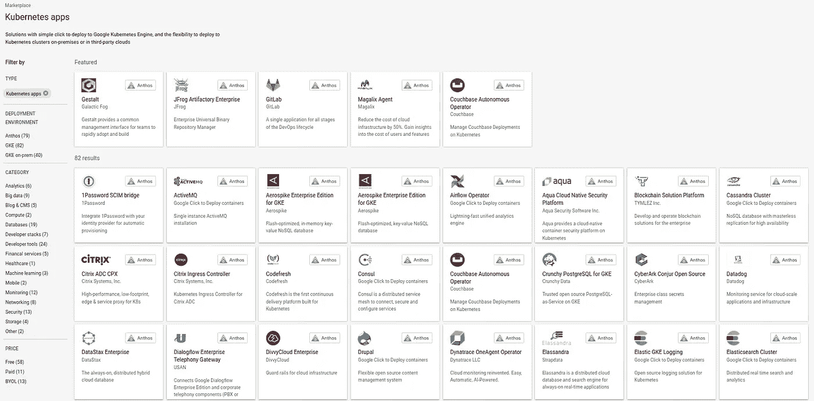

可部署在 GKE 集群上的谷歌云市场应用

搜索或选择一个应用程序，以查看其信息，包括其价格。

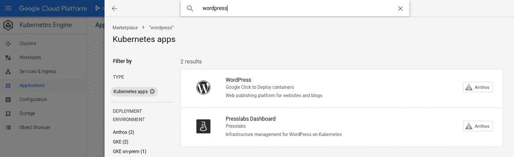

搜索 Wordpress

*点击你选择的 app>****进行配置。*** *为您的应用程序输入一个名称，然后点击* ***【部署】*** *。*

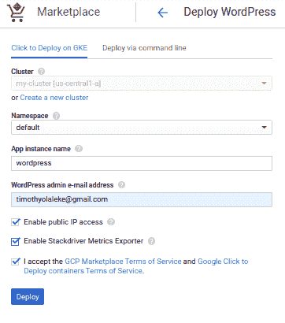

在 GKE 集群上部署应用

*您可以* ***启用公共 IP 访问*** *进行来自外部世界的可访问性，* ***启用 stack driver Metrics Exporter****进行监控，并且还要做检查* ***服务条款。***

将部署您的应用程序，并为您创建所有资源。
要管理、编辑或删除您的应用程序部署，请从 GKE 集群的**应用程序**页面进行操作。

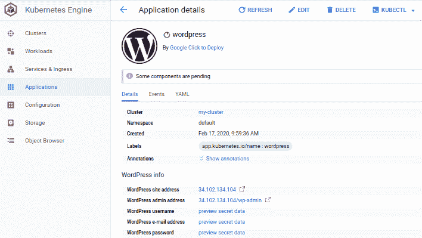

管理部署的应用程序

你可以从它的[文档](https://cloud.google.com/marketplace/docs)中了解更多关于谷歌云市场的信息。

# 使用 Kubectl 将容器映像部署到 GKE

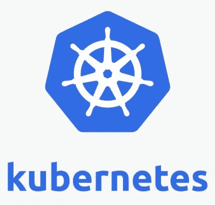

库伯内特斯

Kubectl 是一个用于控制 Kubernetes 集群的命令行工具，它允许您对 Kubernetes 集群运行命令来部署应用程序、检查和管理集群资源，或者查看日志。
我们将使用 kubectl 工具将一个容器映像部署到 Google Kubernetes 引擎集群。

GKE 使用 Kubernetes 对象来创建和管理集群的资源。Kubernetes 提供了[部署](https://cloud.google.com/kubernetes-engine/docs/concepts/deployment)对象，用于部署无状态应用程序，如 web 服务器。[服务](https://cloud.google.com/kubernetes-engine/docs/concepts/service)对象定义了从互联网访问应用程序的规则和负载平衡。

要安装 Kubectl，请遵循此处描述的[步骤。](https://kubernetes.io/docs/tasks/tools/install-kubectl/)

## 配置 kubectl

创建集群后，您需要获得身份验证凭证来与集群交互，您可以使用安装了 *kubectl* 和[g cloud](https://cloud.google.com/sdk)的命令行来完成。

*   使用以下方式登录 Gcloud:

```
gcloud auth login
```

这将打开一个浏览器窗口供您登录。如果您还没有设置默认项目，也可以设置一个默认项目。

*   要配置 kubectl 来管理您的 GKE 集群，请执行:

```
gcloud container clusters get-credentials my-cluster
```

*其中****my-cluster****是您之前创建的集群的名称。*

## 创建部署

在这一步中，您将通过编写 YAML 配置，使用 *kubectl* 命令和**而不是**命令来创建部署。

*要在您的 GKE 集群上创建一个新的部署，运行以下命令:*

```
kubectl create deployment hello-server — image=gcr.io/google-samples/hello-app:1.0
```

*该命令在您配置的集群上创建一个名为****hello-server****的部署。部署的 Pod 运行****hello-app****容器映像。* 通过跑步检查跑步吊舱:

```
kubectl get pods
```

## 公开部署

您需要将它公开到互联网上，以便用户可以访问它。您可以通过创建一个服务来公开您的应用程序，这个服务是一个 Kubernetes 资源，它将您的应用程序公开给外部流量。

*要在您的 GKE 集群上创建新服务，请运行以下命令:*

```
kubectl expose deployment hello-server — type=LoadBalancer — port 8080
```

通过运行以下命令检查`hello-server`服务:

```
kubectl get service hello-server
```

*生成外部 IP 地址可能需要几分钟时间。如果外部 IP 列处于“挂起”状态，请再次运行上述命令。*

要了解更多关于 Kubectl 的信息，请查看 kubectl 的概述。

# 使用舵图管理 GKE 上的应用程序

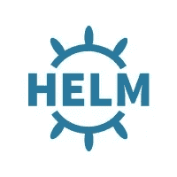

舵

Helm 被描述为“Kubernetes 的包管理器”，它是一个管理在 Kubernetes 集群管理器中运行的应用程序的工具。Helm 提供了一组对管理应用程序有用的操作，例如:检查、安装、升级和删除。我们将使用 Helm 将应用程序部署到 Google Kubernetes 引擎集群。

Helm 提供了与您可能已经熟悉的许多包管理器相同的基本特性集，例如 Debian 的 apt 或 Python 的 pip。舵能:安装软件。自动安装软件依赖项。升级软件。配置软件部署。从存储库中获取软件包

## 舵图

Helm charts 是预先配置的 Kubernetes 资源包，可以随时部署。它包括描述应用程序的元数据，以及按照标准 Kubernetes 原语操作应用程序所需的基础设施。每个图表引用一个或多个(通常是 Docker 兼容的)容器映像，这些映像包含要运行的应用程序代码。

*安装舵 v3。x，运行以下命令，或者检查出* [*文档*](https://helm.sh/) *:*

```
curl https://raw.githubusercontent.com/kubernetes/helm/master/scripts/get-helm-3 > get_helm.sh
chmod 700 get_helm.sh
./get_helm.sh
```

[Helm Hub](https://hub.helm.sh) 存储库包含 Helm 托管的分布式公共存储库搜索的文档和一些配置。

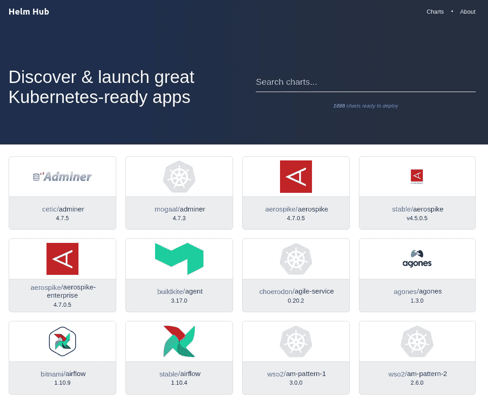

舵毂

你可以使用 Helm Chart 安装一个 [Wordpress](https://wordpress.org) 应用程序。你可以搜索 Wordpress 掌舵图，选择 *bitnami/wordpress* 。

*要添加* [*Bitnami Helm 图表库*](https://kubeapps.com/charts/search?q=bitnami) *以便使用 install Wordpress，您需要运行以下命令:*

```
helm repo add bitnami [https://charts.bitnami.com/bitnami](https://charts.bitnami.com/bitnami)
```

*要验证存储库是否已添加，请运行命令:*

```
helm repo list
```

*要安装 Wordpress 图表到 Helm，运行命令:*

```
helm install myblog bitnami/wordpress --version 8.1.4 --set wordpressUsername=admin,wordpressPassword=password
```

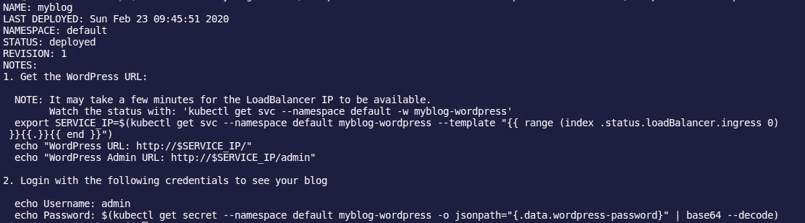

输出

这个图表使用 [Helm](https://helm.sh/) 包管理器在您的 [Kubernetes](http://kubernetes.io/) 集群上启动一个 [WordPress](https://github.com/bitnami/bitnami-docker-wordpress) 部署。

它还打包了 Bitnami MariaDB 图表，这是为 WordPress 应用程序的数据库需求引导 MariaDB 部署所必需的。

上面的命令还将 WordPress 管理员帐户的用户名和密码分别设置为`admin`和`password`。你可以在这里了解更多关于 Bitnami Wordpress 图表及其配置参数[。](https://hub.helm.sh/charts/bitnami/wordpress)

要获取部署的应用程序的 IP 地址，您可以运行以下命令:

```
kubectl get service myblog-wordpress
```

*注意这是*<application _ name>-WordPress *的形式。您也可以访问外部 IP 或使用之前使用的用户名和密码登录* < IP > /admin*。*

您还可以导航到 **Kubernetes 引擎>服务&入口**并查看您的应用程序运行情况。如下图所示。

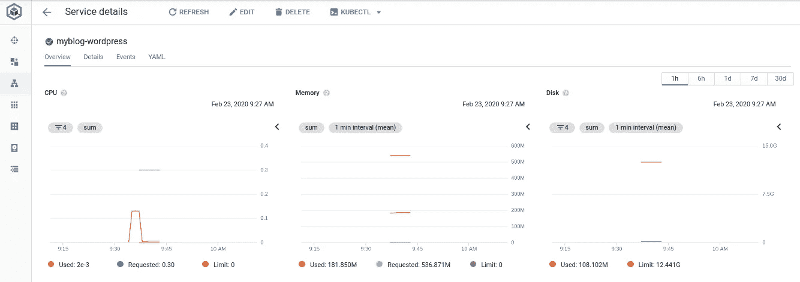

要卸载应用程序，您需要运行以下命令:

```
*helm delete* command
```

*请注意，与该版本相关的所有 Kubernetes 资源都将被删除。*

要了解更多关于 Helm 的信息，请访问它的[文档](https://helm.sh/docs/)。

# 有用的链接

*   [牛逼的 Kubernetes](https://github.com/ramitsurana/awesome-kubernetes)
*   [Kubernetes 文档](https://kubernetes.io/docs/)
*   [谷歌 Kubernetes 引擎文档](https://cloud.google.com/kubernetes-engine/docs)