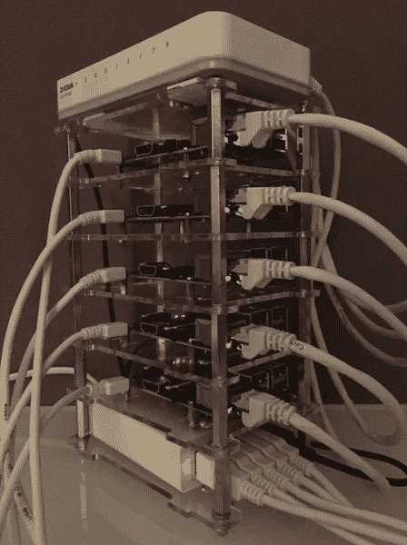
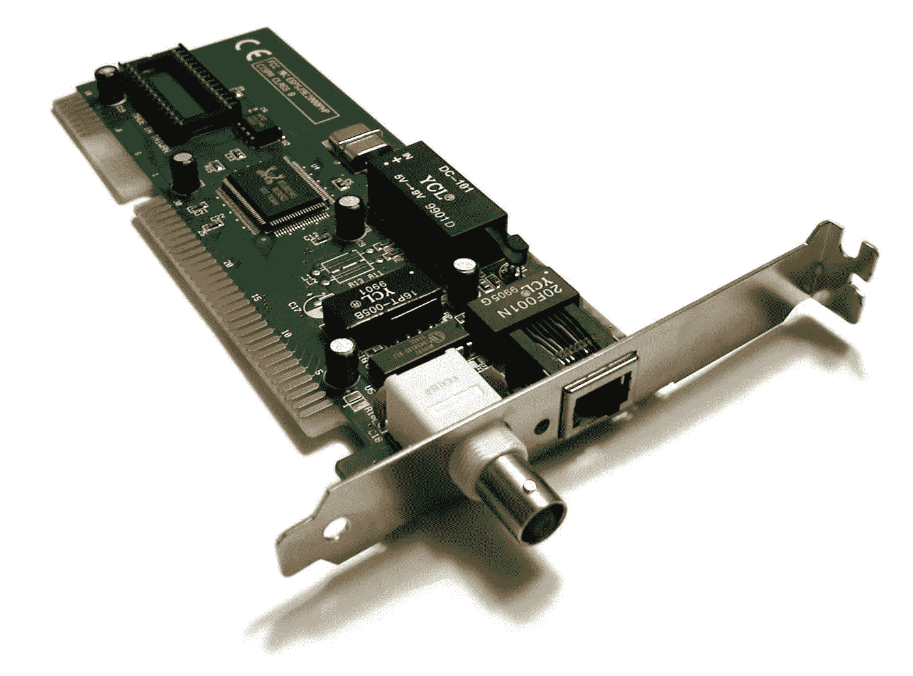

# Kubernetes 树莓 Pi 集群—故事

> 原文：<https://medium.com/google-cloud/kubernetes-raspberry-pi-cluster-the-story-ace773cf8573?source=collection_archive---------1----------------------->

我在世界各地旅行并参加许多会议。2015 年 11 月，我在 [J-Fall](http://www.nljug.org/jfall/2015/) 与 Spring Boot、容器和 Kubernetes 谈到了[基于 Java 的微服务。会议结束后，我在展厅里走了一圈，在一个展台上看到了这个:](http://www.nljug.org/jfall/session/java-based-microservices-containers-kubernetes-how/173/)

JFall 的 Quintor's Raspberry Pi 集群

我站在那里盯着它看了将近一个小时。我被闪烁的灯光、电缆以及每个组件如何完美地装配在一起迷住了。这让我想起了我曾经组装电脑的时候，用古老的网络软件和硬件将它们连接在一起，就像这样:

一张 10Base2 网卡，[Photo](https://commons.wikimedia.org/wiki/File:Network_card.jpg)BY helix 84/[CC BY](https://creativecommons.org/licenses/by-sa/3.0/deed.en)

我记得从一个房间到另一个房间的物理电缆，然后是能够从一台计算机向另一台计算机发送文本信息的兴奋。

当我看到 Raspberry Pi 集群时，我意识到我不再玩硬件和真正的物理机器集群了。现在，我只用一台笔记本电脑，它通过 Wi-Fi 连接到世界各地！我意识到 Raspberry Pi 集群可能是我曾经使用过的集群的现代版本，但是更便宜、更小。

当今的数据中心极其复杂。他们需要提供高度可用和容错的服务，并且他们需要回答这个问题:当某个硬件出现故障时会发生什么，您如何优雅地处理这些故障？

谷歌创造了 Kubernetes——一个开源的容器编排工具。它是基于谷歌内部工具 Borg 的经验而创建的。

> Borg 是“一个集群管理器，它运行来自成千上万个不同应用程序的成千上万个任务，跨越数个集群，每个集群有成千上万台机器。”— [在 Google 使用 Borg 进行大规模集群管理](http://research.google.com/pubs/pub43438.html)

使用 Kubernetes，用户可以轻松地将一个应用程序的多个实例调度到一个机器集群上。如果一个应用程序实例死亡，Kubernetes 可以自动重启该实例。更重要的是，如果集群中的一台物理机器出现故障，Kubernetes 会自动将该机器上的工作重新调度到另一台健康的机器上。

然后我想，如果我们可以使用 Kubernetes 来管理这个树莓 Pi 集群，那就太好了——这样我们就可以玩真正的混沌猴子了！我们可以在这个集群上运行一些服务，拉一些电缆，然后查看集群如何运行以及应用程序如何响应。当然，您也许可以在云中模拟这种情况——但是我喜欢拉物理电缆！

Arjen Wassink 是 Quintor 的团队负责人，他构建了 J-Fall 上展示的 Raspberry Pi 集群。我把这个想法告诉了 Arjen，几天后，Arjen 和他的团队在他们的 Raspberry Pi 集群上安装了 Kubernetes。几天后，我们在比利时 Devoxx 展示了它，非常有趣！

我们谈话的简短版本

你也可以自己做一个！阅读[你需要知道的关于 Kubernetes Raspberry Pi 集群的一切](/google-cloud/everything-you-need-to-know-about-the-kubernetes-raspberry-pi-cluster-2a2413bfa0fa#.vja37pwnl)，找到硬件、软件、网络配置和演示软件安装说明。

最后但同样重要的是，您也可以在云中运行 Kubernetes！运行 Kubernetes 集群最简单的方法之一是使用[谷歌容器引擎](https://cloud.google.com/container-engine/)。试试看！