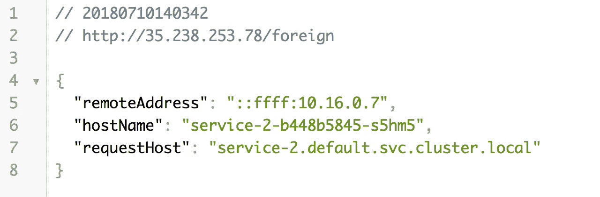

# Kubernetes:通过 FQDN 路由内部服务

> 原文：<https://medium.com/google-cloud/kubernetes-routing-internal-services-through-fqdn-d98db92b79d3?source=collection_archive---------1----------------------->


由[杰森·罗斯韦尔](https://unsplash.com/@jasonrosewell?utm_source=medium&utm_medium=referral)在 [Unsplash](https://unsplash.com?utm_source=medium&utm_medium=referral) 上拍摄的照片

我记得当我第一次进入 Kubernetes 时。一切都是崭新的、闪亮的、有规模的。当我继续开发在 Kubernetes 上运行的云原生应用程序时，我发现有一小段文字说 Kubernetes 有一个内置的 DNS 服务器。

当然了，这很有道理。

但是现在有了内置的 DNS 服务器，这就带来了很多机会。在我们的集群内以新的复杂方式路由和屏蔽路由。

在本文中，我们将了解如何在集群内定制路由，以简化集群间的通信。

*如果你还没有通读或者甚至没有阅读过本系列* *的第一部分，你可能会感到困惑，对代码在哪里或者之前做了什么有疑问。记住这里假设你正在使用*[](https://cloud.google.com/)**和*[](https://cloud.google.com/kubernetes-engine/)**。我将始终提供代码和如何测试代码是按预期工作。***

**[](/google-cloud/kubernetes-day-one-30a80b5dcb29) [## Kubernetes:第一天

### 这是 Kubernetes 帖子的必选步骤之一。如果你对 Kubernetes 感兴趣，你可能已经读过 100 本了…

medium.com](/google-cloud/kubernetes-day-one-30a80b5dcb29) 

# 通过 FQDN 路由内部服务看起来像什么？

当调用外部服务时，您可能习惯于编写完全限定的域名(FQDN)，如下所示。

```
**// FQDN = some.url.com
// port = 80
// endpoint =  /service**

http.get(**'some.url.com/service'**, (response) => {
   //simplified
   res.status(200).json(response);
});
```

但是，当您在集群中发出请求时，您希望它如何工作？pod 是短暂的，因此 URL 会随着 pod 的创建和销毁而频繁更改。不是解决方案。

您可以使用由服务公开的负载平衡器提供的外部 URL。但是那样的话，你就多做了一次跳跃，浪费了时间和处理。

如果我们想要与我们的其他服务进行通信而不进行不必要的跳跃，那么您只需要使用 Kubernetes 内置的内部通信方案。查看部分服务 yaml 文件，我们可以提取 FQDN 的值。

```
apiVersion: v1
kind: Service # a way for the outside world to reach the Pods
metadata:
  # any Pods with matching labels are included in this Service
  name: **service-1 # service name**
spec:
  # Service ports
  ports:
```

对于此服务，根据服务名称，FQDN 将是:

```
**service-1**.default.svc.cluster.local
```

其他部分呢？

```
service-1.**default**.svc.cluster.local
```

这是我们针对的 pod 的名称空间。因为我没有设置名称空间，所以名称空间是`default`。

您也可以通过移除`svc.cluster.local`来缩短 FQDN。留给你:

```
service-1.default
```

# 为什么在您的应用中使用 FQDN 路由？

正如您将从下面提供的示例中看到的，将参数化路由插入到您的应用程序中非常简单。这对于 Kubernetes 非常有用，因为您可能希望根据环境或其他规则进行稍微不同的路由。

# 运行 FQDN 国内航线

我创建了一个示例项目来突出这个特性。对于这个例子，我使用了 [pod 环境变量和一个应用程序来将必要的变量注入到应用程序](https://github.com/jonbcampos/kubernetes-series/blob/6c00cc949d56604ff557ba3c73ce98125143a962/communication/k8s/deployment_1.yaml#L52-L65)中，这样我们就可以看到一个服务如何调用另一个服务。

```
- name: **FOREIGN_SERVICE**
  value: **service-2.default.svc.cluster.local**
- name: **FOREIGN_PATH**
  value: **/service-2**
```

在[应用程序代码中，值被注入以定制代码](https://github.com/jonbcampos/kubernetes-series/blob/master/communication/routes.js#L48-L61)。

```
router.get('**/foreign**', function (req, res, next) {
    const url = **config.get('FOREIGN_SERVICE') +    config.get('FOREIGN_PATH')**;
    http.get(url, response => {
        let data = '';
        response.on('data', chunk => {
            data += chunk;
        });
        response.on('end', () => {
            res.status(200).json(JSON.parse(data));
        });
    }).on('error', err => {
        throw err;
    });
});
```

在这段代码中，我使用`service-1`通过`/foreign`端点调用`service-2`。我还设置了反向，以便`service-2`可以呼叫`service-1`。您可以通过在 Cloud Shell 中运行以下命令来运行代码。

```
$ git clone [https://github.com/jonbcampos/kubernetes-series.git](https://github.com/jonbcampos/kubernetes-series.git)
$ cd ~/kubernetes-series/communication/scripts
$ sh [startup.sh](https://github.com/jonbcampos/kubernetes-series/blob/master/communication/scripts/startup.sh)
$ sh [deploy.sh](https://github.com/jonbcampos/kubernetes-series/blob/master/communication/scripts/deploy.sh)
$ sh [check-endpoint.sh](https://github.com/jonbcampos/kubernetes-series/blob/master/communication/scripts/check-endpoint.sh) service-1
```

这将为准备就绪的`service-1`产生一个 IP 地址。如果点击`/foreign`终点，您将看到以下结果。

`http://[service-1 IP Address]/foreign`



您将看到`service-1`直接调用`service-2`就像访问任何其他端点一样简单。这种奇妙的魔法让构建微服务变得更加容易。

# 拆卸

在您离开之前，请确保清理您的项目，这样您就不会为您用来运行群集的虚拟机付费。返回到云 Shell 并运行 teardown 脚本来清理您的项目。这将删除您的集群和我们构建的容器。

```
$ cd ~[/kubernetes-series/communication/scripts](https://github.com/jonbcampos/kubernetes-series/tree/master/communication/scripts) # if necessary
$ sh [teardown.sh](https://github.com/jonbcampos/kubernetes-series/blob/master/communication/scripts/teardown.sh)
``` 

# **本系列的其他文章**

**[](/google-cloud/kubernetes-cluster-autoscaler-f1948a0f686d) [## Kubernetes:集群自动缩放

### 自动缩放是 Kubernetes 的一个巨大的(并且已经上市的)特性。当你的网站/应用程序/应用程序接口/项目变得越来越大时，洪水…

medium.com](/google-cloud/kubernetes-cluster-autoscaler-f1948a0f686d) [](/@jonbcampos/kubernetes-horizontal-pod-scaling-190e95c258f5) [## Kubernetes:水平 Pod 缩放

### 通过 Pod 自动扩展，您的 Kubernetes 集群可以监控现有 Pod 的负载，并确定我们是否需要更多…

medium.com](/@jonbcampos/kubernetes-horizontal-pod-scaling-190e95c258f5) [](https://itnext.io/kubernetes-readiness-probe-83f8a06d33d3) [## Kubernetes:就绪探测

### 如果对这个特性有任何疑问，我写这篇文章是为了说明这不是一个…

itnext.io](https://itnext.io/kubernetes-readiness-probe-83f8a06d33d3) [](/@jonbcampos/kubernetes-liveness-checks-4e73c631661f) [## Kubernetes:活性检查

### 最近，我整理了一篇关于 Kubernetes 就绪性调查以及它对您的集群有多重要的文章…

medium.com](/@jonbcampos/kubernetes-liveness-checks-4e73c631661f) 

Jonathan Campos 是一个狂热的开发者，也是学习新事物的爱好者。我相信我们应该不断学习、成长和失败。我总是开发社区的支持者，并且总是愿意提供帮助。因此，如果你对这个故事有任何问题或意见，请在下面提出。在 [LinkedIn](https://www.linkedin.com/in/jonbcampos/) 或 [Twitter](https://twitter.com/jonbcampos) 上与我联系，并提及这个故事。**