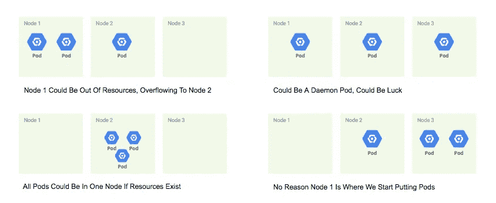
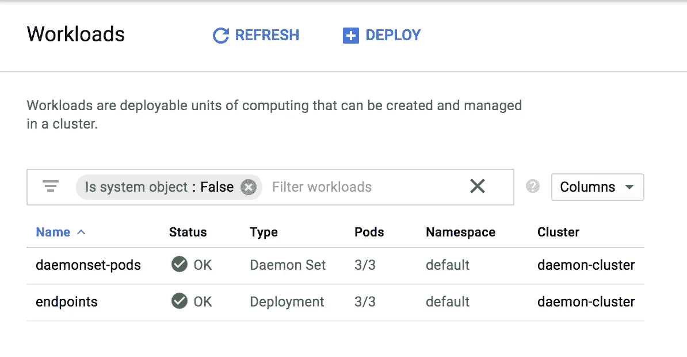
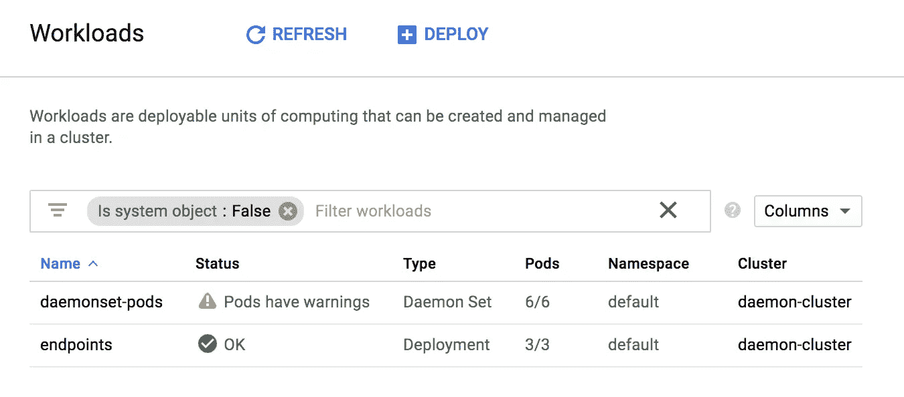
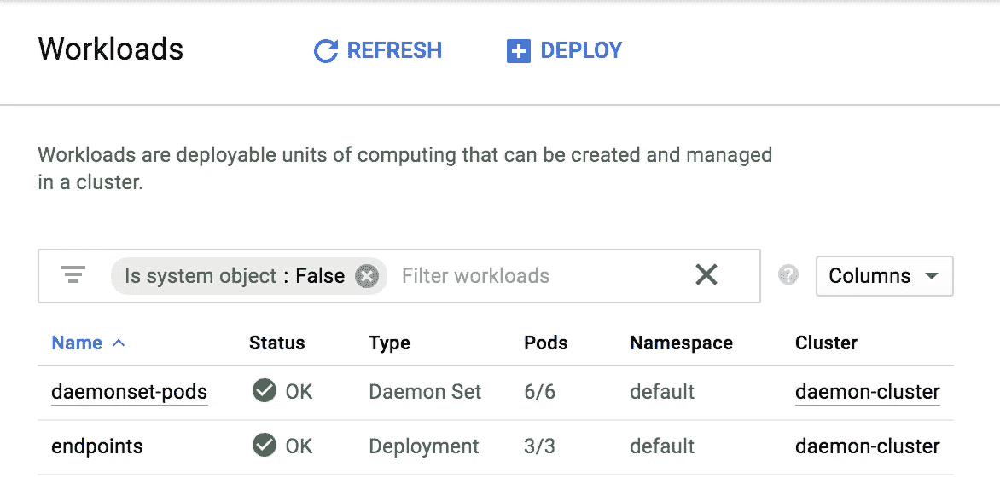

# Kubernetes:用守护进程集在每个节点上运行一个 Pod

> 原文：<https://medium.com/google-cloud/kubernetes-run-a-pod-per-node-with-daemon-sets-f77ce3f36bf1?source=collection_archive---------0----------------------->

我最初给这篇文章起的名字是“守护进程集”,并假设它足以让任何对阅读感兴趣的人理解这一点。但是很快我回想起我第一次在 Kubernetes 文档中看到 Daemon Sets 的时候，想起了我自己的好奇心和对这个主题的矛盾心理。然而，在某些情况下，守护进程集将使您摆脱非常特定的束缚。让我们探索更多。

所以现在我们已经知道 Kubernetes 是在节点上运行的 pod 的混合物。很简单。但是，不保证一个 pod 将运行在哪个节点上，也不保证 pod 在节点上的间距是一致的。



没有节点到豆荚的承诺…直到恶魔集

如果您需要将一个 Pod 与一个节点进行一对一绑定(例如**监控或记录** Pod ),那么您如何保证会有必要的 Pod 到节点布局呢？守护进程集，就是这样。守护进程集为创建的每个节点创建一个 Pod。因此，如果一个新节点启动，守护进程集的 Pod 也将在该节点上运行。如果删除了一个节点，属于该节点的守护程序集的 pod 也会被删除。

让我们来看看如何定义一个守护进程集，并看看它是如何工作的。

*如果您没有通读甚至没有阅读过本系列* *的第一部分，您可能会对这段代码在哪里或者之前做了什么产生疑问。记住这里假设你正在使用*[](https://cloud.google.com/)**和*[](https://cloud.google.com/kubernetes-engine/)**。***

**[](/google-cloud/kubernetes-day-one-30a80b5dcb29) [## Kubernetes:第一天

### 这是 Kubernetes 帖子的必选步骤之一。如果你对 Kubernetes 感兴趣，你可能已经读过 100 本了…

medium.com](/google-cloud/kubernetes-day-one-30a80b5dcb29) 

# 创建 Kubernetes 守护进程集

如果你通读了我的其他一些帖子(你应该！)，下面这个 yaml 文件在别人看来是很熟悉的。您会注意到`.metadata`部分，就像您之前看到的一样，还有`.spec`部分。让守护进程与众不同的是`.kind`参数。如果设置为`Daemon Set`，那么 Kubernetes 将在您的 Kubernetes 集群中的每个节点下自动创建`.spec.template`中描述的 Pod。

```
**apiVersion: apps/v1
kind: DaemonSet** # it is a daemonset
**metadata:
  name: daemonset-pods** # name of the daemon set
  **labels:**
    # any Pods with matching labels are included in this Daemon Set
    **app: kubernetes-series
    tier: monitor**
**spec:
  selector:**
    # Pods will match with the following labels
    **matchLabels:
      name: daemonset-pods
  template:**
    # Pod Template
    **metadata:**
      # Pod's labels
      **labels:
        name: daemonset-pods
    spec:**
      # the container(s) in this Pod
      **containers:
        - name: daemon-container
          image: gcr.io/PROJECT_NAME/daemon-container-daemon:latest**
          # environment variables for the Pod
          env:
          **- name: GCLOUD_PROJECT
            value: PROJECT_NAME
          ports:
          - containerPort: 80**
```

# Kubernetes 守护进程开始运行

为了测试 DaemonSet，我们将从创建我们的 Kubernetes 集群开始，正如我们在以前的许多文章中所做的那样。以下脚本在您的 Google Cloud Shell 中运行时，将创建一个 Kubernetes 集群，并将守护进程集 yaml 文件部署到您的集群。

```
$ git clone [https://github.com/jonbcampos/kubernetes-series.git](https://github.com/jonbcampos/kubernetes-series.git)
$ cd [~/kubernetes-series/daemon/scripts](https://github.com/jonbcampos/kubernetes-series/tree/master/daemon/scripts)
$ sh [startup.sh](https://github.com/jonbcampos/kubernetes-series/blob/master/daemon/scripts/startup.sh)
$ sh [deploy.sh](https://github.com/jonbcampos/kubernetes-series/blob/master/daemon/scripts/deploy.sh)
$ sh [check-endpoint.sh](https://github.com/jonbcampos/kubernetes-series/blob/master/daemon/scripts/check-endpoint.sh) endpoints
```

值得注意的是，这是 Kubernetes 中的一个 3 节点集群。这很重要，因为一旦您运行部署脚本，您就可以在您的`GCP Kubernetes > Workloads`视图中看到您将部署一个名为`daemonset-pods`的守护程序集 Pod，具体来说是其中的 3 个。



部署在 3 个节点上的 3 个 daemon set-pod

现在，我创建了一个非常粗糙的脚本，通过 X 个节点来扩展集群。您可以这样运行该脚本:

```
$ cd [~/kubernetes-series/daemon/scripts](https://github.com/jonbcampos/kubernetes-series/tree/master/daemon/scripts)
$ sh [scale.sh](https://github.com/jonbcampos/kubernetes-series/blob/master/daemon/scripts/scale.sh) **3** # scale up by 3 nodes
```

这个脚本添加了一个名为`my-pool`的节点池，并告诉节点池向集群添加 X 个(本例中为 3 个)节点。如果您返回到您的工作流视图，您会立即看到新节点正在旋转…守护程序集的窗格也是如此。



最多可旋转 6 个节点和单元

在一切准备就绪后，我们的 Kubernetes 集群正式处于 6 个节点，有 6 个守护程序集单元，仍然是原来的 3 个`endpoints`单元。



6/6 节点到机架

# 结论

看到 Kubernetes 如此轻松地处理一个问题，同时让您能够灵活地解决特定于您的应用程序的问题，总是一件美妙的事情。现在，您可以看到如何基于节点调度 Pod，而不是 Kubernetes 默认的随机的 Pod 到节点分配。

# 拆卸

在您离开之前，请确保清理您的项目，这样您就不会为您用来运行群集的虚拟机付费。返回到云 Shell 并运行 teardown 脚本来清理您的项目。这将删除您的集群和我们构建的容器。

```
$ cd [~/kubernetes-series/daemon/scripts](https://github.com/jonbcampos/kubernetes-series/tree/master/daemon/scripts)
$ sh [teardown.sh](https://github.com/jonbcampos/kubernetes-series/blob/master/daemon/scripts/teardown.sh)
``` 

# **本系列的其他文章**

**[](/google-cloud/kubernetes-cron-jobs-455fdc32e81a) [## 库伯内特:克朗·乔布斯

### 有时候你的工作不是事务性的。我们不再等待用户点击按钮让系统亮起来…

medium.com](/google-cloud/kubernetes-cron-jobs-455fdc32e81a) [](/google-cloud/kubernetes-dns-proxy-with-services-d7d9e800c329) [## Kubernetes:带服务的 DNS 代理

### 构建应用程序时，通常需要与外部服务进行交互来完成业务…

medium.com](/google-cloud/kubernetes-dns-proxy-with-services-d7d9e800c329) [](/google-cloud/kubernetes-routing-internal-services-through-fqdn-d98db92b79d3) [## Kubernetes:通过 FQDN 路由内部服务

### 我记得当我第一次进入 Kubernetes 时。一切都是崭新的、闪亮的、有规模的。当我继续的时候…

medium.com](/google-cloud/kubernetes-routing-internal-services-through-fqdn-d98db92b79d3) [](/google-cloud/kubernetes-horizontal-pod-scaling-190e95c258f5) [## Kubernetes:水平 Pod 缩放

### 通过 Pod 自动扩展，您的 Kubernetes 集群可以监控现有 Pod 的负载，并确定我们是否需要更多…

medium.com](/google-cloud/kubernetes-horizontal-pod-scaling-190e95c258f5) [](https://itnext.io/kubernetes-readiness-probe-83f8a06d33d3) [## Kubernetes:就绪探测

### 如果对这个特性有任何疑问，我写这篇文章是为了说明这不是一个…

itnext.io](https://itnext.io/kubernetes-readiness-probe-83f8a06d33d3) [](/@jonbcampos/kubernetes-liveness-checks-4e73c631661f) [## Kubernetes:活性检查

### 最近，我整理了一篇关于 Kubernetes 就绪性调查以及它对您的集群有多重要的文章…

medium.com](/@jonbcampos/kubernetes-liveness-checks-4e73c631661f) 

Jonathan Campos 是一个狂热的开发者，也是学习新事物的爱好者。我相信我们应该不断学习、成长和失败。我总是开发社区的支持者，并且总是愿意提供帮助。因此，如果你对这个故事有任何问题或意见，请在下面提出。在 [LinkedIn](https://www.linkedin.com/in/jonbcampos/) 或 [Twitter](https://twitter.com/jonbcampos) 上与我联系，并提及这个故事。**