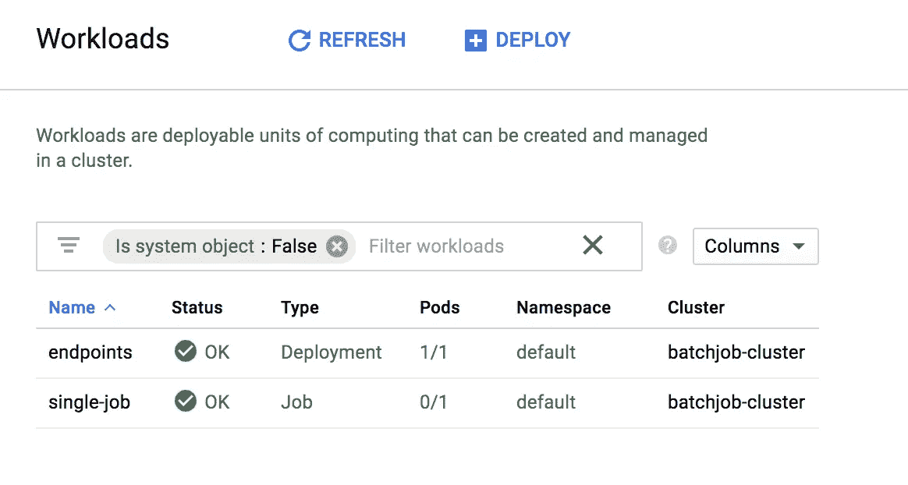
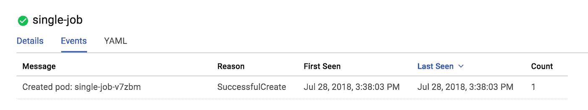
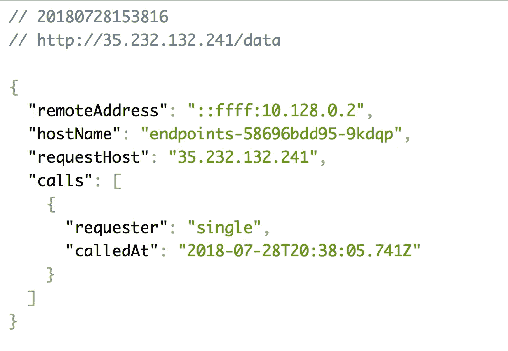
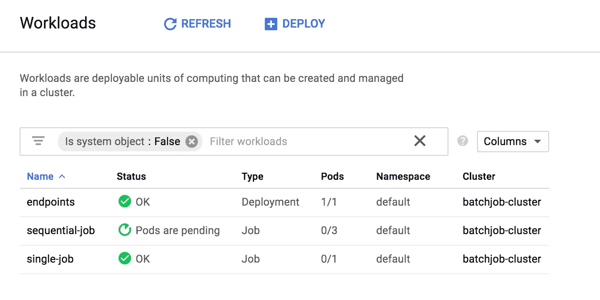
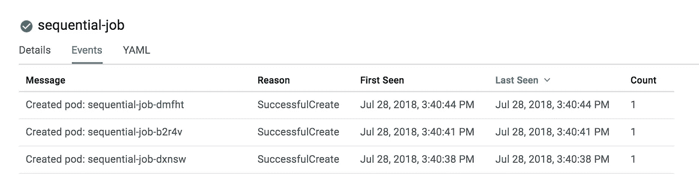
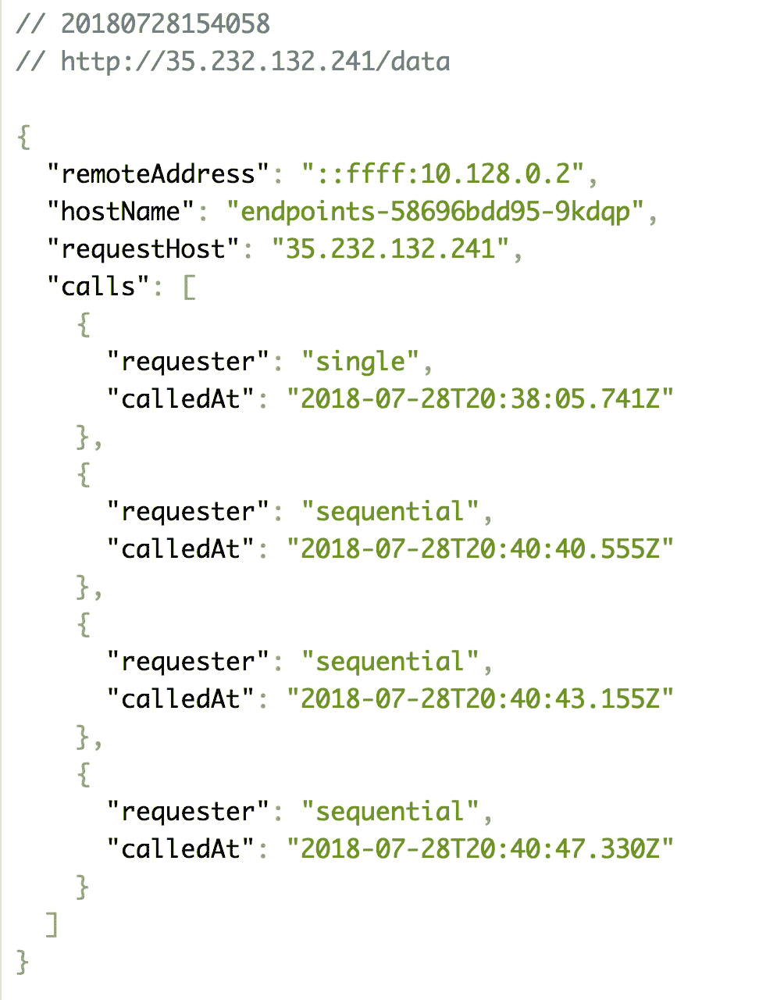
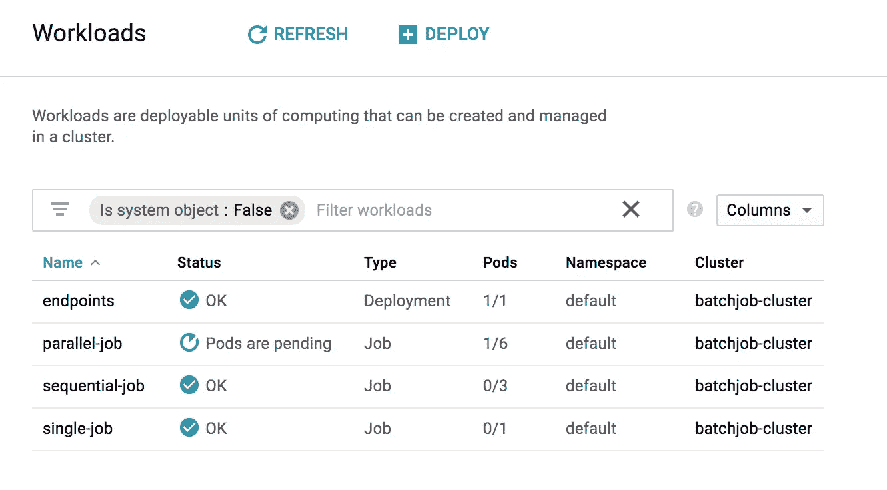
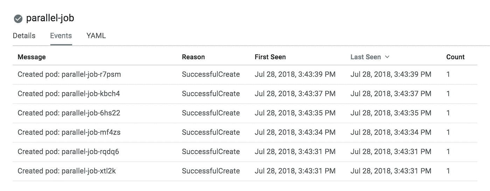
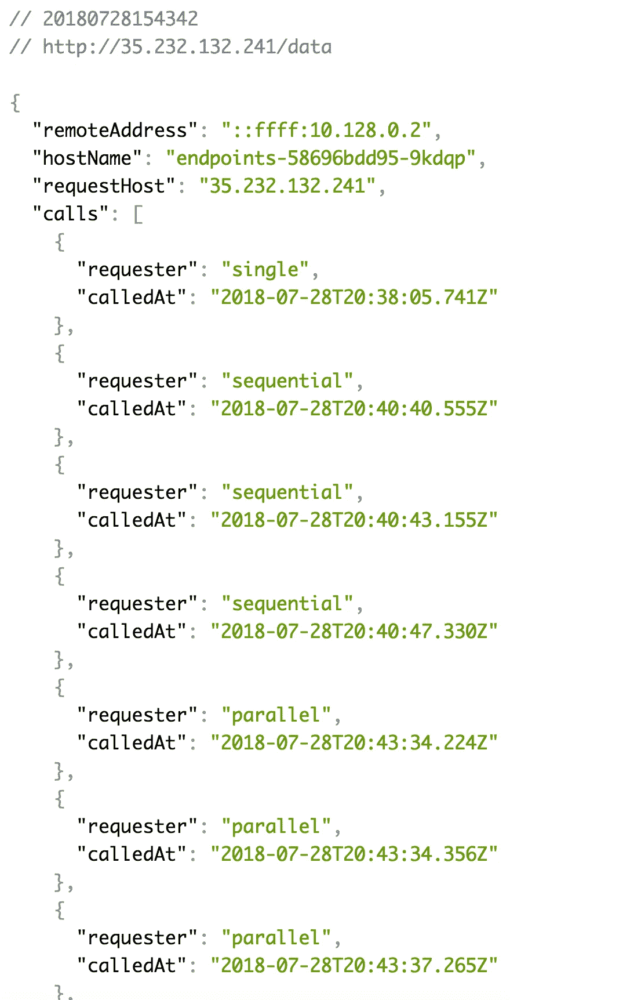

# Kubernetes:使用批处理作业运行后台任务

> 原文：<https://medium.com/google-cloud/kubernetes-running-background-tasks-with-batch-jobs-56482fbc853?source=collection_archive---------0----------------------->

在构建令人惊叹的应用程序时，有时您可能希望处理用户请求/响应生命周期之外的动作。如果你想对基于时间的事件做出反应，那么你会想看看 cron jobs 。如果您想在用户的请求/响应生命周期之外启动一个流程，但不是基于时间，那么您会看到批处理作业。批处理作业可以由任意数量的触发器启动，并且可以运行复杂的任务，而不会影响用户的响应时间。


乔纳森·法伯在 [Unsplash](https://unsplash.com?utm_source=medium&utm_medium=referral) 拍摄的照片

在本文中，我们将看看如何以几种不同的方式运行批处理作业:**一次性**、**顺序**和**并行**。

*如果你没有通读甚至没有读过本系列的第一部分*[](/@jonbcampos/kubernetes-day-one-30a80b5dcb29)**你可能会感到困惑，对代码在哪里或者之前做了什么有疑问。记住这里假设你正在使用*[](https://cloud.google.com/)**和*[](https://cloud.google.com/kubernetes-engine/)**。我将始终提供代码和如何测试代码是按预期工作。****

**[](/google-cloud/kubernetes-day-one-30a80b5dcb29) [## Kubernetes:第一天

### 这是 Kubernetes 帖子的必选步骤之一。如果你对 Kubernetes 感兴趣，你可能已经读过 100 本了…

medium.com](/google-cloud/kubernetes-day-one-30a80b5dcb29) 

# 设置您的 Kubernetes 集群

与本系列中的其他文章不同，本文将让我们运行更多的脚本来查看我们的批处理作业。因此，我们需要从设置一次 Kubernetes 集群开始，并在集群上继续运行作业。下面是使用 Google Kubernetes 引擎在 Google Cloud 中设置 Kubernetes 集群的脚本。

```
$ git clone [https://github.com/jonbcampos/kubernetes-series.git](https://github.com/jonbcampos/kubernetes-series.git)
$ cd [~/kubernetes-series/batch-job/scripts](https://github.com/jonbcampos/kubernetes-series/tree/master/batch-job/scripts)
$ sh [startup.sh](https://github.com/jonbcampos/kubernetes-series/blob/master/batch-job/scripts/startup.sh)
$ sh [deploy.sh](https://github.com/jonbcampos/kubernetes-series/blob/master/batch-job/scripts/deploy.sh)
$ sh [check-endpoint.sh](https://github.com/jonbcampos/kubernetes-series/blob/master/batch-job/scripts/check-endpoint.sh) endpoints
```

随着这些脚本的运行，您将有一个 Kubernetes 集群在您的 Google Cloud 项目中运行。此外，请注意由`[check-endpoint.sh](https://github.com/jonbcampos/kubernetes-series/blob/master/batch-job/scripts/check-endpoint.sh)`命令透露的 IP 地址。这将是我们稍后用来查看批处理作业输出的 IP 地址。

> 注意:您可以在`http://[IP_Address]/data`查看批处理文件的结果。当我们通过各种方式运行您的批处理作业时，您会看到数据被记录到此位置。

# 创建一次性 Kubernetes 工作

有时你可能有一些只需要运行一次的脚本。也许是迁移脚本。也许是一个脚本来修复一些丢失的数据。不管是什么原因，你都需要运行一次。对于本例，我们假设您已经准备好了要运行的代码，如我为您设置的简单容器/脚本所示。

准备好您想要运行的容器后，我们只需要创建我们的 [yaml 文件](https://github.com/jonbcampos/kubernetes-series/blob/master/batch-job/k8s/single-job.yaml#L1-L29)。

```
**apiVersion: batch/v1
kind: Job
metadata:
  name: single-job
spec:
  backoffLimit: 6** # number of retries before throwing error
  **activeDeadlineSeconds: 10** # time to allow job to run
  **template:
    metadata:
      labels:
        app: kubernetes-series
        tier: job
    spec:
      restartPolicy: OnFailure
      containers:
        - name: job
          image: gcr.io/PROJECT_NAME/batchjob-container-job:latest**
          # environment variables for the Pod
          **env:
          - name: GCLOUD_PROJECT
            value: PROJECT_NAME
          - name: MESSAGE
            value: I am a single run job
          - name: FOREIGN_SERVICE
            value: http://endpoints.default.svc.cluster.local/single
          - name: NODE_ENV
            value: production
          ports:
          - containerPort: 80**
```

准备好容器和 Kubernetes 集群后，您唯一需要做的事情就是用下面的脚本运行 yaml 文件。

```
kubectl apply -f ../k8s/single-job.yaml
```

参见下一节运行脚本并查看输出。

## 一次性 Kubernetes 工作在行动

随着 Kubernetes 集群的运行，我们只需进入 Google Cloud Shell 并运行以下脚本来运行一次性批处理作业。

```
$ cd [~/kubernetes-series/batch-job/scripts](https://github.com/jonbcampos/kubernetes-series/tree/master/batch-job/scripts)
$ sh [run_single_job.sh](https://github.com/jonbcampos/kubernetes-series/blob/master/batch-job/scripts/run-single-job.sh)
```

当你按下回车键时，很多事情会立即发生。如果您运行到您的`Kubernetes Engine > Workloads`视图，您将看到您的工作负载中新的`single-job` Pod 和活动的`0/1`Pod。那是因为`single-job`在完成时运行并终止了分离舱。



`single-job` Pod 完成

如果您查看`single-job`事件的详细信息，您还可以看到在 Pod 创建后记录的`SuccessfulCreate`事件。



单一作业 Pod 事件

最后，要查看`single-job` Pod 的结果，您可以返回到`http://[IP_Address]/data`并查看批处理作业的结果。



单一作业批处理作业结果

哇！这么多事情发生得太快了！对于一项简单的工作来说，这一切都很好。但是，如果您需要一次移动大量数据，该怎么办呢？运行一个作业可能还不够。在下一个示例中，我们将了解如何按顺序创建批处理作业。

# 创建连续的 Kubernetes 作业

在这种情况下，您希望按顺序运行成批的作业，而不是有一个很长的作业。如果您担心作业可能会失败并需要重新启动，如果某个作业正在消耗大量内存/资源并需要限制，或者如果您只是不想让后台作业运行太长时间，这就特别好。

> 示例:假设您有 100 个资源要消耗和转换。您可能有一个作业需要一个小时才能运行，并且可能会失败，需要启动多次才能完全完成。或者您可以有 10 个批处理作业，一次运行 10 个资源。即使批处理作业失败，您最终也只是重新启动特定的 10 人组，而不是整个 100 人组。

要在 Kubernetes 能够理解的 yaml 文件中看到这一点，请看下面的代码。除了增加了一个`.spec.completions`之外，yaml 文件的大部分与单次运行批处理作业极其相似(下面以粗体显示)。[这将设置批处理作业运行 3 次，一个接一个。](https://github.com/jonbcampos/kubernetes-series/blob/master/batch-job/k8s/sequential-jobs.yaml)

```
apiVersion: batch/v1
kind: Job
metadata:
  name: sequential-job
spec:
  **completions: 3 # number of times to run**
  backoffLimit: 6 # number of retries before throwing error
  activeDeadlineSeconds: 10 # time to allow job to run
  template:
    metadata:
      labels:
        app: kubernetes-series
        tier: job
    spec:
      restartPolicy: OnFailure
      containers:
        - name: job
          image: gcr.io/PROJECT_NAME/batchjob-container-job:latest
          # environment variables for the Pod
          env:
          - name: GCLOUD_PROJECT
            value: PROJECT_NAME
          - name: MESSAGE
            value: I am a sequential run job
          - name: FOREIGN_SERVICE
            value: http://endpoints.default.svc.cluster.local/sequential
          - name: NODE_ENV
            value: production
          ports:
          - containerPort: 80
```

变化超级小，超级有效。接下来让我们来看看它的实际应用。

## 连续 Kubernetes 工作在行动

随着 Kubernetes 集群的运行，我们只需要进入 Google Cloud Shell 并运行以下脚本来运行一个连续的批处理作业。

```
$ cd [~/kubernetes-series/batch-job/scripts](https://github.com/jonbcampos/kubernetes-series/tree/master/batch-job/scripts)
$ sh [run-sequential-job.sh](https://github.com/jonbcampos/kubernetes-series/blob/master/batch-job/scripts/run-sequential-job.sh)
```

当你按下回车键时，很多事情会立即发生。如果您运行到您的`Kubernetes Engine > Workloads`视图，您将看到您的工作负载中新的`sequential-job` Pod 和活动的`0/3`Pod。那是因为`sequential-job`在完成时运行并终止了分离舱。



顺序作业完成

如果您查看`sequential-job`事件的详细信息，您还可以看到在 Pod 创建后记录的`SuccessfulCreate`事件。



顺序作业事件视图

最后，要查看`sequential-job` Pod 的结果，您可以返回到`http://[IP_Address]/data`并查看批处理作业的结果。



顺序作业批处理作业结果添加到输出

就像`single-job`一样，`sequential-job`这么快就做了这么多！如果您需要将一个运行任务分解为多个任务，这是一个非常有效的解决方案。如果你想更进一步，会发生什么呢？如果您想分解作业并同时运行多个作业，该怎么办？是时候谈谈平行作业了。

# 创建并行 Kubernetes 作业

现在，您可以按顺序运行作业，将长时间运行的作业分解成小块。如果您想使用 Google 云和 Kubernetes 集群的能力，并行而不是顺序地运行这些作业——有效地将几个小时的处理变成在更多节点上几分钟的处理，该怎么办？并行作业会帮你做到这一点。

如果您已经将作业设置为[等幂运行](/google-cloud/kubernetes-cron-jobs-455fdc32e81a#a86e)，那么这就不是问题。在您的 [yaml 文件](https://github.com/jonbcampos/kubernetes-series/blob/master/batch-job/k8s/parallel-jobs.yaml)中添加一个新的行将赋予您这种能力。

> 如果你对这个术语感到困惑，请务必查看我的[幂等工作的快速解释](/google-cloud/kubernetes-cron-jobs-455fdc32e81a#a86e)。

```
apiVersion: batch/v1
kind: Job
metadata:
  name: parallel-job
spec:
  completions: 6 # number of times to run
  **parallelism: 2 # number of pods that can run in parallel**
  backoffLimit: 6 # number of retries before throwing error
  activeDeadlineSeconds: 10 # time to allow job to run
  template:
    metadata:
      labels:
        app: kubernetes-series
        tier: job
    spec:
      restartPolicy: OnFailure
      containers:
        - name: job
          image: gcr.io/PROJECT_NAME/batchjob-container-job:latest
          # environment variables for the Pod
          env:
          - name: GCLOUD_PROJECT
            value: PROJECT_NAME
          - name: MESSAGE
            value: I am a parallel run job
          - name: FOREIGN_SERVICE
            value: http://endpoints.default.svc.cluster.local/parallel
          - name: NODE_ENV
            value: production
          ports:
          - containerPort: 80
```

现在,`.spec.parallelism`行告诉 Kubernetes 可以同时运行这么多的 pod。如果我将完成数设置为 6，并行度设置为 6，那么我的所有批处理作业将同时运行。在这个例子中，我希望每批运行 3 个 Kubernetes Pods，所以我将并行度设置为 2，将完成度设置为 6。

## 并行 Kubernetes 工作在行动

随着您的 Kubernetes 集群的运行，我们只需要进入 Google Cloud Shell 并运行以下脚本来运行并行批处理作业。

```
$ cd [~/kubernetes-series/batch-job/scripts](https://github.com/jonbcampos/kubernetes-series/tree/master/batch-job/scripts)
$ sh [run-sequential-job.sh](https://github.com/jonbcampos/kubernetes-series/blob/master/batch-job/scripts/run-sequential-job.sh)
```

当你按下回车键时，很多事情会立即发生。如果您运行到您的`Kubernetes Engine > Workloads`视图，您将看到您的工作负载中新的`parallel-job` Pod 和活动的`0/6`Pod。那是因为`parallel-job`在完成时运行并终止了分离舱。*注意:在截图中，我看到一个豆荚还在旋转。*



并行作业单元正在旋转

如果您查看`parallel-job`事件的详细信息，您还可以看到在 Pod 创建后记录的`SuccessfulCreate`事件。



并行作业事件视图

最后，要查看`parallel-job` Pod 的结果，您可以返回到`http://[IP_Address]/data`并查看批处理作业的结果。



并行作业批处理作业结果添加到输出

嘣！批处理作业，按顺序并行运行。加快您的处理速度，让您不再等待。它是如此简单，以至于你几乎会觉得你错过了什么。

# 结论

如果你做到了这一步，并且运行了所有的代码，你现在一定是最快乐的程序员了——我知道我是。运行批处理作业并让它们按照您想要的方式运行是多么容易。Kubernetes 是 job 中的一股新鲜空气，它通常充满了令人畏缩的配置文件和脚本。

# 拆卸

在您离开之前，请确保清理您的项目，这样您就不会为您用来运行群集的虚拟机付费。返回到云 Shell 并运行 teardown 脚本来清理您的项目。这将删除您的集群和我们构建的容器。

```
$ cd [~/kubernetes-series/daemon/scripts](https://github.com/jonbcampos/kubernetes-series/tree/master/daemon/scripts)
$ sh [teardown.sh](https://github.com/jonbcampos/kubernetes-series/blob/master/daemon/scripts/teardown.sh)
``` 

# **本系列的其他文章**

**[](/@jonbcampos/kubernetes-run-a-pod-per-node-with-daemon-sets-f77ce3f36bf1) [## Kubernetes:用守护进程集在每个节点上运行一个 Pod

### 我最初给这篇文章起的标题只是“守护进程集”,并假设它足以抓住要点…

medium.com](/@jonbcampos/kubernetes-run-a-pod-per-node-with-daemon-sets-f77ce3f36bf1) [](/google-cloud/kubernetes-cron-jobs-455fdc32e81a) [## 库伯内特:克朗·乔布斯

### 有时候你的工作不是事务性的。我们不再等待用户点击按钮让系统亮起来…

medium.com](/google-cloud/kubernetes-cron-jobs-455fdc32e81a) [](/google-cloud/kubernetes-dns-proxy-with-services-d7d9e800c329) [## Kubernetes:带服务的 DNS 代理

### 构建应用程序时，通常需要与外部服务进行交互来完成业务…

medium.com](/google-cloud/kubernetes-dns-proxy-with-services-d7d9e800c329) [](/google-cloud/kubernetes-routing-internal-services-through-fqdn-d98db92b79d3) [## Kubernetes:通过 FQDN 路由内部服务

### 我记得当我第一次进入 Kubernetes 时。一切都是崭新的、闪亮的、有规模的。当我继续的时候…

medium.com](/google-cloud/kubernetes-routing-internal-services-through-fqdn-d98db92b79d3) [](/google-cloud/kubernetes-liveness-checks-4e73c631661f) [## Kubernetes:活性检查

### 最近，我整理了一篇关于 Kubernetes 就绪性调查以及它对您的集群有多重要的文章…

medium.com](/google-cloud/kubernetes-liveness-checks-4e73c631661f) [](https://itnext.io/kubernetes-readiness-probe-83f8a06d33d3) [## Kubernetes:就绪探测

### 如果对这个特性有任何疑问，我写这篇文章是为了说明这不是一个…

itnext.io](https://itnext.io/kubernetes-readiness-probe-83f8a06d33d3) [](/google-cloud/kubernetes-horizontal-pod-scaling-190e95c258f5) [## Kubernetes:水平 Pod 缩放

### 通过 Pod 自动扩展，您的 Kubernetes 集群可以监控现有 Pod 的负载，并确定我们是否需要更多…

medium.com](/google-cloud/kubernetes-horizontal-pod-scaling-190e95c258f5) [](/google-cloud/kubernetes-cluster-autoscaler-f1948a0f686d) [## Kubernetes:集群自动缩放

### 自动缩放是 Kubernetes 的一个巨大的(并且已经上市的)特性。当你的网站/应用程序/应用程序接口/项目变得越来越大时，洪水…

medium.com](/google-cloud/kubernetes-cluster-autoscaler-f1948a0f686d) [](/google-cloud/kubernetes-day-one-30a80b5dcb29) [## Kubernetes:第一天

### 这是 Kubernetes 帖子的必选步骤之一。如果你对 Kubernetes 感兴趣，你可能已经读过 100 本了…

medium.com](/google-cloud/kubernetes-day-one-30a80b5dcb29) 

Jonathan Campos 是一个狂热的开发者，也是学习新事物的爱好者。我相信我们应该不断学习、成长和失败。我总是开发社区的支持者，并且总是愿意提供帮助。因此，如果你对这个故事有任何问题或意见，请在下面提出。在 [LinkedIn](https://www.linkedin.com/in/jonbcampos/) 或 [Twitter](https://twitter.com/jonbcampos) 上与我联系，并提及这个故事。**