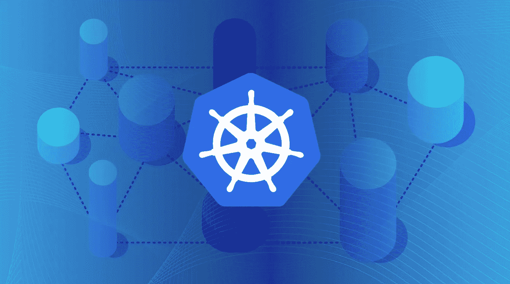
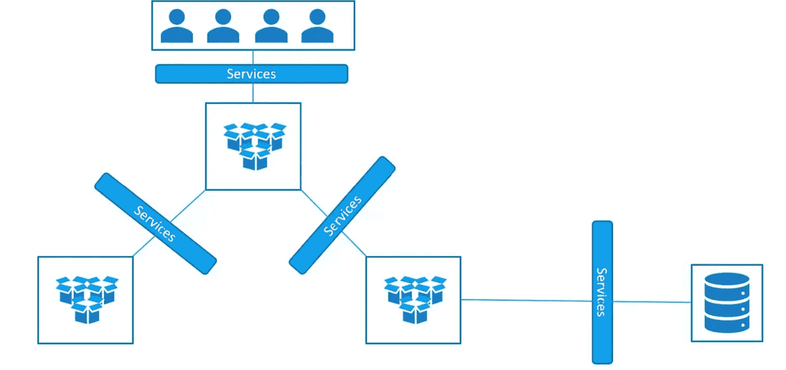
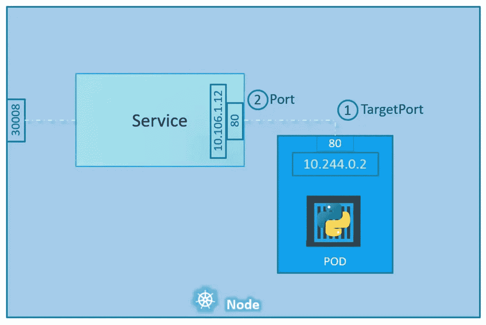

# kubernetes 服务公司第一部分

> 原文：<https://medium.com/google-cloud/kubernetes-services-%EF%B8%8F%EF%B8%8F-part-1-42244ada9990?source=collection_archive---------0----------------------->

## Kubernetes 有哪些服务？

## 介绍🚩🚩

各位读者好👋:)
“Kubernetes 服务”是一个又大又长的主题。所以我决定为它写两部分。这不仅有助于我使文章简洁明了，也有助于你们更好、更深入地理解这个概念。

***在这一部分，我们将试着理解下面的事情*** :

*   什么是 Kubernetes 服务？
*   Kubernetes 的服务类型。
*   节点端口服务是如何工作的？
*   如何使用 Yaml 文件制作节点端口服务？

> 因此，没有任何进一步的拖延，让我们开始我们的文章:)

## 定义🤓🤓



Kubernetes 服务

Kubernetes 中的 ***服务是一种抽象的方式，将运行在一组 Pods 上的应用程序公开为网络服务。***

使用 Kubernetes，您不需要修改应用程序来使用不熟悉的服务发现机制。Kubernetes 为一组 Pods 提供它们自己的 IP 地址和一个 DNS 名称，并且可以在它们之间进行负载平衡。

> 好了，好了，技术定义够了。😏
> 让我们了解一下"**什么是服务？？**“用非常简单的术语。我们走吧！！🏇

## 让我们开始吧！！⛏️⛏️

假设在一个 Kubernetes 节点上有三组不同豆荚。

*   **前端 pod**【在其上运行最终用户将使用的 web 应用程序前端部分的 pod】
*   **后端 pod**【在其上运行最终用户将使用的 web 应用程序后端部分的 pod】
*   **数据库盒**【运行数据库应用实例的盒，负责存储 web 应用的数据】

上述所有节点都运行正常，运行在这些节点上的应用程序也处于良好状态。

但是有 ***一些可能出现的问题*** 👀👀。让我们来讨论一下:

1.  最终用户如何在各自的计算机中访问前端窗格上运行的前端应用程序？？
2.  **前端 PODs 如何与后端 PODs** 通信以使整个应用程序实际运行？？
3.  前端 pod 如何与数据库 pod 通信以获取它们所需的数据？？



Kubernetes 服务的运作

如上图所示，我们讨论过的所有上述问题。可以通过使用“Kubernetes 服务”轻松解决 ***。***

***Kubernetes 服务很简单来说，*** 都是 Kubernetes 帮助我们的对象

1.  ***向最终用户展示 pod 上运行的应用*** 。
2.  ***帮助 pod 与 Kubernetes 集群上的其他 pod***进行通信，即帮助 pod 之间的连接。
3.  帮助收集用户请求，并将这些请求平均分配给 pod 上运行的应用程序，即 ***帮助负载平衡 pod 上运行的应用程序的用户请求*** 。

> 万岁！！🥳🥳:现在我们明白了什么是服务，以及它们能做什么。
> 现在我们来讨论一下服务的类型:)

## Kubernetes 服务的类型🌐🌐


Kubernetes 服务的类型

*   **节点端口:**通过每个节点 IP 上的静态端口公开服务。简而言之，该服务有助于向最终用户展示 pod 上运行的服务/应用程序。
*   **ClusterIP :** 公开只能从集群内部访问的服务。简单地说，该服务帮助 pod 访问运行在另一个 pod 上的服务。(吊舱间通信)
*   **负载平衡器:**通过云提供商的负载平衡器公开服务。简而言之，这项服务通过云提供商的负载平衡器来帮助平衡用户对在 pod 上运行的应用程序的请求。
*   **ExternalName :** 通过为 CNAME 记录返回值，将服务映射到预定义的 ExternalName 字段。简而言之，这些服务只作为其他常规服务工作，但是当您想要访问该服务名称时，它不是返回该服务的 cluster-ip，而是返回具有服务的`externalName:`参数中提到的值的 CNAME 记录。

## 节点端口服务是如何工作的？？🤔🤔



节点端口服务

***让我们试着理解上图*** 中 ***所示的场景。***

1.  有一个 worker 节点，其中包含一个 POD。
2.  POD 在其上运行一个 web 应用程序。
3.  我们创建了一个节点端口服务，该服务将节点上的端口映射到节点上存在的端口。

***现在*** ***每当最终用户想要访问 POD******上运行的 web 应用程序时，以下事情会在后台发生:***

1.  用户只需在映射到 POD 的节点端口号上发送请求(这里的端口是 30008)
2.  接下来，节点端口服务接收用户请求，并将其映射到自己的端口，即服务端口(这里的端口:80)
3.  接下来，从服务端口开始，请求被映射到 web 应用程序 POD 的端口(这里是 TargetPort : 80)

> 在这些简单的步骤中，使用**节点端口服务**。用户可以从自己的设备上访问 pod 上运行的应用程序。

## 我们如何创建节点端口服务？？🤯🤯

我们可以使用 YAML 文件创建一个节点端口服务。要使用 YAML 创建 Kubernetes 节点端口服务，首先要创建一个空文件，为它分配必要的访问权限，然后定义必要的键-值对。

下面是一个节点端口服务定义文件 *(* ***节点端口服务. yaml*** *)* 的例子

```
apiVersion: v1 
kind: Service
metadata:  
 name: my-service 
spec:  
 type: NodePort   
 selector:    
  app: echo-hostname    
 ports:
  - nodePort: 30008
    port: 80
    targetPort: 80
```

这个文件中有很多方面和组件。让我们逐一分析😀

*   让我们从`apiVersion`(键值对)开始。这用于阐明在创建节点端口服务时，您将在后台运行什么 API 服务器和版本。
*   接下来是`kind`,表示这是一种定义文件。在我们的例子中，它是一种“服务”。
*   接下来是`metadata`，这是一个包括项目名称的字典。元数据存储分配给正在创建的节点端口服务的值。
*   最后是`spec`，它实际上是一个数组/列表。以下是其中存在的值及其含义。
    `type`:这个键的值，定义了正在创建的服务的类型。在我们的例子中，它是一个“节点端口”。
    `selector`:它基本上有 pod 的标签，从而帮助服务识别它必须使用的 pod。
    `ports`:包含服务必须使用的端口的部分。
    `nodePort`拥有用户请求将要到达的节点上的端口值。它的值可以在 30000–32767 的范围内。
    `port`具有服务对象上的端口值，用户请求将映射到该端口。

我们已经完成了节点端口服务定义文件。现在我们可以保存并退出文件。

使用此命令基于上述 YAML 文件创建节点端口服务:

```
kubectl create -f *nodePortService*.yaml
```

使用此命令查看群集上运行的所有服务:

```
kubectl get services
```

# 接下来呢？👀 👀


> 非常感谢你来到这里！是本文的结尾。我会很快回来写这篇博客的下一部分。在这里我将深入解释其他类型的服务。还有很多要去的地方，这将是一次有趣的旅程，我们将一起学习很多很酷的东西。
> 
> 鼓掌，跟我来🙈如果你喜欢我的作品，并希望在未来更多地阅读我的作品:)

如果你对这篇文章有任何疑问，或者想聊聊天，请随时联系我的社交媒体账号

*推特—*[https://twitter.com/ChindaVibhor](https://twitter.com/ChindaVibhor)

*领英—*[*https://www.linkedin.com/in/vibhor-chinda-465927169/*](https://www.linkedin.com/in/vibhor-chinda-465927169/)

## 我以前写的文章:

[](/google-cloud/what-are-namespaces-in-kubernetes-d03c76a83d04) [## Kubernetes 中的名称空间是什么？？

### 名称空间是 Kubernetes 对象，它将一个 Kubernetes 集群划分成多个虚拟集群。在…

medium.com](/google-cloud/what-are-namespaces-in-kubernetes-d03c76a83d04) [](https://faun.pub/kubernetes-object-deployments-1e09cd904963) [## Kubernetes 对象:☸☸部署

### Kubernetes 中有哪些部署？

faun.pub](https://faun.pub/kubernetes-object-deployments-1e09cd904963) 

## 参考

[](https://kubernetes.io/docs/concepts/services-networking/service/) [## 服务

### 将运行在集群中的应用程序暴露在单个外向端点之后，即使工作负载被拆分…

kubernetes.io](https://kubernetes.io/docs/concepts/services-networking/service/) 

我仍然会继续发表新的文章，涵盖我正在探索的一系列主题。

那都是乡亲们！！涂鸦:))