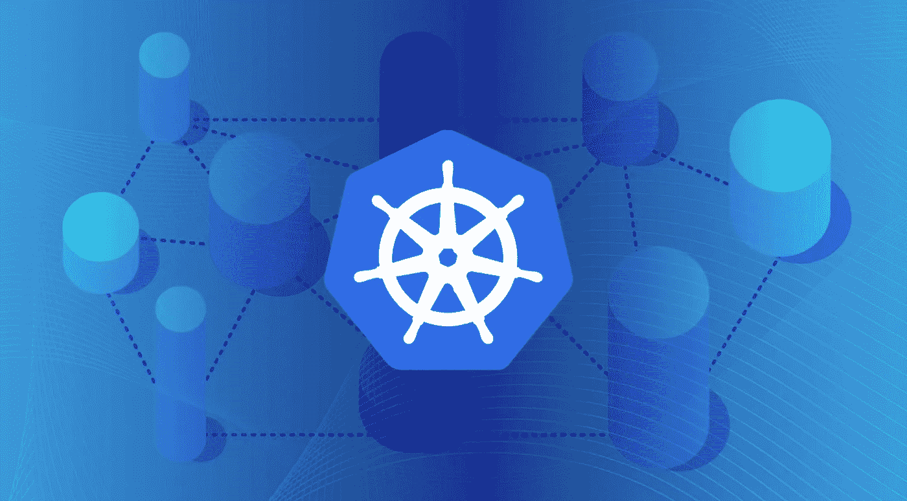
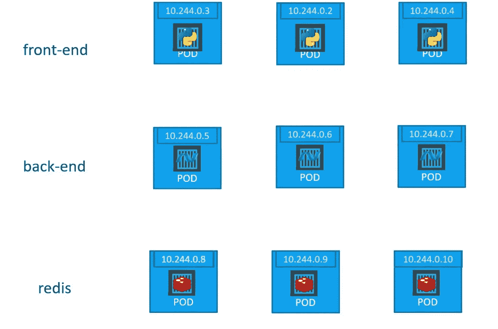
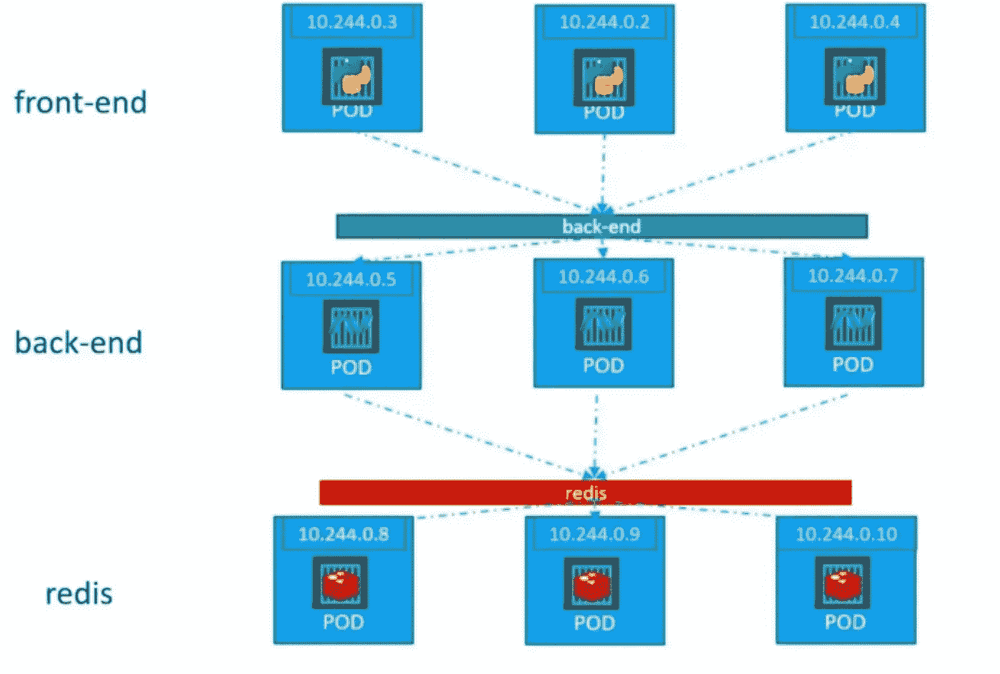

# kubernetes 服务公司:第二部分

> 原文：<https://medium.com/google-cloud/kubernetes-services-part-2-90b2cfa98d21?source=collection_archive---------0----------------------->

## Kubernetes 有哪些服务？

## 介绍🚩🚩

各位读者好👋正如我在上一篇文章中告诉大家的，“Kubernetes 服务”是一个很大很长的主题。所以我决定为它写两部分。这不仅有助于我使文章简洁明了，也有助于你们更好、更深入地理解这个概念。

***这将是这个系列的第二部，也是最后一部。在这一部分，我们将试着去理解下面的事情*** :

*   什么是 ClusterIP 服务？
*   ClusterIP 服务如何工作？
*   如何使用 yaml 文件创建 ClusterIP 服务？
*   什么是负载平衡器服务？
*   如何使用 yaml 文件创建负载平衡器服务？

## 概述🔦🔦



Kubernetes 服务

让我们快速回忆一下我们在本系列的前一部分已经讨论过的所有内容。

Kubernetes 中的 ***服务是一种抽象的方式，将运行在一组 Pods 上的应用程序公开为网络服务。***

Kubernetes 中有 ***四种类型的服务*** :

*   节点端口
*   ClusterIP
*   负载平衡器
*   外部名称

***下面的事情我在之前的帖子里已经全部讨论过了。***

*   什么是 Kubernetes 服务？
*   Kubernetes 的服务类型。
*   节点端口服务是如何工作的？
*   如何使用 yaml 创建节点端口服务？

你们都可以在这里查阅

[](/google-cloud/kubernetes-services-️️-part-1-42244ada9990) [## kubernetes 服务公司第一部分

### Kubernetes 有哪些服务？

medium.com](/google-cloud/kubernetes-services-️️-part-1-42244ada9990) 

> *谈够了。
> 所以没有任何进一步的拖延，让我们开始我们的文章:)*

## 什么是 ClusterIP 服务？？🤔🤔



Kubernetes 集群中存在三组豆荚

***让我们试着理解上图*** 中 ***所示的场景。
在 Kubernetes 集群中，存在如下三组豆荚:***

*   ***前端 pod***【运行 web 应用程序前端部分的 pod】
*   ***后端 pod***【在其上运行 web 应用程序后端部分的 pod】
*   ***数据库窗格*** 【在其上运行数据库应用程序实例的窗格】

以上所有的 pod 都运行正常，并且在其上运行的应用程序也处于良好的状态。但是对于最终用户应用程序的正常工作来说，重要的是所有的单元应该一起正常工作，而不是独立工作。

> **现在问题来了，我们如何将前端单元连接到后端单元，将后端单元连接到数据库单元**？？🤔🤔

一个简单的解决方案是使用 IP 地址手动配置 pod 的属性，以便它们可以相互通信。

但是上述做法会给管理员 ***不可想象的噩梦*** 👻。
想象一下配置 1000 个 pod，其中一些会停止运行，然后恢复运行。都有不同的和新的 IP。 ***末日轮回看来是*** 😰

> 下面是类型为 **ClusterIP** 的服务。他们让所有这些工作变得简单可行。让我们看看如何🐵

## ClusterIP 服务如何工作？？🤔🤔



集群 IP 服务

***让我们试着理解上图中*** ***所示的场景:***

*   有三组 PODs 前端、后端和数据库]
*   我们创建了两个 ClusterIP 服务(后端和 redis)来简化 pod 间的通信过程。

***让我们来探究一下 ClusterIP 服务在幕后是如何工作的:***

1.  假设一个前端 POD 需要获取一些后端服务。
2.  前端 POD 将联系我们创建的后端服务。
3.  后端服务将把 POD 通信请求映射到合适的后端 POD 上。
4.  后端 POD 将返回所需的数据，这些数据将通过服务提供给前端 POD。

所有的事情，比如请求应该传递给哪个 POD，或者数据应该如何返回给请求者 POD，都将由服务本身处理，而不需要管理员的干预。

即使在此之上，POD 层也可以根据集群上的负载随时扩大或缩小，并且不会中断这些服务正在设计的通信系统。
因为即使有 1000 个节点，服务也可以毫无困难地沿着集群扩展。

> 以这种简单的方式，通过使用**集群 IP 服务**。pod 能够轻松地与集群中的其他 pod 进行通信:))

## 我们如何创建 ClusterIP 服务？？🤯🤯

我们可以使用 YAML 文件创建 ClusterIP 服务。要使用 YAML 创建 Kubernetes ClusterIP 服务，首先要创建一个空文件，为它分配必要的访问权限，然后定义必要的键-值对。

下面是一个集群 IP 服务定义文件*(****cluster _ IP . YAML****)*的例子

```
**apiVersion**: v1
**kind**: Service
**metadata**:
  **name**: back-end
**spec**:
  **type**: ClusterIP
  **selector:** 
      **name**: myapp
      **type**: back-end  
  **ports**:
    - **targetPort**: 80
      **port**: 80
```

这个文件中有很多方面和组件。让我们逐一分析😀

*   让我们从`apiVersion`(键值对)开始。这用于说明在创建 ClusterIP 服务时，您将在后台运行什么 API 服务器和版本。
*   接下来是`kind`,表示这是一种定义文件。在我们的例子中，它是一种“服务”。
*   接下来是`metadata`，是包含物品名称的字典。元数据存储分配给正在创建的 ClusterIP 服务的值。
*   最后是`spec`，它实际上是一个数组/列表。以下是其中存在的值及其含义。
    `type`:这个键的值，定义了正在创建的服务的类型。在我们的例子中，它是一个“集群 IP”。
    `selector`:它基本上有 pod 的标签，从而帮助服务识别它必须使用的 pod。
    `ports`:这个部分包含服务必须使用的端口。
    `port`具有服务对象上的端口值，调用请求将映射到该端口。

我们已经完成了 ClusterIP 服务定义文件。现在我们可以保存并退出文件。

使用此命令基于上述 YAML 文件创建 ClusterIP 服务:

```
kubectl create -f cluster_ip.yaml
```

使用此命令查看群集上运行的所有服务:

```
kubectl get services
```

## 什么是负载平衡器服务？？🤔🤔


由 Pavel Neznanov 在 [Unsplash](https://unsplash.com?utm_source=medium&utm_medium=referral) 上拍摄的照片

**想象一个场景，其中已经执行了以下操作**:

1.  您已经使用 NodePort 服务将运行在 POD 上的应用程序暴露给工作节点的端口。
2.  现在让我们假设有 100 个 pod 跨不同的工作节点运行相同的应用程序。
3.  每个工作节点有不同的 ip 地址。因此，即使端口相同，每个节点上要访问的 URL 也会不同。

那么在给用户端点的时候，你会给哪个节点的 URL，给多少个 URL😓。最终这将导致一片混乱。

***现在为了解决上述问题，我们创建一个负载平衡器服务。*** 简单来说，通过给用户一个 URL 来展示整个应用程序。此外，它使用一些云提供商(gcp、azure、aws 等)的负载平衡器来平衡用户对运行这些服务的 pod 的请求。

> 以这种简单的方式，通过使用**负载平衡器** **服务**。用户请求可以很容易地实现负载平衡，整个应用程序可以通过一个 URL 向最终用户公开:))

## 我们如何创建一个负载平衡器服务？？🤯🤯

我们可以使用 YAML 文件创建一个负载平衡器服务。要使用 YAML 创建 Kubernetes LoadBalancer 服务，首先要创建一个空文件，为它分配必要的访问权限，然后定义必要的键-值对。

下面是一个负载平衡器服务定义文件*(****load _ balancer . YAML****)*的例子

```
**apiVersion**: v1
**kind**: Service
**metadata**:
  **name**: myapp-service
**spec**:
  **type**: LoadBalancer
  **selector**:
    **app**: front-end
  **ports**:
    - **port**: 80
      **targetPort**: 80
      **nodePort:** 30008
```

这个文件中有很多方面和组件。让我们逐一分析😀

*   让我们从`apiVersion`(键值对)开始。这用于说明在创建 LoadBalancer 服务时，您将在后台运行什么 API 服务器和版本。
*   接下来是`kind`,表示这是一种定义文件。在我们的例子中，它是一种“服务”。
*   接下来是`metadata`，这是一个包括项目名称的字典。元数据存储分配给正在创建的负载平衡器服务的值。
*   最后是`spec`，它实际上是一个数组/列表。以下是其中存在的值及其含义。
    `type`:这个键的值，定义了正在创建的服务的类型。在我们的例子中，它是一个“负载平衡器”。
    `selector`:它基本上有 pod 的标签，从而帮助服务识别它必须使用的 pod。
    `ports`:包含服务必须使用的端口的部分。
    `nodePort`拥有用户请求将要到达的节点上的端口值。
    `port`具有服务对象上的端口值，用户请求将映射到该端口。

我们已经完成了负载平衡器服务定义文件。现在我们可以保存并退出文件。

使用此命令基于上述 YAML 文件创建负载平衡器服务:

```
kubectl create -f load_balancer***.***yaml
```

使用此命令查看群集上运行的所有服务:

```
kubectl get services
```

## 接下来呢？👀 👀


> 非常感谢你来到这里！是本文的结尾。
> 但我们只是触及了 K8s 生态系统的表面:)】
> 还有很多，这将是一次有趣的旅程，我们将一起学习许多很酷的东西。
> 
> 鼓掌，跟我来🙈如果你喜欢我的作品，并希望在未来更多地阅读我的作品:)

如果你对这篇文章有任何疑问，或者想聊聊天，请随时联系我的社交媒体账号

*推特—*[https://twitter.com/ChindaVibhor](https://twitter.com/ChindaVibhor)

*领英—*[*https://www.linkedin.com/in/vibhor-chinda-465927169/*](https://www.linkedin.com/in/vibhor-chinda-465927169/)

## 我以前写的文章:

[](/google-cloud/kubernetes-services-️️-part-1-42244ada9990) [## kubernetes 服务公司第一部分

### Kubernetes 有哪些服务？

medium.com](/google-cloud/kubernetes-services-️️-part-1-42244ada9990) [](/google-cloud/what-are-namespaces-in-kubernetes-d03c76a83d04) [## Kubernetes 中的名称空间是什么？？

### 名称空间是 Kubernetes 对象，它将一个 Kubernetes 集群划分成多个虚拟集群。在…

medium.com](/google-cloud/what-are-namespaces-in-kubernetes-d03c76a83d04) [](https://faun.pub/kubernetes-object-deployments-1e09cd904963) [## Kubernetes 对象:☸☸部署

### Kubernetes 中有哪些部署？

faun.pub](https://faun.pub/kubernetes-object-deployments-1e09cd904963) 

## 参考资料:

[](https://kubernetes.io/docs/concepts/services-networking/service/) [## 服务

### 将运行在集群中的应用程序暴露在单个外向端点之后，即使工作负载被拆分…

kubernetes.io](https://kubernetes.io/docs/concepts/services-networking/service/) 

我仍然会继续发表新的文章，涵盖我正在探索的一系列主题。

那都是乡亲们！！涂鸦:))