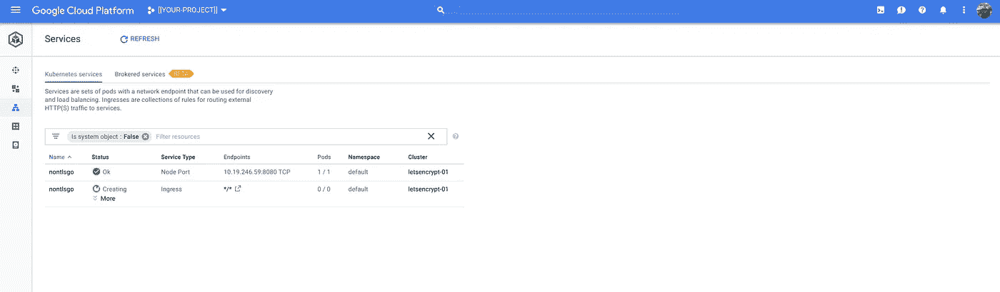

# Kubernetes 让我们加密和云 DNS

> 原文：<https://medium.com/google-cloud/kubernetes-w-lets-encrypt-cloud-dns-c888b2ff8c0e?source=collection_archive---------0----------------------->

这可能已经做得太多了，但是我没有使用自动化的方法来为 Kubernetes 服务生成证书，并且`cert-manager`承认它的文档需要改进:

[https://cert-manager . readthedocs . io/en/latest/tutorials/acme/DNS-validation . html](https://cert-manager.readthedocs.io/en/latest/tutorials/acme/dns-validation.html)


我偶然看到了 Ross Kukulinski 的帖子“[让我们加密 Kubernetes](https://kukulinski.com/lets-encrypt-kubernetes/) ”，但承诺已久的使用“让我们加密”的“第二部分”尚未发布。所以，这篇文章就是其中的一大部分。

在完全公开的情况下，我没有(可能是错误地)使用 Kelsey Hightower 的 [Kubernetes 证书管理器](https://github.com/kelseyhightower/kube-cert-manager)。如果我有时间，我也会利用这段时间更新这篇文章。

因此，下面是我如何能够使用 Jetstack 的 [cert-manager](https://github.com/jetstack/cert-manager) 来生成 cert，使用[来加密](https://letsencrypt.org/)，使用[云 DNS](https://cloud.google.com/dns) 和 [Kubernetes 引擎](https://cloud.google.com/kubernetes-engine/)来保护(带有警告)一个普通的 Golang http 服务。

> **注意事项**:我使用了 Let ' s Encrypt staging not production service；我在本地转发服务，而不是公开它来测试结果。当我有时间的时候，我会解决这两个限制。

## **更新 18–05–17**

帖子现在从四个方面描述了解决方案:

*   自签名证书
*   带有 TLS 后端的网络负载平衡器
*   带有非 TLS 后端的 HTTPS 负载平衡器
*   带有 TLS 后端的 HTTPS 负载平衡器。

## 设置

给自己拿一个新的 Kubernetes(引擎),并对其进行认证。给自己太多的机会(**除了个人发展/测试* *，不要这样做)RBAC 信条:

```
PROJECT=[[YOUR-PROJECT]]
REGION=[[YOUR-REGION]]
CLUSTER=[[YOUR-CLUSTER]]
BILLING=[[YOUR-BILLING]]
LATEST=[[SEE-NOTE-BELOW]]gcloud projects create $PROJECT
gcloud beta billing projects link $PROJECT \
--billing-account=$BILLINGgcloud services enable container.googleapis.com \
--project=$PROJECTgcloud beta container clusters create $CLUSTER \
--username="" \
--cluster-version=${LATEST} \
--machine-type=custom-1-4096 \
--image-type=COS \
--num-nodes=1 \
--enable-autorepair \
--enable-autoscaling \
--enable-autoupgrade \
--enable-cloud-logging \
--enable-cloud-monitoring \
--min-nodes=1 \
--max-nodes=2 \
--region=${REGION} \
--project=${PROJECT} \
--preemptible \
--scopes="[https://www.googleapis.com/auth/cloud-platform](https://www.googleapis.com/auth/cloud-platform)"gcloud beta container clusters get-credentials $CLUSTER \
--project=${PROJECT} \
--region=${REGION}kubectl create clusterrolebinding $(whoami)-cluster-admin-binding \
--clusterrole=cluster-admin \
--user=$(gcloud config get-value account)
```

> **NB** I [最近写了](/google-cloud/kubernetes-engine-master-node-versions-b5ecd9ed0b35)关于自动确定最近(或最新)主节点版本的方法。使用您喜欢的版本或查看帖子中描述的 3 种方法来确定`${LATEST}`的值。

复制一份 Ross 的 Golang 代码，或者——如果你愿意的话——使用他的 Docker 图像(`rosskukulinski/secure-go-app`)。我没有使用过他的图像，也不能证明这一点。或者，如果你愿意这样做，可以抓取我的 Docker 图片(`dazwilkin/securego`)。

> 罗斯的图像使用`443`端口，而我的图像使用`8443`端口，这只是一个偏好。

## 自签名证书

我喜欢罗斯的方法。他逐步构建。通常，我会在本地运行代码，然后在本地但被容器化，然后部署到 Kubernetes。但是，让我们切入正题，把它留给你的家庭作业。如果您这样做，我建议您考虑参数化证书和密钥的位置。

因此，我们将首先创建一个自签名证书，将其作为一个秘密部署到 Kubernetes，然后将装载了该秘密的映像作为一个卷部署(在`/secure/`上)

```
PREFIX=securego
DOMAIN=[[YOUR-DOMAIN]]
NAME=${PREFIX}.${DOMAIN}
openssl req \
-x509 \
-nodes \
-days 365 \
-newkey rsa:2048 \
-keyout ${NAME}.key \
-out ${NAME}.crt \
-subj "/CN=${NAME}"
```

> **注意**你需要访问一个域，这一切才能工作。有很多方法可以获得这些。我使用[谷歌域名](https://domains.google/)并且——上一次我检查过——谷歌(我的雇主)实际上并没有把这些域名和谷歌云域名系统结合起来使用。这篇文章假设您正在使用云 DNS 来管理您的域，但是这并不是工具的要求。

我在为自己工作，但我喜欢让我的 X509 证书和密钥按照它们的域明确命名，这样我就可以区分它们。当我们为证书和密钥创建 Kubernetes secret 时，它希望文件被称为`tls.crt`和`tls.key`，因此请注意下面命令中的`— from-file`映射:

```
kubectl create secret generic selfsigned \
--from-file=tls.key=./${NAME}.key \
--from-file=tls.crt=./${NAME}.crt
```

现在我们只需要一个结合了映像、其端口以及我们的证书和密钥的部署规范:

您可以:

```
kubectl apply --filename=securego.deployment.yaml
```

与其将部署作为服务公开，不如使用 kubectl 将部署创建的 pod 进行移植。然后，我们可以局部地卷曲向前端口:

```
POD=$(\
kubectl get pods \
--selector=app=securego \
--output=jsonpath="{.items[0].metadata.name}")kubectl port-forward ${POD} 8443:8443
```

从一个单独的外壳中:

```
curl --insecure [https://localhost:8443](https://localhost:8443)
```

如果您使用我的图像，您应该会收到:

```
Hello Henry!
```

## 证书管理器

你可以使用头盔展开`cert-manager`。Helm 是 Kubernetes 事实上的“包装”经理。它非常优秀，如果您还没有这样做，我建议您对它进行评估。我很懒，所以我使用 Kubernetes 规范直接部署了 cert-manager:

[https://cert-manager . readthedocs . io/en/latest/getting-started/2-installing . html # with-static-manifests](https://cert-manager.readthedocs.io/en/latest/getting-started/2-installing.html#with-static-manifests)

```
go get github.com/jetstack/cert-manager
cd ../jetstack/cert-manager/
cd contrib/manifests/cert-manager/rbackubectl apply --filename=.
```

> **注意**:如果您依赖于上一步中的 Docker 图像，即您之前没有使用 Golang 代码，您将需要设置一个 Golang 工作空间。

一切正常，`cert-manager`应该已经创建了一个名为`cert-manager`的名称空间，其中包含一个名为`cert-manager`的部署:


证书管理器

我们现在必须配置 cert-manager 来自动为我们创建证书。这需要配置一个(n) `[Cluster]Issuer`和一个`Certificate`。在我的例子中，这是最费时的部分，所以我会试着解释你需要什么和在哪里。

我使用的是 ClusterIssuer，它将为集群中的任何名称空间提供证书。我觉得你也应该用这个。

> **NB** 在我的例子中，包含我的云 DNS 区域的项目不同于包含 Kubernetes 引擎集群的项目。这是完全可能的情况。
> 
> 提供一个合法的电子邮件地址，让我们加密你可能收到的邮件。
> 
> **NB**T5`cert-manager`使用。您不需要为自己创建名为`letsencrypt-staging`的秘密。我建议你保持原样。
> 
> 你确实需要创建`clouddns` `serviceAccountSecretRef`条目(见下文)。

`cert-manager`使用服务帐户向 DNS 添加|删除条目，以向 Let's Encrypt 服务证明您对该域的所有权。为此，我们必须创建一个服务帐户，为其分配适当的权限，并将服务帐户公开给`cert-manager`部署(作为 Kubernetes 的秘密)。

```
ROBOT=clouddns
DNS=[[YOUR-CLOUD-DNS-PROJECT]]gcloud iam service-accounts create ${ROBOT} \
--display-name=${ROBOT} \
--project=${DNS}gcloud iam service-accounts keys create ./${ROBOT}.key.json \
--iam-account=clouddns@${DNS}.iam.gserviceaccount.com \
--project=${DNS}gcloud projects add-iam-policy-binding ${DNS} \
--member=serviceAccount:${ROBOT}@${DNS}.iam.gserviceaccount.com \
--role=roles/dns.adminkubectl create secret generic clouddns \
--from-file=./clouddns.key.json \
--namespace=cert-manager
```

> **注意**上图中`DNS`的值很可能与`PROJECT`的值相同；如果`${DNS}` == `${PROJECT}`，那也行。如果您的 DNS 项目不同，请确保正确设置值。

现在 cert-manager 可以访问服务帐户，您可以部署颁发者:

```
kubectl apply --filename=certmanager.issuer.yaml
```

您可以使用 Google Cloud Console 中的 Kubernetes 工作负载浏览器来查看 Pod(！idspnonenote)的日志条目。)是证书管理器部署的基础。如果您检查日志，您应该会看到类似下面的内容:


证书管理器的 Pod(成功)日志

现在，我们可以将证书请求应用到证书管理器发行者。这是橡胶上路的地方，如果一切顺利，我们的证书不仅会被创建，而且还会被配置为 Kubernetes 的秘密，供我们使用。以下是证书规范:

**NB** 在我这里，`[[YOUR-DOMAIN]]`的值是`dazwilkin.com`。这个文件多次重复了`[[YOUR-DOMAIN]]`条目，可能不需要全部。这是适合我的配置。

一切正常，您现在应该有一个叫做`securego`的 Kubernetes 秘密。

```
kubectl get secrets/securego
NAME                     TYPE                DATA      AGE
securego                 kubernetes.io/tls   2         2h
```

你可以通过。这是我的修订结果:

```
kubectl describe certificate/securego-dazwilkin-comName:         securego
Namespace:    default
API Version:  certmanager.k8s.io/v1alpha1
Kind:         Certificate
Metadata:
  Cluster Name:        
  Creation Timestamp:  2018-05-16T21:54:22Z
  Generation:          0
  Resource Version:    49010
Spec:
  Acme:
    Config:
      Dns 01:
        Provider:  clouddns
      Domains:
        securego.dazwilkin.com
  Common Name:  securego.dazwilkin.com
  Dns Names:
    securego.dazwilkin.com
  Issuer Ref:
    Kind:       ClusterIssuer
    Name:       letsencrypt-staging
  Secret Name:  securego
Status:
  Acme:
    Order:
  Conditions:
    Last Transition Time:  2018-05-16T21:56:56Z
    Message:               Certificate issued successfully
    Reason:                CertIssued
    Status:                True
    Type:                  Ready
    Last Transition Time:  <nil>
    Message:               Order validated
    Reason:                OrderValidated
    Status:                False
    Type:                  ValidateFailed
Events:                    <none>
```

并且，您可以修改`securego`部署来反映这个新证书:

> **注意:**单数变化是第 27 行的 secretName。从`selfsigned`到`securego`。

您不会立即注意到任何差异，因为服务已经由证书保护。因此，让我们先检查一下提供给我们的证书，然后再换成`cert-manager`为我们提供的加密证书:

```
POD=$(\
kubectl get pods \
--selector=app=securego \
--output=jsonpath="{.items[0].metadata.name}")kubectl port-forward ${POD} 8443:8443
```

然后，从另一个壳里:

```
openssl s_client \
-servername securego.[[YOUR-DOMAIN]] \
-connect localhost:8443 \
| less
```

您应该会看到类似如下的内容:

```
verify error:num=18:self signed certificate
verify return:1
depth=0 CN = securego.[[YOUR-DOMAIN]]
verify return:1
CONNECTED(00000003)
---
Certificate chain
 0 s:/CN=securego.[[YOUR-DOMAIN]]
   i:/CN=securego.[[YOUR-DOMAIN]]
---
Server certificate
-----BEGIN CERTIFICATE-----
...
-----END CERTIFICATE-----
subject=/CN=securego.[[YOUR-DOMAIN]]
issuer=/CN=securego.[[YOUR-DOMAIN]]
```

**NB** 它报告`self signed certificate`。您还应该看到您的域以我们在开始时使用的`securego`主机为前缀。

好了，现在您可以应用基于加密的部署了:

```
kubectl apply --filename=securego.deployment.yaml
```

部署将替换 Pod，因此，一旦稳定下来，重复获取 Pod 并进行端口转发的命令，然后重复`openssl`查找。这一次，您应该会看到类似如下的内容:

```
CONNECTED(00000003)
---
Certificate chain
 0 s:/CN=securego.[[YOUR-DOMAIN]]
   i:/CN=Fake LE Intermediate X1
 1 s:/CN=Fake LE Intermediate X1
   i:/CN=Fake LE Root X1
---
Server certificate
-----BEGIN CERTIFICATE-----
...
-----END CERTIFICATE-----
subject=/CN=securego.[[YOUR-DOMAIN]]
issuer=/CN=Fake LE Intermediate X1
---
```

**NB** 链条现在包括`Fake LE Intermediate X1`和`Fake LE Root X1`。这些是由 Let's Encrypt 的 staging(！idspnonenote)使用的合法证书。)环境。发行人也是`Fake LE Intermediate X1`。

## 网络 LB 和云 DNS

好吧，我在帖子的顶部提到过，我没有通过 Kubernetes 服务和公共负载平衡器测试过这个。所以，让我们开始吧。

> 如您所知，支持我们 Kubernetes 服务的 Docker 容器期望流量通过 TLS。L7|HTTPS 负载平衡器终止 TLS 连接。然后，它可以为其后端重新加密流量，但这不是我们所建立的。相反，我们必须有一个网络负载平衡器，因为这只会将流量路由到后端，而不会终止 TLS。网络 LBs 在 Kubernetes 中用 `— type=LoadBalancer`表示。

有 3 个步骤。首先，我们必须将服务公开为`— type=LoadBalancer`。其次，我们必须用为我们配置的负载平衡器的端点来配置我们的 DNS。第三，我们使用 curl 和 openssl 查找服务的证书。

```
kubectl expose deployment/securego \
--port=443 \
--target-port=8443 \
--type=LoadBalancer
```

> **注意**我们可以通过服务重新映射端口。在上面的例子中，我公开了端口 443 上的服务，尽管容器在端口 8443 上。

这导致了网络 LB


此外，还必须在 DNS 服务中配置一个端点(公共 IP)作为`securego.[[YOUR-DOMAIN]]`的别名。在我的例子中，`35.233.171.159`被映射到云 DNS 中的`securego.dazwilkin.com`:


一旦 DNS 条目被更改，我们必须等待它的传播，您可以定期检查它以更新:

```
nslookup securego.[[YOUR-DOMAIN]] 8.8.8.8
```

相对而言，我很快就会收到:

```
Server:         8.8.8.8
Address:        8.8.8.8#53Non-authoritative answer:
Name:   securego.dazwilkin.com
Address: 35.233.171.159            # Your IP will differ
```

然后，您可以:

```
curl --insecure [https://securego.[](https://securego.dazwilkin.com)[YOUR-DOMAIN]]
Hello Henry!
```

更有用的是:

```
openssl s_client \
-servername secure.dazwilkin.com \
-connect 35.233.171.159:443           # Your IP will differ
```

## 日志

您可能希望从命令行查看日志:

```
FILTER="resource.type=\"container\" resource.labels.cluster_name=\"letsencrypt-01\" resource.labels.namespace_id=\"cert-manager\""gcloud beta  logging read "$FILTER" \
--order=asc \
--project=$PROJECT \
--format="json" \
| jq --raw-output .[].textPayload
```

下面是使用我的配置成功运行的例子:

```
Calling GetOrder
Calling GetAuthorization
Calling DNS01ChallengeRecord
Cleaning up old/expired challenges for Certificate default/securego-dazwilkin-com
Calling GetChallenge
Checking DNS propagation for "securego.dazwilkin.com" using name servers: [10.19.240.10:53]
Waiting DNS record TTL (60s) to allow propagation of DNS record for domain "_acme-challenge.securego.dazwilkin.com."
ACME DNS01 validation record propagated for "_acme-challenge.securego.dazwilkin.com."
Accepting challenge for domain "securego.dazwilkin.com"
Calling AcceptChallenge
Waiting for authorization for domain "securego.dazwilkin.com"
Calling WaitAuthorization
Successfully authorized domain "securego.dazwilkin.com"
Cleaning up challenge for domain "securego.dazwilkin.com" as part of Certificate default/securego-dazwilkin-com
Issuing certificate...
getting private key (letsencrypt-staging->tls.key) for acme issuer cert-manager/letsencrypt-staging
Calling GetOrder
Calling FinalizeOrder
successfully obtained certificate: cn="securego.dazwilkin.com" altNames=[securego.dazwilkin.com] url="[https://acme-staging-v02.api.letsencrypt.org/acme/order/6100788/1013320](https://acme-staging-v02.api.letsencrypt.org/acme/order/6100788/1013320)"
Certificate issued successfully
Found status change for Certificate "securego-dazwilkin-com" condition "Ready": "False" -> "True"; setting lastTransitionTime to 2018-05-16 21:56:56.842909838 +0000 UTC m=+7058.901958015
Certificate default/securego-dazwilkin-com scheduled for renewal in 1438 hours
certificates controller: Finished processing work item "default/securego-dazwilkin-com"
certificates controller: syncing item 'default/securego-dazwilkin-com'
Certificate default/securego-dazwilkin-com scheduled for renewal in 1438 hours
certificates controller: Finished processing work item "default/securego-dazwilkin-com"
```

## 结论

cert-manager 警告说，这种功能还不能用于生产部署，但是将 Kubernetes 与自动生成和管理证书的机制结合起来是非常好的！您没有理由不对所有工作负载使用合法的(非临时加密或您的首选 CA)证书。

总是寻求反馈

仅此而已！

## 18–05–17 更新:

## 带有非 TLS 后端的 HTTPS 负载平衡器

在这个变体中，我们从 Kubernetes 部署中删除了 TLS，并将由 Let's Encrypt 生成的证书应用到 Google Cloud HTTPS 负载平衡器。

下面包括了更简单的`main.go`和一个 Dockerfile 文件，假设你已经构建了它的二进制文件。我已经将图像作为`dazwilkin/nontlsgo`推送到 DockerHub。所以你可以直接引用它。

将部署`nontlsgo.deployment.yaml`应用到您的集群。假设您保留了前面步骤中的 cert-manager 部署，您可以重用颁发者，但是您必须应用这里提供的新的`certmanager.certificate.yaml`。此证书申请是针对`nontlsgo`的。这是我们将在入口中用于供应 HTTPS 负载平衡器的证书。一旦您能够确认证书已创建，应用`ingress.yaml`来提供 GCLB。

我能够将 cert-manager 提供的 Let's Encrypt challenge 捕获到云 DNS 中，以便 Let's Encrypt 服务能够确认我对`dazwilkin.com`的所有权:


云 DNS 展示让我们加密的极致挑战

以下是成功提供证书的日志输出:


我们能够查询证书:

```
kubectl get certificate/nontlsgoNAME       AGE
nontlsgo   7m
```

我们需要将我们的部署公开为`— type=NodePort`的服务:

```
kubectl expose deployment/nontlsgo \
--port=8080 \
--target-port=8080 \
--type=NodePort
```

这一次，我们将在 Kubernetes 引擎中提供一个入口，该入口将提供一个谷歌云 HTTPS 负载平衡器。

```
kubectl apply --filename=ingress.yaml
```

这是云控制台服务栏的视图，因为入口正在配置谷歌云 HTTPS 负载平衡器(GCLB):



我们也可以通过控制台的负载平衡器栏看到这一点:


**注意**HTTP(在端口`80`上)和 HTTPS(在端口`443`上)都在 VIP `35.190.27.1`上启用。对于 HTTPS，Kubernetes 也提供了`nontlsgo`秘密作为 LB 的证书。

调配好 GCLB 后，我们应该能够到达终点:

```
curl --insecure [https://35.190.27.1](https://35.190.27.1)
Hello Henry!
```

和以前一样，我们可以检查它提供的证书:

```
openssl s_client \
-servername nontlsgo.[[YOUR-DOMAIN]] \
-connect 35.190.27.1:443 \
| less
```

和以前一样:

```
CONNECTED(00000003)
---
Certificate chain
 0 s:/CN=nontlsgo.[[YOUR-DOMAIN]]
   i:/CN=Fake LE Intermediate X1
 1 s:/CN=Fake LE Intermediate X1
   i:/CN=Fake LE Root X1
---
Server certificate
-----BEGIN CERTIFICATE-----
...
-----END CERTIFICATE-----
subject=/CN=nontlsgo.[[YOUR-DOMAIN]]
issuer=/CN=Fake LE Intermediate X1
```

在这种情况下，我们的后端服务不受 TLS 的保护，但我们使用需要 TLS 的 GCLB 作为前端服务。

## 带有 TLS 后端的 HTTPS 负载平衡器

啊哈！在 GCLB 运行 HTTPS 的情况下，有一些 Alpha 工作来实现对 TLS 后端的支持，让我们来探索一下:

[https://github . com/kubernetes/ingress-GCE/blob/master/readme . MD # back end-https](https://github.com/kubernetes/ingress-gce/blob/master/README.md#backend-https)

有用！

很抱歉，我的命名会使这看起来更加混乱，但我们要做的是重用上面的入口配置(使用`nontlsgo`证书)，这次我们将使用 securego 服务(使用`securego`证书)作为后端。因此，GCLB 终止外部 TLS 连接(使用证书`nontlsgo`),然后 GCLB 使用证书`securego`重新加密流量(作为客户端)以路由到 TLS(！)为基础的`securego`服务。

重用之前的所有内容，并使用下面的`service.yaml`和`ingress.yaml`:

> **NB** 我从服务容器的`8443` → `443`重新映射服务中的端口。这是因为阿尔法入口引用端口`443`，我不想改变太多，打破了一些东西。我也试试用`8443`。
> 
> **NB** 入口包含 Alpha 注释，支持后端服务使用 TLS:`service.alpha.kubernetes.io/app-protocols`。该值采用我们命名为`https-port`的端口，并指定`HTTPS`。

这是入口产生的 GCLB:


一路安全！

正如所料:

```
curl --insecure [https://35.186.202.30](https://35.186.202.30)
Hello Henry!
```

正如所料，我们得到了`nontlsgo`证书，因为我们与 HTTPS 负载平衡器进行了交互。如果我们能看到绿色窗帘后面，我们会看到负载平衡器本身在与 Kubernetes 后端服务对话时接收到了`securego`证书。

```
openssl s_client \
-servername nontlsgo.dazwilkin.com \
-connect 35.186.202.30:443 \
| less
```

并且:

```
CONNECTED(00000003)
---
Certificate chain
 0 s:/CN=nontlsgo.[[YOUR-DOMAIN]]
   i:/CN=Fake LE Intermediate X1
 1 s:/CN=Fake LE Intermediate X1
   i:/CN=Fake LE Root X1
---
Server certificate
-----BEGIN CERTIFICATE-----
...
-----END CERTIFICATE-----
subject=/CN=nontlsgo.[[YOUR-DOMAIN]]
issuer=/CN=Fake LE Intermediate X1
---
```

## 生产

为了完整起见，让我们去掉对`curl — insecure`的需求。

以下是脚本:

**NB**secure go 服务正在端口`8443`上运行。这证明了像之前质疑的那样做(而不使用`443`)是可能的。

**NB** 入口重用|假设基于 TLS 的服务存在(端口`8443`上的`securego`

一旦端点可用，您将需要更新 DNS 记录集以反映它，然后:

```
curl [https://tlsprdgo.[](https://tlsprdgo.dazwilkin.com)[YOUR-DOMAIN]]
Hello Henry!
```

仅此而已！