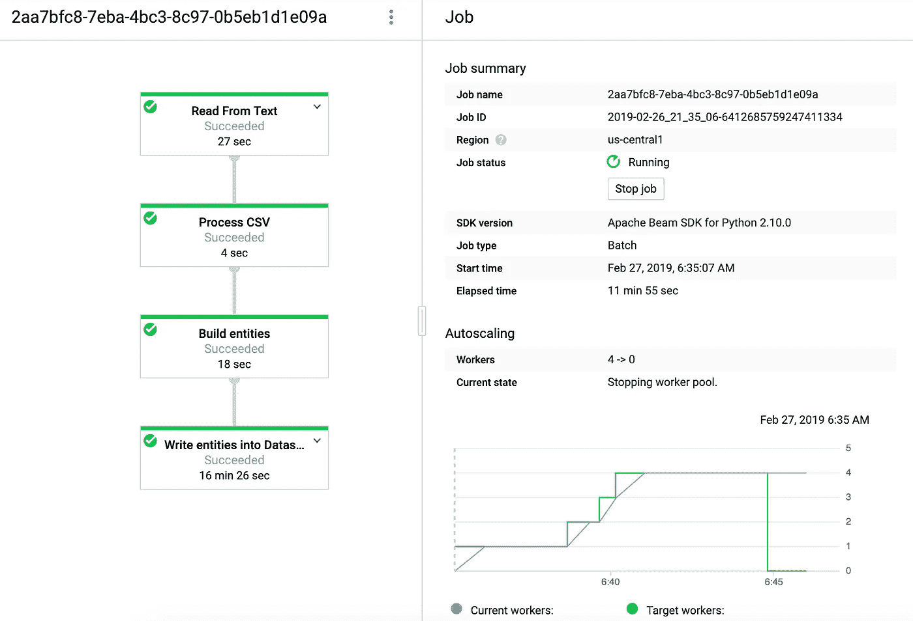
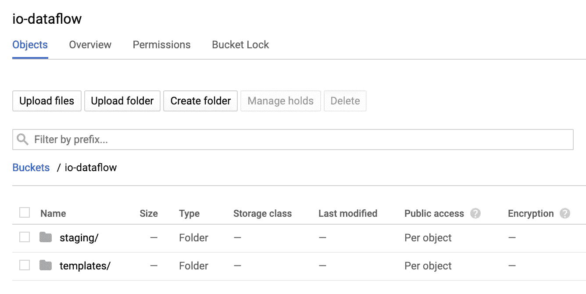
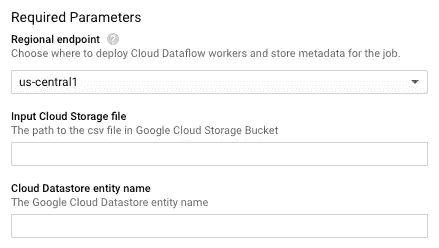
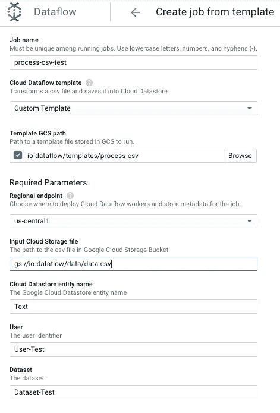
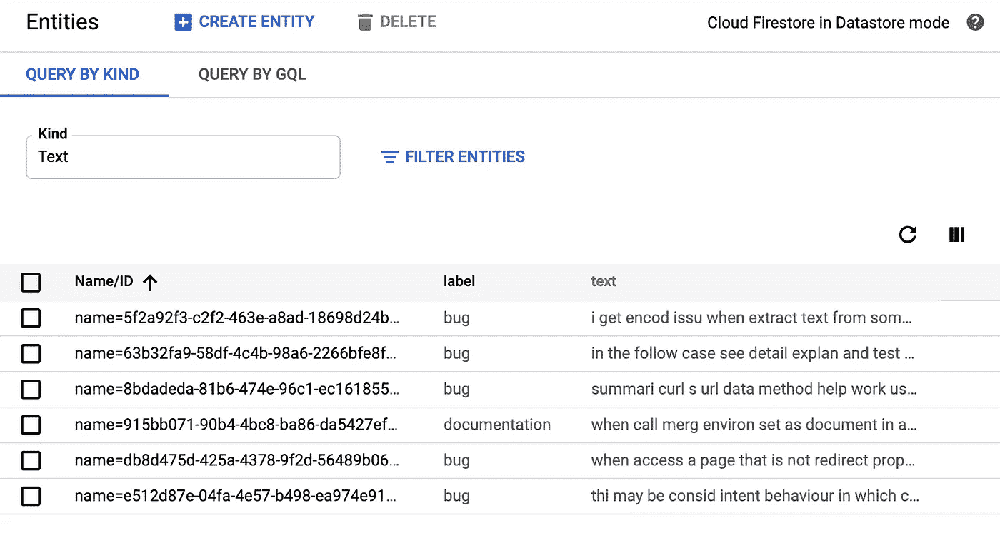

# 使用云数据流和云数据存储进行大数据处理

> 原文：<https://medium.com/google-cloud/large-data-processing-with-cloud-dataflow-and-cloud-datastore-839aae5ee372?source=collection_archive---------1----------------------->

## 了解如何并行处理大规模 csv 文件。

在我的一个[项目](https://ioannotator.com)中，我需要处理大小从几百 MB 到 GB 甚至 TB 的大型文本文件。用户上传一个 csv 文件，我们需要将每一行写入[谷歌云数据存储](https://cloud.google.com/datastore/)(非 SQL 文档数据库)。

显然，在这个大小范围内，使用简单的 web 服务器是无法存档的。这就是我利用[谷歌云数据流](https://cloud.google.com/dataflow)的地方，我编写了一个管道来处理这些 csv 文件，并将它们保存到谷歌云数据存储中。在这篇文章中，我想和你分享我是如何解决这个任务的。



运行中的数据流

> 大规模的文本注释可能很难，这就是为什么我目前正在构建一个可以在机器学习项目中使用的文本注释器。这篇文章是基于我在实现过程中的学习。如果你不想错过，就在 Twitter 上关注我吧。

# 先决条件

您需要两个需求:第一个是 apache beam 本身，第二个是数据流。请记住，如果您想在本地运行您的管道，您需要使用 Python 2.7。Apache Beam 还是[不支持 Python 3](https://issues.apache.org/jira/browse/BEAM-1251) 。

```
pip install apache-beam
pip install apache-beam[gcp]
```

对 [Apache Beam](https://beam.apache.org/documentation/) 和 [Google Cloud Dataflow](https://cloud.google.com/dataflow/docs/) 的基本了解是有益的。

# 如何启动数据流管道

基本上，您有五种选择来启动管道:

*   在本地，此选项适用于开发目的。
*   如果你想运行一次管道，直接在数据流中。
*   在数据流用户界面中。
*   使用 gcloud 命令。
*   Via [云数据流 API](https://cloud.google.com/dataflow/docs/reference/rest/) 。

请注意，对于最后 3 个选项，您需要创建一个数据流模板。

# 云数据流模板

要创建数据流模板，您必须使用**add _ value _ provider _ argument**value provider。这就是我们将参数传递给数据流管道的方式。例如，在我们的例子中，csv 文件的路径。

```
class ProcessOptions(PipelineOptions):[@classmethod](http://twitter.com/classmethod)
    def _add_argparse_args(cls, parser):
        parser.add_value_provider_argument(
           '--input',
           dest='input',
           type=str,
           required=False,
           help='Local file or a file in a Google Storage Bucket.')
```

如果您不使用模板，您可以简单地使用:

```
parser.add_argument(...)
```

# 建造管道

为了构建管道，我们创建一个管道对象并将`PipelineOptions`传递给它。

```
process_options = PipelineOptions().view_as(ProcessOptions)
p = beam.Pipeline(options=process_options)
```

我们的管道由 4 个不同的步骤组成:

1.  **从文本中读取:**从本地路径或 Google Cloud Bucket 中读取输入文件，这是我们的管道数据。
2.  **处理 CSV:** 我们的第一个[转换](https://beam.apache.org/documentation/programming-guide/#transforms)，它接受数据中的每一行并提取所需的信息。
3.  **构建实体:**创建云数据存储实体
4.  **写实体:**最后将每一行作为一个实体写入云数据存储。

```
(p
     | 'Read from text' >> beam.io.ReadFromText(process_options.input, skip_header_lines=0)
     | 'Process CSV' >> 
beam.ParDo(ProcessCSV(),['text','label'])
     | 'Build entities' >> 
beam.ParDo(BuildEntities(), process_options.entity)
     | 'Write entities into Datastore' >> 
WriteToDatastore('annotator'))
```

最后，我们运行我们的管道。

```
p.run().wait_until_finish()
```

# 创建数据流模板

要创建模板，我们必须用模板的 Google 云存储位置来定义`--template_location`。该命令如下所示:

```
python2 -m process \     
  --runner DataflowRunner \     
  --project io-annotator \     
  --staging_location gs://io-dataflow/staging \     
  --temp_location gs://io-dataflow/temp \     
  --template_location gs://io-dataflow/templates/process-csv \    
  --save_main_session True
```

该命令在给定的`--template_location`处创建模板:

```
INFO:root:A template was just created at location gs://io-dataflow/templates/process-csv
```

您的存储桶现在应该包含两个文件夹 staging 和 template:



# [计]元数据

此外，我们用元数据扩展模板，以验证我们的参数，并将有价值的信息添加到数据流 UI 中。



元数据文件遵循这个命名`<template-name>_metadata`，必须上传到 templates 文件夹。

```
{
  "name": "Transform CSV",
  "description": "Transforms a csv file and saves it into Cloud Datastore",
  "parameters": [{
    "name": "input",
    "label": "Input Cloud Storage file",
    "help_text": "The path to the csv file in Google Cloud Storage Bucket",
    "regexes": ["^gs:\/\/[^\n\r]+$"],
    "is_optional": false
  },
  {
    "name": "entity",
    "label": "Cloud Datastore entity name",
    "help_text": "The Google Cloud Datastore entity name",
    "is_optional": false
  }]
}
```

# 启动数据流模板

在本文中，我们将模板用于数据流用户界面。

要启动模板，请转到[数据流创建作业页面](https://console.cloud.google.com/dataflow/createjob)并选择自定义模板作为云数据流模板。我们需要额外的参数输入云存储文件和云数据存储实体名称。



运行作业并切换到云数据存储区以查看结果。



# 属国

这个话题花了我一些时间，☕，这就是为什么我想与你分享解决方案。

虽然 DirectRunner 在本地一切正常，但当我尝试在数据流中启动管道时，出现了以下错误:

```
NameError: global name 'csv' is not defined
```

原来，像`import csv` 这样的函数、变量和全局导入在云数据流作业的序列化过程中不会被保存。换句话说，全局名称空间的状态没有加载到云数据流工作器上。

查看[数据流常见问题解答](https://cloud.google.com/dataflow/docs/resources/faq?hl=en#how_do_i_handle_nameerrors)有助于解决这个问题，只需添加一个额外的管道选项。

```
--save_main_session True
```

# 云数据存储限制

云数据存储对 UTF-8 编码的属性有 1500 字节的限制。这意味着如果你想保存更多的单词，那么你会得到一个错误。如果你看一下[文档](https://cloud.google.com/datastore/docs/concepts/limits?hl=en)，你会很快注意到它只是对索引属性的一个限制。未编制索引的属性的最大大小是 1 MB，这足以满足我们的要求。

以下设置将属性从索引中排除。作为交换，你不能再搜索这个属性。

```
exclude_from_indexes=True
```

# 包扎

我希望我能与你分享如何使用云数据流来处理存储在谷歌云存储中的大文件，并将它们转换为云数据存储实体。

作为下一篇文章的一部分，我将与您分享如何将云功能和云数据流结合到无服务器的大型数据处理环境中，因为我们希望实现完全自动化的管道。

*感谢阅读。*

*本文的代码和示例数据可在* [*GitHub*](https://github.com/SaschaHeyer/Io-Data-Processing) *上获得。*

如果你喜欢我的文章，请留下一些掌声👏。
非常感谢您的反馈和问题，您可以在 Twitter 上找到我[*@ HeyerSascha*](https://twitter.com/HeyerSascha)*。*

# 关于作者

[Sascha Heyer](https://twitter.com/HeyerSascha)Io Annotator 创始人一个针对文本和图像的 AI 注释平台
，它提供了几种图像和文本注释工具。