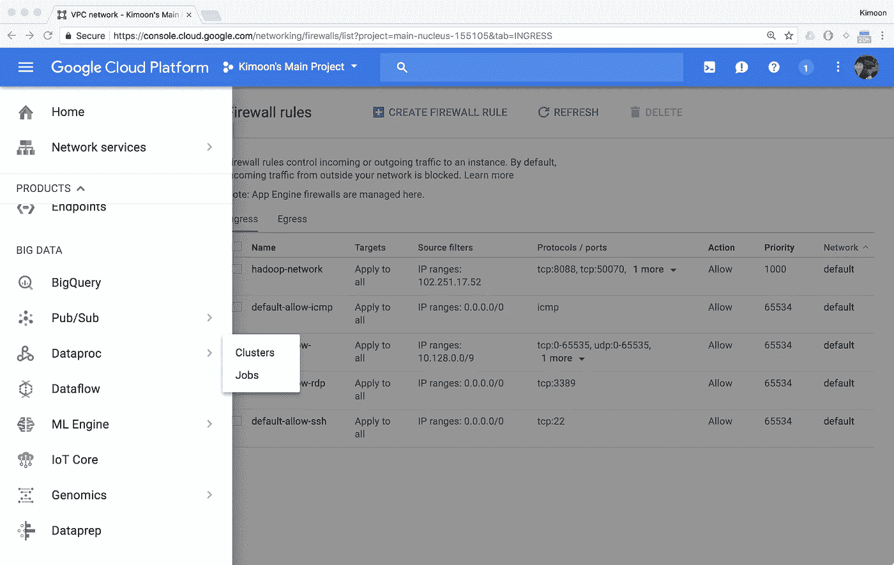
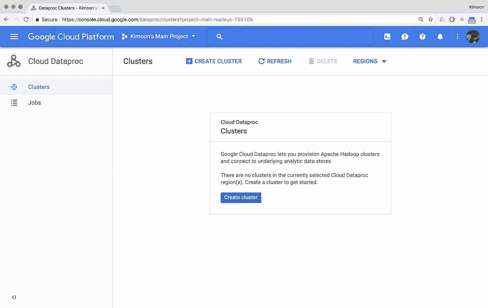

# 在 Google Cloud Dataproc 中，在 90 秒或更短时间内启动 Hadoop 集群！

> 原文：<https://medium.com/google-cloud/launch-a-hadoop-cluster-in-90-seconds-or-less-in-google-cloud-dataproc-b3acc1c02598?source=collection_archive---------1----------------------->

> “我说的是真心话，我说的是真心话。一头大象百分之百的忠实！”—苏斯博士

Hadoop，我们最喜欢的大象，是一个开源框架，允许你存储和分析跨计算机集群的大数据。这是通过使用谷歌的 [MapReduce](http://static.googleusercontent.com/media/research.google.com/en/us/archive/mapreduce-osdi04.pdf) 编程模型实现的，你可以在这里了解更多关于[的信息。](https://www.tutorialspoint.com/hadoop/hadoop_mapreduce.htm)

现在，启动本地 Hadoop 集群并非易事。我很幸运地参与了这个过程，知道建立这样一个组织需要付出多大的努力。作为参考，每个节点启动一个工作集群通常需要一天半的时间(例如，一个 10 节点的集群通常需要大约 15 个工作日)。谁有 15 天时间来构建一个 10 节点的集群？

最近在南非，企业和大数据初创公司对 Hadoop 产生了浓厚的兴趣。这就是为什么我认为现在是写一篇文章展示使用 [Google Cloud Dataproc](https://cloud.google.com/dataproc/) 启动 Hadoop 集群(一步一步)是多么容易的好时机。Cloud Dataproc 是 Google 完全托管的 Hadoop、Spark 和 Flink 服务，允许您以更简单、更具成本效益的方式部署集群。让我告诉你怎么做。

# 你需要什么

*   一个启用计费的谷歌云项目，你可以在这里了解如何做。
*   在谷歌中输入“我的 IP 是什么”，写下你的公共 IP 地址。

# 1.网络安装程序

## 第一步

转到您在**console.cloud.google.com**上创建的项目仪表盘

项目仪表板

## 第二步

点击屏幕左上方的**“汉堡包”**或**菜单**。

汉堡包或菜单

## 第三步

在**网络**下，将鼠标悬停在**网络服务**上，点击**防火墙规则**按钮。

防火墙规则

## 第四步

然后点击**创建防火墙规则**。

**VPC 网络**下入口流量的防火墙规则

## 第五步

键入您要为 Hadoop 网络指定的名称。

防火墙规则设置

## 第六步

1.  将**目标**从**“指定目标标签”**更改为**“网络中的所有实例”**。
2.  在**源 IP 范围**下，填入你一开始记下的**公共 IP** 地址。
3.  在**协议和端口**下，键入:**TCP:8088；TCP:50070；tcp:8080** 打开特定端口。
4.  点击**创建**。

防火墙规则设置

# 2.Dataproc 设置

## 第七步

点击**“Hamburger-stack”**或**菜单**并导航至**大数据**部分下的 **Dataproc** 。

菜单

## 第八步

点击**创建集群**按钮。

云 Dataproc 菜单

## 第九步

1.  为集群命名。
2.  为您的**主节点**和**主磁盘大小**设置您特定的**机器类型**(例如，n1-standard-4，磁盘大小为 10 GB)。
3.  为您的**工作节点**设置您特定的**机器类型**，并指定您需要多少个节点(例如，10 GB 磁盘大小的 x2 n1-standard-4)。
4.  您可以通过展开**“可抢占工人、存储桶、网络、版本、初始化、&访问选项”**链接来了解更多详情。
5.  **(可选)**您可以在不同的网络下创建 Hadoop 集群。出于本文的目的，我在这个集群所在的**默认**网络下创建了一个 **hadoop-firewall** 规则。
6.  完成后，单击**创建**按钮创建集群。

云 Dataproc 设置

## 第十步

等待(大约 90 秒)直到集群创建完毕。当你看到绿色的勾号时，你就知道完成了。

Dataproc 仪表板

# 3.测试您的 Hadoop 集群

## 步骤 11

点击**菜单**中**计算**部分下的**计算引擎**并记录。

## 步骤 12

记下您的**主节点的外部 IP 地址**(它是您的集群名称，后跟 **-m** )。

虚拟机实例

## 第十三步

在你的**浏览器**中键入**外部 IP:** 后跟**端口**(例如，在我的例子中是**35.195.107.25:8088**)，你应该会看到和我下面看到的一样的屏幕。

Hadoop 端口 8088:集群指标

恭喜你！看到多简单了吧？

如果你想在 Dataproc 上了解更多关于 Hadoop 的信息，请阅读 [Tino Tereshko](https://hackernoon.com/@thetinot?source=post_header_lockup) 关于 [**为什么 Dataproc 的精彩文章——谷歌的托管 Hadoop 和 Spark 产品是一个游戏改变者。**](https://hackernoon.com/why-dataproc-googles-managed-hadoop-and-spark-offering-is-a-game-changer-9f0ed183fda3)

在 twitter 上关注我@kimoon92，让我知道你的想法！

-金梦金