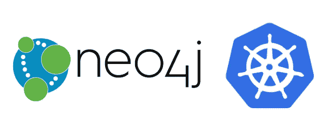
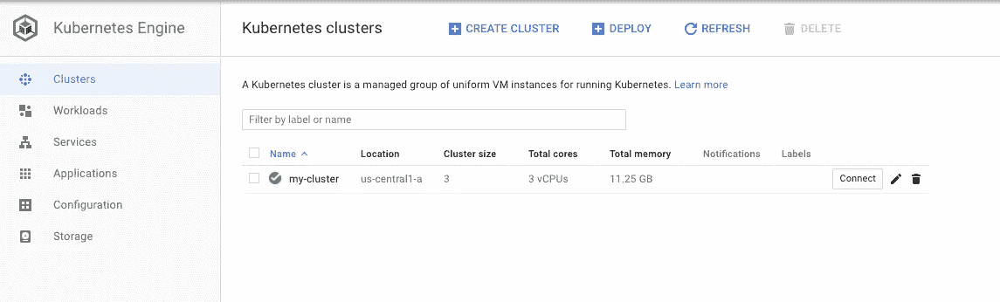
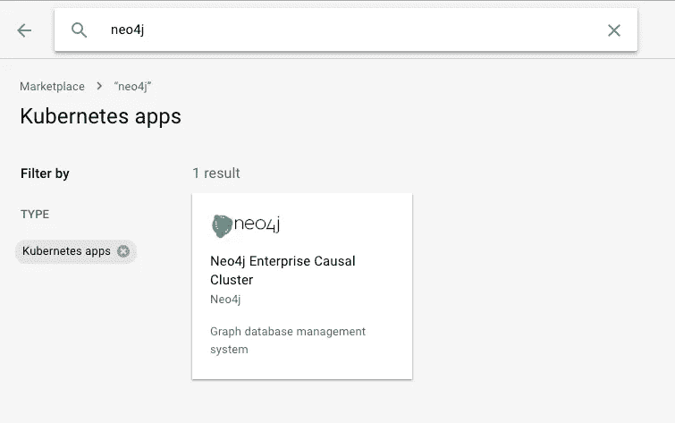
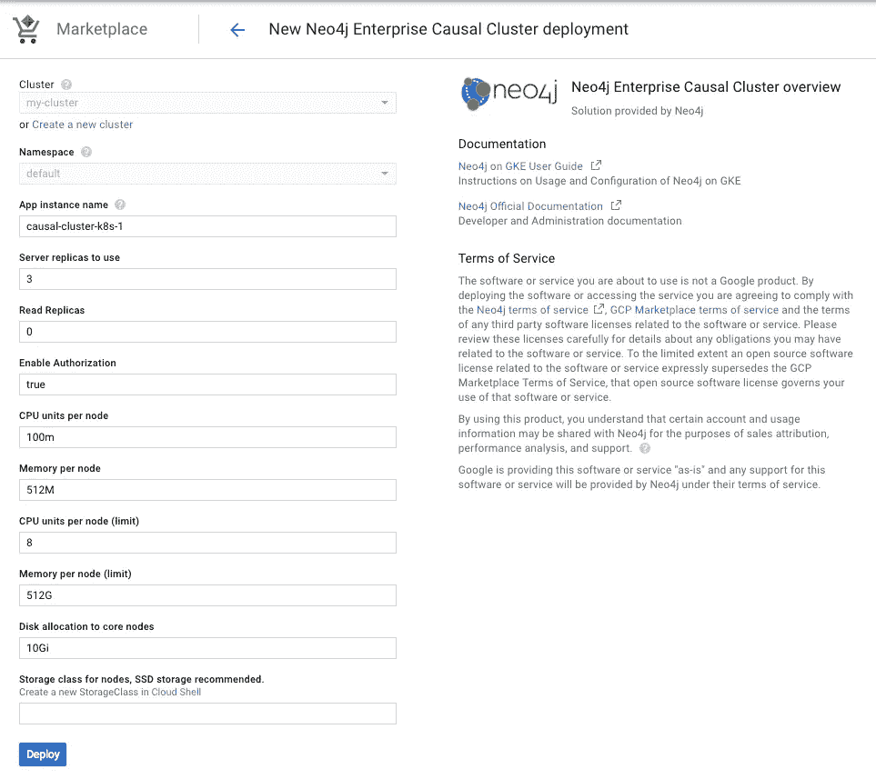
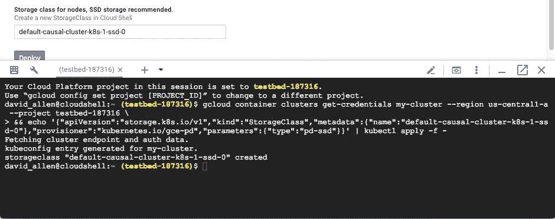
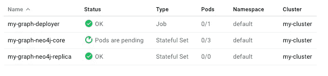
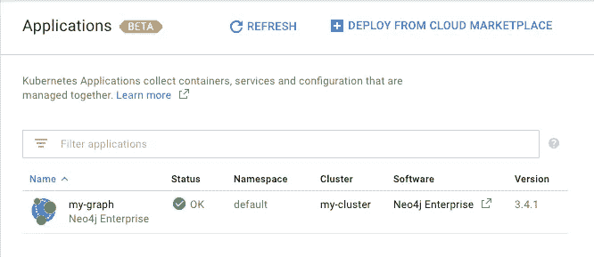

# 在谷歌的 Kubernetes 市场上发布 Neo4j

> 原文：<https://medium.com/google-cloud/launching-neo4j-on-googles-kubernetes-marketplace-97c23c94e960?source=collection_archive---------0----------------------->

在最近的 Cloud Next’18 大会上，谷歌宣布 Kubernetes 应用程序在 GCP 市场可用。其要点是，现在应用程序可以从市场安装到 Kubernetes 集群中，而无需编写任何 YAML。

Neo4j 是这个项目的合作伙伴之一，所以我想展示一下它在实践中是如何工作的，以及为什么它很酷。今天，我们将从“我没有 Kubernetes 集群”开始，用大约 10 分钟的时间在 Kubernetes 集群中运行 Neo4j 中的 Cypher。我们将使用 [Neo4j 市场入口](https://console.cloud.google.com/marketplace/details/neo4j-public/causal-cluster-k8s)。



# 创建 GKE 集群

让我们从[创建一个谷歌 Kubernetes 引擎(GKE)集群](https://cloud.google.com/kubernetes-engine/docs/how-to/creating-a-cluster)开始。GKE 是谷歌托管的 Kubernetes 服务。基本上是普通的 Kubernetes，带有一些漂亮的附加组件和一个很棒的命令行界面管理外壳。



成就解锁:闪亮的新 kubernetes 集群

现在我们已经准备好了，我们只需在 GCP 市场查找 Neo4j，确保使用“Kubernetes Apps”过滤器。你可以通过这个链接直接跳到正确的位置[。](https://console.cloud.google.com/marketplace/details/neo4j-public/causal-cluster-k8s)



# 部署 Neo4j

单击此磁贴将进入产品概述页面，页面上有一个大的“配置”按钮，我们将单击该按钮。在该产品概述页面上还有一个链接，链接到 Github 上的 [Neo4j on GKE 用户指南](https://github.com/neo-technology/neo4j-google-k8s-marketplace/blob/master/user-guide/USER-GUIDE.md)，以及重新创建该产品的功能所需的所有导航图和模板，或者根据您的需要进行定制。

配置我们的解决方案，设置集群数据库非常简单，我们只需要选择各种设置。最重要的是“服务器副本”,它控制 neo4j 集群中有多少核心节点，并读取副本。我将保留默认值，但这对于您集群中的容量来说是值得考虑的。您将开始一个至少有服务器副本+读取副本的有状态集。



因为 Neo4j 更喜欢固态硬盘，所以在撰写本文时，需要手动完成一个步骤——单击底部附近的“云壳”按钮来设置固态硬盘功能。如果您熟悉 Kubernetes，它会创建一个新的存储类并将配置应用到您的集群。该命令是预先填充的，您只需按 enter 键。



好了，现在我们准备好了，只需点击“部署”,容器立即开始被调度到您的集群上。谷歌会把你带到 GKE 集群窗口下的“应用程序”标签，向你显示事情进展的状态。当然，您可以深入这些工作负载中的任何一个，并检查单个容器的日志、状态等等。



GKE 工作负载菜单显示了我正在部署的核心单元

在您的集群完成部署后，这是令人满意的状态:



准备开始

# 等等，我的密码是什么？

当部署 neo4j 时，会为您选择并分配一个强密码，然后存储在 kubernetes 秘密中。您可以直接通过 GKE 用户界面选择 Configuration-> my-graph-neo4j-secrets，然后查看 neo4j-password 字段，或者您也可以从 kubectl 获取它，就像在您的云 shell 中一样:

```
$ kubectl get secrets my-graph-neo4j-secrets -o yaml | grep neo4j-password: | sed 's/.*neo4j-password: *//' | base64 --decode
3lg81oVvGY
```

(记得用您的部署名称替换“我的图形”)

您现在可以连接到内部 DNS 地址:

```
$APP_INSTANCE_NAME-neo4j.$NAMESPACE.svc.cluster.local
```

其中$APP_INSTANCE_NAME 是部署的名称，$NAMESPACE 是部署它的 kubernetes 名称空间。

# 创建一个简单的密码外壳

启动 shell 需要将解决方案容器调度到集群中，并运行 cypher-shell 作为它的入口点，如下所示:

```
$ kubectl run -it --rm cypher-shell \
   --image=gcr.io/cloud-marketplace/neo4j-public/causal-cluster-k8s:3.4 \
   --restart=Never \
   --namespace=default \
   --command -- ./bin/cypher-shell -u neo4j \
   -p "$NEO4J_PASSWORD" \
   -a $APP_INSTANCE_NAME-neo4j.default.svc.cluster.local
```

你在做生意。

# **更多信息**

请务必查看 github 上的 [Neo4j on GKE 用户指南，了解有关如何使用您的实例、如何设置 SSH 转发以使用 Neo4j 浏览器、定制您自己的 kubernetes/neo4j 解决方案所需的所有模板等更多信息。](https://github.com/neo-technology/neo4j-google-k8s-marketplace/blob/master/user-guide/USER-GUIDE.md)

如果您有任何其他问题，请在 [Neo4j 社区网站](https://community.neo4j.com/t/launching-neo4j-on-google-kubernetes-marketplace/2376)上与我们一起跟进！

开心图黑！