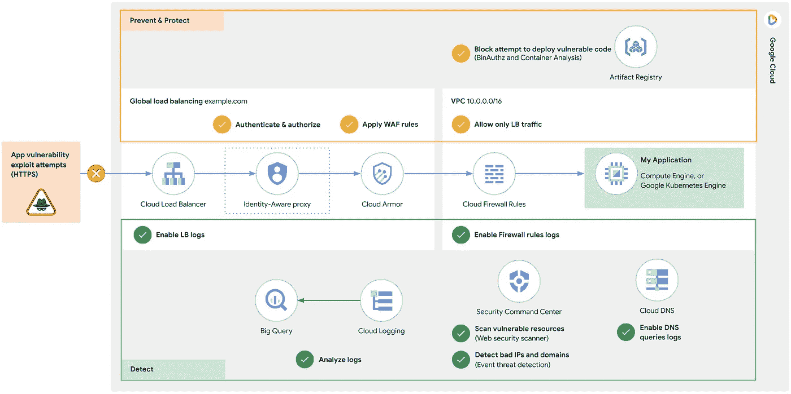
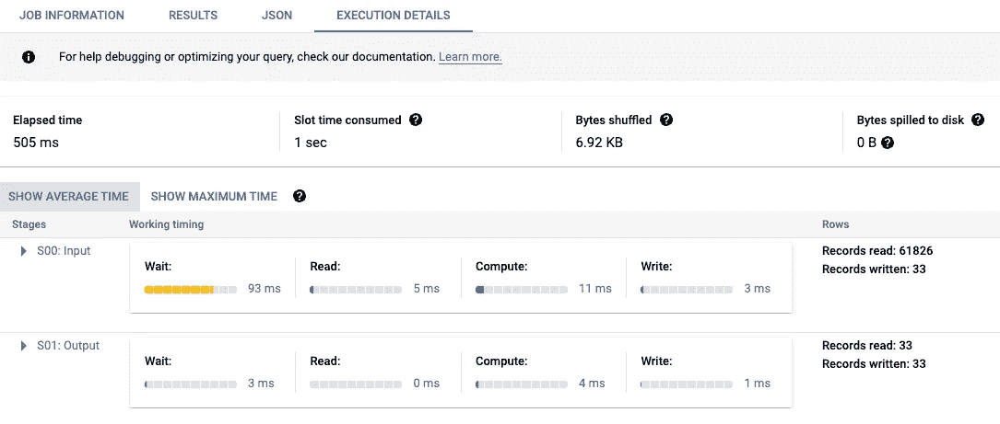
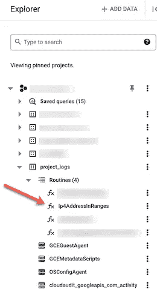
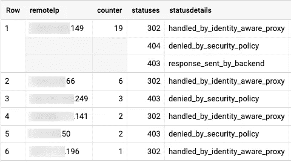
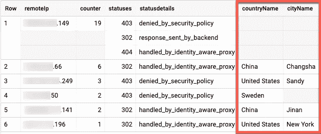

# 从 Log4j 2 漏洞中吸取教训—第 2 部分

> 原文：<https://medium.com/google-cloud/learning-from-log4j-2-vulnerability-eba946d31980?source=collection_archive---------4----------------------->

## 如何使用 BigQuery 检测和调查威胁

本博客系列的第二部分。参见第一部分 [*此处*](/google-cloud/learning-from-log4j-2-vulnerability-f1eabd06329e) *。*

好吧…我们需要谈谈从 Log4j 2 漏洞和您的云原生威胁防御中学到的东西。

在[之前的一篇文章](/google-cloud/learning-from-log4j-2-vulnerability-f1eabd06329e)中，我讨论了如何在 Google Cloud 中使用负载平衡器功能保护您的应用程序(在下面的黄色复选标记中)，以及如何使用云日志检测未来 Log4j 漏洞利用尝试的&警报(在下面的绿色复选标记中)。在本文中，我们将把日志导出并分析到 BigQuery，以获得高级分析、更长的保留期和更便宜的存储。

*GCP 深度防御类似 Log4j: Prevent，Protect & Detect*

确保您在所有面向互联网的 HTTP(S)负载平衡器上启用了 100%采样的日志记录[。到目前为止，您大概已经修补了您的应用程序，并启用了上图中突出显示的云防护和身份感知代理(如果适用)等关键保护。](https://cloud.google.com/load-balancing/docs/https/https-logging-monitoring)

使用云日志记录和云监控，我们能够快速检测威胁，并为未来的尝试设置连续警报。但是更高级的用例呢:

*   如果您需要进行更多**深度分析**如过滤或关联，该怎么办？例如，您可能希望过滤掉 Log4j 扫描，这些扫描可能来自良好的参与者，如 Google Cloud 自己的 Web 安全扫描器(上图中突出显示的安全命令中心的一部分)，它可以标记易受攻击的资源和应用程序。您可能还想对剩余的被过滤的攻击进行地理定位，以找出攻击实际上来自哪里，等等。
*   如果您需要进行超过过去 30 天的**历史分析**，这是默认的日志存储桶保留时间，该怎么办？分析较长时间内的日志可能会发现不久前开始的攻击链。出于合规性目的，也可能需要它。

这就是为什么在本文中，我们将使用 BigQuery 来补充我们在 Logs Explorer 中进行的[特别分析，以便进行更深入的分析。](/google-cloud/learning-from-log4j-2-vulnerability-f1eabd06329e)

首先，[按照这些说明](https://cloud.google.com/architecture/exporting-stackdriver-logging-for-security-and-access-analytics#configure_the_logging_export)来设置一个从云日志到 BigQuery 的本地日志接收器。确保您的日志过滤器没有排除位于`requests`日志，即`logName="/projects/[PROJECT_ID]/logs/requests"`中的 HTTPS 负载平衡器日志

**注**:参见[日志范围界定工具](https://cloud.google.com/architecture/exporting-stackdriver-logging-for-security-and-access-analytics#log_scoping_tool)帮助生成全面的日志过滤器，不仅包括 HTTPS LB 日志，还包括您可能需要的其他安全相关日志，如 DNS 查询、VPC 流日志和防火墙规则日志。在本文中，我们将只分析 HTTPS LB 日志。

# 搜索所有 Log4j 漏洞利用尝试

BigQuery 日志接收器自动将日志(包括 HTTP(S) LB 请求日志)从云日志路由到 BigQuery 表，遵循此[日志到表名映射](https://cloud.google.com/logging/docs/export/bigquery#partition-table-organization)约定。因为我们将日志接收器配置为使用分区表，所以 HTTP(S) LB 日志位于一个统一的**请求**表中。换句话说，所有 HTTP(S) LB 日志的目的表是`[LOG_SINK_BQ_PROJECT].[LOG_SINK_BQ_DATASET].requests`，其中`LOG_SINK_BQ_PROJECT`和`LOG_SINK_BQ_DATASET`是您在创建日志接收器时指定的 Google Cloud 项目和 BigQuery 数据集。

让我们转到 BigQuery 控制台中的 SQL 工作区，在用各自的值替换了`LOG_SINK_BQ_PROJECT`和`LOG_SINK_BQ_DATASET`之后，运行下面的查询:

这将返回过去 30 天内所有 Log4j 漏洞利用尝试。假设您在相同的时间窗口内运行，您应该获得与您在 Logs Explorer 中查询相同的日志条目(在[第 1 部分](/@arsan/learning-from-log4j-2-vulnerability-f1eabd06329e))。在我们的例子中，我们在大约 0.5 秒内从大约 61.8k 的请求中检索出同样的 33 个日志条目:

# 筛选出好演员

如前所述，这些 Log4j 扫描可能来自恶意或善良的参与者。例如，你可能已经在使用谷歌云的[网络安全扫描仪](https://cloud.google.com/security-command-center/docs/concepts-web-security-scanner-overview)。在这种情况下，您希望过滤出相应的记录的[静态 IP 地址范围](https://cloud.google.com/security-command-center/docs/how-to-use-web-security-scanner#static_ip_address_ranges_for_managed_scans)。为此，我们可以用 JavaScript 创建一个 BigQuery 用户定义函数(UDF ),进行一些逐位数学运算，确定给定的 IPv4 地址是否在给定的 CIDR 范围内。

运行下面的查询来创建一个名为`Ip4AddressInRanges()`的新函数。它遍历每个 CIDR 范围，如果 IPv4 输入字符串属于任何传递的 CIDR 范围，则返回 TRUE:

现在，您的项目中有了一个可用的 BigQuery 函数。它接受一个输入 IPv4 字符串，即一个或多个 CDIR 范围字符串的数组，并根据该 IPv4 地址是否在任何范围内返回 TRUE 或 FALSE。

正在创建名为 Ip4AddressInRanges()的新 BigQuery 用户定义函数(UDF)

现在，让我们回到原始查询，在 WHERE 子句中添加以下语句，以过滤出 Web Security Scanner IP 范围和/或您可能拥有的任何其他合法 IP 范围:

# 按违规 IP 分组

为了识别潜在的攻击者，让我们首先按照远程 IP 地址对这些请求进行分组，并按照最活跃的请求进行排序:

查询结果应该类似于(部分编辑的 IP 地址):

试图利用 Log4j 漏洞的顶级违规 IP

# 地理定位攻击

现在，让我们从地理上确定这些攻击实际上来自哪里。键入以下查询，将违规 IP 的结果列表与在 [GeoLite2](https://dev.maxmind.com/geoip/geoip2/geolite2/) 地理位置表中找到的位置数据相关联(详细信息将在此 Google [博客](https://cloud.google.com/blog/products/data-analytics/geolocation-with-bigquery-de-identify-76-million-ip-addresses-in-20-seconds)中进一步描述)。确保将前一部分中的查询作为子查询进行粘贴，以使用排名靠前的违规 IP 结果填充下面的`log4j_exploit_attempts`临时表。

查询结果应如下所示，其中国家/地区和城市名称附加到每一行的地理定位 IP 地址中:

尝试利用富含地理位置数据的 Log4j 漏洞的顶级违规 IP

如您所见，除了第一个 IP 地址之外，所有 IP 地址的地理位置信息都找到了。GeoLite2 数据库[是免费的，但不如 MaxMind 的 GeoIp2 数据库](https://dev.maxmind.com/geoip/geolite2-free-geolocation-data)精确，这里使用的后处理 GeoLite2 BigQuery 表是历史快照。

也就是说，事实证明，第一个 IP 地址“[redacted].149”位于俄罗斯。因此，这些利用漏洞的尝试大多来自俄罗斯或中国，也有一些来自美国和瑞典。幸运的是，正如您可以从响应状态详细信息中看到的，绝大多数都被我们的云防御成功阻止了。由于我们已经配置了我们的云装甲安全策略和我们的身份感知代理访问控制，这些尝试都没有到达我们的后端应用程序。

**注意**:这个 BigQuery 地理编码示例是为了说明的目的而展示的。您可能希望使用更新的 GeoLite2 或 GeoIP2 后处理 BigQuery 表，或者您自己的下游可视化或 BI 工具(如 Looker 或 Tableau)中可用的其他地理编码方法。

# 下一步是什么？

现在，您应该更熟悉使用 Google Cloud 的 HTTPS 负载平衡器日志来预防、检测和警告潜在的 Log4j 和其他 web 漏洞利用。借助 BigQuery 的强大功能，您可以快速分析和调查这些威胁。

如果你对这个和其他安全或合规性问题感兴趣，请查看社区支持的代码为 repo for Google Cloud 的[威胁检测，您可以使用和扩展更多开箱即用的威胁检测查询。这些基本的示例查询不仅涵盖网络活动(如本博客所示)，还涵盖其他类别，如登录模式、密钥管理、配置活动以及数据或工作负载使用情况。](https://github.com/GoogleCloudPlatform/threat-detection-as-code)

狩猎愉快！