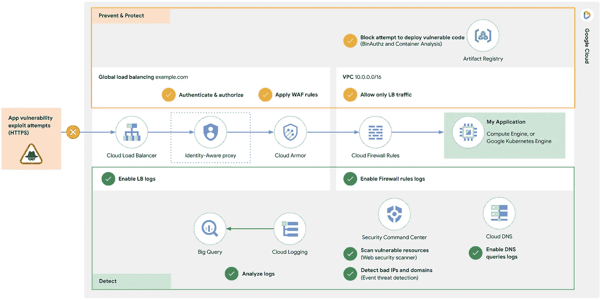

# 从 Log4j 2 漏洞中吸取教训—第 1 部分

> 原文：<https://medium.com/google-cloud/learning-from-log4j-2-vulnerability-f1eabd06329e?source=collection_archive---------3----------------------->

## 如何使用云操作套件检测威胁并发出警报

本博客系列的第一部分。 [*见第二部分使用 BigQuery*](/google-cloud/learning-from-log4j-2-vulnerability-eba946d31980) *调查威胁。*

你以为我们已经讨论完 Log4j 2 漏洞了吗？

到目前为止，您已经修补了所有易受攻击的应用程序，并确保正确启用和配置了云原生威胁防御工具。对吗？干得好！这是不是意味着我们结束了？

Log4j 漏洞利用([CVE-2021–44228](https://nvd.nist.gov/vuln/detail/CVE-2021-44228)和[CVE-2021–45046](https://nvd.nist.gov/vuln/detail/CVE-2021-45046))的后果为许多组织的安全态势评估敲响了警钟:

1.  我的应用程序现在和将来都受到保护吗？
2.  我的申请被泄露了吗？
3.  如何提醒我未来的漏洞利用企图？

在过去的几周里，我和你们中的几个人一起在谷歌云上工作，希望基于你们自己的 GCP 日志来回答这些问题以及更多的问题。我们需要对过去的 Log4j 漏洞利用尝试进行历史分析，并检测未来的潜在漏洞。这个博客系列旨在为更广泛的 GCP 社区整合这些提示和技巧。

所以，让我们戴上侦探帽，做一些威胁狩猎…

在继续之前，请确保您已经在所有面向互联网的 HTTP(S)负载平衡器上启用了具有全保真度(采样率= 1.0)的日志记录[(如果您还没有这样做的话)。](https://cloud.google.com/load-balancing/docs/https/https-logging-monitoring)

去吧，我等着。云日志不可追溯，所以没有日志，没有答案！

好的，让我们继续…

# 我的应用程序受到保护了吗？

值得注意的是，在 Google Cloud 中有两套安全控制可供您使用:预防性控制和检测性控制。我在下图中突出显示了其中的一些控制措施，预防性控制措施用黄色标记，检测性控制措施用绿色标记。在这篇博文中，我们将重点关注检测控件，特别是日志记录，以监控利用企图**和**，确保您的预防性控件配置正确。



*GCP 针对 Log4j 等漏洞的深度防御:防止、保护&检测*

此图是一些云原生威胁防御工具的简要概述，我们建议您利用这些工具来构建分层的深度防御架构，以帮助缓解 Log4j 和其他类似的漏洞利用，特别是:

*   **身份感知代理**(或 BeyondCorp)，用于基于上下文和身份(相对于基于网络)的访问控制。[为您的 HTTPS 负载平衡器](https://cloud.google.com/iap/docs/load-balancer-howto)启用 IAP，以实现零信任。
*   **云装甲**为您的应用提供 DDoS 和 WAF 保护，支持 HTTPS 负载平衡器。[使用预配置的 WAF 规则启用云装甲安全策略](https://cloud.google.com/blog/products/identity-security/cloud-armor-waf-rule-to-help-address-apache-log4j-vulnerability)，包括针对 Log4j 的新“cve-canary”规则。

将此图视为帮助您回答您的应用程序是否受到保护的蓝图。正如您将在后续部分看到的，正确配置 IAP 和 Cloud Armor 后，您应该可以验证您的应用程序是否受到了保护。

有关 Log4j 漏洞风险管理的最新建议，请参见谷歌网络安全行动小组的这篇官方[谷歌云文章。](https://cloud.google.com/blog/products/identity-security/recommendations-for-apache-log4j2-vulnerability)

# 是否有任何 Log4j 漏洞利用企图？如果是，针对哪个应用程序？

让我们使用 Logs Explorer 对过去的 Log4j 2 漏洞利用尝试进行快速专门调查:

1.  导航到[日志浏览器](https://console.cloud.google.com/logs/query)
2.  选择您的云项目(通常是生成日志的地方，也是 HTTPS LB 资源驻留的地方)

**注意**:如果日志是从不同的项目聚合到一个集中的存储桶中(非常常见)，选择 Refine Scope to Scope by storage view，以便同时搜索多个项目的 LBs 日志。有关存储视图的更多信息，请参考[管理日志桶的日志视图](https://cloud.google.com/logging/docs/logs-views)

3.在查询字段中输入以下内容，并点击**运行查询**:

生成的日志条目都是在指定时间段内尝试利用 Log4j 漏洞的 HTTP 请求。在我的测试环境中，30 天内有 33 次攻击尝试。

让我们按目标应用程序对这些进行细分:

1.  从任何结果日志条目的扩展字段中单击*resource . labels . back end _ service _ name*字段值。
2.  选择**将字段添加到日志字段窗格**。

现在，您可以看到随着时间的推移，哪些应用程序成为了攻击目标，以及攻击次数。在我们的测试环境中，我们可以看到历史上有 3 项服务成为目标:


Log4j 漏洞利用尝试按目标后端细分(日志浏览器用户界面)

# 我的申请被泄露了吗？

这些尝试不一定是妥协，因为许多可能已被 IAP 和/或云装甲阻止，但请求仍由 HTTPS LBs 记录。要了解这些请求是否到达了您应用程序，让我们按 HTTP 请求状态详细信息进行分类:

1.  点击任意日志扩展结果中的*jsonpayload . status details*字段值。
2.  选择**将字段添加到日志字段窗格**

现在，您可以看到这些攻击企图是如何被处理的。在我们的测试环境中，正如预期的那样，所有请求都被身份感知代理(`statusDetails=handled_by_identity_aware_proxy`)或云装甲(`statusDetails=denied_by_security_policy`)阻止，只有两个请求到达了后端应用程序:


按响应细分的 Log4j 漏洞利用尝试(日志浏览器用户界面)

让我们通过在日志字段窗格中选择`json_payload.statusDetails`下的`response_sent_by_backend`,深入探究这些到达后端服务的尝试，得到以下查询:

和过滤的日志条目:


到达后端的 Log4j 漏洞利用尝试(日志浏览器 UI)

这显示了 12 月 27 日在我的测试环境中我的一个面向互联网的应用程序中的两个漏洞。这个特定的应用程序没有 Log4j 漏洞，并对这些请求返回 404“未找到”。在我用针对我的测试环境中的 Log4j 漏洞的新 WAF 规则“cve-canary”更新了 Cloud Armor 安全策略之后，后续请求无法到达应用程序。我们现在已经验证了 WAF 规则“cve-canary”已经创建并正确应用，通过阻止 Log4j 漏洞来帮助保护我们的应用程序。请注意，Cloud Armor 中的 WAF 规则并不保证能够检测到所有可能的漏洞利用企图，但会随着行业对这一漏洞和其他新漏洞的了解而自动管理和更新。

然而，这是一个我们应该定期进行的分析。更好的是，如果有任何漏洞通过，我们希望得到提醒。让我们接下来做那件事。

# 如何提醒我未来的漏洞利用企图？

我们已经完成了历史搜索(虽然只是在过去 30 天内)，但是如何设置连续的接近实时的搜索呢？为此，让我们使用:

*   Cloud Logging 设置一个基于日志的自定义指标**来统计 Log4j 攻击进入我们后端应用的数量，然后，**
*   云监控设置一个**警报策略**以便在发生事故时通知我们。

为了避免警报疲劳，我们不会对像 Cloud Armor 这样的本机工具阻止的每一次攻击尝试发出警报，而只会对实际到达我们后端应用程序的攻击发出警报，因此我们将重用最后一个查询。

1.  导航到[基于日志的指标](https://console.cloud.google.com/logs/metrics)
2.  选择**创建指标**
3.  选择**计数器**类型，填写名称、描述，复制上面的日志查询作为过滤器


用于计数到达后端的 Log4j 漏洞利用尝试的自定义指标(基于日志的指标 UI)

**注意**:基于日志的度量数据以每分钟 1 个数据点的速度写入，但是只有当有匹配的日志条目时。如果没有匹配的日志条目，则不会在这些时间戳的指标时间序列中写入数据点。基于日志的指标的时间序列中的每个数据点代表自上一个数据点以来的**增量**。

现在，单击新创建的基于日志的指标旁边的**更多操作**，并选择**从指标创建警报**以导航到预填充了目标或监控过滤器的云监控>警报向导。


检测到 Log4j 尝试时触发的警报策略(云监控 UI)

在我们的案例中，目标指标是:

```
metric.type="logging.googleapis.com/user/log4j_exploits"
```

我们希望在*任何*应用程序上发生此类攻击企图时收到警报，因此我们将设置警报策略，以汇总给定滚动时间窗口内的所有事件，并针对任何时间序列(即任何应用程序)发出警报。

警报条件包括:

*   滚动窗口:10 分钟
*   滚动窗口功能:总和
*   时序聚合:无
*   条件类型:阈值
*   警报触发:任何时间序列违反
*   阈值位置:高于阈值
*   阈值:0

如果您设置了包括电子邮件在内的警报策略通知渠道，则一旦警报触发，您将收到以下内容:


近乎实时地发送电子邮件通知，提醒 Log4j 漏洞利用企图

您可以点击直接从电子邮件中查看日志，并确认和解决事件。这些是可操作的警报，因为只有实际到达后端应用程序的尝试才会触发警报。这意味着有人禁用或错误配置了您的缓解工具，如防火墙规则或云装甲 WAF，或者只是推出了不遵循公司政策的新应用程序，从而绕过了这些保护工具。修复配置后，您可以关闭事件。默认情况下，事件会在 7 天后自动关闭。

# 下一步是什么？

因此，我们设置了我们自己的云防御，如 Cloud Armor，使用 Logs Explorer 进行了一些特别的分析，并通过云监控实现了实时警报。为了进一步调查这些利用漏洞的企图，[请参见本系列的第 2 部分](/google-cloud/learning-from-log4j-2-vulnerability-eba946d31980)，其中我们利用了 BigQuery 的高级分析功能，例如:

*   按违规 IP 分组的聚合
*   过滤以去除好演员，以及
*   丰富/关联这些攻击的地理位置来源。

狩猎愉快！！