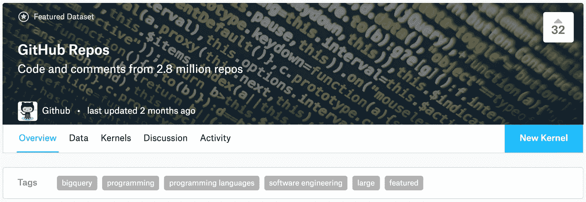
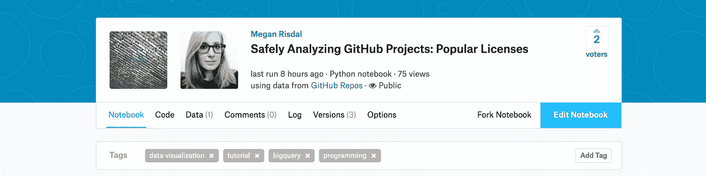
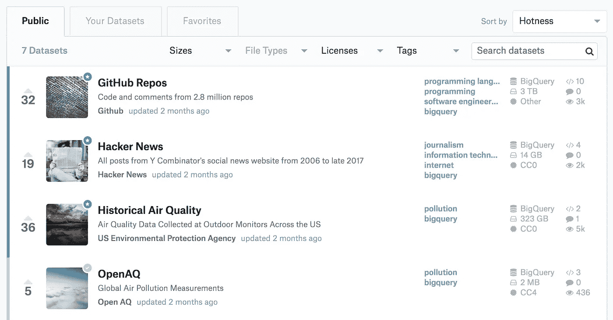
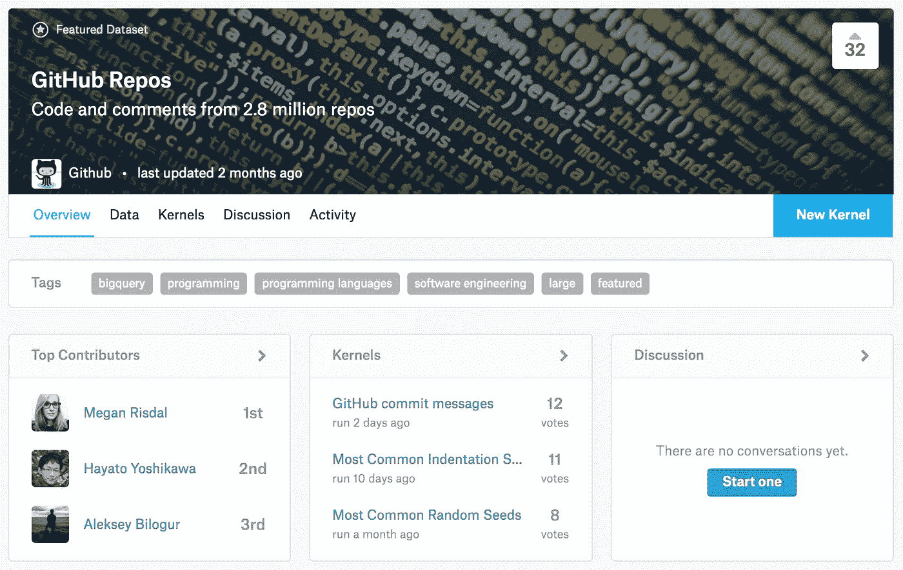
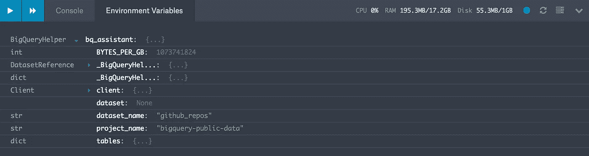
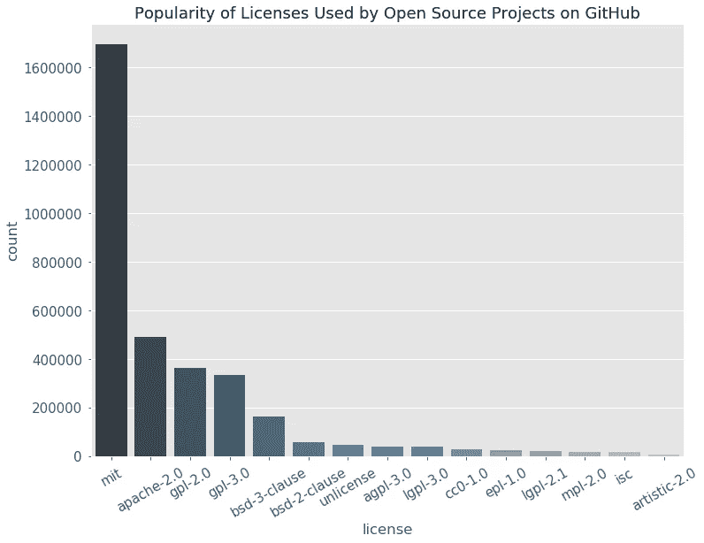

# 学习在 Kaggle 上使用 Python 分析巨大的 BigQuery 数据集

> 原文：<https://medium.com/google-cloud/learning-to-analyze-huge-bigquery-datasets-using-python-on-kaggle-2c6c6153f542?source=collection_archive---------0----------------------->

在过去的几周里，我学会了如何使用 Python 来分析一些 BigQuery 很酷的公共数据集。如果你不熟悉的话，BigQuery 使得在几秒钟内查询万亿字节的数据变得非常容易。

在这篇文章中，我将分享一些在内核中使用 Python(ka ggle 的免费编码环境)分析 BigQuery 数据的技巧和诀窍。最后，您将看到编写和执行自己的查询是多么容易。此外，您还将了解 GitHub 上基于成千上万个开源库的最受欢迎的许可证。

# 背景

最近， [Kaggle](https://www.kaggle.com/) 让几个 BigQuery 公共数据集如 [GitHub Repos](https://www.kaggle.com/github/github-repos) 和[黑客新闻](https://www.kaggle.com/hacker-news/hacker-news)可以访问。这有几个好处:

*   您可以获得 5TB 的 30 天免费配额
*   您可以使用内核在 Python 中查询和分析数据
*   没有信用卡，零风险支付任何款项

免费配额加内核的一键式笔记本环境使其成为学习使用大数据的完美沙盒。你所需要的只是一个帐户。

*如果你喜欢以交互方式学习本教程，请点击* [*跳到我的内核*](https://www.kaggle.com/mrisdal/safely-analyzing-github-projects-popular-licenses/notebook) *。只需点击蓝色的“Fork Notebook”按钮，自己执行代码。*

# 第一步:Kaggle 上的 BigQuery 数据集

第一步是在 Kaggle 上找到可访问的 BigQuery 数据集。转到 [Kaggle 数据集](https://www.kaggle.com/datasets)并在“文件类型”下拉菜单中选择“BigQuery”。[你会得到这样一个列表](https://www.kaggle.com/datasets?filetype=bigQuery):

我将选择 GitHub Repos 数据集。你可以在这里阅读费利佩·霍法对这个惊人的 3TB 数据集的介绍。事实上，你可能已经看过他比较制表符和空格的分析。

下面是 Kaggle 上的 [GitHub 回购数据集页面](https://www.kaggle.com/github/github-repos)的样子:

现在我已经准备好开始分析数据了，我要做的就是点击“New Kernel”。幸运的是，我不必担心软件包安装或下载任何东西，所以从现在开始，我可以专注于代码(你也可以！).

# 第二步:查询数据

在这部分教程中，我将演示如何使用这个 [BigQuery 助手模块](https://github.com/SohierDane/BigQuery_Helper/blob/master/bq_helper.py)安全地查询 Kaggle 上可用的最大 BigQuery 数据集 [GitHub Repos](https://www.kaggle.com/github/github-repos) 。总重量为 3TB，您可以看到，对于我来说，快速用完 5TB 的 30 天配额扫描大型表是多么容易。

`bq_helper`模块简化了我们使用 Kaggle 上的 BigQuery Python 客户端库可以完成的常见只读任务。

在本节中，您将学习如何使用`bq_helper`完成以下工作:

1.  创建一个`BigQueryHelper`对象
2.  了解数据集中的表
3.  在进行查询之前，估计一下查询的大小
4.  安全地执行查询

## 创建 BigQueryHelper 对象

首先，我们使用`bq_helper`创建一个`BigQueryHelper`对象。这需要项目名称和数据集名称作为它的两个参数。

下面是我用来为 GitHub 数据集创建一个名为`bq_assistant`的`BigQueryHelper`对象的代码。在幕后，这将建立一个经过身份验证的会话，并准备对 BigQuery 中的数据集的引用。

当您在 Kaggle 的内核中运行这段代码时，您会在内核编辑器的环境变量查看器中看到一个`BigQueryHelper`对象，如下所示。

我们只需要在会话中创建这个对象一次，它就可以用于我们向它抛出的任何查询。

## 了解数据集中的表

通过 GitHub 数据集的`BigQueryHelper`对象`bq_assistant`，我们可以使用几个超级简单的只读函数来了解更多关于数据的信息，包括:

*   列表表格:`bq_assistant.list_tables()`
*   获取表模式:`bq_assistant.table_schema("licenses")`
*   正在检查表格行:`bq_assistant.head("licenses", num_rows=10)`

这些都是不需要花费配额就能感受到想要处理的数据的简单方法。

当然，如果您继续分叉[这个内核](https://www.kaggle.com/mrisdal/safely-analyzing-github-projects-popular-licenses/notebook)，您也可以通过点击“数据”选项卡并查看文件预览来获得所有这些信息。

## 在进行查询之前，估计一下查询的大小

现在是真正酷的部分。我们渴望开始分析 GitHub BigQuery 数据集，以揭示对开源软件开发的见解，但我们应该小心我们在查询中扫描了多少数据。让我们把那些免费的 5TB 也算进去吧！

幸运的是，`bq_helper`模块为我们提供了工具，在我们超越自己之前，可以非常容易地估计我们的查询的大小。见下文:

`估算 _ 查询 _ 大小'的结果

无需运行查询，我们现在知道它将“花费”近 18GB。现在，您可以看到为什么知道这一点非常有帮助，而不需要实际花费配额！

注意，该查询显然不会返回 17.6GB 的对象，它只会返回 2000 条相当短的提交消息。

让我们更改查询，看看会发生什么:

第二个` estimate_query_size `的结果

同样，我们扫描的是同样的 17.6GB，这是`message`字段的完整大小。教训:您正在扫描的数据并不等同于您期望查询作为其结果返回的数据。[查看 BigQuery 的最佳实践文档](https://cloud.google.com/bigquery/docs/best-practices)了解更多信息。

不要因此而气馁。当您 *do* 发出查询请求时，您的结果将被默认缓存。只要您在同一个交互式内核会话中，您就可以多次运行同一个单元/查询，而无需花费多倍的配额成本。咻！漂亮的缓存行为特别有用，因为当你点击“新建快照”来保存你的工作时，你的内核将从头到尾被执行一次。

## 安全地执行查询

既然我们已经习惯了手边的大量数据，并且知道我们可以自信地估计查询的大小，那么让我们实际尝试获取一些数据吧！

`query_to_pandas_safe`函数是另一个`bq_helper`函数，它调用执行我们的查询。与使用基本的 BigQuery Python 客户端库相比，它有两个优点:

*   默认情况下，它不会执行大小估计超过 1GB 的查询
*   它返回一个方便的熊猫数据帧

让我们在第一个查询中测试一下`query_to_pandas_safe`。如果它工作正常，查询将无法执行，因为我们知道它扫描 17.6GB 的数据。

我们的查询被取消，因为它将扫描超过 1GB 的数据

不出所料，查询因超过 1GB 的估计数据量而被取消。

有了这些函数，我们现在可以安全地编写并执行一个查询来帮助回答我们的问题:**GitHub 上共享的开源项目最流行的许可证是什么？**

让我们使用我们在`estimate_query_size`和`query_to_pandas_safe`中学到的最佳实践来查询 GitHub BigQuery 数据集的`licenses`表:

执行此查询需要几秒钟。现在我们已经有了熊猫的数据框架，我们进入了非常熟悉的数据科学领域。

# 第三步:可视化最流行的 GitHub 项目许可证

一旦我们将它们可视化，我们的查询结果(以及我们学习 BigQuery 的努力)都会变成现实！我将使用`matplotlib`和`seaborn`来创建一个条形图，显示按许可类型划分的 GitHub 项目的数量。

下面是我在我的内核中使用的代码:

这是最终的柱状图:

这表明，与接下来最常见的许可相比，MIT 是最受欢迎的许可:Apache 2.0 和 GPL 2.0 和 3.0。因为这是 Python，所以我写了更多的代码来可视化我的数据，而不是从 BigQuery 检索查询结果。在 BigQuery 中分析大数据是多么的简单快捷，令人惊叹。

声明一下，[我写的 Python 内核](https://www.kaggle.com/mrisdal/safely-analyzing-github-projects-popular-licenses)是 Apache 2.0 许可的。:)

# 结论

我希望你喜欢这个演练，并学到了一些新的东西。就我个人而言，我对探索这个巨大的 3TB 数据集充满信心，因为我知道在`bq_helper`中可用的函数可以防止我意外地花费超过我预期的配额。

以下是在 Kaggle 内核中使用 BigQuery 数据集的一些附加资源:

*   SQL 新手？报名参加 Kaggle 于 2 月 15 日开始的[为期 5 天的 SQL 寻宝游戏](https://www.kaggle.com/sql-scavenger-hunt)，学习这门实用语言
*   [ka ggle 上所有 BigQuery 资源的集合](https://www.kaggle.com/product-feedback/48573)
*   探索 Kaggle 上所有可用的 BigQuery 数据集——每个数据集都有自己的“启动内核”供您使用

*在评论中告诉我你的想法或者关注我* [*推特*](https://twitter.com/MeganRisdal) *。感谢*[*sohire Dane*](https://www.kaggle.com/sohier)*创建了* [*BigQueryHelper 模块*](https://github.com/SohierDane/BigQuery_Helper) *。*