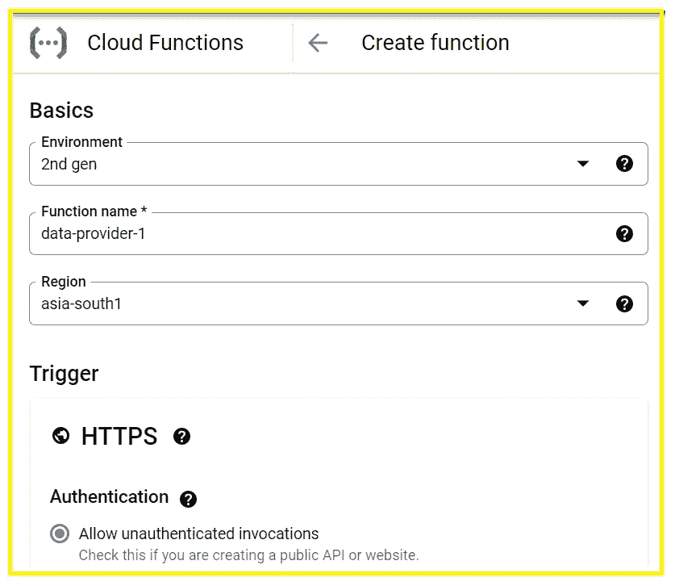
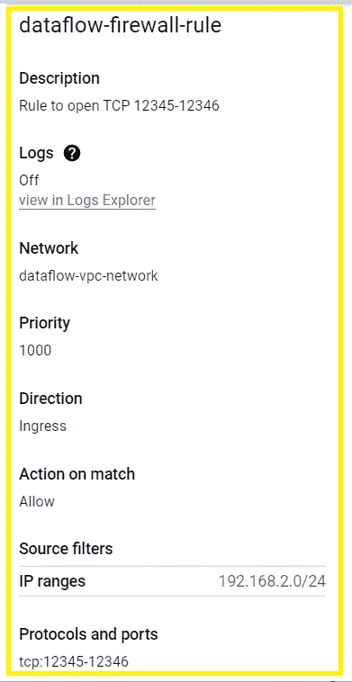
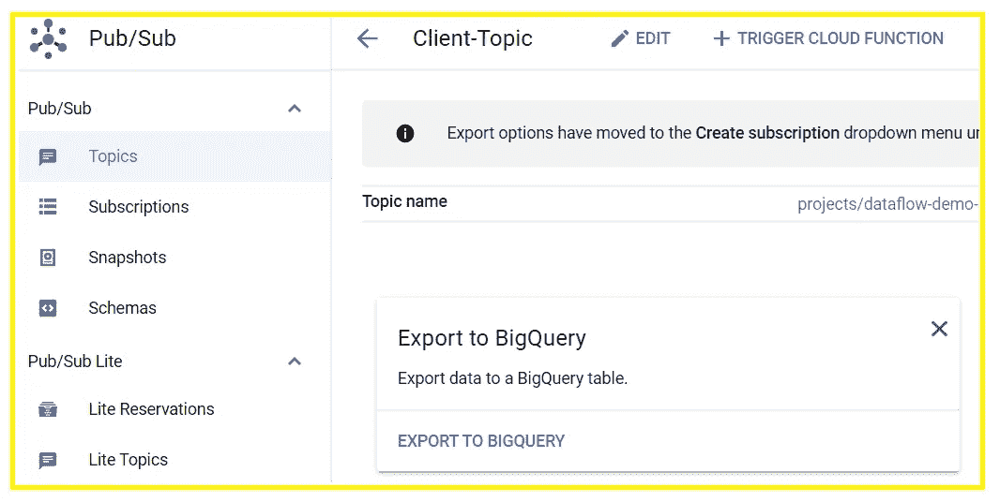

# 让我们顺流而下

> 原文：<https://medium.com/google-cloud/lets-flow-with-dataflow-4559bbc6d221?source=collection_archive---------3----------------------->

考虑一个场景，您希望从发布/订阅主题向 Bigquery 发送数据。有哪些可能的选择？选项 1:只需编写一个函数来映射来自主题的数据，并将其发送给 BigQuery。对吗？很简单，不是吗？但是，不能。这样的解决方案将局限于 BigQuery 中允许的少量事务。BigQuery 每天只能处理 100，000 个事务，因此，我们需要一种流式方法，在这种方法中，我们可以连续流式传输数据，因此，“*让我们与数据流*一起流动”。

D ataflow 是一种完全托管的流分析服务，通过自动缩放和批处理最大限度地减少延迟、处理时间和成本。对于本文，我们将使用下面的 GCP 服务:

*   发布/订阅主题
*   云函数
*   Bigquery
*   VPC 和子网
*   云存储
*   数据流

## 发布/订阅主题:

主题将消息从发布者转发到订阅者。创建一个发布/订阅主题很容易。进入谷歌控制台，搜索主题并点击“创建主题”。给出任何名称，然后像下面这样创建:

## 云功能:

我们将使用云函数向发布/订阅主题连续发送数据，这些数据随后将流向 Bigquery 表。因此，我们将以 JSON 格式发送数据，稍后将作为记录插入表中。

让我们进入谷歌控制台，搜索云功能并点击创建功能。您可以选择下面显示的详细信息:

我是一个 Java 开发人员，我用 Java 11 运行时，编码发送 JSON 到题目。你可以随意使用任何语言。示例代码可从[https://cloud.google.com/pubsub/docs/publisher](https://cloud.google.com/pubsub/docs/publisher)获得

## BigQuery:

我们已经准备好了来源。现在，我们需要目的地。正如开始时提到的，我们将把所有数据流式传输到 BigQuery 表中。因此，让我们创建一个包含相应表的数据集。在控制台中搜索 BigQuery。在左侧选项卡中，您应该看到您的项目 id。点击三个点，选择“创建数据集”。

数据集出现后，再次单击已创建数据集的三个点，然后单击“Create Table”。

传递表名并创建您的模式。请确保您的模式与我们将从 Cloud Function 提供的 JSON 相对应。

## VPC 和子网:

要创建数据流，我们需要一个 VPC 子网，以便流在同一个网络中工作。让我们开始创建 VPC，在控制台中搜索 VPC 网络，然后点击“创建 VPC 网络”。

给出名称和描述，并在子网创建模式中选择“custom ”,因为我们只需要为将部署数据流管道的区域设置一个子网。

数据流工作者虚拟机(VM)必须到达谷歌云 API 和服务。为此，它要求开放 TCP 12345–12346 端口。我们可以在 VPC 的防火墙规则中打开它。您可以在 VPC 网络详细信息中找到防火墙选项卡，如下所示:

单击创建防火墙规则，给出名称，并添加允许的所需 TCP 端口。

## 云存储:

为了处理临时文件，数据流将数据写入临时位置。因此，我们将创建一个桶，其中包含一个空白的临时文件夹。

## 数据流:

是时候了！让我们从数据流创建开始！转到我们之前创建的发布/订阅主题，并选择“导出到 BigTable”。

选择“使用数据流”选项，然后点击“继续”。选择区域。最初，我选择了亚洲南部 1(孟买)，但是我找不到资源。因此，我使用美国中心 1。所以，你也可以选择相同的。给创建的表命名为 BigQuery 和一个临时位置，如下所示。对于这个临时位置，我只是在 Google Storage 中创建了一个 bucket，并创建了一个空文件夹。

给出我们之前创建的网络名称。我们还需要以这种格式提供子网:`[https://www.googleapis.com/compute/v1/projects/HOST_PROJECT_ID/regions/REGION_NAME/subnetworks/SUBNETWORK_NAME](https://www.googleapis.com/compute/v1/projects/HOST_PROJECT_ID/regions/REGION_NAME/subnetworks/SUBNETWORK_NAME)`

终于，我们准备好了！点击“运行作业”:

我们的数据流管道应该如下图所示。

数据流

耶！

让我们快速测试我们的管道！让我们运行之前创建的云函数，将一些数据推送到 BigQuery。

要运行云功能，您可以点击 HTTP 端点或使用测试功能进行测试。可以在功能中找到测试选项卡，只需点击“云壳中测试”，查看 BigQuery 表即可。

我已经发送了 JSON 有效负载来从函数生成流。因此，对于我的情况，我们将在下表的计数中看到新的记录:

*BigQuery 通过将分析数据的计算引擎与您的存储选择分开，最大限度地提高了灵活性。您可以在 BigQuery 中存储和分析数据，或者使用 BigQuery 评估数据所在的位置。联邦查询允许您从外部数据源读取数据，而流支持连续的数据更新。像 BigQuery ML 和 BI Engine 这样的强大工具可以让您分析和理解这些数据。*

*确保阅读参考链接中的数据流定价。*

## 参考资料:

*   [https://cloud.google.com/bigquery/quotas](https://cloud.google.com/bigquery/quotas)
*   [https://cloud.google.com/pubsub/docs/publisher](https://cloud.google.com/pubsub/docs/publisher)
*   [https://cloud . Google . com/data flow/docs/guides/routes-firewall](https://cloud.google.com/dataflow/docs/guides/routes-firewall)
*   [https://cloud . Google . com/data flow/docs/guides/specificing-networks](https://cloud.google.com/dataflow/docs/guides/specifying-networks)
*   【https://cloud.google.com/bigquery-ml/docs/introduction 
*   [https://cloud.google.com/dataflow/pricing](https://cloud.google.com/dataflow/pricing)

希望你喜欢。

如果您有任何相关的疑问，请随时联系我。如果可以的话，我很乐意帮助你。保持联系:)

**领英:**[**www.linkedin.com/in/sakshikhandelwal276**](http://www.linkedin.com/in/sakshikhandelwal276)**推特:**[**www.twitter.com/SakshiKhandlwl**](https://twitter.com/SakshiKhandlwl)