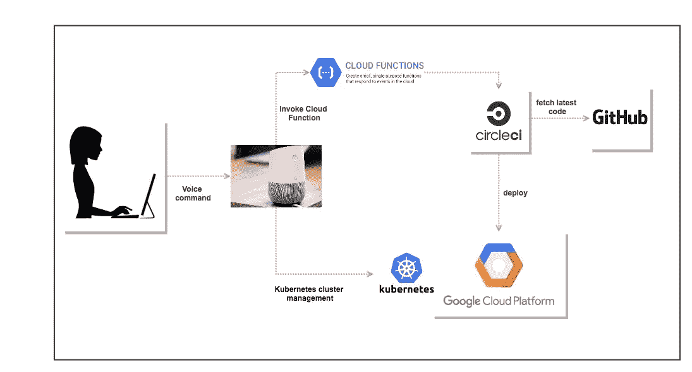
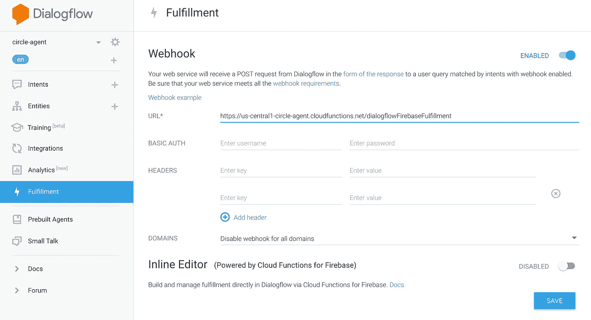

# 让我们讨论一下 Google Home、CircleCI 和 Google Container Engine 的部署

> 原文：<https://medium.com/google-cloud/lets-talk-deployments-with-google-home-circleci-and-google-container-engine-f4121703ef26?source=collection_archive---------2----------------------->

我们如何使用 Google Home 来推动我们与 CircleCI 的一些 DevOps 工作。请参见本页末尾的概念验证视频。

> **背景**:在[过去的文章](/@nithinmallya4)中，我描述了我们进入谷歌云平台的旅程，以及我们如何利用我们的发现提出想法来简化我们的构建/测试/部署过程，并与社区分享它们。
> 
> 我们处理了涉及后端服务、发布/订阅用户、存储桶、CloudSQL 数据库、众多 GCP 项目、证书、cdn、多种环境(QA、试运行(预生产)、冒烟测试和生产)的部署。这引发了蓝/绿部署和其他创新方法，在保持稳定的部署速度的同时，不会破坏生产中的应用程序。CircleCI 是满足我们需求的优秀工具，他们的 API 非常好。为此我们使用了 CircleCI 1.0 和 2.0。

现在，我们已经可以在不到 5 分钟的时间内以完全自动化的方式将我们的应用程序部署到生产环境中，我想看看我们还能做些什么来简化我们的日常工作。

所以，我决定开始说。也就是和 Google Home 对话。

> Google Home 是一个语音激活的扬声器，类似于亚马逊的 Alexa。你可以使用谷歌助手与它交流，这是一个虚拟的个人助理。经典的例子包括询问天气，让它播放你的 Spotify 播放列表中的歌曲等。当你想用它做更多的事情时，你可以通过创建一个动作来扩展它的功能。
> 
> 在我的例子中，我有一个允许我构建和部署 Google 云平台的操作，所以我会通过说“O **k，Google”这样的话与助手进行交互。与开发运营助手"**交流。
> 
> 它是由 [DialogFlow](https://dialogflow.com/) (以前的 API。AI)，这是一个基于你的输入进行学习的对话平台，允许你将你的需求转化为行动。

本文的其余部分将讨论我们如何使用 Google Home 和 DialogFlow 工具(以前的 API)。AI)使用自然语言理解来为我们做一些繁重的工作。

下图来自 Google，展示了从用户到设备到 DialogFlow (API)的流程。AI)调用 node.js 编写的云函数。

来源:[https://www . slide share . net/bretmc/Google-home-and-Google-assistant-workshop-build-your-own-server less-action-on-Google-app](https://www.slideshare.net/bretmc/google-home-and-google-assistant-workshop-build-your-own-serverless-action-on-google-app)

下图显示了用户如何通过语音命令与 Dev Ops 助手(在我们的例子中是 Google Assistant)进行交流。这些命令反过来执行 Google Cloud 函数(node.js)。Cloud 函数调用 CircleCI 中的 RESTful APIs，这些 API 触发我们在 GitHub 中的存储库的各个分支中的构建。

图中还显示了第二个交互，其中一个应用程序托管在 GCP，并公开了一个端点，该端点调用 Kubernetes APIs(类似于 **kubectl** 所做的)来管理 GKE 集群。

使用 Google Assistant 和 CircleCI 将应用程序部署到 GCP

虽然有许多家庭应用程序，但我们可以通过以下方式利用谷歌助手满足工作中的一些需求:

1.  **指导助理构建和部署**我们的各种环境。当然，我们也使用 CircleCI-Github webhooks，但这更有趣，本文后面的演示视频就是这么做的。
2.  **使用 K8s APIs 查询您的 GCP Kubernetes 集群**(我们广泛使用谷歌容器引擎)以获取更多信息并修改我们的部署、副本、服务等。用语音命令。您可以轻松地启动/关闭您的工人(Rails 世界中的 ActiveJobs)，扩展您的部署，并做 Kube API 允许您做的几乎任何事情。
3.  **查看系统运行状况的仪表盘，生产错误**，应有尽有。如果它可以通过 RESTful 端点交付，那么最有可能通过询问 Google Home 来获得。

在很高的层次上，您需要了解以下内容:

1.  您已经在[动作控制台](https://console.actions.google.com/u/0/?pli=1)中创建了一个项目
2.  您理解以下概念:

> a**Actions**:Actions 帮助你联系用户，把事情做好。例如，在演示中，我使用了一个动作，允许我开始构建和部署到我选择的环境中。
> 
> E **实体**:实体是用户提供给助手的值。例如:在流行的谷歌主页视频中，你可以看到用户指定他们想要的比萨饼配料。在我的例子中，我使用" **environment** "实体来告诉助手我想要在什么环境中进行构建/部署。

> **意图**:意图是用户告诉助手的。简单来说，用户说类似于“**我想做一个 QA 版本**”可能是一种意图。您可以训练助手微调用户请求，并将它们映射到正确的意图。我有几个意图，包括一个“**env-intent”**，它处理我将应用程序部署到不同环境的请求。

> 完成:最终，你的意图需要做“一些事情”。这可能是用静态响应来响应您的请求，也可能是来自后端服务的更动态的响应。Fulfillments 通过允许您指向对应于 HTTPS RESTful API 的 WebHook 来帮助实现这一点，该 API 可以是应用程序中的端点，也可以是提供所需输出的 Google Cloud 函数。在我的例子中，node.js 中的云函数调用一个 RESTful CircleCI API，该 API 触发我的 Github 存储库中的主构建和开发分支。

在下面的视频中，我使用 Google Home 在两种不同的环境中开始构建:QA 和 Staging。这只是我们能做的一些事情的一个例子，还有很多可能性。

> ***结论*** *:总体来说，这是一个非常顺利的过程。从建立行动项目到创建一个简单的应用程序，它有潜力做更多的事情。与 Google Home 设备本身的集成是无缝的。*

> **请注意**，谷歌上有一些关于如何开始使用自定义助手的优秀资源，您可以在下面的链接中找到它们。我将很快分享我的 Github repo 和更多的实现细节。

## 资源:

1.  谷歌助手:[https://home-assistant.io/addons/google_assistant/](https://home-assistant.io/addons/google_assistant/)
2.  云功能:[https://cloud.google.com/functions/](https://cloud.google.com/functions/)
3.  对谷歌的行动:[https://developers.google.com/actions/](https://developers.google.com/actions/)
4.  构建自己的无服务器操作:[https://www . slide share . net/bretmc/Google-home-and-Google-assistant-workshop-build-your-own-server less-action-on-Google-app](https://www.slideshare.net/bretmc/google-home-and-google-assistant-workshop-build-your-own-serverless-action-on-google-app)
5.  我以前关于这些主题的文章:[https://medium.com/@nithinmallya4](/@nithinmallya4)