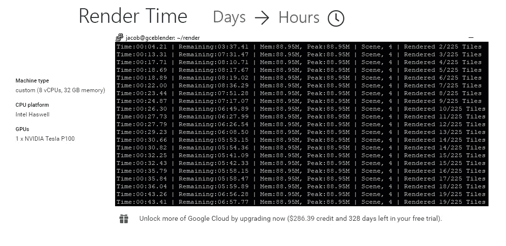
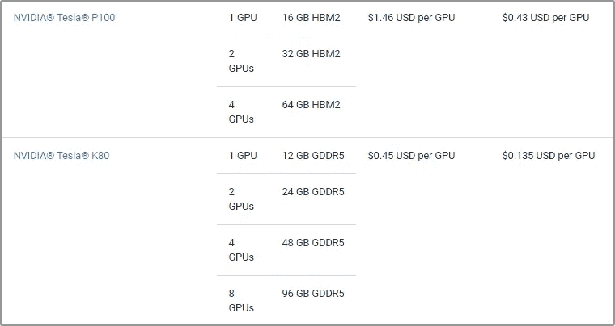
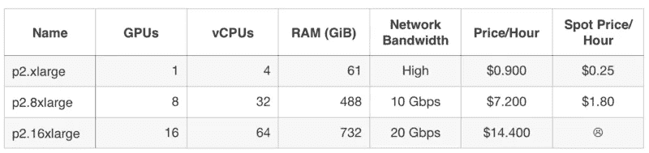
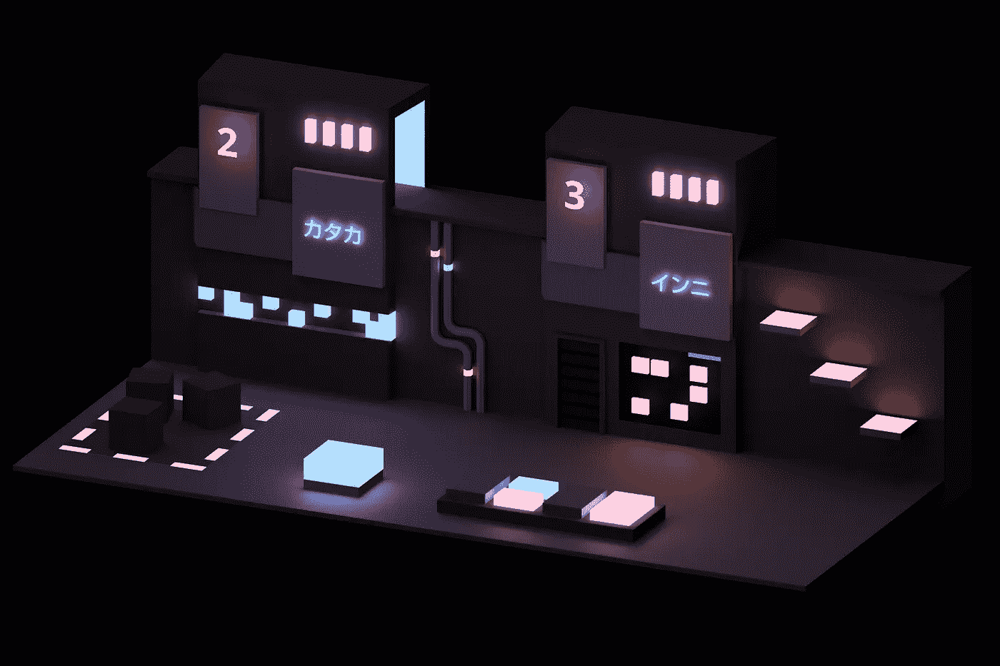
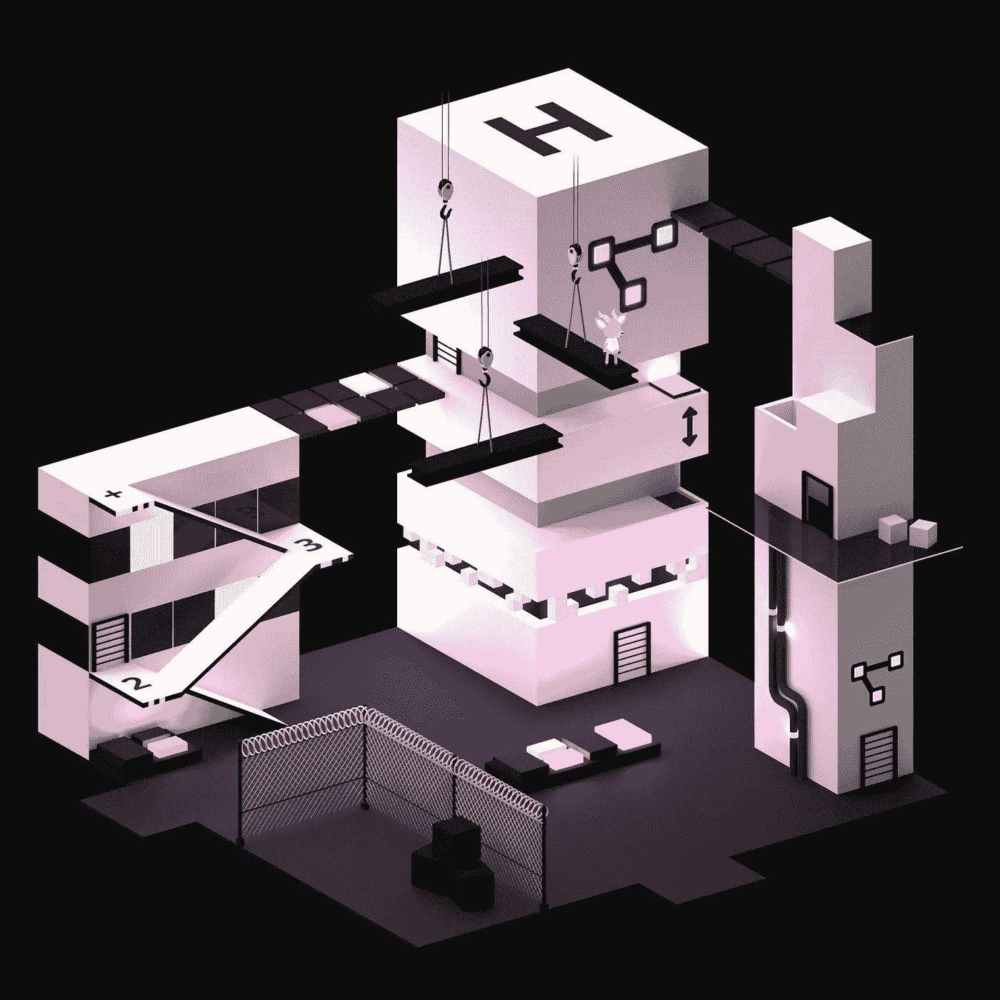
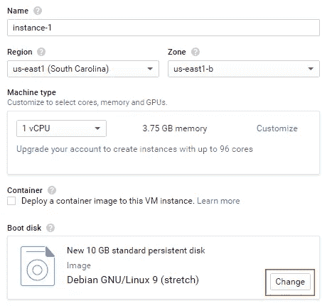
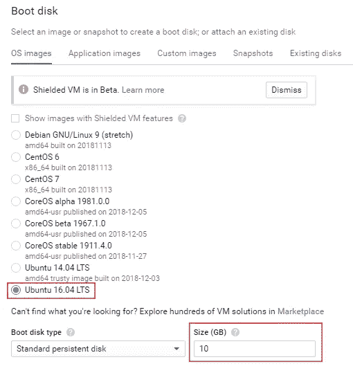
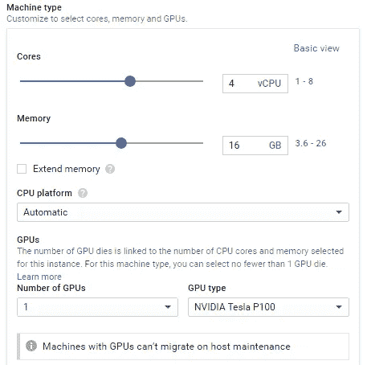
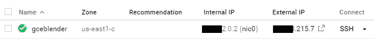
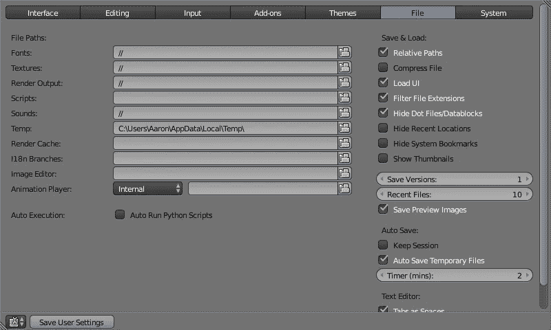

# 利用谷歌计算引擎进行低成本的 GPU 渲染(以及其他有趣的耐心练习)

> 原文：<https://medium.com/google-cloud/leveraging-google-compute-engine-for-low-cost-gpu-rendering-and-other-fun-exercises-in-patience-bf621cd6b0ae?source=collection_archive---------0----------------------->


对于我的游戏项目 [Elliot & Ko](https://twitter.com/cloutsocks) ，我倾向于需要大量的前期 GPU 资源和时间。我没有处理在各种低端设备上实时制作漂亮东西的传统难题，而是选择预渲染极高质量(因此需要大量资源)的渲染，然后将这些渲染作为 2D 资产与假 3D 物理进行实时合成。

这一切都很好，除了我的 GPU 像一个土豆的事实。在借用了一个朋友的更好的硬件(带有一定的讽刺意味，他是一名开发人员 Google Compute Engine)之后，我决定直接从源头入手，在云硬件上安装一个低成本的远程系统。

# 用例一览

*   通过远程处理要求苛刻的作业节省时间并释放 PC 资源(同时节省功耗)
*   3D 渲染或烘焙，尤其是在 Blender 中
*   高 GPU 产量，如后期效果渲染、各种 Unity 任务(预先计算的照明等。)



# 硬件和定价

如果你还不知道，**当你第一次注册谷歌的云平台时，谷歌会提供 300 美元的信用额度。与此同时，[今年早些时候](https://cloud.google.com/blog/products/gcp/introducing-preemptible-gpus-50-off?hl=nl)，谷歌以更低的成本推出了“可抢占的”GPU，你可以以美分/小时的价格运行几千美元的硬件，第一次试用在技术上是免费的……谁知道要多久。**

成本和可用性[因地区](https://cloud.google.com/compute/pricing#gpus)而异，但最终它比亚马逊的“现货实例”更便宜，还有诱人的信用。不过，如果你对 AWS 感兴趣，这里概述的一切都适用于那里，这里有一个出色的类似草案[详细介绍了 AWS 的设置。](/@Mikulas/blender-rendering-on-aws-p2-61f7fb8405d8)



美国东部地区谷歌定价摘录；右栏是可抢占价格



AWS 定价，用于比较

注意，两项服务的每小时价格，*向上取整*。它们的配置选项都非常通用，所以选择一个功能更强大(每小时成本更高)的设置通常会节省成本和时间，只需很少的时间即可完成。这是很容易的游戏，并调整到你喜欢的。

在本文中，我们也将在我们的实例中使用 Linux，原因有二:它更便宜，而且(通常)更快。这一点在 Windows 10 上的 Blender 等特定程序中表现得尤为明显，这些程序会经历一个名为*的 Windows 显示驱动程序模型*的过程，开销很大。也就是说，有人写了一篇关于绕过这个特殊问题的精彩文章[这里](http://blog.thepixelary.com/post/167616662857/improving-performance-of-blenders-cycles)。



体积照明，反射和盘绕栅栏的细微阴影都将我的渲染时间推到了平均硬件上令人沮丧的高数字

# 入门指南

第一步是在谷歌注册[，如果你还没有注册的话。瞧啊。$300.你有整整 365 天的时间来度过。从那里，前往](https://console.cloud.google.com/freetrial)[实例控制面板](https://console.cloud.google.com/compute/instances)并选择**创建实例**，在那里你会看到以下选项菜单:



给你的实例起一个令人难忘或可区分的名字，比如 *GCE Rendering* 之类的。之后点击**更改**配置操作系统和大小。我选择了 Ubuntu 16.04.5 LTS，因为这是我所习惯的，但是如果你更熟悉另一个 Linux 发行版，那就试试吧！你还需要设置一个磁盘大小——存储空间很便宜，但你仍然要为此付费，所以选择你需要的有一点剩余空间的空间；我选择了 15 GB 左右，没有一个我接近完成。



接下来我们可以设置机器类型*和*区域；请记住，并非所有硬件都适用于所有地区，而且价格也各不相同。在[谷歌](https://cloud.google.com/compute/pricing#gpus)查看，并相应配置；您可以在以后毫不费力地更换虚拟机上的 GPU、CPU 和 RAM，但是更改区域需要您创建一个新的虚拟机实例。就我的目的而言，我去了美国东部地区，这给了我特斯拉 K80 和更强大的特斯拉 P100，这两者对我来说都绰绰有余。



如果你在寻找机器类型的确切规格，我帮不了你！这完全取决于手头的工作和资源限制。一些作业严重依赖 CPU 并需要大量内存，其他作业可以充分利用 2x 或 4x GPU 设置。事实上，我的实例总是根据任何给定工作的概要进行调整，这确实是处理事情的最佳方式；在作业发生时评估作业、使用情况、限制和执行时间，并根据需要进行调整。我在下面增加了一个**剖析**的部分，但是当我们谈论小钱的时候，超过一个小时几乎不是一个昂贵的错误。

接下来，单击**管理、安全性、磁盘、网络、单独租赁**扩展一些附加选项。

## 启动脚本

粘贴下面的启动脚本(或者你选择的 Linux 发行版的等效命令，Google 有类似的指令[这里](https://cloud.google.com/compute/docs/gpus/add-gpus#install-gpu-driver))。这将在启动时安装 CUDA，这对于 Nvidia 卡上的 GPU 渲染是绝对必要的。您会注意到，我包含了(但注释掉了)明确设置应用程序时钟速度的最后一行，该速度因硬件而异。Nvidia 有一个使用`nvidia-smi -q -i 0 -d SUPPORTED_CLOCKS` [确定可用速度的指南，这里是](https://devblogs.nvidia.com/increase-performance-gpu-boost-k80-autoboost/)。当您找到最大时钟速度时，您可以调整启动脚本来匹配或手动运行命令，但这不是绝对必要的。

将此选项**转到**上！我希望在这一点上原因很明显。忘记这样做将产生正常的、高得多的利率。

## 自动重启等等

这取决于你，但就我个人而言，我不需要在失败时自动重启。如果远程作业中途停止，在我没有注意到的情况下重启并让硬件闲置，对我没有任何好处。

…我们准备好了！单击创建。一旦准备好了，你就可以使用控制台顶部的开始和停止按钮来打开和关闭它。请注意，当它打开时，您将按小时收费，所以不要忘记明确地管理这一点。不出所料，你需要打开它才能连接。

# 通过命令行和 SFTP 连接到您的实例

一旦实例启动并运行，您将获得一个可以用来连接的外部 IP。请注意，这在可抢占的创业公司之间是变化的。



打开状态，列出外部 IP。一个助记符:绿色图标=燃烧绿色货币。

您将需要命令行 SSH 访问来安装和运行您的程序，并需要 SFTP 访问来将您的作业文件发送到远程机器并下载结果输出。这篇文章假设你对这两者都有些熟悉，但是如果你遇到困难，就在 Twitter 上给我发消息[，我会试着扩展它。](http://twitter.com/ElliotAndKo)

谷歌似乎不顾一切地鼓吹自己的控制台连接[这里](https://cloud.google.com/compute/docs/instances/connecting-to-instance)，但我更喜欢使用外部工具，他们有详细说明[这里](https://cloud.google.com/compute/docs/instances/connecting-advanced#thirdpartytools)。在 Windows 上，对于 SSH，这通常是 PuTTy 或 Cmder，对于 SFTP，这通常是 WinSCP。

# 搅拌机

最后，我们来看一个用例！这部分很有趣。继续对你的机器嘘，我们可以安装搅拌机。你将不必与驱动程序和这样的混乱，因为启动脚本为我们处理。

我会推荐**而不是**使用 apt 来安装 Blender，因为在我写这篇文章的时候，2.79 的打包版本有一些主要的渲染工件。你可以选择在[https://download.blender.org/release/](https://download.blender.org/release/)发布稳定版本，或者在[https://builder.blender.org/download/](https://builder.blender.org/download/)发布前沿版本(新功能，不太稳定)。或者甚至抓几个，尝试不同的结果。我对前者的意见最少。

`cd`到您选择的目录中(我倾向于使用`render/`)，然后运行以下代码，适当替换 URL:

```
wget ‘[https://download.blender.org/release/Blender2.79/blender-2.79b-linux-glibc219-x86_64.tar.bz2'](https://download.blender.org/release/Blender2.79/blender-2.79b-linux-glibc219-x86_64.tar.bz2')
tar -jxvf blender*.tar.bz2
```

将你的`.blend`文件上传到容易访问的地方，为了减少上传时间，设置**保存时压缩文件**并重新保存。



Blender 允许你运行带有或不带有混合文件的 headless 命令，你甚至可以配置额外的设置，比如禁用不必要的功能。完整的命令行文档在这里是，但是您会注意到我们可以传入一个 python 脚本来为我们执行一些操作！我倾向于在两个文件中大量使用它:

*   一个`adjust.py`用于进行快速调整，如样本数量、切换图层(或任何 2.8 等效最终结果)和更多不需要渲染的**。这意味着您可以上传文件并动态调整其值，而不必每次更改都重新上传。**
*   用于设置(或覆盖)全局设置和执行渲染作业的`render.py`。这对于确保启用 GPU 渲染也是至关重要的，无论您在本地保存文件时的首选项是什么。

举个例子，在 2.79 中，我大量使用图层来一次渲染出独立的场景元素。偶尔，我喜欢增加样本数量，关闭/打开一些图层，或者调整其他设置，如照明和降噪。要获取特定设置的 python 属性，您可以在 Blender 中右键单击它并选择**复制数据路径**。

然后，要用新的设置更新混合文件，我只需运行:

`installdir/blender -b blends/projectname.blend -P “scripts/adjust.py”`

使用`-b`在后台运行，使用`-P`传入 python 文件执行。

最后是`render.py`:

…我们可以用它来执行

`installdir/blender -b blends/projectname.blend -P “scripts/render.py”`

请注意，它在开始时打印设备及其启用状态。**请密切注意这一点！**如果需要验证，可以用`#`注释掉第 23 行。如果你想要的 GPU 设备不可见或没有启用，要么你或 Blender 做错了什么。你最不希望发生的事情就是经历所有这些麻烦，只为了在 GPU 发电站上使用 CPU 渲染！

您将在 shell 中获得持续的输出，包括对剩余时间的估计等等。如果你想保持渲染运行，即使你的本地机器断开连接，考虑使用 [**Tmux**](https://www.ocf.berkeley.edu/~ckuehl/tmux/) ！超级好用；键入`tmux`，照常运行命令，然后`ctrl-b, d`分离。`tmux attach`必要时重新连接。

渲染完成后，它会告诉你的！您将根据您的节点设置获得所有文件，然后您可以通过 SFTP 将这些文件传输回您的本地机器。完成后，请务必关闭实例的电源！

# 一致

我自己没有探索过这个选项，因为我不需要它，但是对于昂贵的过程来说，它肯定是方便的，例如使用光照贴图来烘焙灯光。请注意，只有渐进式 GPU Lightmapper 利用 GPU 加速，而标准仅在 CPU 上运行(尽管如此，对于 CPU 计算实例而言，这仍是一个很好的用例，而不是 GPU)。渐进式 GPU 光照映射器首先出现在 Unity 2018.3 中。

工作流程将类似于 Blender，使用命令行参数和脚本(用 C#而不是 Python)的组合来运行一些昂贵的作业并保存。你可以在这里查看命令行选项，还有一些类似于`-executeMethod`的选项允许你运行编辑器代码。从那里，您可以查阅文档，并找出您希望脚本运行的操作。请确保在脚本结束时保存场景文件！

我从未在 Linux 上运行过 Unity，所以我可以谈谈它的性能，甚至它在不同平台上共享项目时的表现，所以使用您的本地操作系统启动一个 GCE 实例可能是值得的(并相应地更改 CUDA 驱动程序启动脚本！)

# 压型

对于 Ubuntu 上的 CPU 和内存监控，我倾向于喜欢[眼色](https://pypi.org/project/Glances/)！

对于 GPU 来说，有了`nvidia-smi`，像`watch -n 1 nvidia-smi`之类的就简单多了。

在这一点上，我只是检查使用情况，并确保没有明显的峰值或使用不足！

说到 Blender 和它的 Cycles 渲染器(因为我还没有探索过 Eeevee ),我倾向于用基本的 GPU/CPU/RAM 来渲染场景元素。在任何情况下，我仍然进行概要分析——直接在实例上而不是在本地进行，这样就不会根据我的本地环境做出错误的假设。

为此，我只是快速更改我的`render.py`或`adjust.py` 来降低整体分辨率，对于过大的场景，可能会将渲染区域设置为一个较小的区域(可能是一个密度很大的区域)，然后运行几分钟，刚好足以了解监控情况，并先发制人地发现我正在使用的特定 blender build 中的任何异常。我之前暗示过差异，其中一个不稳定的 Linux 版本在进行混合 GPU+CPU 渲染时会神秘地变亮某些图块。


GPU/CPU 混合渲染中的神秘亮化贴图，但仅在某些 Linux 版本上。我想知道为什么？

所以我重申:经常测试和剖析。

# 结束语

我希望这是很有见地的，也许能为你节省一些头痛和时间，就像我一样！如果你有任何问题或者你想看看我记录的其他小事情，给我留言或者关注我的推特@cloutsocks

快乐渲染！