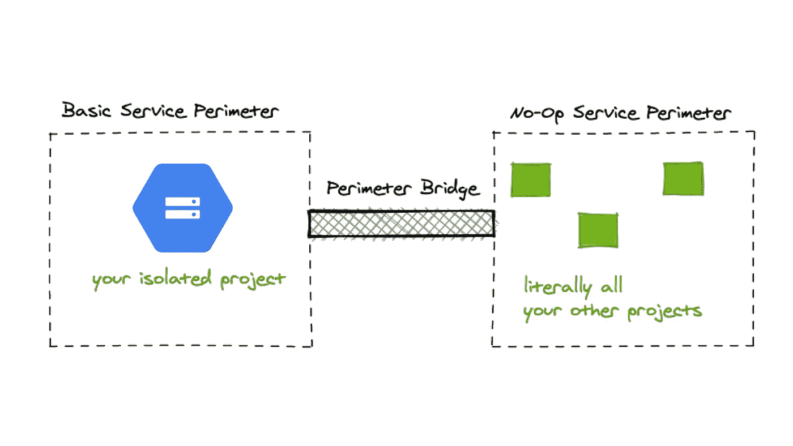

# 通过 IP 地址限制对谷歌云存储的访问

> 原文：<https://medium.com/google-cloud/limit-bucket-access-in-google-cloud-storage-by-ip-address-d59029cab9c6?source=collection_archive---------1----------------------->

*在撰写本文时，目前有一个* [*特性请求*](https://issuetracker.google.com/issues/63068776) *来限制桶策略中的 IP，但这在生产中还不可用。*

在 [Expo](https://expo.dev/) 上，我们正在为我们的客户建立一个新的服务，要求我们将所有 GCP 桶访问限制到一组 IP 地址。谷歌的人正在跟踪一个功能请求，以在桶策略中指定 IP 允许列表，但它还不可用于一般公众。今天实现这一点的方法是使用 [VPC 服务控件](https://cloud.google.com/vpc-service-controls)，它要求您创建一个单独的项目，只包含这个桶，并围绕它配置一个服务边界。

使用服务边界的基本架构

以下是如何做到这一点的分步指南:

# 0.创建一个单独的 GCP 项目

这个项目应该只包含您想要限制访问的存储桶。

# 1.创建访问级别

条件可以用 OR/AND 运算符连接起来

首先，您必须创建一个访问级别，指定您想要允许的 IP 地址。试验访问级别策略的最简单方法是使用访问上下文管理器 UI。在将访问级别应用到实时服务边界之前，不会强制实施访问级别。

理想情况下，你还需要一个 GCP 管理员或服务帐户来访问你的 IP 限制项目。如果您需要在项目中创建新资源，这将非常有用，因为您需要向创建资源的人员或为您自动执行该过程的服务帐户授予权限。

最终在 Terraform 中管理您的配置会更容易，但这不是本设置所必需的。为了在 [Terraform 中编码 IP 地址和 GCP 成员允许列表，](https://www.terraform.io/)您需要用条件资源将它们链接起来，如下所示:

# 2.创建服务边界

首先在模拟运行模式下创建您的测试边界！

在将您的边界编码为 Terraform 之前，我强烈建议首先在 UI 中创建一个预演模式的服务边界。您可以选择想要保护的项目及其服务。一旦应用了模拟运行策略，就可以在日志资源管理器中查看审计日志，看它是否具有预期的行为。

在这个基本配置中，我们已经创建了一个组织范围的服务边界，它只保护我们的带有存储桶的项目。我们进一步将其限制为适用于谷歌云存储服务。

# 3.创建无操作边界和桥*

如果要将数据从另一个项目移动到受限项目中，这一步是必需的。例如，如果您将文件从另一个项目中的存储桶移动到您的 IP 受限项目中的存储桶，您需要完成这个步骤。如果被转移的数据可以归因于另一个 Google Cloud 项目，那么即使您已经为自己的访问级别添加了适当的成员，边界也会阻止请求。**您需要明确启用与 IP 受限边界的桥接通信。**

在最基本的情况下，您可以通过将所有其他项目放在无操作边界中来实现这一点。这将允许您创建一个桥，将项目从无操作边界连接到 IP 限制边界中的项目。

在您应用了所有的 Terraform 配置之后，您现在应该有一个 IP 受限的 bucket，它可以很好地与您的所有其他 GCP 项目配合使用。

有什么问题吗？随时在推特上给我发消息 [@quinlanjung 【T3:)](https://twitter.com/quinlanjung)