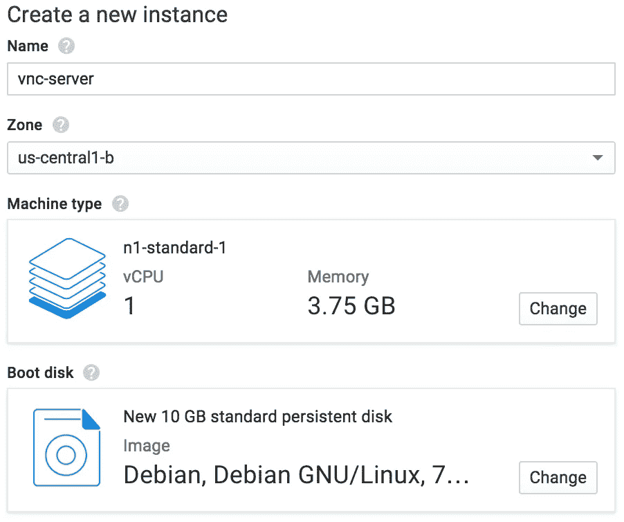
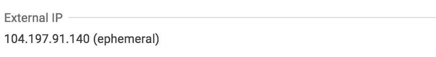
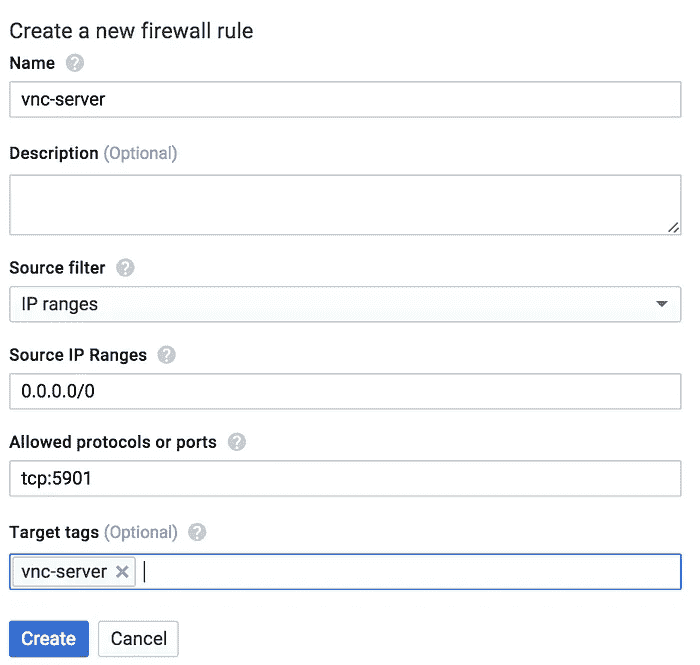
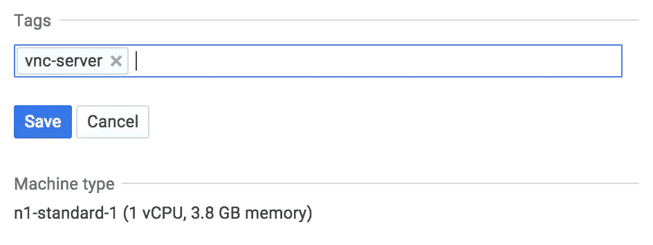
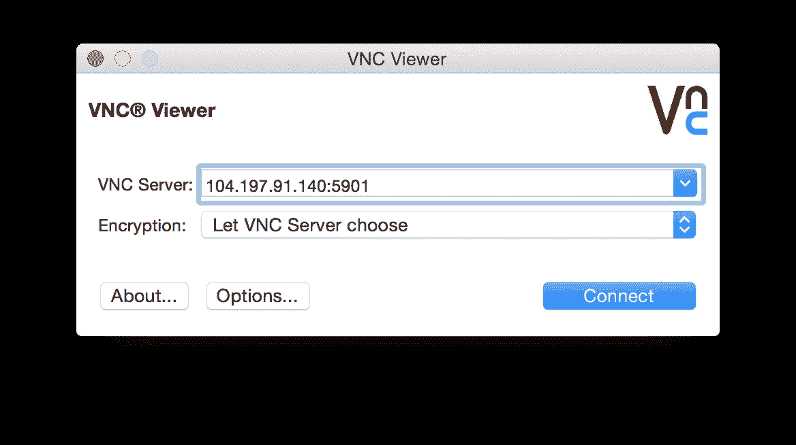
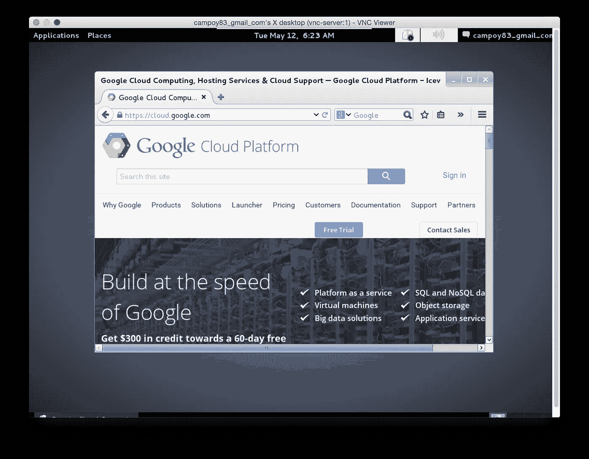

# 你在谷歌云平台上的桌面

> 原文：<https://medium.com/google-cloud/linux-gui-on-the-google-cloud-platform-800719ab27c5?source=collection_archive---------0----------------------->

## 谷歌计算引擎实例上的 VNC

将服务器放在云上是很棒的:你可以随时随地访问它们！你可以很容易地 ssh 到你的服务器，做任何你想做的事情，对不对？

嗯，如果你想浏览网页呢？我想用 Chrome！或者你可以使用 Lynx，但是我听说它不兼容 CSS3。这是一个小教程，它将带你通过 GUI 访问 Google 计算引擎实例的所有步骤。

> ***重要*** :如果你启动了一个实例，你将被按分钟收费。转到这篇文章的结尾，看看如何停止它，并获得 **$300** 的信用！

更新:我的下一篇文章将讨论如何通过使用 VPN 上的 VNC 来保证这个连接的安全。

## **创建新项目**

访问[开发者控制台](https://console.developers.google.com/)，登录，如果需要，点击**创建项目**按钮创建项目。导航左侧菜单，列出项目中运行的虚拟机实例:*计算>计算引擎>虚拟机实例。如果这是你第一次为这个项目这样做，可能会花一点时间，因为它设置了一些东西，不要担心这只会发生一次。*

## 创建新实例



点击**创建实例**按钮进入实例创建表单。为实例选择一个名称。任何实例类型和 linux 发行版都可以，但是如果你想要安全的话，选择 *n1-standard-1* 和*backports-debian-7-wheezy-v 2015 04 23。*

选择一个靠近您的区域，以获得最佳的连接延迟。

如果你想使用 Windows，这些实例已经支持 RDP(远程桌面协议)，所以你不需要任何额外的步骤。

## 安装 VNC 服务器

一旦您的实例正在运行，您就可以通过简单地点击 SSH 按钮直接进入它。这也为你处理认证，真的很方便！

连接后，让我们更新我们的源列表并安装一些额外的包:

```
$ sudo apt-get update
$ sudo apt-get install tightvncserver
```

在我们继续配置允许我们通过桌面环境访问实例的 VNC 服务器之前，我们应该安装一个。你可以安装你最喜欢的:

a)如果你喜欢 Gnome 并且不着急:

```
$ sudo apt-get install aptitude tasksel
$ sudo tasksel install gnome-desktop --new-install
```

侏儒很漂亮…而且很重！所以在所有东西安装好的时候要有耐心，两到五分钟是完全正常的。

b)如果您喜欢安装速度更快的软件，您可能会喜欢:

```
$ sudo apt-get install xfce4 xfce4-goodies
```

## 设置 VNC 服务器

现在我们的实例有了一个桌面环境，让我们通过 VNC 访问它。启动 vncserver，并按照说明创建密码

```
$ vncserver
```

> ***注意:*** 这个密码将授予对你的实例的访问权限，所以要使它很强。

如果一切正常，您的 VNC 服务器现在正在运行并监听端口 5901。您可以从 Google 计算引擎实例中使用 netcat 来验证这一点:

```
$ nc localhost 5901
RFB 003.008
```

## 安装 VNC 客户端

有很多选项可供选择，我最喜欢的是 [RealVNC Viewer](http://www.realvnc.com/download/viewer/) 。安装一个，但不要试图连接到您的服务器:它会失败，因为防火墙规则不允许它。

## 打开防火墙

为了与我们的实例通信，我们需要它的外部 IP。您可以在开发人员控制台上找到它。



找到你的外部 IP，应该是这样的。

让我们再次尝试使用 netcat 连接到它:

```
$ nc 104.197.91.140 5901alternatively you can use telnet$ telnet 104.197.91.140 5901
```

无论您使用什么工具，连接都将失败，这是意料之中的，因为出于安全原因，防火墙规则默认情况下会阻止所有通信。让我们来解决这个问题。

导航到默认网络*的配置“计算>计算引擎>网络】*，然后单击*默认*。或者您也可以点击[此处](https://console.developers.google.com/project/_/compute/networksDetail/global/networks/default)并选择您的项目。

我们将添加一个新的防火墙规则，按下相应的按钮。



为规则选择一个描述性名称。

我们将允许来自任何来源的流量，这就是我们使用 0.0.0.0/0(相当于通配符的 IP 掩码)的原因。

流量将位于协议 TCP 的端口 5901 上，并去往标记为 *vnc-server* 的实例。

最后一步是将我们的实例标记为 vnc-server，为此，返回到虚拟机描述页面并单击*“添加标记”*



## 连接到 VNC 服务器

让我们首先确保防火墙现在允许连接:

```
$ nc 104.197.91.140 5901
RFB 003.008
```

太好了！一切似乎都准备好了，我们的 VNC 客户端连接。打开 VNC 查看器，在端口 5901 上连接到计算引擎实例的 IP。



连接到端口 5901 上的计算引擎实例。

要进行连接，您需要提供您在本教程开始时提供的密码。



瞧！现在，您可以在 Google 计算引擎实例上使用您最喜欢的桌面环境。

## 解决纷争

如果你在创建了防火墙规则后仍然无法连接到 VNC，你应该确保你的 IP 没有被 [sshguard](http://www.sshguard.net/) 禁止。

要查看是否是这种情况，您可以运行:

```
$ sudo iptables -L
Chain INPUT (policy ACCEPT)
target     prot opt source               destination         
Chain FORWARD (policy ACCEPT)
target     prot opt source               destination         
Chain OUTPUT (policy ACCEPT)
target     prot opt source               destination
```

如果您的输出与此不同，刷新表格并重试:

```
$ sudo iptables -F
```

## 清理和费用

运行在云上的一个实例是有成本的，但是好消息是你可以简单地停止它，并在你需要的时候重启它。点击停止按钮，你将只为相关的[磁盘](https://cloud.google.com/compute/pricing#persistentdisk)付费，在本文撰写之时为每月**40**。我打赌你在旧金山找不到比这更便宜的咖啡了！

最后，如果你是谷歌云平台的新手，一定要参加[免费试用](https://cloud.google.com/free-trial/)来获得 300 美元的信用额度，这样你就可以尝试一下，享受一下乐趣了！

我希望这是有用的。欢迎在 [twitter](http://twitter.com/francesc) 上添加任何反馈意见或问题。