# 石蕊混沌测试(CPU 和内存)在 GKE(谷歌 Kubernetes 引擎)

> 原文：<https://medium.com/google-cloud/litmus-chaos-tests-cpu-memory-in-gke-google-kubernetes-engine-fef586888a50?source=collection_archive---------1----------------------->

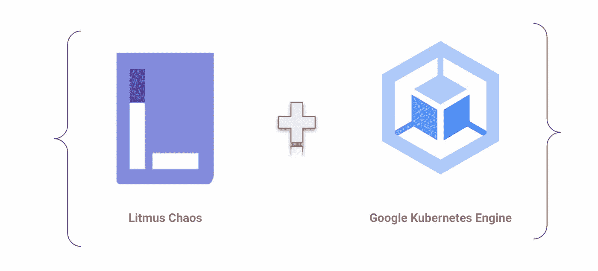

首先，为什么要进行混沌测试？这是为了在不断增长的大规模分布式软件系统中建立信心和测试可靠性，模拟灾难性事件(删除/CPU 压力/内存压力)的诱导..)可能发生在生产环境中。

其次，在具备操作 Google Kubernetes 引擎( [GKE](https://cloud.google.com/kubernetes-engine) )、Litmus Chaos 工具( [LitmusChaos](https://litmuschaos.io) )、 [Helm](https://helm.sh) 或 [Kubectl](https://kubernetes.io/docs/tasks/tools/#kubectl) 的知识的前提下，下面举例说明。

我们将通过 CPU 和内存压力实验，在节点级别测试 GKE 集群的可靠性。为了达到这个目的，我们在星团里安装了 LitmusChaos 中心和混沌代理。

创建 GKE 集群:

要创建 GKE 集群，请确保您的项目已启用计费，启用 Kubernetes 引擎 [API 的](https://cloud.google.com/endpoints/docs/openapi/enable-api)，并确保您有可用的[配额](https://cloud.google.com/docs/quota)。

```
gcloud container clusters create <CLUSTER_NAME> --zone "us-central1-c" --machine-type "e2-custom-4-4096" --image-type "UBUNTU_CONTAINERD" --num-nodes "2" --node-locations "us-central1-c"
```

连接到已安装的群集:

```
gcloud container clusters get-credentials <CLUSTER_NAME> --zone us-central1-c --project <PROJECT_NAME>
```

列出节点和命名空间的详细信息:

```
kubectl get nodes
kubectl get ns
```

使用 Helm 或 Kubectl 安装 Litmus ChaosCenter:

```
helm repo add litmuschaos [https://litmuschaos.github.io/litmus-helm/](https://litmuschaos.github.io/litmus-helm/)
helm repo list
```

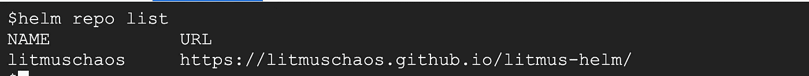

```
# You can use any of your convenient NameSpace
kubectl create ns litmus
helm install chaos litmuschaos/litmus --namespace=litmus
```

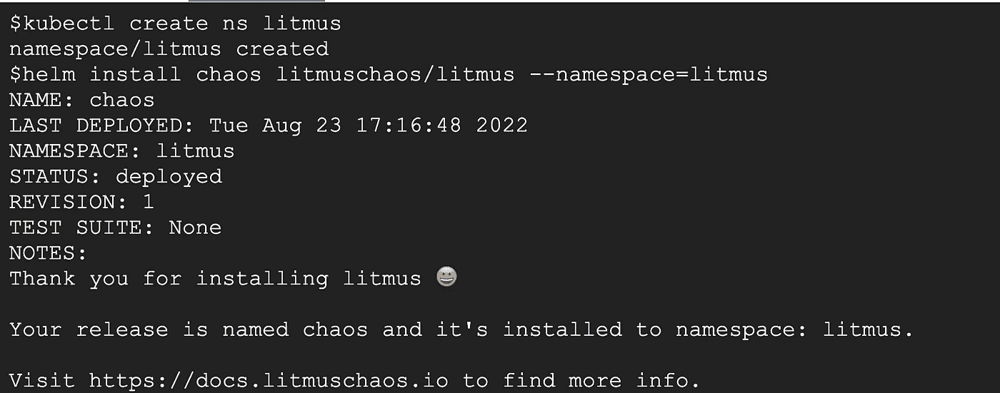

安装 Litmus ChaosCenter 的 kubectl 命令:

```
kubectl apply -f [https://litmuschaos.github.io/litmus/2.12.0/litmus-2.12.0.yaml](https://litmuschaos.github.io/litmus/2.12.0/litmus-2.12.0.yaml)
```

我们可以通过以下方式验证 Litmus 工具的安装

```
kubectl get pods -n litmus
kubectl get svc -n litmus
```

您应该看到 litmusportal-frontend-service 和其他四个依赖服务作为 pods 运行。

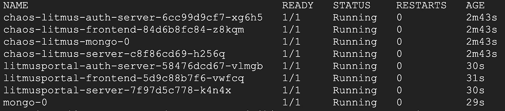

为前端服务和服务器服务创建 Google 云防火墙规则，以允许来自互联网的连接访问 Litmus ChaosCenter:

```
gcloud compute firewall-rules create <NAME_FRONTEND_SERVICE> --allow tcp:<TCP_PORT>
gcloud compute firewall-rules create <NAME_SERVER_SERVICE> --allow tcp:<FIRST_TCP_PORT>
```

> Litmus ChaosCenter 的 URL 可以从下面的命令中获得。输出格式将类似于(示例)http://172.17.0.3:31186

```
LITMUS_PORTAL_NAMESPACE=litmus
export NODE_NAME=$(kubectl -n $LITMUS_PORTAL_NAMESPACE get pod  -l "component=litmusportal-frontend" -o=jsonpath='{.items[*].spec.nodeName}')
export EXTERNAL_IP=$(kubectl -n $LITMUS_PORTAL_NAMESPACE get nodes $NODE_NAME -o jsonpath='{.status.addresses[?(@.type=="ExternalIP")].address}')
export NODE_PORT=$(kubectl -n $LITMUS_PORTAL_NAMESPACE get -o jsonpath="{.spec.ports[0].nodePort}" services litmusportal-frontend-service)
echo "URL: http://$EXTERNAL_IP:$NODE_PORT"
```

下面提供了默认凭据，但是在第一次尝试登录时会要求您更改密码

```
Username: admin
Password: litmus
```

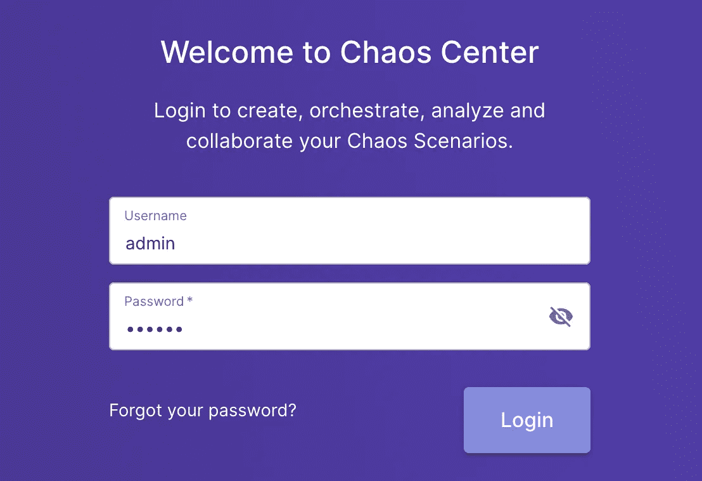

现在，我们将通过注入 [CPU](https://litmuschaos.github.io/litmus/experiments/categories/nodes/node-cpu-hog/) 和[内存](https://litmuschaos.github.io/litmus/experiments/categories/nodes/node-memory-hog/)压力来测试 GKE 节点的可靠性。您应该会在处于活动状态的 ChaosDelegates 下看到自代理。

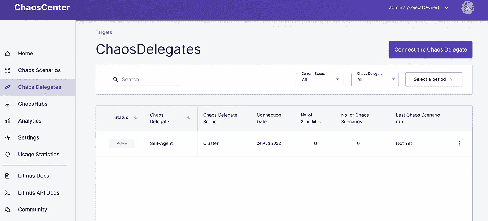

单击安排混乱场景并选择自我代理作为代理。

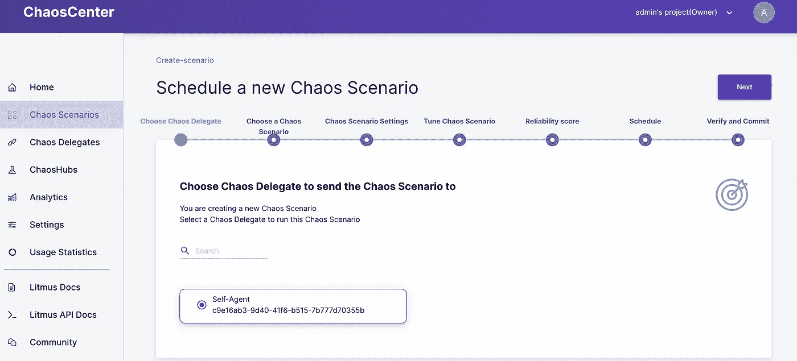

您可以选择预定义的场景、自带场景、使用模板或从 [ChaosHub](https://hub.litmuschaos.io) 中选择。我选择了 ChaosHub。

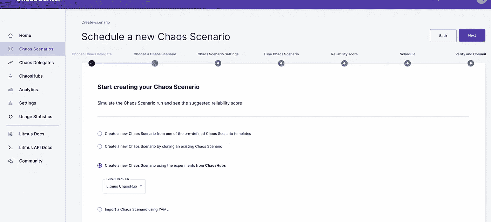

选择通用/节点 cpu-hog 和通用/节点内存-hog

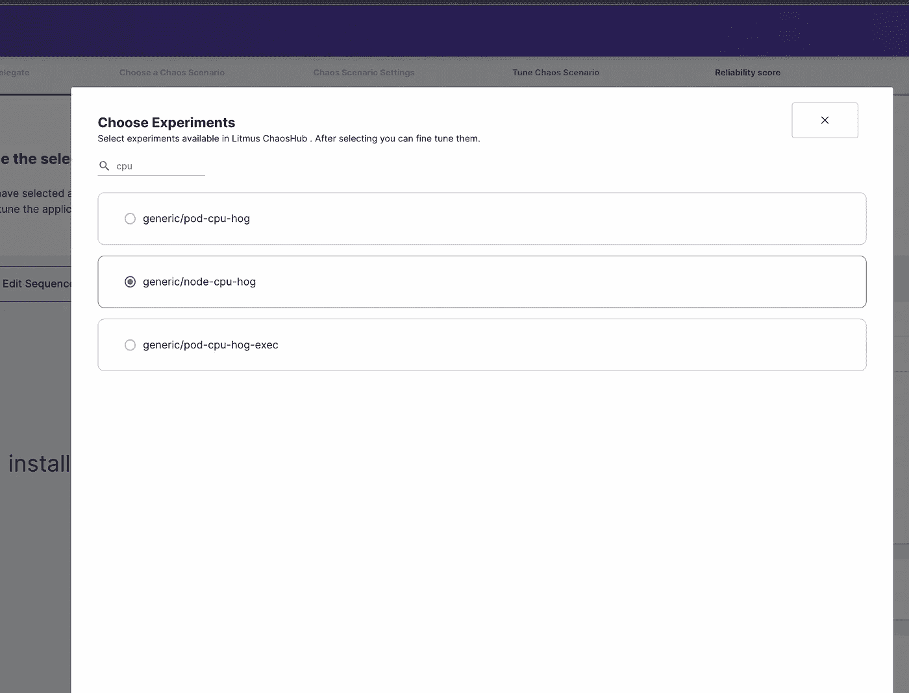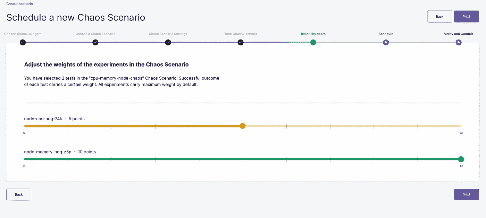

弹性分数是在 Kubernetes 系统上执行不同的混沌场景时，混沌场景的弹性的度量。权重优先级通常分为三个级别:0-3(低优先级)、4-6(中优先级)、7-10(高优先级)。

ChaosHub 是一个可以进行各种实验的市场。

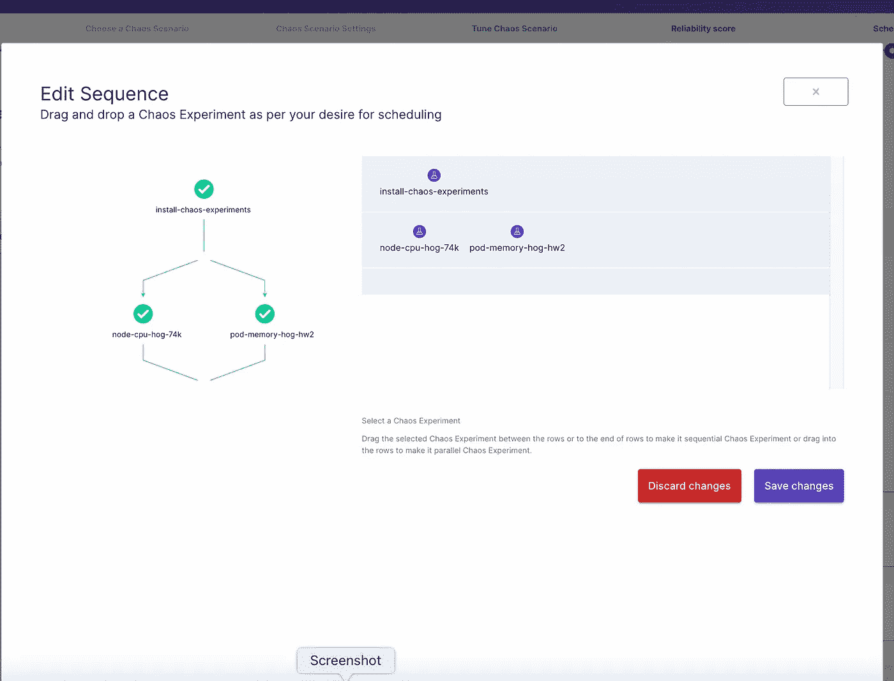

您可以编辑序列来选择同时运行 cpu 和内存，或者依次运行每一个。

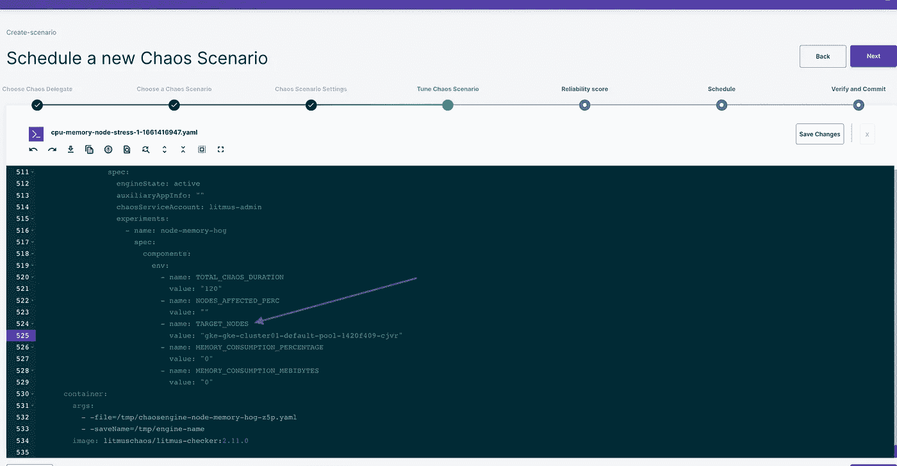

单击编辑 YAML ->并将环境变量 TARGET_NODES 更改为 GKE 节点名称。通过用逗号分隔，可以有多个节点。

一旦您按照要求安排并验证了细节，您就可以单击 finish 来运行实验了。

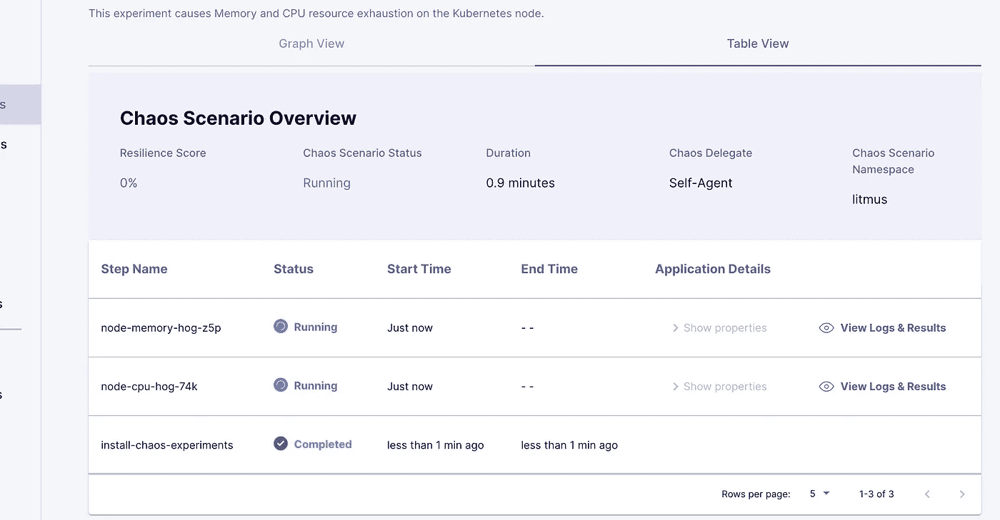

```
kubectl get pods -n litmus
```

你可以看到豆荚弹出，并导致 CPU 和内存的压力。

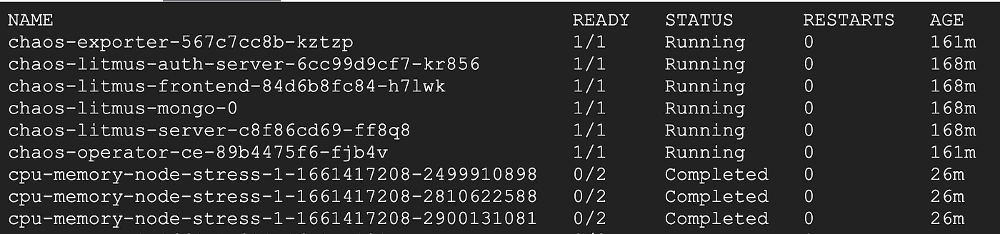

```
kubectl top nodes
```

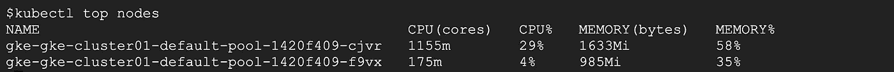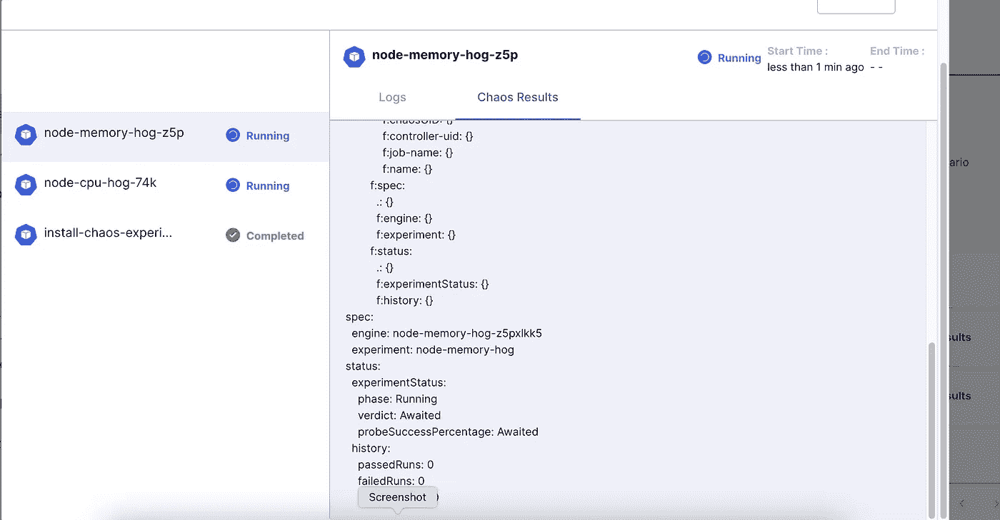

运行实验的全面细节可以在图形视图和表格视图中找到。在执行过程中，日志已经被记录并实时呈现，随后也会出现混乱结果。您可以在上面的图像中看到，裁决正在等待，这表明工作正在进行中。

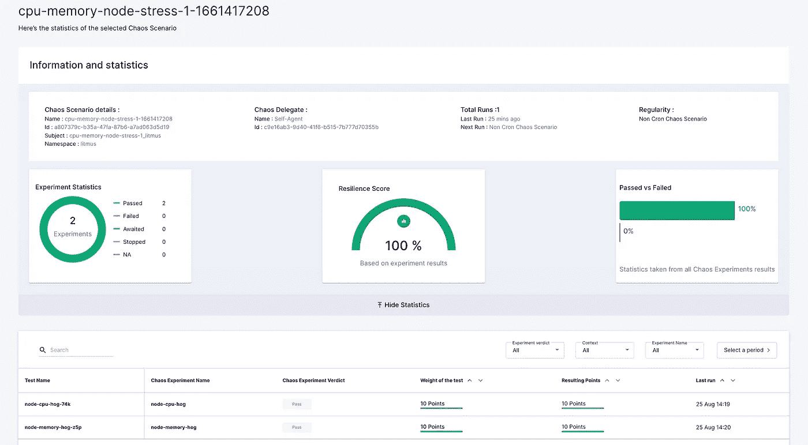

场景完成后，将生成报告，该报告可在“统计数据”部分下的“分析”中找到。在上面的场景中，弹性得分为 100%(CPU 压力为 10 分，内存压力为 10 分)，这表明 GKE 节点对于倾向于该特定实验的定义配置具有高效的弹性。

这为我们带来了 GKE 节点中混沌测试(CPU/内存)的完成。此外，Litmus tool 具有与[普罗米修斯](https://docs.litmuschaos.io/docs/integrations/prometheus)和[格拉夫纳](https://docs.litmuschaos.io/docs/integrations/grafana)集成的能力。你可以从 [Litmus](https://docs.litmuschaos.io/docs/introduction/what-is-litmus) 工具的文档部分获得更多细节。

………..感谢您访问博客，祝您有美好的一天！…………