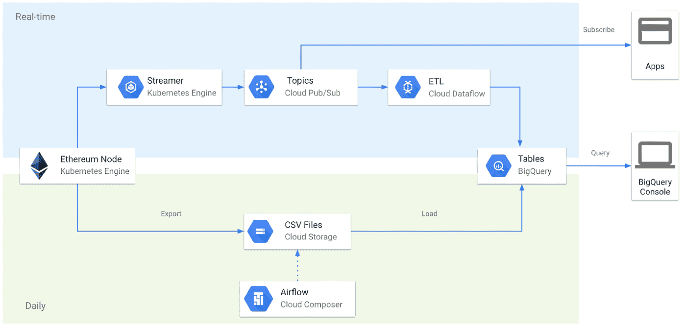

# Google BigQuery 和 Pub/Sub 中的实时以太坊和比特币数据

> 原文：<https://medium.com/google-cloud/live-ethereum-and-bitcoin-data-in-google-bigquery-and-pub-sub-765b71cd57b5?source=collection_archive---------0----------------------->

BigQuery 中的[**crypto _ ether eum**](https://console.cloud.google.com/bigquery?p=bigquery-public-data&d=crypto_ethereum&t=transactions&page=table)**和**[**crypto _ bit coin**](https://console.cloud.google.com/bigquery?p=bigquery-public-data&d=crypto_bitcoin&t=transactions&page=table)**数据集现在使用[流技术](https://cloud.google.com/bigquery/streaming-data-into-bigquery)进行更新。您还可以订阅为这些表提供信息的公共发布/订阅主题。******

******总体架构如下所示:******

************

******区块链 ETL 架构******

******涵盖了以下区块链:******

*   ******以太坊******
*   ******比特币******
*   ******ZCash******
*   ******莱特币******
*   ******总督******
*   ******破折号******

******我们为每个区块链添加了延迟，以防止链重组导致的孤立块流。你可以在 Github 库[https://github.com/blockchain-etl-streaming](https://github.com/blockchain-etl/blockchain-etl-streaming/tree/master/overlays/bitcoin)的配置文件中的`LAG_BLOCKS`参数中查找我们落后链顶端多少块。这些值是根据去年最长的孤立链乘以安全系数计算出来的。对于以太坊，我们以相当于大约 4 分钟滞后的偏移结束。对于比特币来说，这个值相当于 30 分钟的滞后。******

******我们目前正在开发一个解决方案，它将使用额外的消息类型来处理链重组，并允许订阅最新的数据。******

## ******订阅实时数据馈送******

******[安装谷歌云 SDK](https://cloud.google.com/sdk/docs/downloads-interactive) :******

```
****> curl https://sdk.cloud.google.com | bash
> exec -l $SHELL
> gcloud init****
```

******为以太坊内部交易创建发布/订阅:******

```
****> gcloud pubsub subscriptions create **crypto_ethereum.traces.test** --topic=**crypto_ethereum.traces** --topic-project=**crypto-public-data******
```

******阅读订阅中的一条消息来测试它是否有效:******

```
****> gcloud pubsub subscriptions pull **crypto_ethereum.traces.test******
```

******现在，您可以使用以下 Python 脚本运行订阅者并处理订阅中的消息:******

*******subscribe.py*******

```
****import timefrom google.cloud import pubsub_v1**# TODO project_id = "Set Your Google Cloud Project ID Here"**
subscription_name = "crypto_ethereum.traces.test"subscriber = pubsub_v1.SubscriberClient()
# The `subscription_path` method creates a fully qualified identifier
# in the form `projects/{project_id}/subscriptions/{subscription_name}`
subscription_path = subscriber.subscription_path(
    project_id, subscription_name)def callback(message):
    print('Received message: {}'.format(message))
    message.ack()subscriber.subscribe(subscription_path, callback=callback)# The subscriber is non-blocking. We must keep the main thread from
# exiting to allow it to process messages asynchronously in the background.
print('Listening for messages on {}'.format(subscription_path))
while True:
    time.sleep(60)****
```

******安装依赖项并运行脚本:******

```
****> pip install google-cloud-pubsub==1.0.1
> python subscribe.pyListening for messages...
Received message: Message {
  data: b'{"type": "trace", "transaction_index": 158, "from_...'
  attributes: {
    "item_id": "trace_call_0xce2ce80594f7601726d03114366161a0050d4a0beedd8628655f1a19319f203d_"
  }
}
Received message: Message {
  data: b'{"type": "trace", "transaction_index": 159, "from_...'
  attributes: {
    "item_id": "trace_call_0x7d121090c65c93ac6ba99764bae40ef384c388a139578194c503b92228ccfb3d_"
  }
}
...****
```

******也可以用 Go、Java、Node.js 或者 c#:[https://cloud.google.com/pubsub/docs/pull](https://cloud.google.com/pubsub/docs/pull)。******

******Pub/Sub 中的前 10GB 数据是免费的，之后你需要支付大约 40 美元/TB。平均每月有 40GB 以太坊痕迹，相当于每月约 1 美元。******

******还可以订阅比特币区块和交易以及以太坊区块、交易、日志、合约、代币等主题。主题名称遵循 BigQuery 表的命名约定，因此您可以很容易地找到它们:`projects/crypto-public-data/topics/crypto_{chain}.{table_name}`，其中:******

*   ******`chain`可以是`ethereum`、`bitcoin`、`zcash`、`litecoin`、`dogecoin`或`dash`中的一种。******
*   ******`table_name`可以是`blocks`或`transactions`中的一种。另外对于以太坊:`logs`、`token_transfers`、`traces`、`contracts`和`tokens`。******

******接下来是一篇关于 Twitter 机器人的文章，它使用[数据流](https://cloud.google.com/dataflow)和[云函数](https://cloud.google.com/functions)发布异常交易。******

## ******另请参阅:******

*   ******[如何查询所有以太坊地址的余额](/google-cloud/how-to-query-balances-for-all-ethereum-addresses-in-bigquery-fb594e4034a7)******
*   ******[在 BigQuery 中计算基尼系数](/google-cloud/calculating-gini-coefficient-in-bigquery-3bc162c82168)******
*   ******[big query 中的以太坊:我们如何构建这个数据集](https://cloud.google.com/blog/products/data-analytics/ethereum-bigquery-how-we-built-dataset)******
*   ******[实时以太坊免费通知大家](/google-cloud/real-time-ethereum-notifications-for-everyone-for-free-a76e72e45026)******

******在推特上关注我们:[https://twitter.com/BlockchainETL](https://twitter.com/BlockchainETL)******