# 通过 IPVS 实现负载平衡

> 原文：<https://medium.com/google-cloud/load-balancing-with-ipvs-1c0a48476c4d?source=collection_archive---------1----------------------->


IP 虚拟服务器(IPVS)直接在 Linux 内核中实现 L4 负载平衡。我需要让它在 GCP 发挥作用，心想这不会那么难。我有些头疼，但也很开心:)

# 当生活变得容易时

像 GCP 这样的云环境非常好。最初，这有点令人困惑，因为网络还有其他的*规则*，但是你会开始喜欢它提供的所有抽象概念。例如，实现 L4 负载平衡是通过一种您可以配置的服务来完成的，但大多数情况下您会忘记，它就是有效的。

嗯，没错，这可能并不总是那么容易。但是除了检查配置之外，很少有情况下需要更深入地进行调试。有时候我需要求助于 *tcpdump* (我真的很喜欢)，这个故事就是这样开始的。但我没想到会是怎样的结局。

手头的任务，运行 L4 负载平衡器。在云环境中，有时您无法完全获得所需的服务。在这种情况下，原因并不重要，我稍后会解释，但问题是我(我的客户)决定使用 IPVS。它是 [Linux 虚拟服务器](http://www.linuxvirtualserver.org/)项目的一部分，它作为传输层负载平衡器运行在服务器主机上，提供单个 VIP 来访问真实服务器的服务。如果你不知道，Kubernetes 的 kube-proxy 组件使用 IPVS。

这不会有那么难…

# 试一试

所以我去了。我用三个虚拟机部署了一个非常简单的设置，我喜欢在测试时从简单开始。一台客户机，IPVS 的虚拟服务器，和一台真正的服务器(LVS 称之为 T9)。是的，只有一台真正的服务器，负载平衡不难…

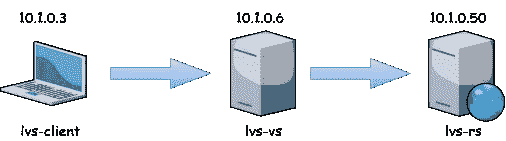

虚拟服务器具有 IP 10.1.0.6，这是我配置的服务的 VIP。真实的服务器运行一个简单的基于 python 的 HTTP 服务器，监听端口 8085 并发出 *Hello！*消息。我通常选择 8085 这样的端口，因为如果您需要捕获数据包，它不会与 80 或 443 这样的典型端口中的其他流量混合。为了测试它，客户端应该能够接触到它。


然后，我在虚拟服务器中配置了 IPVS。首先，我安装了 ipvsadm，这是在内核中配置 IPVS 的工具，用它我建立了一个新的指向真实服务器的 IPVS 服务。

```
sudo apt-get install ipvsadm
sudo ipvsadm -A -t 10.1.0.6:8085
sudo ipvsadm -a -t 10.1.0.6:8085 -r 10.1.0.50 -m
```

IPVS 支持 TCP 和 UDP、三种数据包转发方法(DSR、ipip 或伪装)、多种负载平衡或调度算法以及许多其他选项。除了使用 TCP 进行测试(`-t`)，我只对伪装/NAT ( `-m`)感兴趣，因为其他转发方法，尤其是 DSR，不太适合在 GCP 运行，也不适合我的目的。对于其他选项，我保留默认值。您可以在 [IPVS 手册页](https://linux.die.net/man/8/ipvsadm)中找到更多信息。

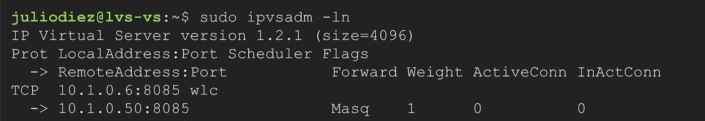

很简单。是时候测试我是否可以通过虚拟服务器的 VIP 从客户端访问真实的服务器了…


***失败！***

两秒钟后看不到回应，你就知道有问题了。好了，不用担心，是时候使用 tcpdump 了。

# 伪装到底是什么

我想，转储数据包应该能告诉我发生了什么。在三个虚拟机中运行 tcpdump 应该能让您了解全部情况，但是我只向您展示从虚拟服务器捕获的内容，因为它处于流量的中间。

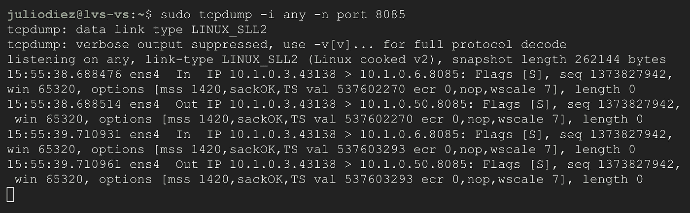

虚拟服务器从客户端 10.1.0.3 收到一个目的地为 VIP 10 . 1 . 0 . 6 的数据包；也看看港口。然后，IPVS 开始将数据包传输到真正的服务器 10.1.0.50，并通过网络发送出去。但是，嘿，那是什么？源 IP 地址，还是 10.1.0.3！

我以为我配置了*伪装*。对于熟悉 iptables 的人来说，Masquerade 是一个类似于 SNAT 的目标，其中源 IP 被转换为转发数据包的主机的 IP，在本例中是虚拟服务器。

事实证明，IPVS 并不是这样运作的。IPVS 只做 DNAT，这在一个叫做双臂负载均衡的模型中很有用。

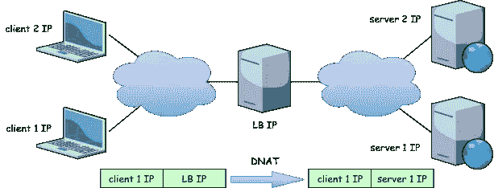

只要有一点想象力，你就能明白为什么它被称为双臂。负载平衡器充当每个网络上的一个臂的路由器，这些网络之间的所有流量都通过负载平衡器。

非常有用的模型。避免 SNAT 可以保护客户端 IP，避免端口分配和耗尽的问题。但不是我所需要的，也不是我所期待的！IPVS 说它使用伪装转发，对我来说这是误导。

那现在怎么办？

# 回归根本

在这里，我开始越来越深入，首先求助于 iptables，并认为这就足够了。我已经很久没有研究过这些主题了…

## iptables 规则

IPVS 不做 SNAT，所以我想通过 iptables 手工做。我可以把 SNAT 或者假面舞会(马斯-QUE-拉德，你知道吗？).

```
sudo iptables -t nat -A POSTROUTING -s 10.1.0.3 -j MASQUERADE
```

一个真实的场景需要考虑的不仅仅是客户端 IP，而是所有的客户端，或者是目的地，但是对于我的测试来说已经足够了。然后通过 curl 从客户端发送一个请求…

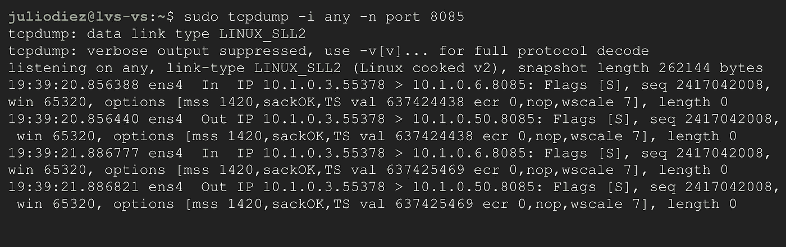

怎么了？什么都没发生，就好像根本没有 SNAT 法则一样！真的，规则不是打了吗？

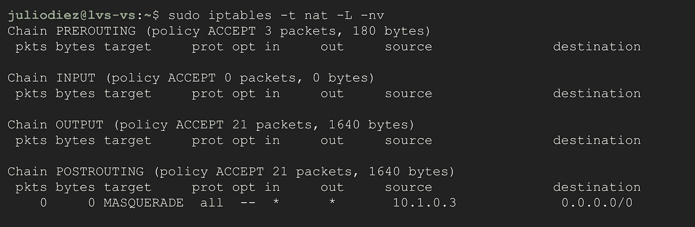

没有:(
这里我真的很迷惑。我的意思是，这是一个干净的环境，系统中没有其他 iptables 规则可以绕过这个规则，我尝试在其他表和链中设置规则，以便在没有观察到任何特殊情况的情况下跟踪进出的包。除了这条规则没有被击中。

我谷歌了一下，发现有一场 IPVS 的 iptables 比赛。我不喜欢在没有理解它们的情况下就离开，但我认为测试一下这个是个好主意。

```
sudo iptables -t nat -A POSTROUTING -m ipvs --vaddr 10.1.0.6 -j MASQUERADE
```

你猜怎么着？同样的结果，或者同样的没有结果。规则也没有被击中。然而，读多了一点，我发现“配置 _IP_VS_NFCT”应该启用，sysctl 变量“连接跟踪”设置为 1，无论这意味着什么。

## 内核源代码和模块

如果你玩过编译 Linux 内核，你会认识到配置格式。阅读资料时，我发现:

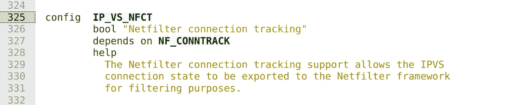

内核源文件[net/netfilter/ipvs/Kconfig](https://elixir.bootlin.com/linux/v5.10/source/net/netfilter/ipvs/Kconfig#L325)

天啊，就是它了！ [Netfilter](https://www.netfilter.org/) 是 iptables、连接跟踪、IPVS 等组件所依赖的包过滤的内核框架。似乎没有明确启用它，IPVS 不允许从用户空间访问这个过滤。所以我检查了一下:


奇怪，它被启用了，而且显然是内置在内核中的。我又挖了一点:

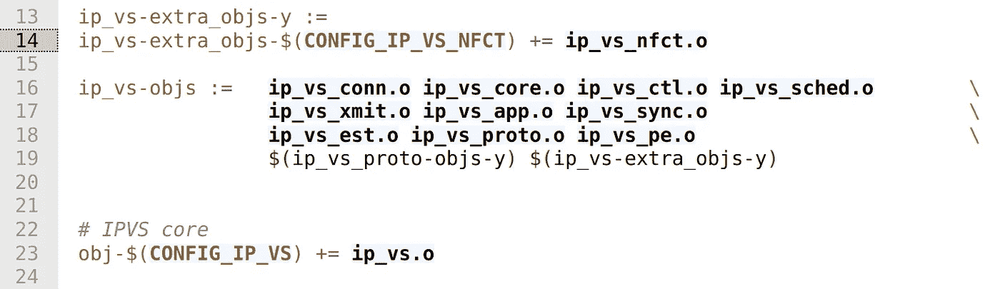

内核源文件[*net/netfilter/ipvs/Makefile*](https://elixir.bootlin.com/linux/v5.10/source/net/netfilter/ipvs/Makefile#L14)

哦，我明白了。这意味着 IP_VS_NFCT 的代码是内核对象 IP_VS 的一部分…


…作为模块加载，而不是内置功能…


…但这也载入了正在运行的内核。如果您仔细观察，还可以看到 xt_ipvs 模块，它允许通过 iptables 匹配从用户空间配置的数据包的 ipvs 连接属性，无需使用 modprobe。看起来一切都准备就绪了。

但是等等，还有一个元素，sysctl 变量“conntrack”:

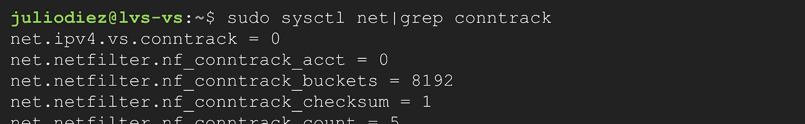

它就在那里，在 *net.ipv4.vs* 条目下，而且没有设置！我很幸运，因为只有当 ipvsadm 服务启动时，该条目才会出现，尽管我在内核源代码中也看到了它，而且您也有内核文档:

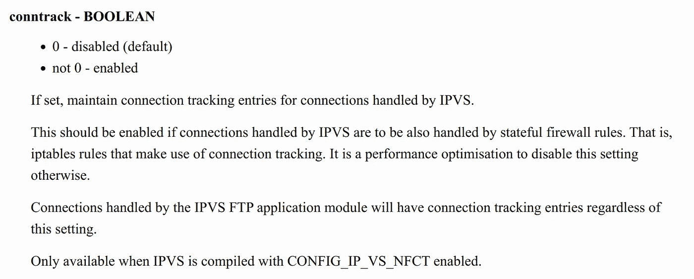

[ipvs-sysctl 的 Linux 网络文档](https://www.kernel.org/doc/html/v5.10/networking/ipvs-sysctl.html)

正如它所说，如果没有 conntrack set，iptables 就不能处理 IPVS 连接！所以我设置它，交叉手指，再次启动 curl:

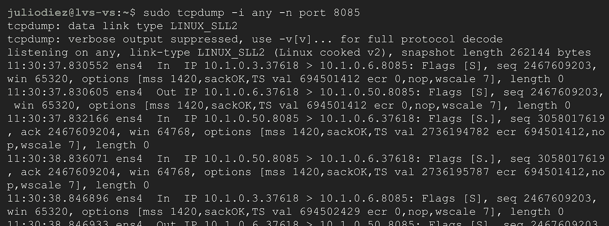

太好了，成功了！嘿，别这么快。SNAT 完成了它的工作，您可以看到源 IP 10.1.0.3 转换为虚拟服务器 IP 10.1.0.6 的 TCP SYN 数据包。并且真实服务器向虚拟服务器发送相应的 SYN-ACK。然而，通信在那个阶段停滞了，没有来自客户端的 ACK 回复。事实上，似乎 SYN-ACK 没有被 NAT 翻译回来，这是怎么回事？

NAT 的实现是有状态的，如果一个 NAT 的包出去和回来，它被处理以撤销 NAT。我们可以通过连接跟踪系统检查这一点:

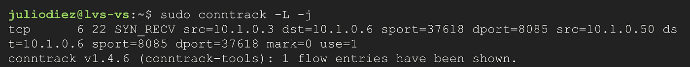

好的，所以 conntrack 系统确实处理了从 10.1.0.50 到 10.1.0.6 的 SYN-ACK(它将连接更改为 SYN_RECV 状态)。那么，那个包裹后来怎么样了？它在某个时候被丢了，但是，我怎么才能找到它呢？

## 调试内核(是的)

我知道，调试内核的想法听起来像掉进兔子洞，但在这一点上，我决定要弄清楚。我考虑了几个做内核追踪的工具: [Kgdb](https://www.kernel.org/doc/html/v5.10/dev-tools/kgdb.html) ， [SystemTap](https://sourceware.org/systemtap/) ， [perf](https://perf.wiki.kernel.org/index.php/Main_Page) (那个我甚至稍微尝试了一下)， [eBPF](https://ebpf.io/) 。但我想保持简单，专注于这个问题。

因为我想在内核中调试网络堆栈监控数据包丢弃，而没有太多麻烦，所以我使用了 [Dropwatch](https://github.com/nhorman/dropwatch) 。这是一个简单的交互式实用程序。使用它需要安装一些软件包:

```
sudo apt-get install git libpcap-dev libnl-3-dev libnl-genl-3-dev binutils-dev libreadline6-dev autoconf libtool pkg-config build-essential
```

您需要克隆项目的 repo 并编译它:

```
git clone [https://github.com/nhorman/dropwatch](https://github.com/nhorman/dropwatch)
cd dropwatch
./autogen.sh
./configure
make
sudo make install
```

当 Dropwatch 运行并检测到丢包时，它会告诉您发生丢包的原始指令指针，但这几乎没有用。将指令指针映射到内核的相应函数名是我所需要的，而 [Dropwatch 可以使用内核的符号文件 *kallsyms* 来完成这个任务](https://linux.die.net/man/1/dropwatch):

```
sudo dropwatch -l kas
```

我启动它来报告丢失的数据包，并在客户机上启动 curl:

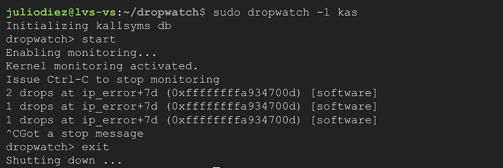

哦，太美了，多么美好的回忆！函数符号和十六进制地址:)这表明数据包丢失发生在 [*ip_error*](https://elixir.bootlin.com/linux/v5.10/source/net/ipv4/route.c#L939) 函数，偏移量 0x7d。这个函数很短，很容易发现对释放套接字缓冲区的内核函数 *kfree_skb* 的调用。

更有趣的是 ip_error 在输入路径中被调用，并给出丢弃一个包的原因。特别是，它引起了我的注意*主机不可达*增加了 [SNMP 计数器*ipinadderrors*的情况。它处理“目的地 IP 地址不是本地地址并且 IP 转发未被启用”的情况。让我们思考一下这个问题:](https://www.kernel.org/doc/html/latest/networking/snmp_counter.html)

*   来自真实服务器 10.1.0.50 ➔ 10.1.0.6 的回复数据包被“捕捉”回 10.1.0.50 ➔ 10.1.0.3
*   我们期望 IPVS 处理回复信息包，将其翻译成相应的 10.1.0.6 ➔ 10.1.0.3，但是 IPVS 在输入路径**开始，在** SNAT 之前
*   现在，输入路径需要处理目的地为 10.1.0.3 的数据包，而不是该主机 10.1.0.6。它不能，所以它放弃了

为了测试我的理论，我在启动 curl 时使用了 *nstat* (netstat 已被弃用),并观察了计数器是如何随着 ip_error 的每次下降而递增的:


你可能想知道，我怎么知道 IPVS 在 SNAT 之前开球？查看[来源](https://elixir.bootlin.com/linux/v5.10/source/net/netfilter/ipvs/ip_vs_core.c#L2249)。我也在那里找到了我需要的答案:


IPVS 在几个地方被钩住了(Netfilter 钩子)，包括转发链。因此，我需要的是到达 IPVS，在那里处理回复，而不是丢弃数据包，你猜怎么着:启用 IP 转发。

# 最后一档

启用 IP 转发通常意味着主机将充当路由器。我最初没有启用它，因为情况并非如此，但无论如何它是需要的。请注意，在 GCP 有一个虚拟机设置，*如果您真的希望该虚拟机像路由器一样工作，但这不是重点，所以没有必要设置它。*

```
sudo sysctl -w net.ipv4.ip_forward=1
```

最后:

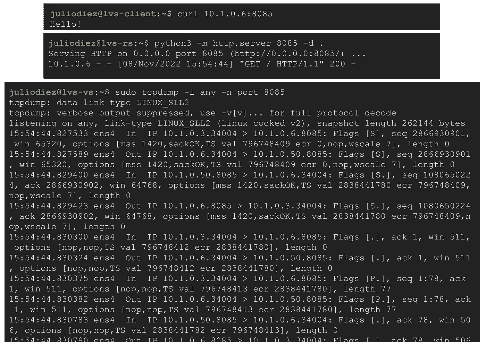

\o/

# 结束语

哇，这是一个艰难的时刻。在最后敲定一些评论之前:

*   LVS 项目不仅由 IPVS 组成，还有更多组件来创建高度可伸缩和可用的服务器集群，具有诸如传输层和应用层负载平衡以及集群管理等功能。我只触及了表面。
*   其中一个组件保持活动状态，提供运行状况检查。如果您通过 keepalived 而不是 ipvsadm 配置虚拟和真实服务器，我在这里解释的完整 NAT 解决方案将无法工作。我没有调查原因。
*   虽然我只测试了 TCP，但 IPVS 同时支持 TCP 和 UDP。UDP 的支持确实是推动这一进程的原因。我的客户需要对来自 GCP 客户端的 TCP 和 UDP 流量进行负载平衡。我们的[内部 TCP/UDP 负载均衡](https://cloud.google.com/load-balancing/docs/internal)不支持内部后端，[内部 TCP 代理负载均衡](https://cloud.google.com/load-balancing/docs/tcp/internal-proxy)支持内部后端，但不支持 UDP。
*   所解释的测试设置类似于单臂模型，其中负载平衡器、客户端和服务器共享同一个网络，并且需要完整的 NAT。但是，如果您想避免 SNAT 或者需要保留客户端 IP，可以创建一个具有多 nic 负载平衡器的双臂设置。
*   在 [LVS 官方页面](http://www.linuxvirtualserver.org/)我发现了关于从 Linux 内核 2.6.32 开始在 IPVS 支持完全 NAT 模式的(旧)新闻。然而，我在最近的内核中没有找到任何代码来证明这种支持，也没有找到配置它的方法。

我不得不说，总而言之，这是一次有趣的经历！