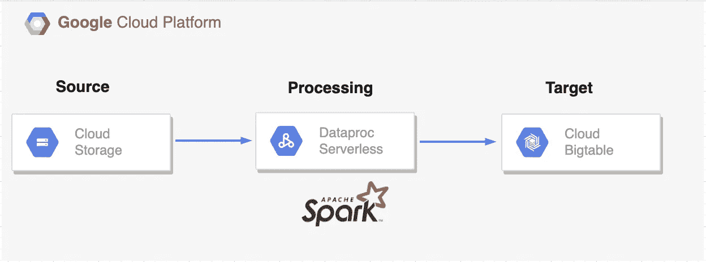

# 将数据从 GCS 加载到 Bigtable —使用 GCP Dataproc 无服务器

> 原文：<https://medium.com/google-cloud/load-data-from-gcs-to-bigtable-using-gcp-dataproc-serverless-5c43d773e615?source=collection_archive---------10----------------------->

Google Cloud Dataproc 平台的最新功能之一， [**Dataproc 无服务器**](https://cloud.google.com/dataproc-serverless/docs/overview) ，使客户无需创建或维护集群即可运行 Spark 工作负载。一旦 Spark 工作负载参数被指定并且任务被提交给服务，Dataproc Serverless 将在后台处理所有必要的基础设施。它使开发人员能够专注于应用程序的基本逻辑，而不是花时间管理框架

由于有了 [**Dataproc 模板**](https://github.com/GoogleCloudPlatform/dataproc-templates) ，我们无需从头开始创建它们，就可以使用 Java 和 Python 在 Dataproc 无服务器上运行典型用例。借助这些模板，我们可以轻松定制和运行常见的 Spark 工作负载。

如果您正在寻找一个使用 Dataproc Serverless 将数据从 GCS 移动到 Bigtable 的 ***Spark-Java 模板，这篇博客文章可能会很有用。***



GCS 到 Bigtable

## **主要优势**

*   [**GCSToBigTable**](https://github.com/GoogleCloudPlatform/dataproc-templates/tree/main/java/src/main/java/com/google/cloud/dataproc/templates/gcs)模板开源，配置驱动，随时可用。
*   支持的文件格式有 CSV、Parquet 和 Avro。
*   通过简单地改变连接参数，这些模板可以相对快速地用于具有相同需求的用例。

## **基本用法**

1) [谷歌云 SDK](https://cloud.google.com/sdk/docs/install) 安装并认证。您可以使用 Google Cloud 控制台中的 Cloud Shell，通过这个[链接](https://console.cloud.google.com/cloudshell/editor)来配置一个环境。

2)如果您要使用由 GCP 生成的“默认”VPC 网络，请确保您已经启用了带有专用 Google 访问的子网。您仍然需要启用如下的私人访问。


```
gcloud compute networks subnets update default - region=us-central1 - enable-private-ip-google-access
```

3)在预装了[各种工具](https://cloud.google.com/shell/docs/how-cloud-shell-works)的云壳中克隆 git repo。或者，你可以使用任何预装了 JDK 8+，Maven 和 Git 的机器。

```
git clone https://github.com/GoogleCloudPlatform/dataproc-templates.git 
cd dataproc-templates/java
```

4)创建 GCS 存储桶和暂存文件夹。这个存储桶将用于存储运行无服务器集群所需的依赖项/ Jar 文件

5)创建一个 GCS 桶和一个输入文件夹。所需的文件(csv/avro/parquet)需要上传到该文件夹中，并在执行时提供位置

6)在集群的实例中创建一个具有所需列族的 BigTable 表。(如果实例不存在，则创建实例)

7)获取认证凭证(提交 Dataproc 作业)。

```
gcloud auth application-default login
```

8)配置 Dataproc 无服务器作业:

要执行 dataproc 作业，需要设置以下配置。

*   `GCP_PROJECT`:无服务器运行 Dataproc 的 GCP 项目。
*   `REGION`:运行 Dataproc 无服务器的区域。
*   `GCS_STAGING_LOCATION`:一个 GCS 位置，Dataproc 将在此存储登台资产。应该在之前创建的存储桶内。

```
export GCP_PROJECT=<project_id>
export REGION=<region>
export GCS_STAGING_LOCATION=<gcs-staging-bucket-folder>
```

9)执行 GCS 到 BigTable 模板，为执行指定模板和以下参数值

*   `project.id`:发布/订阅的项目 id
*   `gcs.bigtable.input.location`:输入文件的位置
*   `gcs.bigtable.input.format`:输入文件的格式(csv/avro/parquet)
*   `gcs.bigtable.output.instance.id`:Bigtable 的实例 Id
*   `gcs.bigtable.output.project.id`:Bigtable 的项目 Id
*   `gcs.bigtable.table.name` : Bigtable 表名
*   `gcs.bigtable.column.family`:bigtable 表的列族。

```
bin/start.sh \
-- --template GCSTOBIGTABLE \
--templateProperty project.id=<gcp-project-id> \
--templateProperty gcs.bigtable.input.location=<gcs file location> \
--templateProperty gcs.bigtable.input.format=<csv|parquet|avro> \
--templateProperty gcs.bigtable.output.instance.id=<bigtable instance Id> \
--templateProperty gcs.bigtable.output.project.id=<bigtable project Id> \
--templateProperty gcs.bigtable.table.name=<bigtable tableName> \
--templateProperty gcs.bigtable.column.family=<bigtable column family>

Here is an example submission:
export GCP_PROJECT=your-project-id
export REGION=your-region 
export GCS_STAGING_LOCATION=gs://your-bucket/temp 

bin/start.sh -- --template GCSTOBIGTABLE --templateProperty project.id=your-project-id --templateProperty gcs.bigtable.input.location=gs://your-bucket/test/file.csv --templateProperty gcs.bigtable.input.format=csv --templateProperty gcs.bigtable.output.instance.id=your-bt-instance-id --templateProperty gcs.bigtable.output.project.id=your-project-id --templateProperty gcs.bigtable.table.name=your-bt-table --templateProperty gcs.bigtable.column.family=cf
```

**注意**:如果尚未启用，它会要求您启用 Dataproc Api。

下面是 GCS 中的输入文件和 BigTable 中的输出行的示例

```
Sample CSV file (Us-cities.csv)

name,post_abbr,zip,phonecode
Alabama,AL,94519,925
Alaska,AK,94520,408

Sample Row in BigTable:
Alabama
  cf:name                                  @ 2022/12/20-06:22:34.057000
    "Alabama"
  cf:phonecode                             @ 2022/12/20-06:22:34.057000
    "925"
  cf:post_abbr                             @ 2022/12/20-06:22:34.057000
    "AL"
  cf:zip                                   @ 2022/12/20-06:22:34.057000
    "94519"

Alaska
  cf:name                                  @ 2022/12/20-06:22:34.602000
    "Alaska"
  cf:phonecode                             @ 2022/12/20-06:22:34.602000
    "408"
  cf:post_abbr                             @ 2022/12/20-06:22:34.602000
    "AK"
  cf:zip                                   @ 2022/12/20-06:22:34.602000
    "94520"
```

10)监视火花批量作业

提交作业后，我们将能够在 [Dataproc 批处理 UI](https://console.cloud.google.com/dataproc/batches) 中看到。从那里，我们可以查看作业的指标和日志。

**参考文献**
[https://cloud.google.com/bigtable/docs/overview](https://cloud.google.com/bigtable/docs/overview)
[https://github.com/GoogleCloudPlatform/dataproc-templates](https://github.com/GoogleCloudPlatform/dataproc-templates)

如有任何疑问/建议，请联系:**data proc-templates-support-external**@ Google groups . com