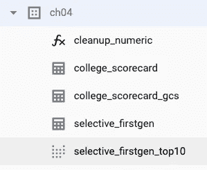

# 使用 dbt 将数据加载并转换到 BigQuery 中

> 原文：<https://medium.com/google-cloud/loading-and-transforming-data-into-bigquery-using-dbt-65307ad401cd?source=collection_archive---------0----------------------->

## 一个数据工程工具，用于在 BigQuery 中构建数据湖、数据仓库、数据集市和商业智能语义层

最近我似乎听到了很多关于 [dbt](https://docs.getdbt.com/) 的事情(最近一次是在由[格拉汉姆·波利](https://medium.com/u/865aa0396c2?source=post_page-----65307ad401cd--------------------------------)和[哈姆扎·汗](https://medium.com/u/1967b9bb3a61?source=post_page-----65307ad401cd--------------------------------)主持的研讨会上)，所以我决定看看到底是怎么回事。

dbt 是 data build tool 的缩写，是一个数据工程工具，当您有多个步骤来转换 SQL 时，它允许您捕获依赖关系。这在您进行 ELT 时很常见——当您将原始数据加载到 SQL 数据仓库中，然后在 SQL 中执行转换来清理数据、创建数据集市等等。

在 BigQuery 的第四章中，我们从一个 CSV 文件中加载了一些关于美国大学的数据，并进行了一些转换。让我们看看如何使用 dbt 自动生成那一章中的所有表和视图。

## 0.设置

首先，你必须做四件事:

*   pip 安装 dbt
*   创建一个供 dbt 使用的服务帐户，并允许该服务帐户创建 BigQuery 表和运行查询
*   将配置文件和服务帐户密钥文件复制到~/中。dbt
*   创建新的 DBT 项目

我已经在 bash 脚本中为您捕获了所有这些步骤。因此，只需通过存储库 git clone 并运行 [setup.sh](https://github.com/GoogleCloudPlatform/bigquery-oreilly-book/blob/master/blogs/dbt_load/setup.sh)

```
git clone [https://github.com/GoogleCloudPlatform/bigquery-oreilly-book/](https://github.com/GoogleCloudPlatform/bigquery-oreilly-book/)
cd bigquery-oreilly-book/blogs/dbt_load
./setup.sh
```

其次，更改 [profiles.yml](https://github.com/GoogleCloudPlatform/bigquery-oreilly-book/blob/master/blogs/dbt_load/profiles.yml) 中的项目名称和 keyfile 的位置，以反映您的主目录(我的是/home/jupyter)。这是要更改的两行:

```
project: **ai-analytics-solutions**  
...
keyfile: /home/**jupyter**/.dbt/keyfile.json
```

## 1.将数据加载到 BigQuery(“数据湖”)

ELT 管道的第一步是 EL。在使用 dbt 进行所有转换之前，必须将数据加载到 BigQuery 中。

因为源数据位于 Google 云存储上，并且是受支持的格式(在我撰写本文时是 CSV/JSON/Avro/Parquet/ORC)，所以将数据放入 BigQuery 的最简单方法是设置一个外部表。这样，我们不必复制原始数据，只需通过运行 [load_external_gcs.sh](https://github.com/GoogleCloudPlatform/bigquery-oreilly-book/blob/master/04_load/load_external_gcs.sh) 在 GCS 文件上定义一个表:

```
./load_external_gcs.sh
```

上述脚本的作用是:

```
bq $LOC \
   mkdef \
   --source_format=CSV \
   --noautodetect \
   $INPUT \
   $SCHEMA \
  | sed 's/"skipLeadingRows": 0/"skipLeadingRows": 1/g' \
  | sed 's/"allowJaggedRows": false/"allowJaggedRows": true/g' \
  > $DEFbq mk --external_table_definition=$DEF ch04.college_scorecard_gcs
```

现在，在 BigQuery 中将有一个名为 college_scorecard_gcs 的外部表。实际数据采用 GCS。我们可以把这看作是我们的数据湖。

## 2.第一次转换(“数据仓库”)

现在让我们定义第一个转换。这是在[模型/学院 _ 记分卡. sql:](https://github.com/GoogleCloudPlatform/bigquery-oreilly-book/blob/master/blogs/dbt_load/college-scorecard/models/college_scorecard.sql)

```
WITH etl_data AS (
   SELECT
     * EXCEPT(ADM_RATE_ALL, FIRST_GEN, MD_FAMINC, SAT_AVG, MD_EARN_WNE_P10)
     , {{target.schema}}.cleanup_numeric(ADM_RATE_ALL) AS ADM_RATE_ALL
     , {{target.schema}}.cleanup_numeric(FIRST_GEN) AS FIRST_GEN
     , {{target.schema}}.cleanup_numeric(MD_FAMINC) AS MD_FAMINC
     , {{target.schema}}.cleanup_numeric(SAT_AVG) AS SAT_AVG
     , {{target.schema}}.cleanup_numeric(MD_EARN_WNE_P10) AS MD_EARN_WNE_P10
   FROM
     ch04.college_scorecard_gcs
)SELECT * FROM etl_data
```

关于这一点需要注意几件事:

*   没有创建或替换表。dbt 将包装这个的创建，并将结果写入数据集 ch04 中名为 college_scorecard 的表中。为什么？因为在 dbt_project.yml 中，我已经指定了:

```
models:
  **college_scorecard:
      materialized: table**
      description: ELT of College Scorecard Data
```

*   dbt 中的“模型”就是我们所说的查询。数据集的名称在 profiles.yml 中指定，表的名称与 SQL 文件的名称匹配。
*   注意，我正在调用一个用户定义的函数 ch04 . clean up _ numeric(target . schema 是输出数据集，所以这里是 ch04)。这在[宏/cleanup_numeric.sql](https://github.com/GoogleCloudPlatform/bigquery-oreilly-book/blob/master/blogs/dbt_load/college-scorecard/macros/cleanup_numeric.sql) 中定义:

```
CREATE OR REPLACE FUNCTION {{target.schema}}.cleanup_numeric(x STRING) AS
(
  IF ( x != 'NULL' AND x != 'PrivacySuppressed',
       CAST(x as FLOAT64),
       NULL )
);
```

*   在开始创建表之前，必须执行所有的宏。我们通过向 dbt_project.yml 添加以下行来确保上面提到的宏运行:

```
on-run-start:
    - "{{**cleanup_numeric_macro**()}}"
```

最终结果是创建了一个名为 college_scorecard 的表。该表包含 CSV 文件中的所有列，但其中五列被转换为数字。这是干净的数据。我们甚至可以丰富或过滤它。我们可以把它想象成我们的数据仓库。

我使用宏来做 UDF 的方式有点像黑客。dbt 中宏的真正目的是捕获您想要重用的 SQL 片段。例如，如果我们一直选择相同的 5 列，我们可以这样定义一个宏:

```

INSTNM, ADM_RATE_ALL, FIRST_GEN, MD_FAMINC, SAT_AVG

```

并引用所有模型 SQL 文件中的宏:

```
SELECT
   {{ selective_college_features() }}
   , MD_EARN_WNE_P10
   ...
```

## 3.第二次转型(“数据集市”)

假设一些商业用户想要一个对第一代学生友好的选择性大学列表。我们知道我们想要运行的 SQL。我们可以把这个放到[models/selective _ first gen . SQL](https://github.com/GoogleCloudPlatform/bigquery-oreilly-book/blob/master/blogs/dbt_load/college-scorecard/models/selective_firstgen.sql)中:

```
SELECT
  INSTNM, ADM_RATE_ALL, FIRST_GEN, MD_FAMINC, SAT_AVG, MD_EARN_WNE_P10
FROM
  {{ ref('college_scorecard') }}
WHERE
  SAT_AVG  > 1300
  AND ADM_RATE_ALL < 0.2
  AND FIRST_GEN > 0.1
```

注意一些事情:

*   我们提供了更小的数据子集(只有几列)
*   FROM 引用 dbt 创建的 college_scorecard

输出被具体化为一个名为 selective_firstgen 的表。

## 4.第三次转型(“报告”)

假设我们有一个报告用例，我们需要根据收入中位数对这些选择性的、第一代友好的大学进行排名。我们可以在[models/selective _ first gen _ top 10 . SQL](https://github.com/GoogleCloudPlatform/bigquery-oreilly-book/blob/master/blogs/dbt_load/college-scorecard/models/selective_firstgen_top10.sql)中再编写一个 SQL 查询:

```
{{ config(materialized='view') }}   /* overrides the project definition */SELECT
  INSTNM, ADM_RATE_ALL, FIRST_GEN, MD_FAMINC, SAT_AVG
FROM
  {{ ref('selective_firstgen') }}
ORDER BY
  MD_FAMINC ASC
LIMIT 10
```

同样，这里的 FROM 子句指的是另一个 dbt 查询。dbt 为我们管理依赖关系。由于 SQL 文件顶部的 config 语句，它将创建一个名为 selective_firstgen_top10 的视图。

## 5.运行它

要运行它，只需执行以下操作:

```
cd college-scorecard
dbt run
```

这将创建函数(由于宏定义)、两个表(college_scorecard 和 selective_firstgen)和一个视图(selective_firstgen_top10):



(回想一下，我们必须在 dbt 之外创建 college_scorecard_gcs，因为它只做 ELT 的 T 部分)。

将它打包到 Docker 容器中，您可以通过云构建或 CI/CD 实现整个过程的自动化，以便在每次修改 SQL 语句时创建表。

dbt 似乎内置了某种测试功能，但我没有探究它。在生产系统中，您可能也会这样做。

## 6.后续步骤

在这个简单的例子中，我们看到了一些常见的数据工程模式。BigQuery 的功能是:

*   数据湖:对存储在 Google 云存储中的文件进行联邦查询
*   数据仓库:用于清理和丰富数据的高度可伸缩的 SQL
*   数据集市:支持业务用户的数据提取
*   商业智能语义层:一致捕获 KPI 的视图

dbt 能够一次性为我们设置好这一切，并捕获依赖关系。我们可以将项目签入版本控制，进行测试，安排构建，以及 CI/CD。

[完整的代码示例](https://github.com/GoogleCloudPlatform/bigquery-oreilly-book/tree/master/blogs/dbt_load)在 GitHub 上。

另外，请阅读哈姆扎对 dbt 的精彩介绍[。](/weareservian/bigquery-dbt-modern-problems-require-modern-solutions-b40faedc8aaf)

尽情享受吧！