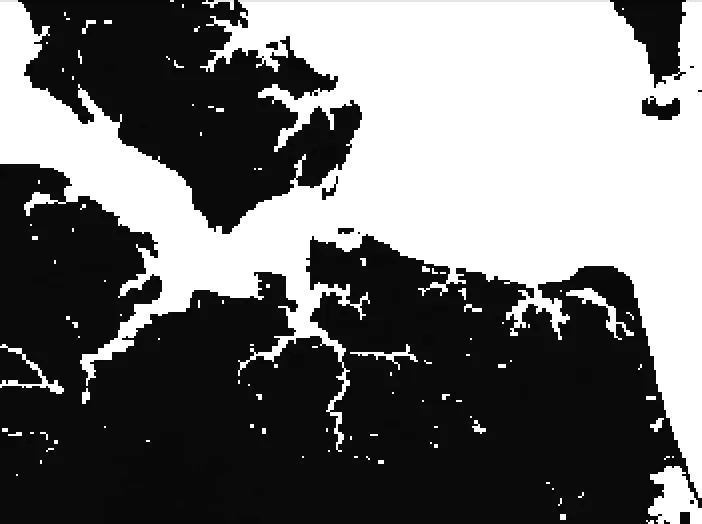

# 在 BigQuery 中加载地理多波段栅格数据

> 原文：<https://medium.com/google-cloud/loading-geographic-multiband-raster-data-in-bigquery-5acea6174d3f?source=collection_archive---------1----------------------->

> 目标:使用以下两种方法在 BigQuery 中加载栅格数据，
> 
> 1.通过 GeoBeam 使用数据流
> 
> 2.使用 GDAL 核心库。

为了设置上下文，这里解释了一些关于栅格数据的术语，

# 光栅图像

在栅格形式中，数据是通过遥感作为图像捕获的，并表示为像素网格。卫星或装有照相机的飞机捕捉地球上某个区域的图像，代表连续变化的数据，例如土壤的性质、林地中的种植园等。

这些图像带有地理标记，包含地理位置信息。通常，此信息由图像左上角像素的坐标、X 方向上每个像素的大小、Y 方向上每个像素的大小以及图像旋转的量(如果有)组成。有了这些信息，GIS 应用程序就可以确保栅格数据显示在正确的位置。

# 法官

栅格图像可以包含一个或多个波段，每个波段覆盖相同的空间区域，但包含不同的信息。有些栅格只有一个波段或图层(单个特征的测量值)，而其他栅格则有多个波段。基本上，波段由单个像元值矩阵表示，具有多个波段的栅格包含多个表示同一空间区域的空间重合像元值矩阵。

波段可以代表电磁波谱的任何部分，包括肉眼不可见的范围，例如红外或紫外部分。具有单一波段的图像称为灰度图像。多光谱图像的三个波段可以用红色、绿色和蓝色显示，这样我们就能看到它们。

> 在光栅图像上表示要素

每个像素或一组像素可以表示一个地理点或一条要素线，如河流或显示为多边形的区域。

# 在 BigQuery 数据集中加载栅格数据

**GeoTIFF** 是一种广泛使用的栅格数据格式。这种格式允许将 TIFF 图像中的像素映射到地理坐标。Tag 图像文件格式，缩写为 **TIFF** 或 **TIF** ，是一种用于存储光栅图形的图像文件格式。

这是我从 geobeam 示例中获得的 tiff 文件，



[土壤网格 Tiff 文件](https://storage.googleapis.com/geobeam/examples/soilgrid-test-clipped.tif)

该栅格文件被加载到 BigQuery 中进行地理空间分析。该文件中的数据模式如下所示，

```
[
  {
    "name": "h3",
    "type": "INT64",
    "description": "Derived available soil water capacity (volumetric fraction) with FC = pF 2.5 for depth 0 cm"
  },
  {
    "name": "geom",
    "type": "GEOGRAPHY"
  }
]
```

根据数据类型，我们可以将一些地理空间数据直接加载到 BigQuery 和 Earth Engine 中。如果数据使用 WGS 84 参考系统，BigQuery 允许加载 WKT、WKB 和 GeoJSON 文件格式的矢量数据。Earth Engine 直接与 Earth Engine 目录中的可用数据集成，并支持以 GeoTIFF 文件格式直接加载光栅图像。但是，我们总是可以将 GeoTiff 文件转换为矢量数据文件，并将其加载到 BigQuery 中进行地理空间分析。

BigQuery 提供了许多[函数](https://cloud.google.com/bigquery/docs/reference/standard-sql/geography_functions)，让我们可以构造新的地理值，计算地理的度量，探索两个地理之间的关系，等等。我们可以使用 BigQuery S2 函数对 S2 格网单元进行分级地理空间索引。此外，BigQuery ML 的机器学习功能可用于识别数据中的模式，如创建 k-means 机器学习模型来聚类地理空间数据。

BigQuery 中 GeoTiff 文件的摄取是使用下面两种方法完成的，

1.  使用基于 GDAL、PROJ 和其他库的 GeoBeam 库
2.  直接使用 OSGEO 库— GDAL、Rasterio

# 使用 GeoBeam 摄取

我使用带有 geobeam 示例代码的数据流来加载多个图像，在本文中，我将介绍土壤网格 tiff 文件加载步骤和结果。

1.  安装地梁，

```
pip install geobeam
```

2.运行 dataflowrunner 调用 geobeam 示例 python 代码将 tiff 文件加载到 BigQuery 中，

```
python -m geobeam.examples.geotiff_soilgrid \
  --runner DataflowRunner \
  --sdk_container_image gcr.io/dataflow-geobeam/base \
  --temp_location <your temp bucket> \
  --project <your project> \
  --service_account_email <your service account> \
  --region us-central1 \
  --worker_machine_type c2-standard-8 \
  --gcs_url gs://geobeam/examples/soilgrid-test-clipped.tif \
  --dataset examples \
  --table soilgrid \
  --band_column h3
```

3.geobeam 库 geo beam . examples . geo tiff _ soil grid 中的[示例](https://github.com/GoogleCloudPlatform/dataflow-geobeam/blob/main/geobeam/examples/crop_geotiff.py)代码用于演示，但是可以对其进行定制以满足任何用例的需求。该示例代码加载了一个单波段图像文件。我修改了它来加载多个波段。

基本上，该代码使用多边形化方法将栅格像素转换为多边形要素，该方法为栅格中共享一个公共像素值的所有像素连接区域创建矢量多边形。每个多边形都创建有一个指示该多边形像素值的属性。

GeoBeam 中的 RasterPolygonSource 用于启用行级数据加载，以便在 BigQuery 中进行即时查询。

```
class geobeam.io.RasterPolygonSource(file_pattern, bidx=1, in_epsg=None, in_proj=None, **kwargs)
```

```
 with beam.Pipeline(options=pipeline_options) as p:
  (p
   | beam.io.Read(GeotiffSource(known_args.gcs_url))
   | 'MakeValid' >> beam.Map(geobeam.fn.make_valid)
   | 'FilterInvalid' >> beam.Filter(geobeam.fn.filter_invalid)
   | 'FormatRecords' >> beam.Map(geobeam.fn.format_record,
       known_args.band_column, known_args.band_type)
   | 'WriteToBigQuery' >> beam.io.WriteToBigQuery('DATASET.TABLE'))
```

上面的示例管道代码显示了读写步骤和选项，用于过滤记录、格式化记录，然后写入 BigQuery。

面数据被加载到地理数据类型列 geom 中，并用于进一步查询。

# 使用 GDAL 摄取数据

这种方法我使用了 OSGEO 开源库，GDAL 和 OGR。这种方法可以更好地控制数据加载方法和步骤，例如可以根据连通性级别对栅格像素进行多边形化。

GDAL 可以安装为，

```
sudo apt-get install gdal-bin unzip 
```

下面的代码加载 tiff 文件，查找文件中的所有波段，并遍历每个波段。图像中的每个波段都被转换成一个形状文件(一种由 Esri 开发的矢量数据格式)。它允许您存储几何位置和相关属性)。但是，也可以使用其他格式来代替形状文件。

```
from osgeo import gdal, ogr
import sys

src_ds = gdal.Open('./SoilGrid.tif')
band = 0
if src_ds is None:
    print ('Unable to open tif  ')   
    sys.exit(1)

print ("[ RASTER BAND COUNT ]: ", src_ds.RasterCount)
for band in range( src_ds.RasterCount ):
    band += 1
    print ("[ GETTING BAND ]: ", band)
    srcband = src_ds.GetRasterBand(band)
    if srcband is None:
        continue

    stats = srcband.GetStatistics( True, True )
    print("band num is : ", band)
    print ("[ NO DATA VALUE ] = ", srcband.GetNoDataValue())
    print ("[ MIN ] = ", srcband.GetMinimum())
    print ("[ MAX ] = ", srcband.GetMaximum())
    print ("[ SCALE ] = ", srcband.GetScale())
    print ("[ UNIT TYPE ] = ", srcband.GetUnitType())

    dst_layername = "POLYGONIZED_DATA_BAND" + str(band)
    drv = ogr.GetDriverByName("ESRI Shapefile")
    dst_ds = drv.CreateDataSource( dst_layername + ".shp" )
    dst_layer = dst_ds.CreateLayer(dst_layername, srs = None )

    gdal.Polygonize( srcband, None, dst_layer, -1, [], callback=None )

    if stats is None:
        continue
```

可以使用 geobeam 加载形状文件，也可以使用 OGR 将其转换为 CSV 格式，然后使用 BQ load 命令加载到 BigQuery 中，

```
ogr2ogr -f csv -dialect sqlite -sql 'select AsGeoJSON(geometry) AS geom, * from "crop_data"' crop_data.csv crop_data.shp
```

```
bq load --autodetect --replace sample_data.crop_data_vector gs://sample_data/crop_data.csv
```

此外，加载的数据可用于使用 BigQuery 中的 geo 函数进行分析。

为了测试和原型化地理空间分析，我使用了 [BigQuery GeoViz](https://cloud.google.com/bigquery/docs/gis-visualize#geo_viz) 作为验证查询并从 BigQuery 生成可视化输出的方法。对于商业智能报告，可以使用 [Looker Studio](https://lookerstudio.google.com/c/u/0/) 或 [Looker](https://looker.com/) 连接到 BigQuery，并将地理空间可视化与各种其他报告类型相结合，以呈现所需洞察的统一视图。

我计划在接下来的博客中发布更多关于地理空间数据分析和创建仪表板的详细示例。

# 参考

[https://webhelp.esri.com/](https://webhelp.esri.com/)

[](https://cloud.google.com/architecture/geospatial-analytics-architecture) [## 地理空间分析架构|云架构中心|谷歌云

### 本文档帮助您了解 Google Cloud 地理空间功能，以及如何在您的…

cloud.google.com](https://cloud.google.com/architecture/geospatial-analytics-architecture) [](https://github.com/GoogleCloudPlatform/dataflow-geobeam/tree/main/geobeam/examples) [## data flow-geo beam/geo beam/主 GoogleCloudPlatform 上的示例/dataflow-geobeam

### 将县宗地的 shapefile 加载到 big query python-m geo beam . examples . shape file _ parcel \-runner direct runner \…

github.com](https://github.com/GoogleCloudPlatform/dataflow-geobeam/tree/main/geobeam/examples) 

[https://docs.qgis.org/2.8/en/docs](https://docs.qgis.org/2.8/en/docs)