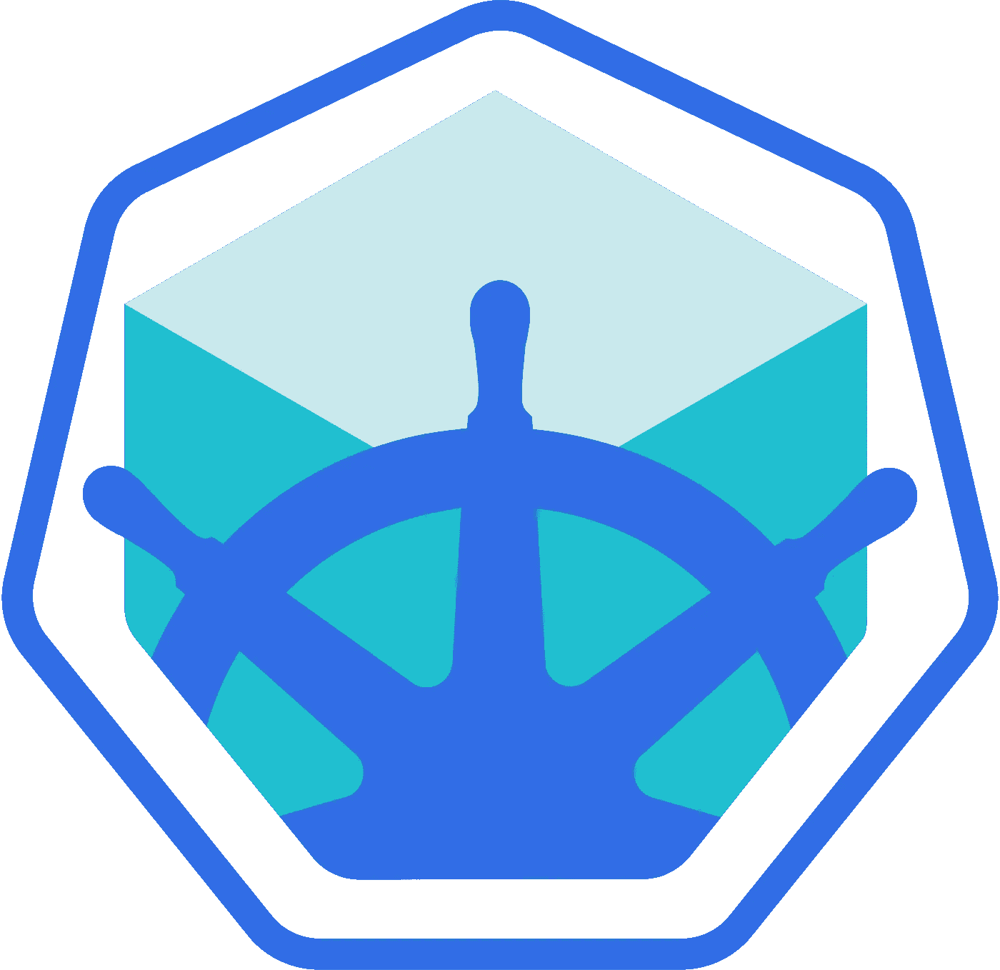

# Kubernetes 的当地 Django 和 Minikube

> 原文：<https://medium.com/google-cloud/local-django-on-kubernetes-with-minikube-89f5ad100378?source=collection_archive---------1----------------------->



迷你库贝

自从我上次在 Kubernetes 上写了关于 [Django 以及 Postgres 和 Redis 容器的文章以来，已经过去半年多了，我想更新一下，谈谈去年在 Kubernetes 生态系统中出现的最令人兴奋的项目之一——](/google-cloud/deploying-django-postgres-redis-containers-to-kubernetes-9ee28e7a146)[Minikube](https://github.com/kubernetes/minikube)。

Minikube 使得在本地运行 Kubernetes 集群变得非常非常容易。虽然以前在本地运行 Kubernetes 有很多选择，但在某种程度上，这个社区正在围绕 Minikube 凝聚，而且它是 Kubernetes Github 组织的正式组成部分。

本教程的所有代码都可以在这个 [Github 项目](https://github.com/waprin/kubernetes_django_postgres_redis)中找到。

以下是一些关于 Minikube 入门的其他教程:

从 Kubernetes 文档开始使用 Minikube

[通过 Minikube 开始使用 Kubernetes](/@claudiopro/getting-started-with-kubernetes-via-minikube-ada8c7a29620#.pukm2rlxz)

[为 Kubernetes 配置终极开发环境](http://thenewstack.io/tutorial-configuring-ultimate-development-environment-kubernetes/)

Minikube 项目本身通常在自述文件中有关于不同安装方式的最新文档，以及开发团队积极响应的问题跟踪器。

除了 Minikube 之外，项目还有其他一些变化:

*   我开始通过 [jinja cli](https://github.com/mattrobenolt/jinja2-cli) 使用 [Jinja](http://jinja.pocoo.org/docs/dev/) 2 模板来填充任何环境变量，并重构配置中特定于 Minikube 或容器引擎的部分。
*   我将所有的复制控制器切换到新的[部署](http://kubernetes.io/docs/user-guide/deployments/)，这与更具声明性的更新系统非常相似

我们的 Django 项目使用了一些云特性，比如负载平衡器和卷(通过 GCE 持久磁盘),您可能想知道它是如何被转换到 Minikube 的。因此，这篇文章将讨论以下主题:

*   我遇到的小技巧和陷阱
*   持久卷和持久卷声明
*   Minikube 服务与外部负载平衡器
*   端口转发及其有用的原因
*   使用主机挂载热重装开发中的代码

# Minikube 提示

2016 年的另一个重大公告是 Docker for Mac，这对我们这些不喜欢运行 VirtualBox 和使用 docker-machine 的人来说非常棒。尽管默认的 Minikube 驱动程序仍然是 VirtualBox，所以如果您使用 Docker for Mac，请确保您指定了 xyve 驱动程序(xyve 是驱动 Docker for Mac 的管理程序):

```
$ minikube start --vm-driver=xhyve
```

或者永久设置为:

```
$ minikube config set vm-driver=xhyve
```

Minikube 需要考虑的另一件事是，它并不总是拥有从私有容器注册中心获取的凭证。如果你使用的是公共 DockerHub 图片，这没什么大不了的，但是如果你使用的是私有注册表(默认情况下像 Google 容器注册表)，这就有问题了。有两种解决方案——第一种是将 [imagePullSecrets](http://kubernetes.io/docs/user-guide/images/) 添加到您所有的 pod 规格中。另一种方法是通过确保 imagePullPolicy 设置为 IfNotPresent 来避免 Minikube 拉取图像。

请记住，默认的 imagePullPolicy 是 IfNotPresent，除非图像被标记为 latest，在这种情况下，它总是。没有标签的图像被认为具有最新的标签。所以最好只是给你的图像加标签，并显式设置你的 imagePullPolicy。

我的示例 repo 采用了后一种方法，避免了在本地工作时提取图像。为了让 Minikube 获得它需要的图像，您可以与 Minikube 共享您的 Docker 守护进程。

```
$ eval $(minikube docker-env)
```

现在，当你做 Docker 构建时，你构建的图像将对 Minikube 可用。

在容器引擎和 Minikube 之间来回切换时，请确保切换上下文:

```
$ gcloud container cluster get-credentials mycluster # Container Engine context$ kubectl config use-context minikube # Minikube context
```

# 持久卷和持久卷声明

在最初的项目中，我将一个 GCE 持久磁盘作为一个卷直接连接到 Postgres Pod:

```
**volumes**:
- **name**: postgresdata
**gcePersistentDisk**:
# your disk name here
**pdName**: pg-data
**fsType**: ext4
- **name**: secrets
```

问题是 Minikube 将无法访问 GCE 磁盘。当然，这很容易通过我们的 Jinja2 模板解决。然而，Kubernetes 有 PersistentVolumes 和 PersistentVolumeClaims 的概念，它们概括了存储的本质，所以我认为这是添加它的好地方。

我们没有附加特定的卷，而是附加了一个 PersistentVolumeClaim，它只是要求某种存储。当然，声明可以指定他们需要什么样的读/写权限，需要多少存储空间，等等。

```
**kind**: PersistentVolumeClaim
**apiVersion**: v1
**metadata**:
**name**: postgres-data
**spec**:
**accessModes**:
  - ReadWriteOnce
**resources**:
  **requests**:
    storage: 5Gi
```

然后我们可以把 PVC 贴在豆荚上。

```
**volumes:** - **name:** postgresdata
**persistentVolumeClaim:
  claimName:** postgres-data
```

声明将需要绑定到满足其约束的持久卷。对于容器引擎，我们仍将创建一个 GCE 磁盘:

```
**apiVersion:** v1
**kind:** PersistentVolume
**metadata:
  name:** pv0001
**spec:
accessModes:** - ReadWriteOnce
**capacity:
storage:** 5Gi
**gcePersistentDisk:
  pdName:** pg-data
  **fsType:** ext4
```

但是对于 Minikube，我们可以只创建一个本地目录，并使用 hostmount 作为持久卷。

```
**apiVersion:** v1
**kind:** PersistentVolume
**metadata:
name:** pv0001
**spec:
accessModes:** - ReadWriteOnce
**capacity:
  storage:** 5Gi
**hostPath:
  path:** /data/pv0001/
```

# 负载平衡器

我们为 web 流量提供服务的前端使用了 LoadBalancer 类型的服务，它在 Container Engine 上提供了一个 Google Compute Engine L7 负载平衡器。这为我们运行时提供了一个外部 IP:

```
$ kubectl get services
```

这样我们就可以从那里获得服务。显然，Minikube 拥有 GCE 负载平衡器或外部 IP 是没有意义的。幸运的是，Minikube 忽略了负载平衡器，我们仍然可以使用“minikube service”命令来访问我们的服务:

```
$ minikube service guestbook
```

这将在本地端口上打开一个浏览器窗口，显示我们的留言簿服务。

# 端口转发

在开发过程中，能够对代码进行更改并立即在浏览器中反映出来通常很有用。另一方面，Kubernetes 期望不可变的图像，所以我们需要做一个 Docker 构建来更新我们的应用程序。如果我们的代码更改能够立即反映出来，并且能够使用我们真正的 Postgres 数据库和 Redis 缓存，那就太好了。

一种选择是在本地开发 Django 代码，但仍然通过 Minikube 使用 Minikube Postgres 和 Redis。Kubernetes 有一个 port-forward 命令，当您想要访问您的 Kubernetes 服务而不将其作为某种外部服务时，这个命令非常有用。所以如果你做一些像

```
$ kubectl port-forward <posgtres-pod> 5432:5432 &$ kubectl port-forward <redis-pod> 6379:6379 &
```

那么您的 localhost Postgres 和 Redis 端口将映射到 Minikube 端口。你可以从你的 Macbook 上直接通过 *psql* 和 *redis-cli* 与这些服务对话，你的本地 Django 应用也可以通过 localhost 与它们对话。一般来说，端口转发对于访问不希望在 Kubernetes 集群上公开的服务非常有用。

# 通过主机装载进行热重装

使用端口转发，您仍然在本地机器上运行 Django 代码，而不是在 Kubernetes 集群上运行，这可能不是您想要的，特别是如果您在 Docker 映像上为前端安装了工作站上不需要的东西。幸运的是，让你的代码热重新加载但仍然在你的 Docker 容器中运行也很容易。

您所要做的就是创建一个主机挂载来将本地目录挂载到您的容器中。您还需要确保将— reload 标志添加到 docker 文件中的 gunicorn 命令:

```
gunicorn --reload -b :$PORT mysite.wsgi
```

现在我们需要挂载主机目录。请记住，在 Mac 上运行时，通常有两级主机。Macbook 本身，然后是 VirtualBox 或者 xhve。因为我使用的是 xhyve，所以我的/Users 目录是自动挂载的，这也是我进行所有开发的地方。所以我只需要把我保存 Django 代码的地方挂载到容器期望找到代码的地方，这个地方对我来说是`/ Users/wa prin/code/Django _ postgres _ redis/guest book `,这个地方是/app。所以我最终在我的前端添加了这样的东西。

```
# in guestbook container **volumeMounts**:
- **name**: reload
  **mountPath**: /app
**volumes**:
  - **name**: reload
  **hostPath**:
**path**: /Users/waprin/code/django_postgres_redis/guestbook
```

现在，每当我对 Macbook 上的代码进行任何更改，都会反映在容器的目录中，gunicorn 会自动热交换新代码。所以我可以在我的 Macbook 上编码，但是我所有的代码都在 Minikube 的 Linux 容器上运行，我所有的 Kubernetes 服务都是可用的。

不幸的是，Linux 上没有实现主机文件夹共享，尽管 Linux 工作站更接近我们运行的 Docker 映像，所以这可能不是什么大问题。

# 保持联系

像往常一样，在我的 [Github repo](https://github.com/waprin/kubernetes_django_postgres_redis) 上提交一个问题，或者在 [Twitter](https://twitter.com/waprin_io) 上提到我。

你还可以加入 Kubernetes [Slack](https://kubernetes.slack.com/) 上的#minikube 频道(在这里获得邀请[)，以及](http://slack.kubernetes.io/) [Google Cloud Slack](https://googlecloud-community.slack.com) 上的#python 频道(在这里获得邀请[)。](https://gcp-slack.appspot.com/)