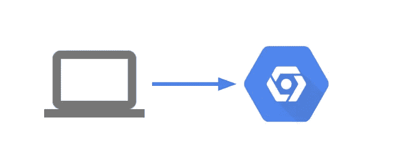

# 使用 Google 云平台进行本地/远程身份验证

> 原文：<https://medium.com/google-cloud/local-remote-authentication-with-google-cloud-platform-afe3aa017b95?source=collection_archive---------0----------------------->

**作者:** [萧](/@theodoresiu7)，[丹尼尔](/@danielrdeleo)

**更新(2021–03–24):考虑到安全性，特别是对于本地开发和直接面向用户的计算机，使用服务帐户 JSONS 可能不是最安全的。如** [**后的**](https://jryancanty.medium.com/stop-downloading-google-cloud-service-account-keys-1811d44a97d9) **等文章都主张类似的立场。虽然我们仍然建议使用 GOOGLE_APPLICATION_CREDENTIALS 的服务帐户 JSONS 在生产非 GOOGLE 云类型环境中运行代码，但我们建议使用 gcloud auth application-default 登录进行本地开发。我们已经删除了对“本地机器”上的服务帐户的引用，以反映这一变化。**



不正确的身份验证可能会阻止本地机器访问 GCP 资源

在本地或远程机器上设置谷歌云平台认证可能是一项令人困惑的任务。相对于用户帐户，您应该何时/如何使用服务帐户？你如何处理多个项目？不正确的身份验证也会导致权限被拒绝的错误。下面是一个抛出错误的示例:

```
"Permission 'cloudkms.cryptoKeyVersions.useToEncrypt' denied for resource 'projects/myproject /locations/global/keyRings/myRing/cryptoKeys/myKey'.","status": "PERMISSION_DENIED"
```

Google Cloud Platform 提供了以下从本地机器进行身份验证的方式:

1.  创建服务帐户，下载相应的 JSON 凭证文件，并将 JSON 文件路径的环境变量设置为`GOOGLE_APPLICATION_CREDENTIALS`。
2.  使用`gcloud auth application-default login`对用户身份进行认证(通过 web 流),但使用凭证作为服务帐户的代理。
3.  运行`gcloud auth login`命令以用户身份认证(通过 web flow)，然后授权 gcloud 和其他 SDK 工具访问 Google 云平台。注意，这个 auth 命令也是运行`gcloud init`时运行的一组命令之一。
4.  当您的本地机器是嵌入式设备时，使用 GCP 服务特定的方法，例如生成用于[核心物联网认证](https://cloud.google.com/iot/docs/concepts/device-security#authentication)的私有/公共密钥对。这些特定于服务的示例超出了本文的范围。

# 使用服务帐户

当以编程方式访问 GCP 资源时，应该使用 GCP 的服务帐户(例如:从脚本，使用 google.cloud 库的应用程序，点击 GCP API 等)..).如果你自己访问 GCP，不要使用服务帐户，而是用你自己的谷歌用户身份认证！通过执行以下步骤，可以在本地计算机上创建和使用服务帐户进行身份验证:

**使用 GCP 用户界面**

1.  登录你的 GCP 控制台`[https://console.cloud.google.com](https://console.cloud.google.com)`，点击侧边栏的`API's and Services >> Credentials`。
2.  你将被带到一个屏幕，在那里你可以点击`Create Credentials >> Service Account Key`。在这里，您可以创建一个新的服务帐户(记住[附加适当的 IAM 角色](https://cloud.google.com/iam/docs/granting-roles-to-service-accounts#granting_access_to_a_service_account_for_a_resource))并下载代表凭证的 JSON 密钥文件。

**使用 gcloud 命令行工具**

1.  假设您已经使用`gcloud auth login`认证为用户。然后，您可以使用`gcloud config set project my-project`设置您的项目。
2.  使用命令`gcloud iam service-accounts create [SA-NAME] --display-name "[SA-DISPLAY-NAME]"`创建您的服务帐户，其中`SA-NAME`是您的服务帐户名称，`SA-DISPLAY-NAME`是显示友好名称。此时还应该为服务帐户分配适当的 IAM 角色[。](https://cloud.google.com/iam/docs/granting-roles-to-service-accounts#granting_access_to_a_service_account_for_a_resource)
3.  下载代表凭证的 JSON 密钥文件`gcloud iam service-accounts keys create ~/key.json
    --iam-account [SA-NAME]@[PROJECT-ID].iam.gserviceaccount.com`

下载完密钥后，通过运行 export 命令将环境变量`GOOGLE_APPLICATION_CREDENTIALS`设置为 JSON 的路径。例如:

```
export GOOGLE_APPLICATION_CREDENTIALS=path/to/service_acct.json
```

要更永久地设置您的凭据，如果您正在运行 VM，请考虑将此命令添加到启动/引导脚本中。下面是 BASH 中的一个例子。

```
echo 'export GOOGLE_APPLICATION_CREDENTIALS = your/path/to/service_account_cred.json' >> ~/.bash_profile
```

**使用服务帐户并设置环境变量 GOOGLE_APPLICATION_CREDENTIALS 在 gcloud 上的优先级高于所有其他方法**。**更新(2021–03–24):考虑到安全性，特别是对于本地开发和直接面向用户的计算机，使用服务帐户 JSONS 可能不是最安全的。虽然我们仍然建议使用 GOOGLE_APPLICATION_CREDENTIALS 的服务帐户 JSONS 在生产类型环境中运行代码，但我们建议使用 gcloud auth application-default 登录进行本地开发。**

# 使用 gcloud auth 应用程序-默认登录

`gcloud auth application-default login`命令创建一个名为`application_default_credentials.json`的凭证 JSON，嵌入在环境中的`.config/`目录下。这种方法非常类似于上面的服务帐户方法，除了不是手动配置服务帐户和下载凭证的 JSON 文件，而是对用户进行身份验证并自动生成附加到用户的凭证。**这不是推荐的方法**，因为它的优先级低于设置`GOOGLE_APPLICATION_CREDENTIALS`。**更新(2021–03–24):考虑到本地机器的安全性，这是首选的身份验证方法。**

# 作为用户进行身份验证

运行`gcloud auth login`或者按照`gcloud init`登录流程将您认证为用户——但是这与上面两种使用服务帐户的方法有什么不同呢？

1.  只有在以用户身份执行管理任务(例如，设置服务帐户、手动运行 gsutil 命令)时，才应进行用户身份验证，而不是在以编程方式访问 GCP(如在 Python 或 Go 脚本中)时。
2.  与使用服务帐户方法不同，身份验证不是通过 JSON 文件完成的，而是通过令牌完成的。
3.  通过使用`gcloud auth login`或`gcloud init`，gcloud、gsutil 和 bq 命令开始作为用户帐户运行命令。也可以[将服务帐户](https://cloud.google.com/sdk/gcloud/reference/auth/activate-service-account)与所有这些工具一起使用。关于使用这些命令行工具进行身份验证的两种方法的一般指南可以在[这里](https://cloud.google.com/sdk/docs/authorizing)找到。

# 什么优先？

1.  如果运行 gcloud、gsutil 和 bq 命令行工具而没有作为服务帐户进行身份验证(这是运行`gcloud auth login`或`gcloud init`时的默认设置)，用户帐户将优先。
2.  如果以编程方式使用 GCP 资源(例如:在 google.cloud 库的脚本中)，将调用一个服务帐户，并且环境变量`GOOGLE_APPLICATION_CREDENTIALS`优先于所有其他方法。
3.  在服务帐户的情况下，如果没有找到`GOOGLE_APPLICATION_CREDENTIALS`，将根据操作系统或使用的 Google 服务调用辅助应用程序默认凭证。例如，在 Windows 操作系统上，gcloud 查找`%APPDATA%/gcloud/application_default_credentials.json`，而在非 Windows 操作系统上，gcloud 查找`$HOME/.config/gcloud/application_default_credentials.json`。请参见此[链接](https://cloud.google.com/sdk/docs/authorizing#finding_your_credential_files)以搜索您的默认凭证列表。
4.  在诸如 App Engine、Compute Engine 或 Google Kubernetes Engine 的 GCP 资源上，查询元数据数据库以获取服务自己的凭证。

如果不满足任何条件，GCP 将无法通过身份验证，并且会遇到权限错误。

**结论**

现在我们已经验证了正确的实体已经通过了 Google 云平台的认证，您是否还会遇到同样的权限问题？如果是这样，请继续关注第 2 部分，在那里我们将讨论 GCP 服务权限。

1.  截至 2019 年 4 月发布本文时，存在一个已知的 IAM 策略错误，该错误会在删除服务帐户并重新创建同名的服务帐户时发生。删除时，已删除服务帐户的 IAM 策略绑定不会立即删除。需要手动删除然后重新添加服务帐户的策略绑定，以便向服务帐户正确授予 IAM 角色。