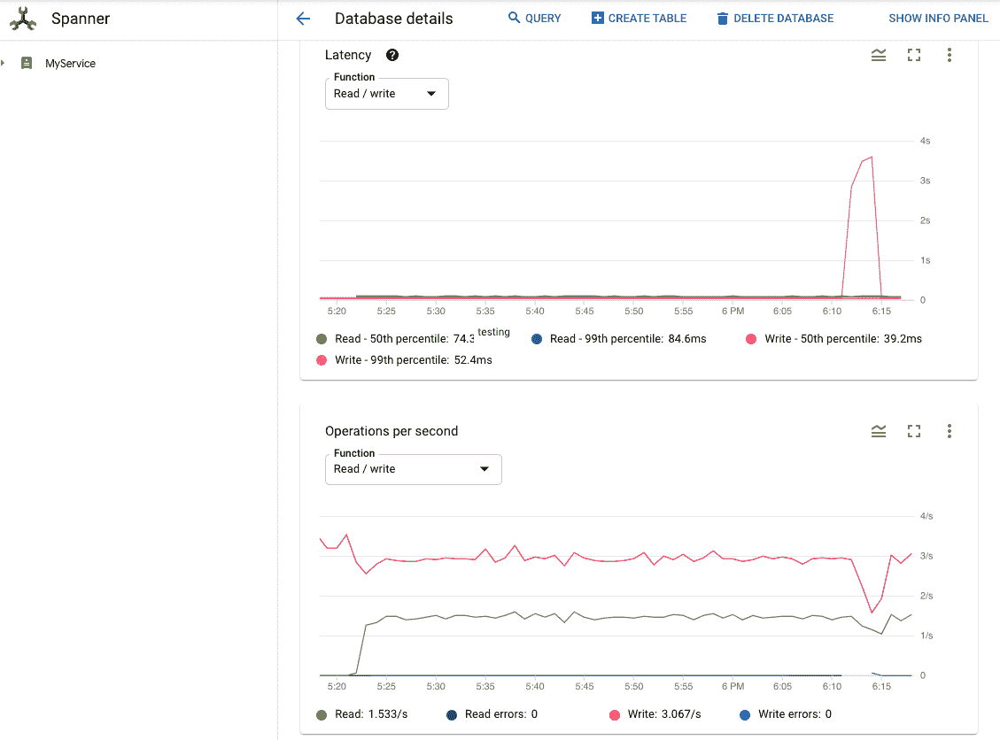
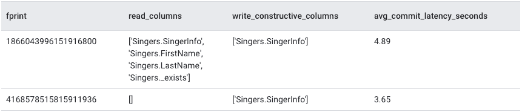

# 锁定统计信息:诊断云扳手中的性能问题

> 原文：<https://medium.com/google-cloud/lock-statistics-diagnose-performance-issues-in-cloud-spanner-266aab4ee3e2?source=collection_archive---------2----------------------->

# 真实世界的场景

假设您正在开发一个由云扳手数据库支持的电子商务应用程序。该应用程序正在按预期运行，您的事务正在以较低的延迟执行。有一天，你听到有人抱怨你的应用程序变慢了，所以你决定调查一下。一种可能性是这个问题可能是数据库问题。您查看了 Cloud Spanner 监控图，并注意到 99%的写入延迟急剧上升，这也影响了吞吐量。



99%的写入延迟峰值

您需要调查延迟峰值的根本原因。您知道最近没有对数据库进行配置或模式更改。您唯一能想到的是几个小时前的新部署，它可能引入了一种新的访问模式。您认为该部署中推出的交易可能有可疑之处。但是你怎么能找到确凿的证据来证明呢？如何发现锁冲突是否导致了延迟高峰？如果锁冲突确实是罪魁祸首，那么事务试图锁定数据库中的哪些表单元格呢？

# 云扳手和锁定

好消息是，Cloud Spanner 的自省工具，特别是最近添加的锁统计功能，可以帮助您回答这些问题。

cloud Spanner——Google 全面管理的水平可扩展关系数据库服务，提供最严格的并发控制保证，因此您可以专注于事务的逻辑，而不必担心数据完整性。为了让您高枕无忧，并确保多个并发事务的一致性，我们在表单元格级别使用了共享锁和排他锁的组合。如您所知，锁带来了潜在的锁冲突。当多个事务试图锁定同一个单元时，可能会发生锁定冲突，从而导致数据库性能下降。

# 什么是锁统计

Lock statistics 是我们最近添加到功能集合中的另一个自省工具，可以帮助您分析和解决云扳手数据库中的问题。顾名思义，锁统计公开了关于锁、锁等待时间、锁涉及哪些表单元格等等的数据。与其他自省工具一样，这些数据通过一组内置的统计表显示在锁统计数据中。

*   **聚合锁统计表**。聚合表包含每 1 分钟、10 分钟和 60 分钟的总锁等待时间。总锁等待时间可用于监控整体应用程序运行状况，并与延迟峰值相关联。
*   **顶锁统计表**。顶部的统计表包含每 1 分钟、10 分钟和 60 分钟内发生最长锁等待时间的抽样单元。顶部的统计表有助于确定导致最长锁等待的特定数据单元，并识别争用锁的事务。

顶部锁统计表中的每一行都代表在给定时间段内导致最长等待时间的锁冲突。它显示锁定键范围的开始键、事务在特定冲突上花费的等待时间，以及与锁定模式有冲突的示例列。这有助于您锁定导致最长锁等待的特定数据单元，并识别哪些事务争用锁。

您可以在文档的[自省工具](https://cloud.google.com/spanner/docs/introspection)部分找到更多详细信息，其中包括查询、事务、读取和锁定统计，以及如何发现最早的活动查询的信息。

现在让我们来看一个结合了锁统计信息和其他统计信息的模式，以解决我们在示例场景中讨论的问题。

# 如何使用锁统计信息

那么，锁统计如何帮助我们理解并有希望减轻导致我们在示例场景中发现的延迟问题的问题呢？正如您将看到的，当我们在问题开始发生的时间段内将来自这些工具的信息结合起来时，内省工具集合的真正力量就显现出来了。

# 锁冲突是延迟高峰的根本原因吗？

要回答这个问题，我们可以检查问题第一次出现时的平均延迟数和锁等待时间。

[事务统计](https://cloud.google.com/blog/products/databases/database-transaction-stats-in-spanner)提供提交延迟信息，锁统计提供锁等待时间信息。如果锁冲突是提交延迟增加的原因，那么当我们将锁统计([TXN _ 统计 _ 总计 _ 10 分钟](https://cloud.google.com/spanner/docs/introspection/transaction-statistics#transaction-stats-total))与锁统计([锁 _ 统计 _ 总计 _ 10 分钟](https://cloud.google.com/spanner/docs/introspection/lock-statistics#locks-by-row-key))连接时，您应该能够看到相关性，如下例所示。以下示例查询告诉我们每 10 分钟间隔的平均提交延迟和总锁等待时间。

```
SELECT 
    t.interval_end, 
    t.avg_commit_latency_seconds, 
    l.total_lock_wait_seconds
FROM spanner_sys.txn_stats_total_10minute t
LEFT JOIN spanner_sys.lock_stats_total_10minute l
ON t.interval_end = l.interval_end
WHERE
    t.interval_end >= “2020–11–12T17:10:00Z”
AND t.interval_end <= “2020–11–12T19:00:00Z”
ORDER BY interval_end;
```

以下是一些示例结果。当你看到**avg _ commit _ latency _ seconds**的增加与 **total_lock_wait_seconds，**的增加高度相关时，那么你知道你正朝着正确的方向前进。

该结果显示在从*2020–11–12 18:10:00*到*2020–11–12 18:20:00*的同一时间段内**avg _ commit _ latency _ seconds**随着 total_lock_wait_seconds 的增加而增加，之后下降。既然我们已经确认了锁等待时间与写入延迟的增加密切相关，那么是时候进入下一个问题了。

# 在特定时间段内，哪些行和列导致了长时间的锁定等待？

为了找出哪些行和列导致了我们在上一步中发现的等待时间峰值，我们可以查询 [LOCK_STAT_TOP_10MINUTE](https://cloud.google.com/spanner/docs/introspection/lock-statistics#locks-by-row-key) 表。该表包含对锁等待影响最大的行键和示例列。

```
SELECT 
    CAST(s.row_range_start_key AS STRING) AS row_range_start_key,
    t.total_lock_wait_seconds,
    s.lock_wait_seconds,
    s.lock_wait_seconds/t.total_lock_wait_seconds frac_of_total,
    s.sample_lock_requests
FROM 
    spanner_sys.lock_stats_top_10minute s,
    spanner_sys.lock_stats_total_minute t
WHERE
    t.interval_end = "2020-11-12T18:20:00Z" 
AND s.interval_end = t.interval_end;
```

从查询结果中，我们可以看到冲突发生在关键字 **SingerId=32** 处的 Singers 表上。**歌手。SingerInfo** 是发生锁冲突的列，此时一个事务试图获取读共享锁，而另一个事务试图获取写共享锁。

当一个事务试图读取某个单元，而另一个事务试图写入同一单元时，这是一种常见的冲突。参见[锁定模式冲突](https://cloud.google.com/spanner/docs/introspection/lock-statistics#lock-mode-conflicts)了解不同锁定模式之间可能冲突的更多信息。现在我们知道了多个事务争用的确切数据单元，我们将继续下一个问题。

# 哪些事务正在访问锁冲突中涉及的列？

为了找出哪些事务试图读写锁冲突中涉及的列，我们在下面的查询中再次将事务统计信息与锁统计信息连接起来。

我们可以通过从[TXN _ 统计 _ 总计 _ 10 分钟](https://cloud.google.com/spanner/docs/introspection/transaction-statistics#transaction-stats-total)中检索 **fprint** 、**read _ 列**、**write _ constructive _ 列**和**avg _ commit _ latency _ seconds**来识别事务。

```
SELECT
    fprint,
    read_columns,
    write_constructive_columns,
    avg_commit_latency_seconds
FROM spanner_sys.txn_stats_top_10minute t2
WHERE (
    EXISTS (
        SELECT * FROM t2.read_columns columns
        WHERE columns IN (
            SELECT DISTINCT(req.COLUMN)
            FROM
                spanner_sys.lock_stats_top_10minute t,
                t.SAMPLE_LOCK_REQUESTS req
            WHERE
                req.LOCK_MODE = "ReaderShared"
                AND t.interval_end ="2020-11-12T18:20:00Z"))
    OR
    EXISTS (
        SELECT * FROM t2.write_constructive_columns columns
        WHERE columns IN (
            SELECT DISTINCT(req.COLUMN)
            FROM
                spanner_sys.lock_stats_top_10minute t,
                t.SAMPLE_LOCK_REQUESTS req
            WHERE
                req.LOCK_MODE = "WriterShared"
                AND t.interval_end ="2020-11-12T18:20:00Z")))
AND t2.interval_end ="2020-11-12T18:20:00Z"
ORDER BY avg_commit_latency_seconds DESC;
```

该查询确定了我们正在调查的时间段内的以下交易:

1.  试图获取读取器共享锁时，从导致锁冲突的任何列中读取的事务。
2.  在尝试获取 WriterShared 锁时，事务写入导致锁冲突的任何列。



查询结果示例

如查询结果所示，两个事务试图访问歌手。SingerInfo，这是在此期间发生锁冲突的列。一旦确定了导致锁冲突的事务，就可以尝试确定每个事务中导致问题的问题。

# 通过应用最佳实践来优化事务延迟

在您成功地识别出争用锁的事务之后，您可以应用[事务最佳实践](https://cloud.devsite.corp.google.com/spanner/docs/introspection/lock-statistics?db=andrewby-lock-stats#applying_best_practices_to_reduce_lock_contention)来减轻锁冲突。

查看新的事务时，您发现事务中的数据操作语言(DML)语句不以主键 SingerId 为条件，从而导致全表扫描并锁定表，直到提交事务。如果我们知道 SingerId，我们可以更新 DML 中的 WHERE 子句，使其以 SingerId 为条件。如果我们不知道要更新的行的 id，我们也可以考虑使用一个单独的只读事务来首先获取 id，然后发送另一个读写事务来根据 id 更新行。

# 摘要

总之，Cloud Spanner 现在通过引入锁统计信息来提供对锁冲突的可见性。查看[锁统计](https://cloud.google.com/spanner/docs/introspection/lock-statistics)文档以了解更多细节，并探索其他[自省工具](https://cloud.google.com/spanner/docs/introspection)以帮助您排除故障并提高您的云扳手实例的性能。