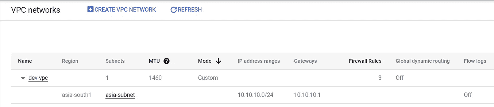
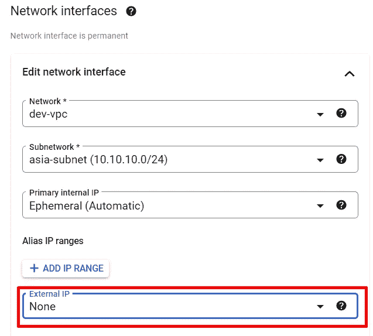
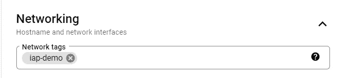
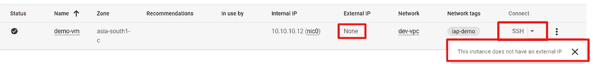
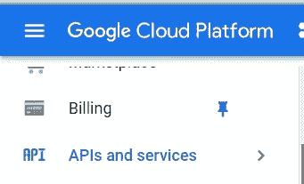
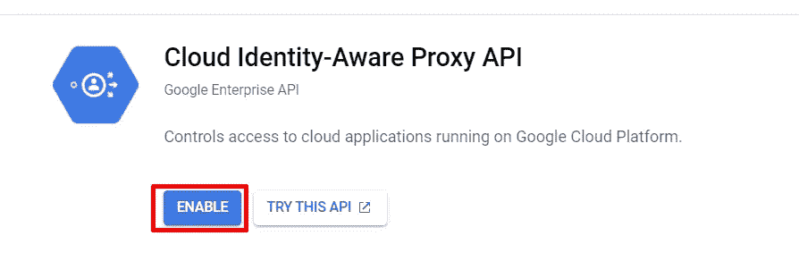
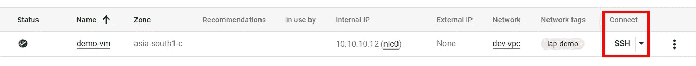
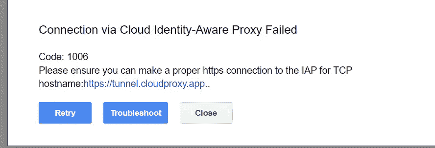
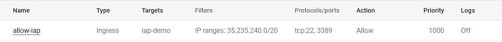
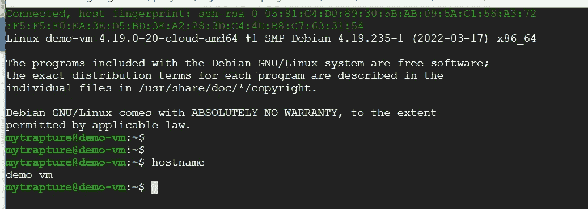

# 使用身份识别代理(IAP)登录到没有公共 IP 的 GCP 虚拟机实例

> 原文：<https://medium.com/google-cloud/login-to-gcp-vm-instance-without-public-ip-31cc01ee152b?source=collection_archive---------0----------------------->

**简介**

本文将尝试向您解释我们如何使用**身份感知代理** (IAP)在没有公共/外部 IP 的情况下登录 GCE 实例。身份识别代理(IAP) TCP 转发，允许对没有外部 IP 地址或不允许通过 internet 直接访问的虚拟机实例进行管理访问。在本文中，我将首先尝试重现该问题，然后引导您完成解决方案。

关于 IAP 的更多信息— [点击此处](https://cloud.google.com/iap/docs/using-tcp-forwarding)

**先决条件**

1.  编辑者/所有者访问 GCP 项目

**资源创建**

1.  创建自定义 VPC ex。 **dev-vpc** ，子网位于所需区域。

自定义 VPC

2.使用自定义 VPC 网络创建一个 GCE 实例，并在创建如下实例时保持外部 IP 为 **none** 。

网络结构

3.使用网络标签 ex。创建实例时出现“iap-demo”。

4.现在实例已经创建并处于运行状态。然而 **ssh** 按钮被禁用。

5.现在使用 IAP 从 API 和服务中启用身份感知代理 API。

导航至 API 和服务

在库中搜索以下 IAP API 并点击**启用**

6.分配用户角色—**IAP-安全隧道用户**来自IAM

7.现在 **ssh** 选项在分配上述角色后可用。

8.现在尝试 ssh，(连接将失败，出现以下错误)

9.要解决此错误，我们需要创建防火墙规则，允许来自 IP 范围`35.235.240.0/20`的流量进入。这个范围包含 IAP 用于 TCP 转发的所有 IP 地址。

允许 IAP 连接的防火墙规则

10.现在尝试 ssh 到 GCE 实例，这将创建成功的 ssh 连接，并允许用户登录到 GCE 实例。

**总结**

1.  身份识别代理(IAP) TCP 转发，允许对没有外部 IP 地址或不允许通过 internet 直接访问的虚拟机实例进行管理访问。
2.  要启用 IAP，我们需要-
3.  启用**云身份感知代理** API
    2)向用户分配**角色/IAP . tunnelresourceaccessor**角色
    3)创建防火墙以允许来自 IP 范围 **35.235.240.0/20** 的 ssh 流量这是 google 提供的固定 IP 范围。

跟随下面的 YouTube 视频进行演示。