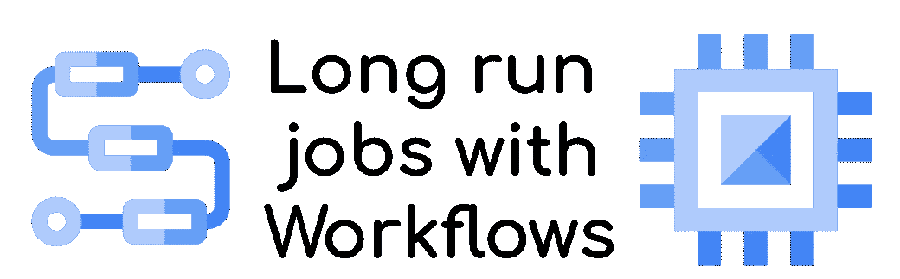
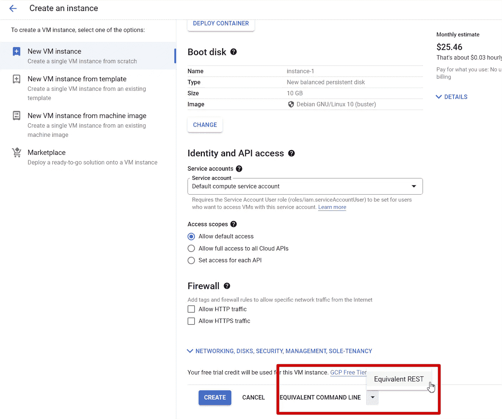

# 使用云工作流的长期运行作业

> 原文：<https://medium.com/google-cloud/long-running-job-with-cloud-workflows-38b57bea74a5?source=collection_archive---------0----------------------->



**无服务器服务**旨在**运行实时和交互式工作负载**:网站、REST APIs 它们**并非真正为数小时、数天或数周内的长期运行任务**而设计。没有专门的服务，虚拟机仍然是运行这些工作负载的最佳场所。

最近， [Mete Atamel](https://medium.com/u/6444b44155fa?source=post_page-----38b57bea74a5--------------------------------) 在一篇 [Google Cloud 博客文章](https://cloud.google.com/blog/topics/developers-practitioners/long-running-containers-workflows-and-compute-engine)中发布了一个带有**云工作流**的解决方案。该解决方案结合了云工作流、无服务器产品和计算引擎，非常棒。

> 然而，我并不完全满意。

事实上，Mete 的解决方案让协调器(云工作流)选择在虚拟机上运行工作负载的持续时间。他的解决方案是:

*   **必须知道工作负载的持续时间**:如果工作负载**提前结束，那么虚拟机的时间就白白浪费了**。如果不是，**在**结束前停止(结果不会错)
*   **必须实现一个 web 服务器**来启动和停止工作负载
*   **必须在互联网上打开一个端口**以允许云工作流与网络服务器交互

> 在不知道工作负载持续时间和没有 web 服务器的情况下，如何运行日志运行作业？

*另外，不开放 VM 端口到野生互联网。*

# 回拨解决方案

Mete 的想法很好:云工作流和计算引擎的**组合**是关键，但是作业的**端必须由工作负载本身**控制。为此，云工作流提出了一个名为 [**回调**](https://cloud.google.com/workflows/docs/creating-callback-endpoints) **的有用特性。**

该功能基于**网钩模式。**

*   你生成一个 URL
*   您向客户端提供 URL
*   您等待客户端对回调 URL 调用

*您可以在等待上添加一个超时，并定制您想要监听的 HTTP 动词(GET、POST、PUT、DELETE)。除了回调通知之外，post 对于接收数据也很有用。*

# 带回调的长时间运行的作业

所以，[我在 GitHub](https://github.com/guillaumeblaquiere/workflow-long-running-job) 中的原型就是利用回调特性，在虚拟机上运行容器。

除了我分享的无用例子，**这里最重要的是原理和工作流逻辑**；*您可以重用和定制该原则，以获得更强大的解决方案！*

## 回调的创建

回调创建不需要特殊技巧。注意在回调被调用时你所期望的 HTTP 动词，特别是当回调通知的同时**得到一个主体响应(在这种情况下不要使用`GET`)**

```
- create_callback:
    call: events.create_callback_endpoint
    args:
      http_callback_method: "GET"
    result: callback_details
```

## 创建计算引擎

计算引擎也没有显示任何挑战。为了更快地了解和理解所需的参数，我使用了控制台上的**计算引擎创建 UI 和** `**View equivalent**` **功能**



并使 JSON 参数适应工作流中的 YAML 定义。

然而，我们不必创建一个简单的虚拟机。我们必须**定制启动**来运行工作负载，并在完成后调用云工作流回调。

**所以，我们需要一个** [**的启动脚本**](https://cloud.google.com/compute/docs/instances/startup-scripts/linux) **！**

## 启动脚本焦点

启动脚本是该解决方案的核心，也是最具挑战性的云工作流约束。

所以我们需要的是:

*   要**知道命令才能运行**。我们可以硬编码它，但是我更喜欢把它放在虚拟机的参数中，在**属性元数据**中
*   到**知道了回叫就去叫**。这里也没有硬编码，也没有放入虚拟机的**参数**
*   被允许使用云工作流回调。因此，我们必须从[元数据服务器](https://cloud.google.com/compute/docs/metadata/default-metadata-values)获取一个访问令牌，并将其添加到回调的 curl 调用的安全头中。

*在安全方面，如果你使用*[*C****Compute Engine 服务账号***](https://cloud.google.com/compute/docs/access/create-enable-service-accounts-for-instances) *，你必须* ***正确地限定你的 Compute Engine*** *VM 的范围。我使用了* ***云平台作用域*** *来避免任何问题(如果使用自定义服务帐户* *，可以* ***跳过作用域)。
另外，所使用的服务账号(默认或自定义)* ***必须有*** [***工作流调用者角色***](https://cloud.google.com/workflows/docs/access-control#roles) ***授予其上。*****

那么，我们开始吧。获取元数据属性并不困难。调用[元数据服务器就足够了](https://cloud.google.com/compute/docs/metadata/default-metadata-values#vm_instance_metadata)，就像这样

```
# Docker Command
curl -H "Metadata-Flavor: Google" [http://metadata.google.internal/computeMetadata/v1/instance/attributes/docker-command](http://metadata.google.internal/computeMetadata/v1/instance/attributes/docker-command)# Callback URL
curl -H "Metadata-Flavor: Google" [http://metadata.google.internal/computeMetadata/v1/instance/attributes/callback-url](http://metadata.google.internal/computeMetadata/v1/instance/attributes/callback-url) 
```

获取访问令牌更具挑战性。当然，元数据服务器提供了`/services-accounts/default/token`端点，答案在 JSON 中。

```
curl -H "Metadata-Flavor: Google" http://metadata.google.internal/computeMetadata/v1/instance/service-accounts/default/token
```

为了在 bash 中很好地解析 JSON，我们可以使用 [JQ](https://stedolan.github.io/jq/) 。
然而，出于**安全原因**和**高效运行容器**，我选择**使用一个** [**COS** (容器优化操作系统)](https://cloud.google.com/container-optimized-os/docs)。出于安全原因，并且为了**减少攻击面**，有**几个二进制文件安装在上面**，并且**不可能安装额外的库。**

*注:您可以看到一个名为* `*get_latest_image*` *的附加步骤，自动选择最新的有效 COS 映像以保持最新，并增加安全性。*

但是，一个解决方案是存在的:你可以使用 T2。这是一个**沙盒 linux 环境**，我们可以在上面安装 JQ！

```
toolbox apt-get install -y jq
```

然后，调用回调与所有的作品

```
toolbox bash -c "curl -s -H \"Metadata-Flavor: Google\" http://metadata.google.internal/computeMetadata/v1/instance/service-accounts/default/token | jq -r .access_token"
```

现在，我们有了所有的构建模块。**第二个挑战是在云工作流中以**清晰可读的方式**编写启动脚本**。

最初，我选择了[多行表达式](https://cloud.google.com/workflows/docs/reference/syntax/expressions#multi-line)来优雅地构建一个字符串。这里有几个挑战:

*   表达式中不允许使用冒号`:`。你必须[用单引号](https://cloud.google.com/workflows/docs/troubleshooting#expressions-colons) `'`转义整个表达式。
*   因为你必须用双引号`"`来表示字符串，脚本行，单引号`'`来表示整个表达式，所以你开始玩，并且用反斜杠`\`转义字符来扭曲你的大脑…一场噩梦
*   当我最终成功时，服务告诉我，我的每个表达式只能有 400 个字符…

所以，我**忘记了第一个选项，用了一个老式的选项**。正如你在我的代码的[赋值步骤中看到的，我一行一行地定义了我的脚本。很好读，我不用用反斜杠`\`转义符。](https://github.com/guillaumeblaquiere/workflow-long-running-job/blob/d1ce29f75182241bceb02b292ca08a946d637619/long-run.yaml#L12)

```
- scriptCreation:
    assign:
      - scriptLine000: '#! /bin/bash'
      - scriptLine001: '$(curl -H "Metadata-Flavor: Google" ...'
      - scriptLine002: 'toolbox apt-get install -y jq'
      - scriptLine003: 'TOKEN=$(toolbox bash -c "curl ...'
      - scriptLine004: 'curl -H "Authorization: Bearer ...'
```

最后，启动脚本定义只是由回车符`\n`分隔的脚本行的串联。

```
- key: "startup-script"
  value: ${scriptLine000 + "\n" +
    scriptLine001 + "\n" +
    scriptLine002 + "\n" +
    scriptLine003 + "\n" +
    scriptLine004
          }
```

注意:工作流程限制告诉我们这不是最佳解决方案。那么长的脚本应该存储在其他地方，比如云存储，然后按原样加载，或者直接在 T7 中加载

## 等待回电

等待回调也是一个简单步骤。*不过，在测试过程中，我推荐使用一个* [*超时*](https://cloud.google.com/workflows/docs/reference/stdlib/events/await_callback#arguments) *在几分钟后自动取消工作流程。它防止您在测试中出现错误时手动取消工作流。*

```
- await_callback:
    call: events.await_callback
    args:
      callback: ${callback_details}
      timeout: 25920000 *#300 days. Max 365* result: callback_request
```

## 删除虚拟机

删除虚拟机是通过删除连接器对[计算引擎 API 的调用。*那段代码是从 Mete 的代码* *中纯粹复制/粘贴而来的* ***！***](https://cloud.google.com/workflows/docs/reference/googleapis/compute/v1/instances/delete)

```
- delete_vm:
    call: googleapis.compute.v1.instances.delete
    args:
      instance: ${instanceName}
      project: ${projectId}
      zone: ${zone}
```

如果你想亲自尝试一下，你可以在我的 [GitHub 库](https://github.com/guillaumeblaquiere/workflow-long-running-job/blob/d1ce29f75182241bceb02b292ca08a946d637619/long-run.yaml#L19L23)中找到完整的代码和说明！

# 无服务器长期运行的未来

由于云工作流和计算引擎，您拥有了一个**完全托管的解决方案**，与无服务器服务相协调。

*   你不需要管理虚拟机
*   你不需要给虚拟机打补丁
*   你总是拥有最新版本的 COS 操作系统
*   你只有在使用虚拟机时才付费。*当工作负载结束时，虚拟机会自动创建和销毁。*

这一次，您可以**运行可能需要数小时、数天、数周或数秒的工作负载**、**，而无需提前知道其持续时间**。例如，这对于 ML 培训工作来说是完美的！

最后，您可以**运行您想要的工作负载**，如果您**定制要运行的命令和要使用的计算引擎映像**，那么**不仅仅是一个容器**。