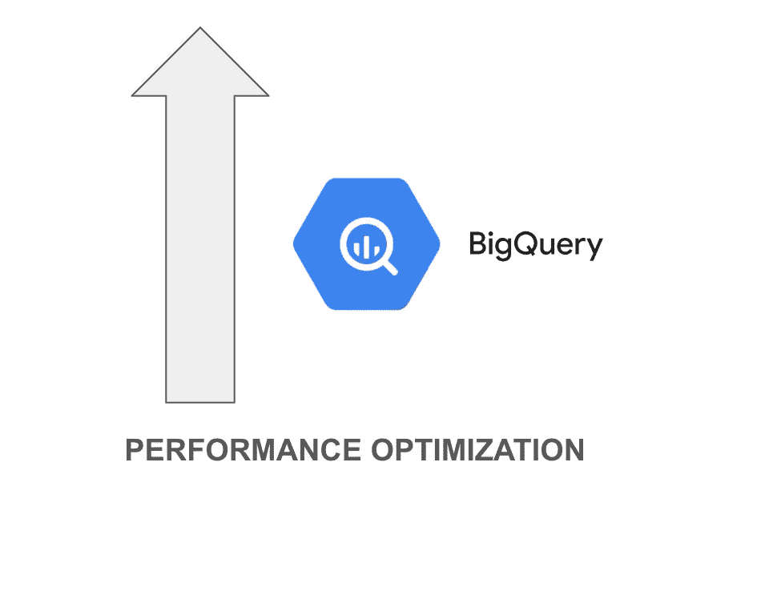

# Bigquery 的长期运行查询优化指南

> 原文：<https://medium.com/google-cloud/long-running-query-optimization-guide-for-bigquery-b3bd3fbca629?source=collection_archive---------0----------------------->

# 介绍

有时，查询运行的时间比您希望的要长。一般来说，工作量少的查询性能更好。它们运行速度更快，消耗的资源更少，这可以降低成本，减少故障。

本文概述了可以提高 BigQuery 查询性能的优化技术。

# 优化技术:

1.  **连接前过滤数据**

**示例**:查找某个产品在某个特定地区的总销售额

> select sum(sales)，region_name，product _ name from sales _ TBL sales
> inner join region _ TBL region
> on sales . region _ id = region . region _ id
> inner join product _ TBL product
> on sales . product _ id = product . product _ id
> 其中 upper(region_name)='APAC '和 upper(product_name) = '键盘'
> group by region_name，product _ name；

上面的查询可以通过将**过滤器应用到 region 和 product 表来优化，首先**使用子查询，然后连接到 sales 表。

优化的查询如下所示:

> select sum(sales)，region_name，product_name from sales _ TBL sales
> 内联接(select * from region _ TBL region where upper(region _ name)= ' APAC ')region
> on sales . region _ id = region . region _ id
> 内联接(select * from product _ TBL product where upper(product _ name)= ' KEYBOARD ')product
> on sales . product _ id = product . product _ id
> group by region _ name，product _ name

另一种情况是在连接之前删除重复项

**例**:销售表中的 region_name 包含重复值，导致交叉连接。

> select product _ name from product _ TBL product
> inner join sales _ TBL sales
> on product . region _ name = sales . region _ name；

为了避免这种情况，可以通过从 sales 表中删除重复项来优化查询

优化的查询如下所示:

> select product _ name from product _ TBL product
> inner join(select region _ name from sales _ TBL group by region _ name)sales
> on product . region _ name = sales . region _ name；

**2。仅选择需要的列**

根据上面的示例(第 1 点)，可以通过将**“select *”替换为“select<column _ list>”**来进一步优化查询

> select sum(sales)，region_name，product _ name from sales _ TBL sales
> 内联接(select region_name，region _ id from region _ TBL region where upper(region _ name)= ' APAC ')region
> on sales . region _ id = region . region _ id
> 内联接(select product_name，product_id from product _ TBL product where upper(product _ name)= ' KEYBOARD ')product
> on sales . product _ id = product . product _ id
> group by region _ name，product _ id

**3。将 Distinct 替换为 Group_by**

**示例**:寻找 APAC 地区的特色产品

> select distinct product . product _ name from region _ TBL region
> inner join product _ TBL product【T1 on region . region _ id = product . region _ id
> 其中 region_name = 'APAC '

可以通过用 group by 替换 **distinct 来优化上面的查询**

> select product . product _ name from region _ TBL region
> inner join product _ TBL product
> on region . region _ id = product . region _ id
> 其中 region _ name = ' APAC '
> group by product _ name

**4。将大表作为 join 子句中的第一个表**

从上面的例子(第 3 点)来看，与区域表相比，产品表是最大的表。因此，可以通过更改连接子句和连接条件中的表顺序来进一步优化查询。

> 在 product . region _ id = region . region _ id
> 上从 product_tbl product
> 内部联接 region_tbl region
> 中选择 product.product_name，其中 region_name = 'APAC'
> 按产品名称分组

**5。在筛选/连接子句中首先使用分区、聚集列**

假设 sales 表按 sales_date 进行分区，并按 product_id 进行聚类。

> select sum(sales)，product_name
> from sales
> inner join product _ TBL product
> on sales . region _ id = ' APAC '
> and sales . product _ id = product . product _ id
> and on sales . sales _ date =(select date from current _ date _ TBL)
> group by region _ name，product _ name

上述查询可以优化如下

> select sum(sales)，product_name
> from sales
> inner join product _ TBL product
> on sales . sales _ date =(select date from current _ date _ TBL)
> and sales . product _ id = product . product _ id
> and sales . region _ id = ' APAC '
> group by region _ name，product _ name

正如我们所看到的，**partition _ column(sales _ date)筛选器首先应用于**，然后是聚类列(product_id)筛选器，最后是普通列筛选器(region_id)

**6。用临时表**替换多个 cte 和视图引用

在下面的示例中，CTE temp_sales 被引用了两次。因此，在执行过程中，CTE 被执行两次。为了避免这种情况，**将 CTE 转换成临时表**，并使用临时表代替 CTE。

> with temp _ sales as
> (select * from sales _ TBL where region _ id = ' R100 ')
> 
> select sum(sales)，region_name，product_name
> from temp _ sales
> inner join region _ TBL region
> on sales . region _ id = region . region _ id
> inner join product _ TBL product
> on sales . product _ id = product . product _ id
> where upper(product _ name)= ' KEYBOARD '
> group by region _ name，product _ name
> 
> 联合所有
> 
> select sum(sales)，region_name，product _ name
> from temp _ sales
> inner join region _ TBL region
> on sales . region _ id = region . region _ id
> inner join product _ TBL product
> on sales . product _ id = product . product _ id
> where upper(product _ name)= ' LAPTOP '
> group by region _ name，product _ name；

上面的查询可以优化如下
这里，cte“temp_sales”被转换为临时表“temp _ sales”

> 创建临时表 temp_sales 作为
> ( select * from sales_tbl，其中 region_id = 'R100 ')
> 
> select sum(sales)，region_name，product_name
> from temp _ sales
> inner join region _ TBL region
> on sales . region _ id = region . region _ id
> inner join product _ TBL product
> on sales . product _ id = product . product _ id
> where upper(product _ name)= ' KEYBOARD '
> group by region _ name，product _ name
> 
> 联合所有
> 
> select sum(sales)，region_name，product _ name
> from temp _ sales
> inner join region _ TBL region
> on sales . region _ id = region . region _ id
> inner join product _ TBL product
> on sales . product _ id = product . product _ id
> where upper(product _ name)= ' LAPTOP '
> group by region _ name，product _ name；

**7。将大型查询拆分成临时表**

如果查询太复杂或需要大量资源，可以使用临时表将查询分成多个部分。

> select sum(sales)，region_name，product_name
> from sales
> inner join region _ TBL region
> on sales . region _ id = region . region _ id
> inner join product _ TBL product
> on sales . product _ id = product . product _ id
> where upper(product _ name)= ' KEYBOARD '
> group by region _ name，product _ name
> 
> 联合所有
> 
> select sum(sales)，region_name，product _ name
> from sales
> inner join region _ TBL region
> on sales . region _ id = region . region _ id
> inner join product _ TBL product
> on sales . product _ id = product . product _ id
> where upper(product _ name)= ' LAPTOP '
> group by region _ name，product _ name；

可以通过创建两个临时表，然后对这两个临时表进行联合来优化上面的查询。此外，临时表的输出可以在多行语句中多次使用，无需任何重新计算。

优化后的查询如下所示

> 创建临时表 keyboard_temp 为
> (
> select sum(sales)，region_name，product_name
> from sales
> inner join region _ TBL region
> on sales . region _ id = region . region _ id
> inner join product _ TBL product
> on sales . product _ id = product . product _ id
> where upper(product _ name)= ' KEYBOARD '
> group by region _ name，product _ name
> 
> );
> 
> 创建临时表 laptop_temp 为
> (
> 
> select sum(sales)，region_name，product_name
> from sales
> inner join region _ TBL region
> on sales . region _ id = region . region _ id
> inner join product _ TBL product
> on sales . product _ id = product . product _ id
> where upper(product _ name)= ' LAPTOP '
> group by region _ name，product _ name
> 
> );
> 
> select * from keyboard _ temp
> union all
> select * from laptop _ temp

我经常写关于谷歌云技术和优化技术的文章。以后的文章请随时关注我。

## 备注:

本文档补充了 google cloud 文档([https://cloud . Google . com/big query/docs/best-practices-performance-overview](https://cloud.google.com/bigquery/docs/best-practices-performance-overview))

## **附录:**

我来自 Bigquery 的其他文章供你参考:

 [## Bigquery 中的分区修剪

### 让我们理解使用 Merge 语句进行分区修剪。

medium.com](/google-cloud/bigquery-merge-optimization-13fc7147efbf)  [## 将 NORMALIZE (Teradata)转换为 Bigquery

### Teradata 复函数转换

medium.com](/google-cloud/convert-normalize-teradata-to-bigquery-76deb6af9a40)